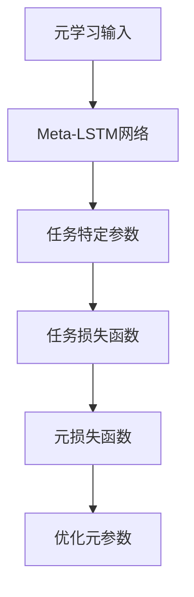
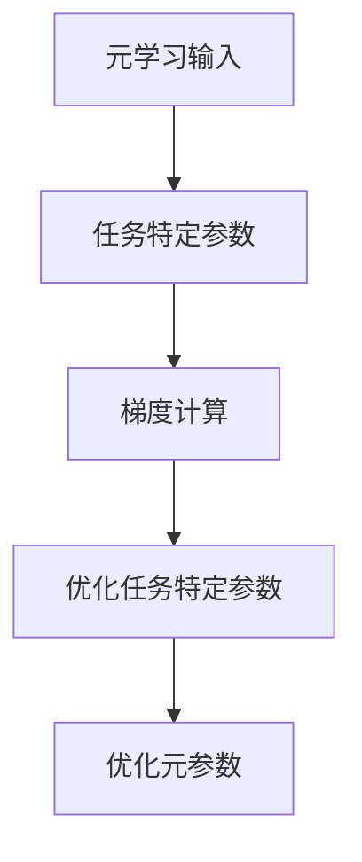
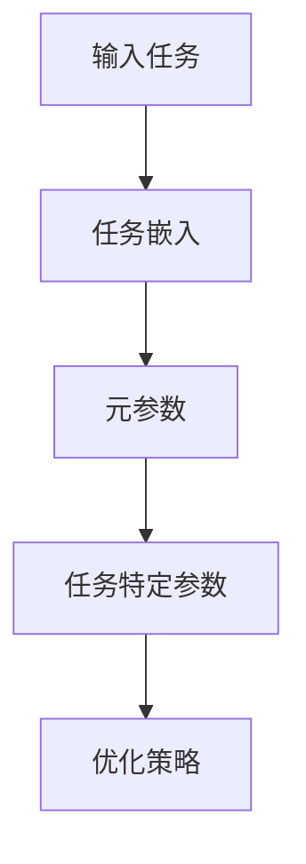
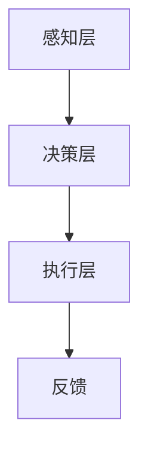

                 


# 元学习在AI Agent快速任务适应中的实践探索

## 关键词：元学习、AI Agent、任务适应、Meta-LSTM、MAML、系统架构

## 摘要：
本文探讨了元学习在AI Agent快速任务适应中的应用。通过背景介绍、核心概念、算法原理、系统架构设计、项目实战及总结与展望，详细阐述了元学习如何提升AI Agent的任务适应能力。文章从基础概念到实际应用，结合数学公式、算法流程图和代码示例，为读者提供了全面的理解和实践指导。

---

# 第1章: 元学习与AI Agent概述

## 1.1 元学习的基本概念

### 1.1.1 元学习的定义
元学习是一种让模型从多个任务中学习通用策略的方法，旨在快速适应新任务。与传统机器学习不同，元学习关注的是模型的元参数优化，使模型能够快速调整以适应不同任务。

### 1.1.2 元学习的核心思想
元学习的核心思想是通过学习如何学习，模型能够在新任务中快速找到最优解。这种思想类似于人类的学习方式，即通过经验快速适应新环境。

### 1.1.3 元学习与传统机器学习的对比

| 特性       | 传统机器学习 | 元学习                     |
|------------|--------------|---------------------------|
| 数据需求   | 高           | 较低                      |
| 任务适应   | 低           | 高                       |
| 算法复杂度 | 较低         | 较高                      |

### 1.1.4 元学习的应用场景
元学习适用于任务多样化的场景，如图像分类、自然语言处理和机器人控制等。

## 1.2 AI Agent的基本概念

### 1.2.1 AI Agent的定义
AI Agent是一种智能体，能够感知环境、做出决策并执行动作。AI Agent的核心目标是根据任务需求，高效地完成特定任务。

### 1.2.2 AI Agent的分类
AI Agent可以分为简单反射式AI Agent、基于模型的AI Agent和目标驱动式AI Agent。

### 1.2.3 AI Agent的核心功能
AI Agent具备感知、决策和执行三大功能，能够自主适应环境变化。

## 1.3 元学习在AI Agent中的应用

### 1.3.1 元学习如何提升AI Agent的适应能力
通过元学习，AI Agent能够在新任务中快速调整策略，无需大量新数据。

### 1.3.2 元学习在AI Agent任务适应中的优势
元学习能够快速适应新任务，减少训练时间，提高效率。

### 1.3.3 元学习与AI Agent结合的典型场景
元学习可以用于多任务学习、任务迁移和任务在线适应等场景。

## 1.4 本章小结
本章介绍了元学习和AI Agent的基本概念，探讨了元学习在AI Agent中的应用，为后续章节奠定了基础。

---

# 第2章: 元学习的原理与算法

## 2.1 元学习的原理

### 2.1.1 元学习的数学模型
元学习的数学模型通常包括任务嵌入和任务特定参数。目标函数表示为：
$$ L = \sum_{i=1}^{N} L_i(\theta, \phi) $$
其中，θ为元参数，φ为任务特定参数。

### 2.1.2 元学习的优化目标
元学习的优化目标是通过优化元参数θ，使得模型在新任务上的表现最优。

### 2.1.3 元学习的训练过程
元学习的训练过程包括元训练和任务训练两个阶段。

## 2.2 元学习的核心算法

### 2.2.1 Meta-LSTM算法



### 2.2.2 MAML算法



### 2.2.3 其他元学习算法简介
包括Reptile、LwF等算法。

## 2.3 元学习算法的优缺点分析

### 2.3.1 元学习算法的优点
元学习算法能够快速适应新任务，减少数据需求。

### 2.3.2 元学习算法的缺点
计算复杂度较高，训练时间较长。

### 2.3.3 元学习算法的适用场景
适用于任务多样化的场景，如图像分类和自然语言处理。

## 2.4 本章小结
本章详细讲解了元学习的原理和核心算法，为后续章节的系统设计奠定了基础。

---

# 第3章: AI Agent的系统架构设计

## 3.1 AI Agent的系统组成

### 3.1.1 感知层
感知层负责数据的采集和预处理，包括传感器和数据处理模块。

### 3.1.2 决策层
决策层负责策略的制定和优化，包括元学习模块和策略优化模块。

### 3.1.3 执行层
执行层负责将策略转化为具体动作，包括执行器和反馈模块。

## 3.2 AI Agent的元学习模块设计

### 3.2.1 元学习模块的功能
元学习模块负责任务适应和策略优化。

### 3.2.2 元学习模块的输入输出
输入：任务描述和环境信息；输出：优化后的策略。

### 3.2.3 元学习模块的内部结构



## 3.3 AI Agent的系统架构设计

### 3.3.1 系统功能设计
系统功能包括任务识别、任务适应和任务执行。

### 3.3.2 系统架构设计



## 3.4 本章小结
本章详细描述了AI Agent的系统架构设计，重点介绍了元学习模块的结构和功能。

---

# 第4章: 元学习算法的实现与优化

## 4.1 元学习算法的实现

### 4.1.1 Meta-LSTM算法的实现

```python
class MetaLSTM(nn.Module):
    def __init__(self, input_size, hidden_size):
        super().__init__()
        self.W = nn.Linear(input_size, hidden_size)
        self.U = nn.Linear(hidden_size, hidden_size)
        self.b = nn.Parameter(torch.zeros(hidden_size))
```

### 4.1.2 MAML算法的实现

```python
def maml_update(meta_model, inner_model, x, y, inner_lr, meta_lr):
    # 计算内循环梯度
    inner_optimizer = SGD(inner_model.parameters(), lr=inner_lr)
    inner_optimizer.zero_grad()
    inner_loss = F.cross_entropy(inner_model(x), y)
    inner_loss.backward()
    # 更新内模型参数
    inner_optimizer.step()
    # 计算外循环梯度
    meta_optimizer = SGD(meta_model.parameters(), lr=meta_lr)
    meta_optimizer.zero_grad()
    # 重置内模型参数
    for p_m, p_i in zip(meta_model.parameters(), inner_model.parameters()):
        p_m.grad += (p_i - p_m)
    meta_optimizer.step()
```

## 4.2 元学习算法的优化

### 4.2.1 参数初始化优化
采用 Xavier 初始化或 Kaiming 初始化。

### 4.2.2 学习率调整
使用 Adam 优化器，并动态调整学习率。

### 4.2.3 正则化优化
添加Dropout层，防止过拟合。

## 4.3 本章小结
本章详细讲解了元学习算法的实现和优化方法，为实际应用提供了指导。

---

# 第5章: 项目实战——基于元学习的AI Agent任务适应

## 5.1 项目背景与需求分析

### 5.1.1 项目背景
在图像分类任务中，AI Agent需要快速适应新类别。

### 5.1.2 需求分析
实现一个基于元学习的图像分类系统，能够快速适应新任务。

## 5.2 项目实现

### 5.2.1 环境配置
安装PyTorch、 torchvision和scikit-learn库。

### 5.2.2 核心代码实现

```python
import torch
import torch.nn as nn
import torch.optim as optim
from torch.utils.data import DataLoader
from torchvision import datasets, transforms

class MetaLSTM(nn.Module):
    def __init__(self, input_size, hidden_size):
        super().__init__()
        self.W = nn.Linear(input_size, hidden_size)
        self.U = nn.Linear(hidden_size, hidden_size)
        self.b = nn.Parameter(torch.zeros(hidden_size))

    def forward(self, x):
        h = torch.zeros(x.size(0), self.hidden_size).to(x.device)
        for t in range(x.size(1)):
            h = torch.tanh(self.W(x[:, t]) + self.U(h))
        return h

# 元学习训练
meta_model = MetaLSTM(input_size, hidden_size).to(device)
meta_optimizer = optim.Adam(meta_model.parameters(), lr=meta_lr)

for batch in meta_train_loader:
    x, y = batch
    x, y = x.to(device), y.to(device)
    # 内循环
    inner_model = MetaLSTM(input_size, hidden_size).to(device)
    inner_optimizer = optim.SGD(inner_model.parameters(), lr=inner_lr)
    inner_optimizer.zero_grad()
    inner_output = inner_model(x)
    inner_loss = F.nll_loss(inner_output, y)
    inner_loss.backward()
    inner_optimizer.step()
    # 外循环
    meta_optimizer.zero_grad()
    meta_output = meta_model(x)
    meta_loss = F.nll_loss(meta_output, y)
    meta_loss.backward()
    meta_optimizer.step()
```

### 5.2.3 案例分析
以图像分类任务为例，展示AI Agent如何快速适应新任务。

## 5.3 项目总结与优化建议

### 5.3.1 项目总结
通过项目实践，验证了元学习在AI Agent任务适应中的有效性。

### 5.3.2 优化建议
优化参数初始化、调整学习率和加入正则化。

---

# 第6章: 总结与展望

## 6.1 元学习与AI Agent的核心总结

### 6.1.1 元学习的核心思想
元学习通过学习如何学习，提升模型的适应能力。

### 6.1.2 AI Agent的核心功能
AI Agent具备感知、决策和执行三大功能，能够自主适应环境。

## 6.2 未来研究方向

### 6.2.1 算法优化
研究更高效的元学习算法，如基于Transformer的元学习模型。

### 6.2.2 多模态任务适应
探索元学习在多模态任务中的应用，如图像-文本联合学习。

### 6.2.3 实际场景应用
将元学习应用于更多实际场景，如自动驾驶和智能客服。

## 6.3 最佳实践 tips

### 6.3.1 参数初始化
采用Xavier或Kaiming初始化。

### 6.3.2 学习率调整
使用Adam优化器，并动态调整学习率。

### 6.3.3 正则化
加入Dropout层，防止过拟合。

## 6.4 本章小结
本章总结了元学习在AI Agent中的应用，并展望了未来的研究方向。

---

# 作者：AI天才研究院/AI Genius Institute & 禅与计算机程序设计艺术 /Zen And The Art of Computer Programming

