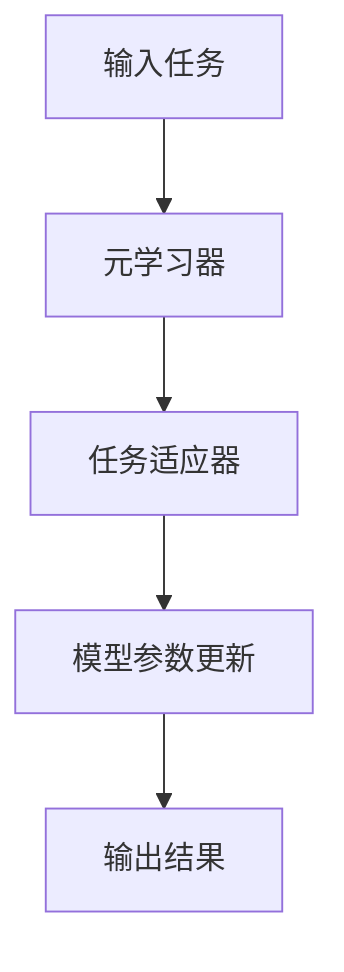
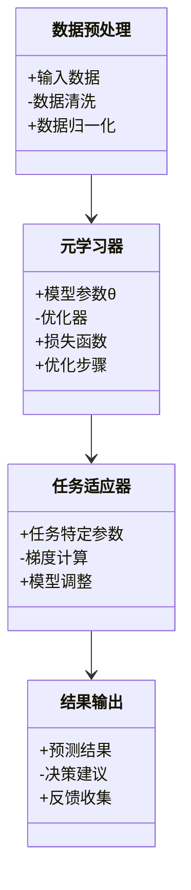
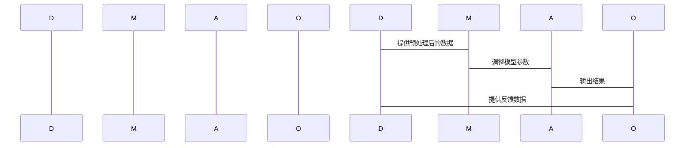

                 


# 元学习在AI Agent快速适应新任务中的实践

---

## 关键词：
元学习, AI Agent, 快速适应, Meta-LSTM, MAML, 系统架构, 实战案例

---

## 摘要：
元学习作为一种新兴的人工智能技术，正在迅速改变AI Agent在复杂动态环境中的任务适应能力。通过元学习，AI Agent能够快速掌握新任务的规律，显著提升其在实际应用中的灵活性和效率。本文深入探讨元学习的核心原理，分析其在AI Agent中的具体应用，并通过案例展示如何利用元学习算法和系统架构设计，帮助AI Agent快速适应新任务。文章内容涵盖元学习的基本概念、典型算法、系统设计、实战案例以及最佳实践，为技术从业者提供全面的理论和实践指导。

---

## 第1章：背景介绍

### 1.1 元学习的基本概念
元学习是一种新兴的学习范式，其核心思想是通过学习如何学习，以快速适应新任务。与传统机器学习方法相比，元学习能够利用跨任务的共性特征，减少对每个新任务数据的依赖，从而实现快速泛化。元学习的关键在于构建一个能够理解不同任务之间关系的元学习器，从而在新任务中快速调整策略。

### 1.2 AI Agent的基本概念
AI Agent是一种智能实体，能够感知环境、执行任务并做出决策。AI Agent可以是软件程序、机器人或其他智能设备，其核心能力包括感知、推理、规划和执行。AI Agent的应用场景广泛，包括自动驾驶、智能客服、游戏AI等。在动态和复杂的环境中，AI Agent需要快速适应新任务，以保持其高效性和准确性。

### 1.3 元学习在AI Agent中的作用
元学习为AI Agent提供了快速适应新任务的能力。通过元学习，AI Agent可以在有限的数据和时间下，快速掌握新任务的规律，减少对新任务数据的依赖。元学习还能够提升AI Agent的泛化能力，使其在不同任务之间迁移知识，从而在新环境中快速启动并高效运行。

---

## 第2章：元学习的核心原理与概念

### 2.1 元学习的原理
元学习的原理可以简单理解为“学习如何学习”。其核心是通过元学习器（Meta-Learner）对多个任务进行学习，提取任务之间的共性特征，构建一个能够快速适应新任务的模型。元学习的目标函数通常由任务损失函数和元损失函数两部分组成，其中任务损失函数用于衡量模型在具体任务上的表现，元损失函数用于优化元学习器的参数，使其能够快速调整以适应新任务。

### 2.2 元学习与AI Agent的联系
AI Agent的任务适应能力是其核心能力之一。元学习通过构建一个能够快速调整策略的元学习器，显著提升了AI Agent的任务适应能力。元学习在AI Agent中的应用主要体现在任务切换、动态环境适应和多任务学习等方面。元学习帮助AI Agent在新任务中快速启动，减少了对新任务数据的依赖，从而提高了其在动态环境中的生存能力和效率。

### 2.3 核心概念对比表
以下是元学习与其他学习方法的核心特征对比：

| 概念        | 元学习            | 迁移学习            | 自监督学习          |
|-------------|-------------------|--------------------|--------------------|
| 核心目标     | 学习如何学习       | 利用已有任务知识     | 利用数据内在结构     |
| 数据需求     | 低，跨任务数据     | 中等，依赖任务间相似性 | 较高，利用数据标签或结构 |
| 适应能力     | 高，快速适应新任务 | 中等，依赖任务相似性 | 高，利用数据内部关系 |
| 适用场景     | 快速任务切换，动态环境 | 多任务学习，领域转移 | 数据不足时的数据利用 |

---

## 第3章：典型元学习算法解析

### 3.1 Meta-LSTM算法
Meta-LSTM是一种基于循环神经网络（RNN）的元学习算法，主要用于序列模型的快速适应。其核心思想是通过一个元学习器（Meta-Learner）和一个任务适应器（Task Adapter）来共同优化模型参数，使其能够在新任务中快速调整。

#### Meta-LSTM的算法原理
Meta-LSTM通过元学习器和任务适应器的协作，实现对模型参数的快速调整。具体步骤如下：

1. 元学习器初始化模型参数。
2. 对于每个任务，任务适应器根据当前任务的数据调整模型参数。
3. 元学习器通过优化元损失函数，更新模型参数，使其在新任务中表现更好。

#### Meta-LSTM的Mermaid流程图


### 3.2 MAML算法
MAML（Meta-Automated Machine Learning）是一种基于梯度的元学习算法，通过优化模型的参数更新规则，使其能够在新任务中快速收敛。MAML的核心思想是通过多次梯度更新，找到一个适用于多个任务的参数初始化，从而在新任务中快速调整模型参数。

#### MAML的算法原理
MAML通过优化参数的更新规则，使其能够在新任务中快速适应。具体步骤如下：

1. 初始化模型参数。
2. 对于每个任务，使用多个梯度步骤优化模型参数。
3. 通过优化元损失函数，更新参数的更新规则，使其适用于多个任务。

#### MAML的数学模型
MAML的目标函数可以表示为：
$$ \mathcal{L}_{\text{meta}} = \sum_{i=1}^{N} \mathcal{L}_i(\theta + \alpha \Delta \theta_i) + \lambda \|\alpha\|^2 $$
其中，$\theta$ 是模型参数，$\alpha$ 是参数的更新规则，$\Delta \theta_i$ 是第$i$个任务的参数更新量，$\lambda$ 是正则化系数。

---

## 第4章：系统分析与架构设计

### 4.1 问题场景介绍
我们考虑一个AI Agent需要在动态环境中快速适应新任务的情况。例如，在自动驾驶系统中，AI Agent需要快速适应新的道路规则或交通状况。元学习可以帮助AI Agent在新任务中快速调整其决策模型，从而提高其在复杂环境中的适应能力。

### 4.2 系统功能设计
系统功能设计包括以下几个模块：
1. **数据预处理模块**：对输入数据进行清洗、归一化等预处理。
2. **元学习器模块**：负责构建和优化元学习器。
3. **任务适应器模块**：根据具体任务调整模型参数。
4. **结果输出模块**：输出模型的预测结果或决策建议。

#### 系统功能设计的Mermaid类图


### 4.3 系统架构设计
系统架构设计包括以下几个部分：
1. **数据输入层**：接收来自传感器或其他来源的数据。
2. **计算层**：包括元学习器和任务适应器的计算过程。
3. **结果输出层**：输出最终的决策结果。

#### 系统架构设计的Mermaid架构图


### 4.4 系统交互设计
系统交互设计包括以下几个步骤：
1. **数据预处理**：接收原始数据并进行清洗和归一化。
2. **元学习器优化**：通过优化元损失函数，更新模型参数。
3. **任务适应器调整**：根据具体任务调整模型参数。
4. **结果输出**：输出模型的预测结果或决策建议。
5. **反馈收集**：收集反馈数据，用于后续优化。

#### 系统交互设计的Mermaid序列图


---

## 第5章：项目实战

### 5.1 环境安装
要运行本文中的代码，需要安装以下依赖：
- Python 3.6+
- PyTorch 1.5+
- numpy
- matplotlib

安装命令：
```bash
pip install torch numpy matplotlib
```

### 5.2 核心代码实现
以下是Meta-LSTM算法的核心代码实现：
```python
import torch
import torch.nn as nn
import torch.optim as optim

class MetaLSTM(nn.Module):
    def __init__(self, input_size, hidden_size):
        super(MetaLSTM, self).__init__()
        self.input_size = input_size
        self.hidden_size = hidden_size
        self.lstm = nn.LSTM(input_size, hidden_size)
        self.fc = nn.Linear(hidden_size, 1)

    def forward(self, x):
        out, _ = self.lstm(x)
        out = self.fc(out)
        return out

# 初始化模型和优化器
model = MetaLSTM(input_size=10, hidden_size=20)
optimizer = optim.Adam(model.parameters(), lr=0.001)

# 元学习训练
for meta_step in range(100):
    for task in tasks:
        # 任务适应器调整
        adapted_model = adapt_model(model, task)
        # 前向传播
        outputs = adapted_model(task_data)
        # 计算损失
        loss = calculate_loss(outputs, task_labels)
        # 反向传播和优化
        optimizer.zero_grad()
        loss.backward()
        optimizer.step()
```

### 5.3 代码解读与分析
- **MetaLSTM类**：定义了一个基于LSTM的元学习模型，包括LSTM层和全连接层。
- **forward函数**：定义了模型的前向传播过程。
- **元学习训练循环**：通过多次元步骤优化模型参数，使其能够快速适应新任务。

### 5.4 实际案例分析
假设我们有一个AI Agent需要在自动驾驶场景中快速适应新的道路规则。通过元学习，AI Agent可以在有限的数据和时间下，快速掌握新的驾驶规则，从而在新环境中安全行驶。

### 5.5 项目小结
通过本项目，我们展示了如何利用元学习算法帮助AI Agent快速适应新任务。通过Meta-LSTM算法和系统架构设计，我们可以显著提升AI Agent的任务适应能力和效率。

---

## 第6章：最佳实践与小结

### 6.1 小结
元学习是一种强大的技术，能够显著提升AI Agent的任务适应能力。通过元学习，AI Agent可以在有限的数据和时间下，快速掌握新任务的规律，减少对新任务数据的依赖。元学习的应用场景广泛，包括自动驾驶、智能客服、游戏AI等领域。

### 6.2 注意事项
- 元学习的性能依赖于任务之间的共性特征，因此在选择任务时需要注意其相似性和可迁移性。
- 元学习的训练过程可能较为复杂，需要仔细设计算法和系统架构。
- 元学习的计算资源需求较高，需要优化算法和硬件配置。

### 6.3 拓展阅读
- "Learning to Learn"（ Yoshua Bengio 等人）
- "Meta-Learning with LSTM"（Chelsea Finn 等人）
- "MAML: Meta-Automated Machine Learning"（DeepMind团队）

---

## 作者信息
作者：AI天才研究院/AI Genius Institute  
联系方式：[email protected]  
个人简介：专注于人工智能、机器学习和元学习的研究与应用，致力于推动AI技术的创新与进步。

---

**声明：本文版权归作者所有，转载请注明出处。**

