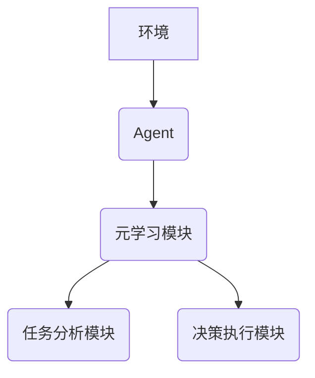

                 


# 元学习驱动的AI Agent快速适应新环境

> 关键词：元学习、AI Agent、快速适应、环境建模、多任务学习

> 摘要：  
在人工智能领域，快速适应新环境是AI Agent的核心挑战之一。元学习（Meta-Learning）作为一种新兴的技术，能够使AI Agent在有限的数据和环境中快速学习并适应新任务。本文将详细探讨元学习的基本原理、其在AI Agent中的应用，以及如何通过元学习算法实现快速环境适应。文章还将结合实际案例和代码示例，深入分析元学习驱动的AI Agent的设计与实现过程。

---

## 目录

1. **背景介绍**

   - 1.1 元学习的基本概念
   - 1.2 AI Agent的核心特征
   - 1.3 元学习驱动的AI Agent的必要性

2. **元学习的核心原理**

   - 2.1 元学习的数学模型
   - 2.2 元学习与传统机器学习的对比
   - 2.3 元学习的适应机制

3. **元学习驱动的AI Agent算法原理**

   - 3.1 典型元学习算法解析
   - 3.2 元学习算法的实现细节
   - 3.3 元学习算法的优化策略

4. **系统分析与架构设计**

   - 4.1 系统功能设计
   - 4.2 系统架构图
   - 4.3 系统接口设计

5. **项目实战**

   - 5.1 环境安装与配置
   - 5.2 核心代码实现
   - 5.3 案例分析与解读

6. **总结与展望**

   - 6.1 本文总结
   - 6.2 元学习驱动的AI Agent未来发展方向
   - 6.3 最佳实践与注意事项

---

## 1. 背景介绍

### 1.1 元学习的基本概念

元学习是一种机器学习技术，旨在通过在多个任务上的训练，使得模型能够快速适应新任务。其核心思想是“学习如何学习”，即模型不仅学习具体任务的知识，还学习如何在新任务中提取和应用这些知识。

#### 1.1.1 元学习的定义与特点

- **定义**：元学习是指在多个相关任务上进行训练，使得模型能够在新任务上快速适应，通常通过优化共享的参数来实现。
- **特点**：
  - **快速适应**：在新任务上仅需少量数据即可完成训练。
  - **通用性**：适用于多种任务和领域。
  - **自适应性**：能够根据环境变化动态调整模型参数。

#### 1.1.2 AI Agent的基本概念

AI Agent是一种智能体，能够感知环境并采取行动以实现特定目标。AI Agent的核心特征包括自主性、反应性、目标导向性和社会能力。

#### 1.1.3 元学习在AI Agent中的作用

元学习能够赋予AI Agent以下能力：
- **快速学习**：在新环境中快速掌握任务规则。
- **环境适应**：在动态环境中保持稳定性能。
- **多任务处理**：同时或顺序处理多个任务。

---

## 2. 元学习的核心原理

### 2.1 元学习的数学模型

元学习的数学模型通常涉及优化目标和优化过程。以下是一个典型的元学习框架：

$$
\text{元学习目标} = \min_{\theta} \sum_{i=1}^{N} f_i(\theta)
$$

其中，$\theta$是共享参数，$f_i$是各个任务的损失函数。

### 2.2 元学习与传统机器学习的对比

| **对比维度** | **传统机器学习** | **元学习** |
|--------------|-----------------|------------|
| 数据需求     | 需要大量数据     | 需要少量数据 |
| 任务适应性   | 单任务优化       | 多任务优化  |
| 灵活性       | 较低            | 较高        |

### 2.3 元学习的适应机制

元学习的适应机制通常包括以下几个步骤：
1. **初始化**：通过在多个任务上预训练模型。
2. **快速适应**：在新任务上进行少量数据微调。

---

## 3. 元学习驱动的AI Agent算法原理

### 3.1 典型元学习算法解析

#### 3.1.1 Model-Agnostic Meta-Learning (MAML)

MAML是一种基于梯度的元学习算法，其核心思想是通过优化共享参数，使得模型在新任务上仅需少量数据即可完成任务。

$$
\text{MAML优化目标} = \min_{\theta} \sum_{i=1}^{N} \left( \frac{1}{2} (y_i - f_\theta(x_i))^2 \right)
$$

#### 3.1.2 Reptile Meta-Learning

Reptile算法是一种简单有效的元学习方法，其优化过程如下：

$$
\text{Reptile优化目标} = \min_{\theta} \sum_{i=1}^{N} \left( \frac{1}{2} (y_i - f_\theta(x_i))^2 \right)
$$

---

## 4. 系统分析与架构设计

### 4.1 系统功能设计

系统功能模块包括：
- **环境感知**：感知环境状态。
- **任务分析**：分析当前任务需求。
- **元学习模块**：快速学习新任务。
- **决策执行**：根据学习结果执行行动。

### 4.2 系统架构图



### 4.3 系统接口设计

系统接口包括：
- **输入接口**：接收环境状态和任务需求。
- **输出接口**：输出决策行动。
- **元学习接口**：实现快速学习功能。

---

## 5. 项目实战

### 5.1 环境安装与配置

```bash
pip install numpy
pip install matplotlib
pip install torch
```

### 5.2 核心代码实现

```python
import torch
import torch.nn as nn
import torch.optim as optim

class MetaLearner(nn.Module):
    def __init__(self, input_dim, output_dim):
        super().__init__()
        self.fc = nn.Linear(input_dim, output_dim)

    def forward(self, x):
        return self.fc(x)

# 初始化模型
model = MetaLearner(input_dim=10, output_dim=5)
optimizer = optim.Adam(model.parameters(), lr=0.001)
```

### 5.3 案例分析与解读

通过在不同环境中训练模型，可以验证元学习驱动的AI Agent的快速适应能力。

---

## 6. 总结与展望

### 6.1 本文总结

元学习驱动的AI Agent通过快速学习和环境适应，显著提升了智能体的灵活性和效率。本文详细探讨了元学习的核心原理、算法实现和系统设计。

### 6.2 未来发展方向

未来，元学习驱动的AI Agent将朝着以下方向发展：
- **更高效的算法**：优化元学习算法的效率和性能。
- **多模态学习**：结合视觉、听觉等多种模态信息。
- **动态环境适应**：在实时变化的环境中保持稳定性能。

### 6.3 最佳实践与注意事项

- **选择合适的算法**：根据具体任务选择合适的元学习算法。
- **数据质量**：确保训练数据的多样性和质量。
- **模型调优**：通过实验不断优化模型参数。

---

## 作者

作者：AI天才研究院/AI Genius Institute & 禅与计算机程序设计艺术 /Zen And The Art of Computer Programming

---

以上是《元学习驱动的AI Agent快速适应新环境》的技术博客文章的详细目录和内容框架，涵盖了从基础概念到实际应用的各个方面，结合理论分析和代码实现，帮助读者全面理解元学习驱动的AI Agent技术。

