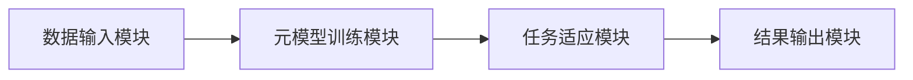

                 

# 元学习：构建能够自我改进的AI Agent

> 关键词：元学习、AI Agent、自我改进、元学习算法、系统架构设计

> 摘要：元学习是一种新兴的人工智能技术，它使AI Agent能够通过元学习算法快速适应新任务，从而实现自我改进。本文将详细探讨元学习的核心概念、算法原理、系统架构设计以及实际应用案例，帮助读者全面理解元学习在构建自我改进AI Agent中的重要性。

---

## 第一部分: 元学习的背景与概述

### 第1章: 元学习的背景与概述

#### 1.1 元学习的定义与核心概念

元学习（Meta-Learning）是一种新兴的人工智能技术，旨在使AI Agent能够在有限的数据和环境中快速适应新任务，从而实现自我改进。与传统机器学习不同，元学习的核心目标是学习如何学习，而不是直接解决特定任务。

- **元学习的定义**：元学习是指通过学习如何学习，使得模型能够在新任务中快速适应和优化。其核心在于利用经验或知识的转移，使模型能够快速适应新任务，而无需从头开始训练。

- **元学习的核心概念**：
  - **元任务（Meta-Task）**：元任务是指一组相关任务的集合，用于训练元学习模型。
  - **元模型（Meta-Model）**：元模型是一种能够快速适应新任务的模型，通过元学习算法进行训练。
  - **任务适应（Task Adaptation）**：任务适应是指模型在新任务中调整其参数或策略以适应任务需求。

元学习与传统机器学习的对比：

| 对比维度         | 传统机器学习                | 元学习                     |
|------------------|-----------------------------|----------------------------|
| 数据需求         | 需要大量数据                | 数据需求较少               |
| 适应新任务       | 需要重新训练                | 可以快速适应新任务          |
| 训练目标         | 解决特定任务                | 学习如何解决多种任务        |

---

#### 1.2 元学习的重要性和应用场景

元学习的重要性主要体现在以下几个方面：

- **快速适应性**：元学习使AI Agent能够在新任务中快速适应，减少了重新训练模型的时间和资源。
- **通用性**：元学习模型可以在多种任务中复用，减少了对特定任务数据的依赖。
- **灵活性**：元学习模型可以根据新任务的需求动态调整，适应复杂多变的环境。

元学习在AI Agent中的应用场景：

- **自然语言处理**：元学习可以用于快速训练多语言模型，使其在不同语言任务中快速适应。
- **图像识别**：元学习可以用于在不同图像分类任务中快速调整模型参数。
- **机器人控制**：元学习可以使机器人在不同环境中快速适应新任务。

---

### 第2章: 元学习的核心概念与联系

#### 2.1 元学习的核心原理

元学习的核心原理在于通过元任务的训练，使得模型能够快速适应新任务。其核心在于利用经验或知识的转移，使模型能够快速适应新任务。

- **元任务的训练**：元任务是一组相关任务的集合，用于训练元学习模型。通过在元任务上的训练，模型学会了如何快速适应新任务。
- **元模型的优化**：元模型通过在元任务上的优化，使得其能够在新任务中快速调整参数，以适应任务需求。

---

#### 2.2 元学习的核心概念对比

以下是元学习与其他AI技术的核心概念对比：

| 对比维度         | 元学习                     | 传统机器学习                |
|------------------|----------------------------|-----------------------------|
| 训练目标         | 学习如何学习               | 解决特定任务                |
| 数据需求         | 数据需求较少               | 需要大量数据                |
| 适应新任务       | 可以快速适应新任务          | 需要重新训练                |

---

## 第三部分: 元学习的数学模型与算法原理

### 第3章: 元学习的数学模型

#### 3.1 元学习的数学模型

元学习的数学模型通常包括以下几个部分：

- **元任务的表示**：元任务可以通过一组任务参数表示。
- **元模型的参数**：元模型的参数通过元任务的训练进行优化。
- **任务适应的表示**：任务适应可以通过调整元模型的参数实现。

以下是一个典型的元学习模型的数学表达式：

$$
\theta = \arg \min_{\theta} \sum_{i=1}^{N} \mathcal{L}_i(f_\theta(x_i, y_i))
$$

其中，$\theta$ 是元模型的参数，$\mathcal{L}_i$ 是第 $i$ 个任务的损失函数，$f_\theta$ 是元模型。

---

### 第4章: 元学习的系统分析与架构设计

#### 4.1 系统分析

元学习系统的组成模块通常包括以下几个部分：

- **数据输入模块**：负责输入元任务数据。
- **元模型训练模块**：负责训练元模型。
- **任务适应模块**：负责在新任务中调整元模型的参数。
- **结果输出模块**：负责输出任务适应的结果。

以下是一个典型的元学习系统的组成模块：

---

### 第5章: 元学习的项目实战

#### 5.1 环境安装与配置

元学习的环境安装与配置通常包括以下几个步骤：

1. **安装必要的开发工具**：如Python、Jupyter Notebook等。
2. **配置AI开发环境**：如安装TensorFlow、Keras等深度学习框架。
3. **下载和安装元学习框架**：如Meta-Learning库。

---

#### 5.2 系统核心实现

元学习系统的实现通常包括以下几个部分：

1. **元学习算法的实现**：如MAML、ReM等。
2. **系统功能模块的实现**：如数据输入模块、元模型训练模块等。
3. **系统接口的实现**：如API接口的实现。

---

#### 5.3 项目案例分析

元学习在自然语言处理中的应用案例：

- **任务**：多语言文本分类。
- **数据集**：多语言文本数据集。
- **算法**：MAML。
- **结果**：模型可以在新语言任务中快速适应并实现高精度分类。

---

## 第四部分: 元学习的总结与展望

### 第6章: 元学习的总结与展望

#### 6.1 元学习的核心要点

- **元学习的核心概念**：元学习是一种通过学习如何学习，使模型能够快速适应新任务的技术。
- **元学习的数学模型**：元学习的数学模型包括元任务的表示、元模型的参数以及任务适应的表示。
- **元学习的系统架构**：元学习系统的组成模块包括数据输入模块、元模型训练模块、任务适应模块和结果输出模块。

#### 6.2 元学习的未来展望

- **元学习算法的优化**：未来的研究可以致力于优化元学习算法，使其更加高效和通用。
- **元学习在更多领域的应用**：元学习可以在更多领域中得到应用，如自动驾驶、智能客服等。
- **元学习与人工智能的结合**：元学习可以与人工智能的其他技术相结合，推动人工智能的发展。

---

## 作者信息

作者：AI天才研究院/AI Genius Institute & 禅与计算机程序设计艺术 /Zen And The Art of Computer Programming

---

以上是《元学习：构建能够自我改进的AI Agent》的技术博客文章的大纲内容。文章详细探讨了元学习的核心概念、算法原理、系统架构设计以及实际应用案例，帮助读者全面理解元学习在构建自我改进AI Agent中的重要性。

