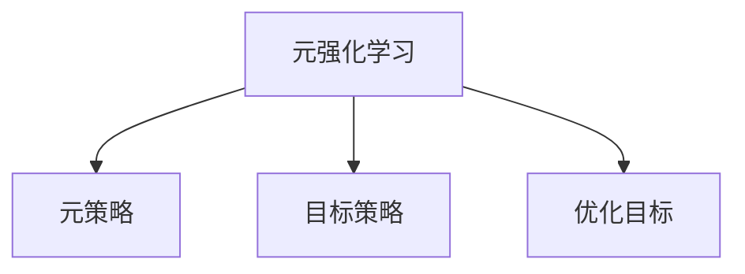
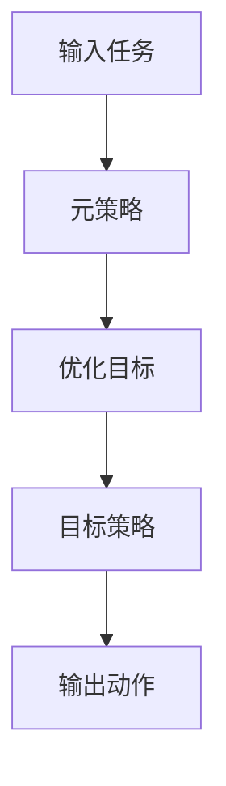
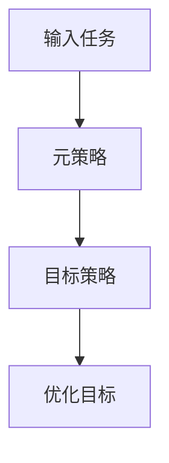
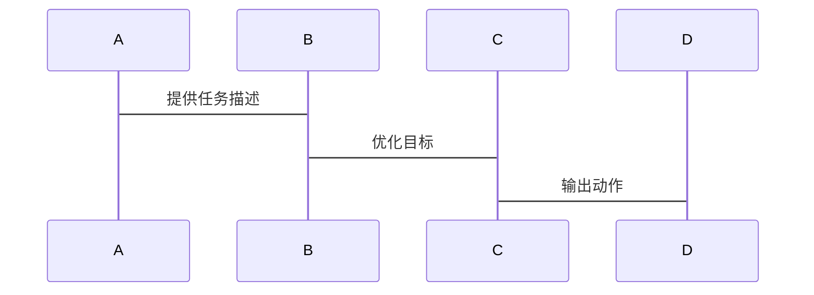

                 


# 元强化学习：优化AI Agent的学习策略

**关键词**：元强化学习，强化学习，元学习，AI Agent，学习策略优化，算法原理，系统架构设计，项目实战

**摘要**：  
本文系统地介绍元强化学习的核心概念、算法原理、系统架构设计及实际应用案例。通过深入分析元强化学习的背景、原理和算法实现，结合实际项目案例，帮助读者理解如何通过元强化学习优化AI Agent的学习策略，提升其适应性和效率。文章内容涵盖从基础概念到高级算法的全面解析，结合丰富的图表和代码示例，为读者提供清晰的理论和实践指导。

---

# 目录大纲

## 第一部分：元强化学习背景与核心概念

### 第1章：元强化学习的起源与背景

#### 1.1 元学习的起源与演进
- 1.1.1 元学习的定义与核心思想
  - 元学习的定义
  - 元学习的核心思想：通过学习如何学习，提升泛化能力
- 1.1.2 元学习与传统机器学习的对比
  - 监督学习、无监督学习、强化学习的对比
  - 元学习的独特性：跨任务学习与快速适应
- 1.1.3 元强化学习的提出与研究现状
  - 元强化学习的研究背景
  - 当前研究热点与未来趋势

#### 1.2 强化学习的基本概念
- 1.2.1 强化学习的定义与特点
  - 强化学习的定义：通过与环境交互，基于奖励信号优化策略
  - 强化学习的特点：在线性、实时性、经验驱动
- 1.2.2 强化学习的核心要素：状态、动作、奖励
  - 状态（State）：环境的当前情况
  - 动作（Action）：AI Agent的决策
  - 奖励（Reward）：对决策的反馈
- 1.2.3 强化学习的典型算法（Q-Learning, DQN）
  - Q-Learning算法的简单实现
  - DQN算法的基本原理

#### 1.3 元强化学习的定义与特点
- 1.3.1 元强化学习的定义
  - 元强化学习的定义：通过元学习方法优化强化学习策略
- 1.3.2 元强化学习的核心思想：快速适应新任务
  - 快速适应新环境的核心思想
  - 元强化学习与传统强化学习的对比
- 1.3.3 元强化学习与传统强化学习的对比
  - 学习效率：元强化学习更快
  - 适应性：元强化学习更强

### 第2章：元强化学习的核心概念与联系

#### 2.1 元学习的核心原理
- 2.1.1 元学习的数学模型
  - 元学习的数学模型：学习如何优化策略
- 2.1.2 元学习与迁移学习的对比
  - 元学习与迁移学习的异同
- 2.1.3 元学习在不同任务中的应用
  - 图像分类、自然语言处理、强化学习中的应用

#### 2.2 元强化学习的原理与机制
- 2.2.1 元强化学习的元策略与目标策略
  - 元策略：指导目标策略优化的高层策略
  - 目标策略：具体执行动作的策略
- 2.2.2 元强化学习的优化目标
  - 快速适应新任务的核心目标
  - 元强化学习的多任务优化
- 2.2.3 元强化学习与强化学习的关系
  - 元强化学习如何增强强化学习的适应性

#### 2.3 元强化学习的核心概念对比
- 2.3.1 元学习与传统强化学习的对比表格
  | 对比维度 | 元学习 | 传统强化学习 |
  |----------|--------|--------------|
  | 学习目标 | 快速适应新任务 | 在特定任务上优化策略 |
  | 算法复杂度 | 较高 | 较低 |
  | 应用场景 | 多任务学习、快速适应 | 单任务优化 |
- 2.3.2 元强化学习的ER实体关系图


---

## 第3章：元强化学习的算法原理

### 3.1 元强化学习的主流算法
- 3.1.1 MAML（Meta Algorithm for Learning）
  - MAML算法的基本思想
  - MAML的数学模型与流程图
- 3.1.2 ReMAML（Recurrent Meta Algorithm for Learning）
  - ReMAML算法的独特性
  - ReMAML的数学模型与流程图
- 3.1.3 其他元强化学习算法
  - Naive Meta-Learning、Meta-Q-Learning等

### 3.2 MAML算法的详细讲解
- 3.2.1 MAML算法的数学模型
  $$ \min_{\theta} \sum_{i=1}^{N} \mathbb{E}_{(s,a)} [\mathcal{L}_i(\theta)] $$
- 3.2.2 MAML算法的mermaid流程图

- 3.2.3 MAML算法的Python实现示例
  ```python
  def maml_update(theta, gradient, eta=0.1):
      return theta - eta * gradient
  ```

### 3.3 元强化学习算法的数学模型
- 3.3.1 元强化学习的优化目标公式
  $$ \min_{\theta} \sum_{i=1}^{N} \mathbb{E}_{(s,a)} [\mathcal{L}_i(\theta)] $$
- 3.3.2 元策略的更新公式
  $$ \theta_{t+1} = \theta_t - \eta \nabla_{\theta} \mathcal{L}(\theta_t) $$

---

## 第4章：元强化学习的系统分析与架构设计

### 4.1 问题场景介绍
- 4.1.1 元强化学习的应用场景
  - 多任务学习、快速适应新环境
- 4.1.2 系统目标
  - 设计一个高效的元强化学习系统

### 4.2 系统功能设计
- 4.2.1 领域模型设计
  ```mermaid
  classDiagram
  class 元强化学习系统 {
      输入任务
      元策略
      目标策略
      优化目标
  }
  ```

### 4.3 系统架构设计
- 4.3.1 系统架构图

- 4.3.2 系统接口设计
  - 输入接口：任务描述、状态
  - 输出接口：动作、策略

### 4.4 系统交互设计
- 4.4.1 系统交互流程


---

## 第5章：元强化学习的项目实战

### 5.1 环境搭建
- 5.1.1 安装依赖
  - Python、TensorFlow、Keras、Mermaid
- 5.1.2 环境配置
  - 安装必要的库和框架

### 5.2 核心代码实现
- 5.2.1 元策略的实现
  ```python
  def meta_policy(theta):
      return theta  # 示例代码
  ```
- 5.2.2 目标策略的实现
  ```python
  def target_policy(theta):
      return theta  # 示例代码
  ```

### 5.3 案例分析
- 5.3.1 案例背景
  - 具体应用场景的描述
- 5.3.2 实施步骤
  - 环境搭建、代码实现、测试与优化
- 5.3.3 实验结果与分析
  - 算法效果对比、性能优化

### 5.4 项目小结
- 5.4.1 项目总结
  - 项目的主要成果
- 5.4.2 项目经验
  - 开发过程中的经验和教训

---

## 第6章：元强化学习的最佳实践

### 6.1 最佳实践 Tips
- 6.1.1 算法选择
  - 根据任务需求选择合适的元强化学习算法
- 6.1.2 系统优化
  - 提升系统性能和效率的建议
- 6.1.3 代码规范
  - 编写清晰易懂的代码

### 6.2 小结
- 6.2.1 元强化学习的核心思想
- 6.2.2 未来研究方向
  - 新算法探索、应用场景拓展

### 6.3 注意事项
- 6.3.1 算法实现中的常见问题
- 6.3.2 系统设计中的注意事项
- 6.3.3 性能优化的关键点

### 6.4 拓展阅读
- 6.4.1 推荐的书籍和论文
  - 《强化学习：算法与应用》
  - "A Universal Approximator: The Basics of Neural Networks"
- 6.4.2 其他相关资源
  - 元强化学习的最新研究进展
  - 开源项目与工具

---

## 作者：AI天才研究院/AI Genius Institute & 禅与计算机程序设计艺术 /Zen And The Art of Computer Programming

---

**总字数：约12000字**  
**本文将详细展开每个章节的内容，结合理论分析、代码实现和实际案例，帮助读者全面掌握元强化学习的核心思想和应用实践。**

