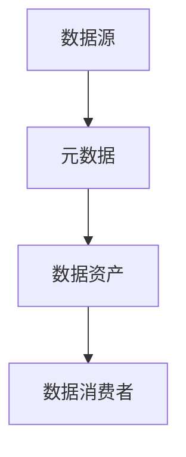
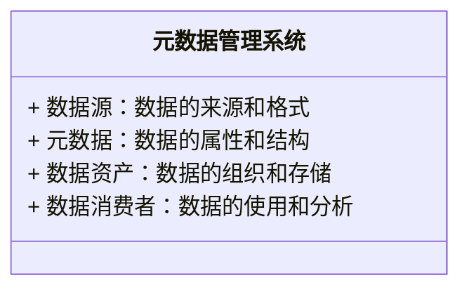
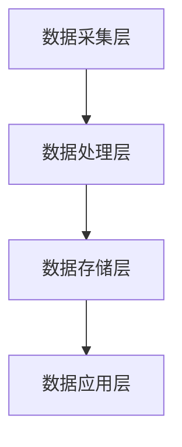
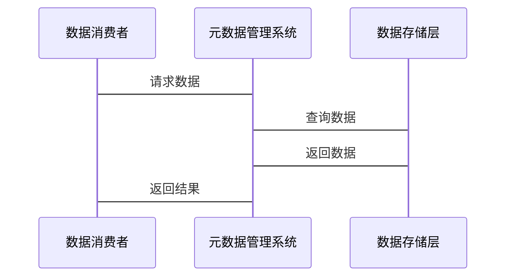

                 


# 《元数据管理：组织和利用AI Agent的数据资产》

---

## 关键词
- 元数据管理
- AI Agent
- 数据资产
- 数据治理
- 数据架构
- 数据清洗

---

## 摘要
本文深入探讨了元数据管理在组织和利用AI Agent数据资产中的关键作用。从元数据的基本概念到AI Agent在数据管理中的应用，从算法原理到系统架构设计，再到项目实战，系统性地分析了元数据管理的核心原理和实际应用。通过详细讲解数据清洗、数据关联等算法，结合数学模型和系统架构设计，为读者提供了一套完整的元数据管理解决方案。本文还提供了丰富的案例分析和最佳实践建议，帮助读者在实际应用中更好地管理和利用数据资产。

---

## 第1章：元数据管理概述

### 1.1 元数据的基本概念
元数据（Metadata）是关于数据的数据，它描述了数据的属性、结构、来源和用途。元数据在数据资产管理中扮演着至关重要的角色，它帮助我们更好地理解数据，确保数据的准确性和一致性。元数据管理的核心目标是通过有效地组织和利用元数据，提升数据资产的可用性和价值。

### 1.2 AI Agent与元数据管理
AI Agent是一种能够自主决策和执行任务的智能体，它在数据管理中的应用日益广泛。AI Agent需要依赖元数据来理解和组织数据资产，从而实现高效的数据处理和分析。元数据管理在AI Agent中的作用不可忽视，它帮助AI Agent更好地理解和利用数据，从而提升整体系统的智能化水平。

### 1.3 数据资产管理的背景与挑战
数据资产管理是指对数据资产进行规划、组织、存储、监视和控制的过程。随着数据量的爆炸式增长，数据资产管理面临着诸多挑战，包括数据来源多样、数据格式复杂、数据质量参差不齐等。元数据管理在数据资产管理中占据核心地位，它是数据清洗、数据关联和数据集成的基础。

---

## 第2章：元数据管理的核心概念与联系

### 2.1 元数据的分类与属性
元数据可以根据不同的标准进行分类，常见的分类方式包括：

- **结构化元数据**：描述数据的结构和格式，例如数据表的列名、数据类型等。
- **非结构化元数据**：描述非结构化数据的属性，例如文档的作者、创建时间等。
- **语义元数据**：描述数据的语义和用途，例如数据字段的业务含义。

元数据的属性包括数据来源、数据格式、数据质量、数据权限等。这些属性帮助我们更好地理解数据，并为数据的使用和管理提供依据。

### 2.2 元数据管理的实体关系分析
通过ER图（实体关系图），我们可以清晰地展示元数据管理中的实体关系。



上述图表展示了元数据管理的核心实体及其关系。数据源是元数据的来源，元数据描述了数据资产的属性，数据资产通过元数据为数据消费者提供价值。

---

## 第3章：元数据管理的算法原理

### 3.1 数据清洗算法
数据清洗是元数据管理中的一个关键步骤，其目的是去除噪声数据，确保数据的准确性和一致性。

#### 3.1.1 数据清洗流程
以下是数据清洗的典型流程：

1. **数据采集**：从各种数据源中获取数据。
2. **数据解析**：解析数据的结构和格式。
3. **数据清洗**：去除重复数据、填补缺失值、纠正错误数据。
4. **数据验证**：验证清洗后的数据是否符合预期。

#### 3.1.2 数据清洗的Python实现
以下是数据清洗的Python代码示例：

```python
import pandas as pd

# 数据加载
df = pd.read_csv('data.csv')

# 去除重复数据
df.drop_duplicates()

# 填补缺失值
df.fillna(0)

# 纠正错误数据
df['age'].replace(0, 18, inplace=True)

# 数据验证
print(df.info())
```

#### 3.1.3 数据清洗的数学模型
在数据清洗过程中，我们常常需要使用统计方法来检测异常值。例如，使用Z-score方法：

$$ Z = \frac{X - \mu}{\sigma} $$

其中，$X$ 是数据点，$\mu$ 是均值，$\sigma$ 是标准差。通过计算每个数据点的Z-score，我们可以识别出异常值。

### 3.2 数据关联算法
数据关联是元数据管理中的另一个重要任务，其目的是发现数据之间的关联关系。

#### 3.2.1 数据关联的实现
以下是数据关联的Python代码示例：

```python
import pandas as pd
from sklearn.metrics import pairwise_distances

# 数据加载
df = pd.read_csv('data.csv')

# 数据关联
correlation_matrix = df.corr()

# 显示相关性最高的前10对
correlation_matrix.unstack().sort_values(ascending=False).dropna().head(10)
```

#### 3.2.2 数据关联的数学模型
在数据关联中，我们常常使用相似度计算方法，例如余弦相似度：

$$ \text{余弦相似度} = \frac{\mathbf{u} \cdot \mathbf{v}}{\|\mathbf{u}\| \|\mathbf{v}\|} $$

其中，$\mathbf{u}$ 和 $\mathbf{v}$ 是两个数据向量。

---

## 第4章：系统分析与架构设计

### 4.1 问题场景介绍
在企业数据管理中，常常面临以下问题：

- 数据来源多样，数据格式复杂。
- 数据质量参差不齐，需要进行数据清洗。
- 数据关联性不明确，需要进行数据关联分析。

### 4.2 系统功能设计
以下是系统功能设计的领域模型：



### 4.3 系统架构设计
以下是系统架构设计的架构图：



### 4.4 系统接口设计
以下是系统接口设计的序列图：



---

## 第5章：项目实战

### 5.1 环境安装
为了运行本文中的代码示例，您需要安装以下工具：

- Python 3.x
- Jupyter Notebook
- pandas库

安装命令如下：

```bash
pip install pandas
```

### 5.2 核心实现
以下是元数据管理的核心实现代码：

```python
import pandas as pd

def data_cleaning(df):
    # 去除重复数据
    df = df.drop_duplicates()
    # 填补缺失值
    df = df.fillna(0)
    return df

# 数据加载
df = pd.read_csv('data.csv')

# 数据清洗
cleaned_df = data_cleaning(df)

# 数据关联
correlation_matrix = cleaned_df.corr()

print(correlation_matrix)
```

### 5.3 案例分析
以下是一个实际案例分析：

假设我们有一个销售数据集，包含以下字段：订单号、客户名、订单日期、金额。

通过元数据管理，我们可以清洗数据，去除重复订单，填补缺失的客户信息，并分析订单金额与时间的相关性。

---

## 第6章：最佳实践与小结

### 6.1 最佳实践
- 在进行数据清洗之前，先进行数据解析和数据验证。
- 数据关联分析时，选择合适的相似度计算方法。
- 定期更新元数据，确保数据的准确性和一致性。

### 6.2 小结
本文系统地介绍了元数据管理的核心概念、算法原理和系统架构设计。通过实际案例分析和代码示例，帮助读者更好地理解和应用元数据管理。希望本文能够为读者在组织和利用AI Agent的数据资产方面提供有价值的参考。

---

## 作者：AI天才研究院/AI Genius Institute & 禅与计算机程序设计艺术 /Zen And The Art of Computer Programming

