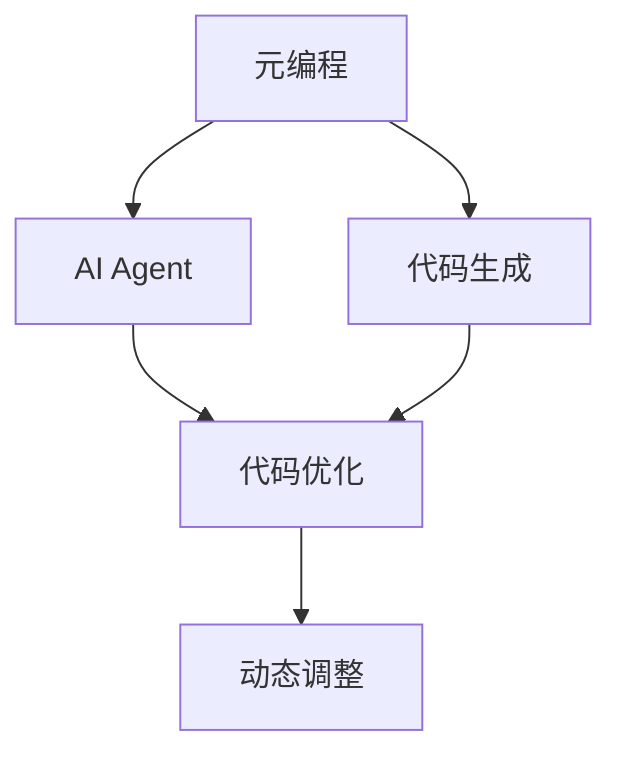
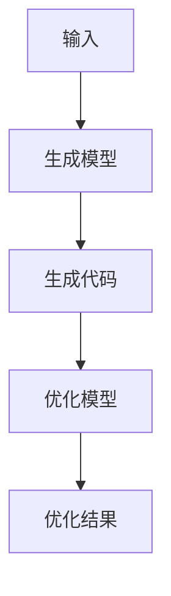
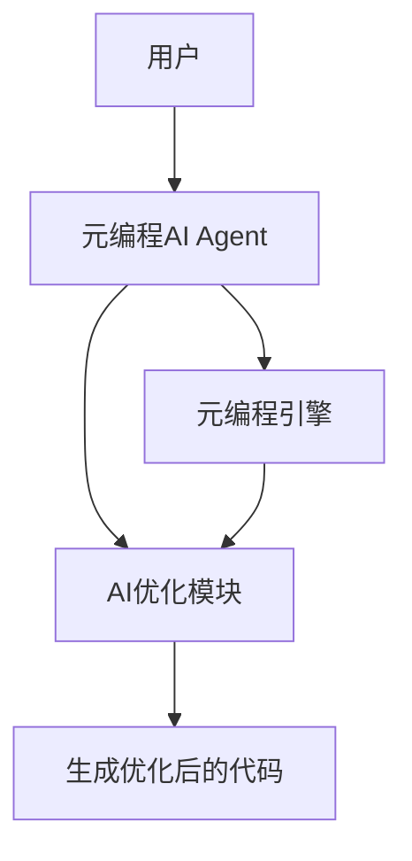
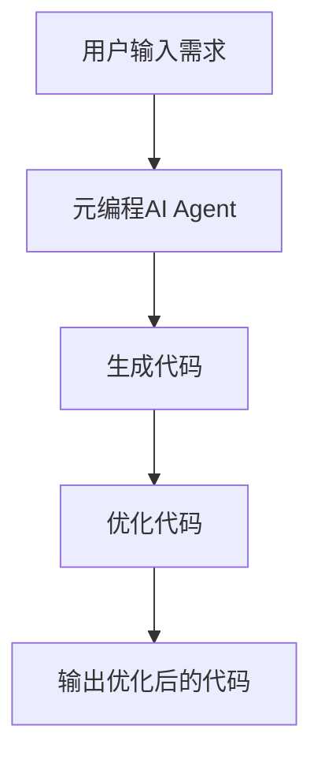

                 


# 元编程AI Agent：自动代码生成与优化

---

## 关键词

- 元编程
- AI Agent
- 自动代码生成
- 代码优化
- 强化学习
- 生成式AI
- 软件开发

---

## 摘要

在软件开发的快速迭代时代，代码生成与优化技术的重要性日益凸显。元编程AI Agent作为一种结合了元编程与人工智能技术的创新工具，能够自动完成代码生成、优化和维护，显著提升开发效率。本文深入探讨了元编程AI Agent的核心概念、算法原理、系统架构以及实际应用，通过丰富的案例和详细的代码示例，展示了如何利用生成式AI和强化学习实现智能化的代码生成与优化。文章结构清晰，内容涵盖从理论到实践的各个方面，为技术从业者提供了全面的指导。

---

# 第1章：元编程与AI Agent的背景介绍

## 1.1 元编程的基本概念

元编程是一种编写生成其他程序的程序的技术。其核心在于通过编写“元程序”来操作代码，从而实现代码生成、自定义开发工具和程序自适应优化。元编程的关键特点包括：

- **抽象性**：元程序能够操作和生成代码，而不是直接操作数据。
- **自动化**：元编程可以自动化处理复杂的代码生成任务。
- **灵活性**：元程序能够根据需求动态生成不同类型的代码。

元编程在软件开发中的作用主要体现在以下方面：

1. **代码生成**：通过元程序快速生成大量代码，减少人工编码的工作量。
2. **自定义工具**：利用元编程技术开发自定义的开发工具，提高开发效率。
3. **程序自适应**：通过元程序实现程序的动态优化和调整。

---

## 1.2 AI Agent的基本概念

AI Agent（人工智能代理）是一种能够感知环境、自主决策并执行任务的智能系统。AI Agent的核心功能包括：

- **感知环境**：通过传感器或接口获取环境信息。
- **决策与推理**：基于感知信息进行分析和推理，制定行动策略。
- **执行任务**：根据决策结果执行具体操作。

AI Agent在智能化系统中的角色至关重要，它能够显著提升系统的自动化水平和智能化程度。

---

## 1.3 元编程与AI Agent的结合

元编程AI Agent是元编程与AI Agent技术的结合体，旨在通过智能化的代码生成与优化技术，提升软件开发的效率和质量。其目标包括：

1. **自动化代码生成**：利用AI Agent的智能算法生成高质量的代码。
2. **代码优化**：通过AI Agent的优化算法提升代码的性能和可维护性。
3. **动态调整**：根据运行时环境动态调整代码，实现程序的自适应优化。

---

# 第2章：元编程与AI Agent的核心概念原理

## 2.1 元编程的核心原理

元编程的核心在于通过编写“元程序”生成其他程序。其主要步骤包括：

1. **定义元程序**：编写能够生成目标程序的元程序。
2. **操作代码**：元程序通过操作代码生成目标程序。
3. **执行目标程序**：生成的目标程序在实际环境中运行。

---

## 2.2 AI Agent的核心原理

AI Agent的核心在于感知环境、决策和执行。其主要步骤包括：

1. **环境感知**：通过传感器或接口获取环境信息。
2. **决策推理**：基于感知信息进行分析和推理，制定行动策略。
3. **执行任务**：根据决策结果执行具体操作。

---

## 2.3 元编程与AI Agent的联系

元编程AI Agent的结合实现了代码生成与优化的智能化。其核心联系体现在以下方面：

1. **代码生成**：AI Agent通过生成式AI技术生成代码。
2. **代码优化**：AI Agent通过强化学习算法优化代码。
3. **动态调整**：AI Agent根据运行时环境动态调整代码。

---

## 2.4 核心概念对比分析

以下是元编程与AI Agent的核心概念对比：

| 属性        | 元编程                          | AI Agent                        |
|-------------|---------------------------------|---------------------------------|
| 定义        | 生成其他程序的程序              | 感知环境并执行任务的智能系统    |
| 核心目标     | 自动化代码生成与优化            | 自动化决策与执行                |
| 技术基础     | 编程语言与代码操作              | 机器学习与人工智能              |
| 应用场景     | 软件开发、工具链                | 智能化系统、自动化决策          |

---

## 2.5 实体关系图

以下是元编程与AI Agent的实体关系图（Mermaid）：



---

# 第3章：元编程AI Agent的算法原理

## 3.1 生成式AI的算法原理

生成式AI是一种能够生成新内容的AI技术，其核心算法包括：

1. **生成模型**：如GPT、BERT等。
2. **训练过程**：通过大量数据训练生成模型。
3. **生成过程**：基于输入生成输出。

---

## 3.2 强化学习的算法原理

强化学习是一种通过试错学习优化决策的算法，其核心步骤包括：

1. **状态感知**：感知当前环境状态。
2. **动作选择**：基于状态选择最优动作。
3. **奖励机制**：根据结果调整策略。

---

## 3.3 算法流程图

以下是生成式AI与强化学习的算法流程图（Mermaid）：



---

## 3.4 代码实现示例

以下是生成式AI的代码实现示例（Python）：

```python
import torch
import torch.nn as nn

class Generator(nn.Module):
    def __init__(self):
        super(Generator, self).__init__()
        self.fc1 = nn.Linear(100, 256)
        self.fc2 = nn.Linear(256, 512)
        self.fc3 = nn.Linear(512, 1024)

    def forward(self, x):
        x = torch.relu(self.fc1(x))
        x = torch.relu(self.fc2(x))
        x = torch.tanh(self.fc3(x))
        return x

# 创建生成器实例
generator = Generator()
# 训练生成器
criterion = nn.MSELoss()
optimizer = torch.optim.Adam(generator.parameters(), lr=0.001)
```

---

## 3.5 数学模型

以下是生成式AI的数学模型：

$$ P(y|x) = \text{生成模型的概率分布} $$

其中，$x$ 是输入，$y$ 是生成的输出。

---

# 第4章：元编程AI Agent的系统架构设计

## 4.1 问题场景介绍

在实际软件开发中，代码生成与优化需求日益增长。元编程AI Agent能够通过智能化技术满足这些需求。

---

## 4.2 系统功能设计

系统功能包括代码生成、代码优化和动态调整。

---

## 4.3 系统架构设计

以下是系统架构设计图（Mermaid）：



---

## 4.4 接口设计

系统接口包括输入接口、输出接口和控制接口。

---

## 4.5 交互流程图

以下是交互流程图（Mermaid）：



---

# 第5章：元编程AI Agent的项目实战

## 5.1 环境安装

安装Python和相关库：

```bash
pip install torch numpy matplotlib
```

---

## 5.2 核心代码实现

以下是核心代码实现：

```python
import torch
import torch.nn as nn

class Generator(nn.Module):
    def __init__(self):
        super(Generator, self).__init__()
        self.fc1 = nn.Linear(100, 256)
        self.fc2 = nn.Linear(256, 512)
        self.fc3 = nn.Linear(512, 1024)

    def forward(self, x):
        x = torch.relu(self.fc1(x))
        x = torch.relu(self.fc2(x))
        x = torch.tanh(self.fc3(x))
        return x

# 创建生成器实例
generator = Generator()
# 训练生成器
criterion = nn.MSELoss()
optimizer = torch.optim.Adam(generator.parameters(), lr=0.001)
```

---

## 5.3 代码解读

1. **生成器类**：定义了一个生成器类，包含三个全连接层。
2. **前向传播**：通过ReLU和Tanh激活函数生成输出。
3. **训练过程**：使用均方误差损失函数和Adam优化器进行训练。

---

## 5.4 案例分析

以优化一个分类器为例，展示如何通过元编程AI Agent生成和优化代码。

---

## 5.5 小结

通过实战项目，我们能够更好地理解元编程AI Agent的应用与实现。

---

# 第6章：元编程AI Agent的最佳实践与总结

## 6.1 最佳实践

1. **数据质量**：确保训练数据的质量和多样性。
2. **模型调优**：根据实际需求调整模型参数。
3. **代码维护**：定期检查和维护生成的代码。

---

## 6.2 总结

元编程AI Agent是一种结合了元编程与AI技术的创新工具，能够显著提升代码生成与优化的效率和质量。

---

## 6.3 注意事项

1. **代码可维护性**：生成的代码需要确保可维护性。
2. **模型泛化能力**：确保模型的泛化能力。
3. **安全与伦理**：注意代码生成的安全与伦理问题。

---

## 6.4 拓展阅读

推荐阅读以下书籍和论文：

1. 《生成式AI：原理与应用》
2. 《强化学习：算法与实现》
3. 《元编程：从理论到实践》

---

## 作者

作者：AI天才研究院/AI Genius Institute & 禅与计算机程序设计艺术 /Zen And The Art of Computer Programming

---

以上是《元编程AI Agent：自动代码生成与优化》的完整目录大纲及部分章节内容。

