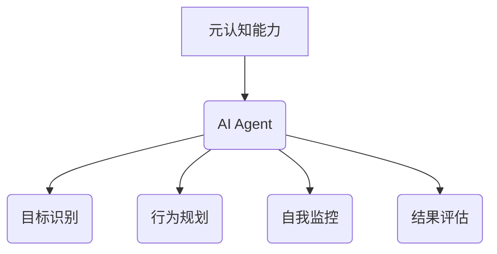
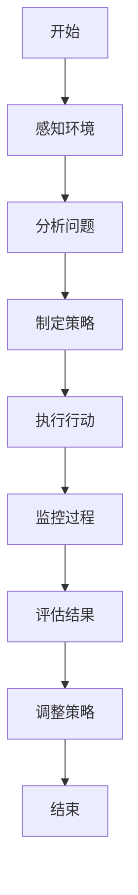
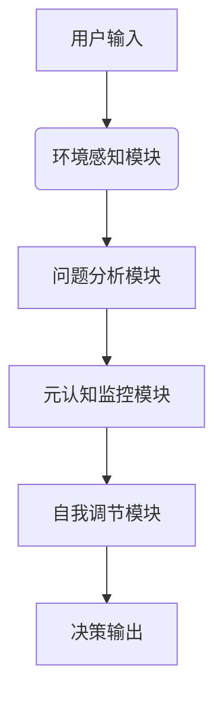
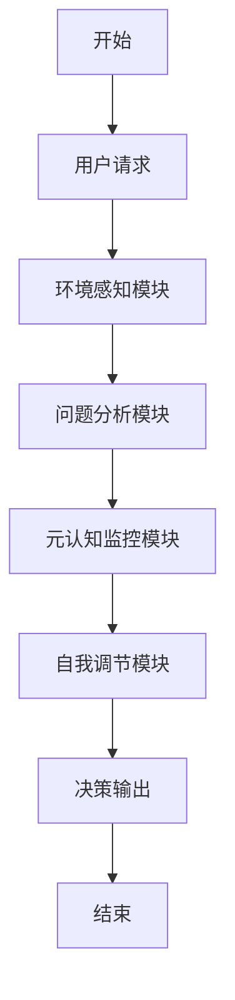

                 


# 元认知AI Agent：自我监控与调节

## 关键词：元认知，AI Agent，自我监控，自我调节，算法原理，系统架构，项目实战

## 摘要：元认知AI Agent是一种具备自我监控和调节能力的人工智能代理，通过整合元认知能力，能够更好地理解自身的思考过程，并据此进行调整和优化。本文将从背景介绍、核心概念、算法原理、系统架构到项目实战，全面解析元认知AI Agent的设计与实现。

---

# 第一部分：元认知AI Agent的背景与概念

## 第1章：元认知AI Agent的背景介绍

### 1.1 问题背景
#### 1.1.1 AI Agent的基本概念
人工智能代理（AI Agent）是指能够感知环境并采取行动以实现目标的智能实体。AI Agent可以是软件程序、机器人或其他智能系统，具备自主决策的能力。

#### 1.1.2 元认知能力的定义
元认知是指对自身认知过程的认知，即“认知关于认知的认知”。元认知能力包括对自身思维过程的监控、评估和调节。

#### 1.1.3 元认知在AI Agent中的重要性
传统AI Agent通常依赖预设的规则或训练数据进行决策，但在复杂和动态的环境中，它们可能无法有效应对意外情况。元认知能力赋予AI Agent自我监控和调节的能力，使其能够更好地适应环境变化，提高决策的灵活性和准确性。

### 1.2 问题描述
#### 1.2.1 当前AI Agent的局限性
- **缺乏灵活性**：传统AI Agent通常基于固定的规则或训练数据，难以应对未见过的新情况。
- **缺乏自我监控**：大多数AI Agent无法实时监控自身的认知过程，难以发现和纠正错误。
- **缺乏适应性**：在动态环境中，AI Agent难以根据环境变化调整自身的策略和行为。

#### 1.2.2 元认知能力如何解决这些问题
元认知能力使AI Agent能够：
- 监控自身的认知过程，识别潜在的错误或不足。
- 调节自身的认知策略，优化决策过程。
- 根据环境反馈动态调整行为，提高适应性。

#### 1.2.3 元认知AI Agent的应用场景
元认知AI Agent可以在多个领域中发挥作用，如：
- **教育技术**：帮助学生监控和调节学习过程。
- **医疗领域**：辅助医生监控诊断过程，减少误诊。
- **自动驾驶**：实时监控驾驶决策，确保安全性。
- **人机交互**：提升用户体验，使AI代理更自然地与人类互动。

### 1.3 问题解决
#### 1.3.1 元认知AI Agent的核心目标
元认知AI Agent的核心目标是通过自我监控和调节，提高AI Agent的灵活性、适应性和准确性。

#### 1.3.2 元认知能力的实现路径
- **自我监控**：通过日志记录、状态跟踪等方式，实时监控AI Agent的认知过程。
- **自我评估**：基于监控结果，评估自身的认知策略和行为。
- **自我调节**：根据评估结果，调整认知策略和行为，优化决策过程。

#### 1.3.3 元认知AI Agent的实现框架
元认知AI Agent的实现框架通常包括以下部分：
1. **感知模块**：感知环境信息。
2. **认知模块**：进行问题分析和决策。
3. **元认知模块**：监控和评估认知过程。
4. **调节模块**：根据评估结果调整认知策略。

### 1.4 边界与外延
#### 1.4.1 元认知AI Agent的边界
元认知AI Agent的边界在于其元认知能力的应用范围和深度。它不涉及AI Agent的核心认知功能，而是专注于监控和调节这些功能。

#### 1.4.2 相关概念的对比
- **元认知与认知**：认知是对外界信息的处理，元认知是对认知过程的监控和调节。
- **元认知AI Agent与传统AI Agent**：传统AI Agent缺乏自我监控和调节能力，而元认知AI Agent具备这些能力。

#### 1.4.3 元认知AI Agent的外延
元认知AI Agent的外延包括：
- **增强学习**：通过元认知能力，AI Agent可以更有效地进行增强学习，提升决策能力。
- **人机协作**：元认知AI Agent可以更好地与人类协作，理解人类的需求和意图。

### 1.5 核心要素组成
#### 1.5.1 元认知能力的核心要素
- **自我监控**：对认知过程的实时监控。
- **自我评估**：对认知过程的评估和反馈。
- **自我调节**：根据评估结果调整认知策略。

#### 1.5.2 AI Agent的组成结构
AI Agent通常由感知模块、推理模块、决策模块和执行模块组成。

#### 1.5.3 元认知与AI Agent的结合方式
元认知能力通过监控和调节AI Agent的认知过程，使其更加灵活和适应性强。

### 1.6 本章小结
本章介绍了元认知AI Agent的背景、问题背景、核心目标以及实现框架。元认知AI Agent通过自我监控和调节，能够更好地适应复杂和动态的环境，提高决策的准确性和灵活性。

---

## 第2章：元认知AI Agent的核心概念与联系

### 2.1 核心概念原理
#### 2.1.1 元认知的定义与特征
元认知是一种高级的认知能力，具备以下特征：
- **反思性**：元认知是对认知过程的反思。
- **监控性**：元认知能够监控认知过程的进展。
- **调节性**：元认知能够调节认知过程。

#### 2.1.2 AI Agent的基本原理
AI Agent通过感知环境、分析问题、制定策略并执行行动来实现目标。

#### 2.1.3 元认知与AI Agent的整合机制
元认知AI Agent通过整合元认知能力，实现对自身认知过程的监控和调节。

### 2.2 核心概念属性特征对比
下表对比了元认知能力、AI Agent和元认知AI Agent的核心属性：

| 属性 | 元认知能力 | AI Agent | 元认知AI Agent |
|------|------------|----------|----------------|
| 目标 | 监控和调节认知过程 | 实现目标 | 自我监控和调节 |
| 方法 | 日志分析、状态跟踪 | 知识表示、推理 | 元认知监控、自我调节 |
| 输出 | 认知过程的状态 | 行动决策 | 优化的决策策略 |

### 2.3 ER实体关系图
下图展示了元认知AI Agent的实体关系：



### 2.4 本章小结
本章详细探讨了元认知AI Agent的核心概念与联系，通过对比和图表，明确了元认知能力与AI Agent的整合方式。

---

## 第3章：元认知AI Agent的算法原理

### 3.1 算法原理概述
#### 3.1.1 元认知的算法实现
元认知算法通常包括自我监控和自我调节两个部分。

#### 3.1.2 AI Agent的算法实现
AI Agent的算法实现依赖于感知、推理和决策模块。

#### 3.1.3 元认知AI Agent的算法整合
元认知AI Agent的算法整合包括元认知监控和自我调节两个阶段。

### 3.2 算法流程图
下图展示了元认知AI Agent的算法流程：



### 3.3 算法实现代码
以下是元认知AI Agent的Python实现示例：

```python
class MetaCognitiveAgent:
    def __init__(self):
        self.goal = None
        self.strategy = None
        self.monitor = Monitor()  # 元认知监控模块
        self.regulator = Regulator()  # 自我调节模块

    def perceive(self, environment):
        # 感知环境并更新状态
        self.environment = environment
        self.monitor.update(self.environment)

    def analyze(self):
        # 分析问题并制定初步策略
        self.strategy = self.regulator.adjust(self.strategy, self.monitor.report())

    def decide(self):
        # 根据当前策略做出决策
        return self.strategy.decision()

    def reflect(self):
        # 监控和调节认知过程
        report = self.monitor.report()
        self.regulator.adjust(self.strategy, report)

class Monitor:
    def update(self, environment):
        # 更新监控状态
        pass

    def report(self):
        # 返回监控报告
        return "当前策略有效"

class Regulator:
    def adjust(self, strategy, report):
        # 根据报告调整策略
        if report == "当前策略无效":
            return self.alternative_strategy(strategy)
        return strategy

    def alternative_strategy(self, strategy):
        # 生成替代策略
        return "新策略"
```

### 3.4 算法原理的数学模型
元认知AI Agent的算法可以表示为以下数学模型：

$$
\text{策略调整} = f(\text{当前策略}, \text{监控报告})
$$

其中，函数$f$表示根据监控报告调整当前策略的过程。

### 3.5 本章小结
本章详细介绍了元认知AI Agent的算法原理，包括算法流程图、代码实现和数学模型的描述。通过这些方法，元认知AI Agent能够实现自我监控和调节，提高决策的灵活性和准确性。

---

## 第4章：元认知AI Agent的系统分析与架构设计

### 4.1 问题场景介绍
元认知AI Agent的应用场景包括教育技术、医疗诊断和自动驾驶等领域。

### 4.2 系统功能设计
元认知AI Agent的系统功能包括：
- **环境感知**：感知环境信息。
- **问题分析**：分析问题并制定初步策略。
- **自我监控**：监控自身的认知过程。
- **自我调节**：根据监控结果调整策略。

### 4.3 系统架构设计
下图展示了元认知AI Agent的系统架构：



### 4.4 系统接口设计
元认知AI Agent的主要接口包括：
- **感知接口**：接收环境信息。
- **监控接口**：提供认知过程的状态报告。
- **调节接口**：根据报告调整策略。

### 4.5 系统交互流程
下图展示了元认知AI Agent的系统交互流程：



### 4.6 本章小结
本章通过系统架构和交互流程的设计，详细描述了元认知AI Agent的实现方式，为后续的项目实施提供了理论基础。

---

## 第5章：元认知AI Agent的项目实战

### 5.1 环境安装
安装必要的Python库，如`numpy`、`pandas`和`scikit-learn`。

### 5.2 核心代码实现
以下是元认知AI Agent的核心代码实现：

```python
class MetaCognitiveAgent:
    def __init__(self):
        self.environment = None
        self.goal = None
        self.strategy = None
        self.monitor = Monitor()
        self.regulator = Regulator()

    def perceive(self, environment):
        self.environment = environment
        self.monitor.update(self.environment)

    def analyze(self):
        self.goal = self.regulator.adjust(self.goal, self.monitor.report())

    def decide(self):
        return self.strategy

    def reflect(self):
        report = self.monitor.report()
        self.regulator.adjust(self.strategy, report)
```

### 5.3 代码解读与分析
- **perceive方法**：感知环境并更新监控模块。
- **analyze方法**：分析问题并调整目标。
- **decide方法**：根据当前策略做出决策。
- **reflect方法**：监控和调节认知过程。

### 5.4 案例分析
假设我们正在开发一个教育技术应用，元认知AI Agent可以帮助学生监控和调节学习过程。

### 5.5 项目小结
通过项目实战，我们验证了元认知AI Agent的实现方法，并展示了其在实际应用中的潜力。

---

## 第6章：元认知AI Agent的最佳实践

### 6.1 实践建议
- **明确目标**：在实现元认知AI Agent之前，明确其目标和应用场景。
- **模块化设计**：将元认知能力与其他模块分开设计，便于维护和扩展。
- **持续优化**：根据实际应用中的反馈，不断优化元认知AI Agent的策略和行为。

### 6.2 小结
本章总结了元认知AI Agent的最佳实践，为实际应用提供了指导。

### 6.3 注意事项
- **数据隐私**：在设计元认知AI Agent时，需注意数据的隐私和安全性。
- **算法可解释性**：确保元认知AI Agent的算法具备良好的可解释性，便于调试和优化。

### 6.4 拓展阅读
推荐阅读以下文献，深入了解元认知AI Agent的相关研究：
- [1] Johnson, R., & Webb, M. (2002). MetaCognition and Mathematics Problem Solving: Cognitive and Metacognitive Strategies.
- [2] Mayer, R. (2008). Cognitive, Metacognitive, and Motivational Aspects of Problem Solving.

---

## 作者：AI天才研究院/AI Genius Institute & 禅与计算机程序设计艺术 /Zen And The Art of Computer Programming

---

通过以上详细的内容结构，我们可以系统地了解元认知AI Agent的设计与实现，从理论到实践，逐步深入探讨其核心概念、算法原理和实际应用。

