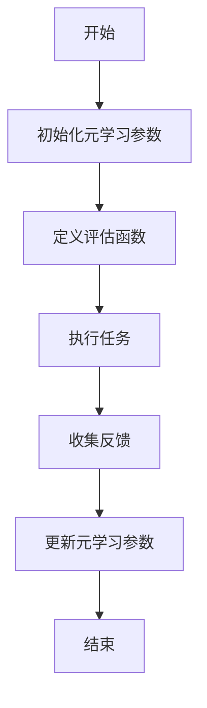
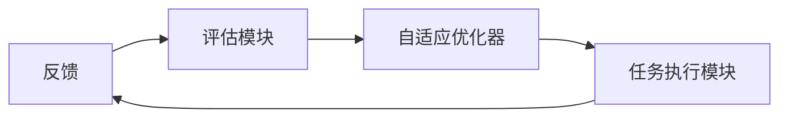
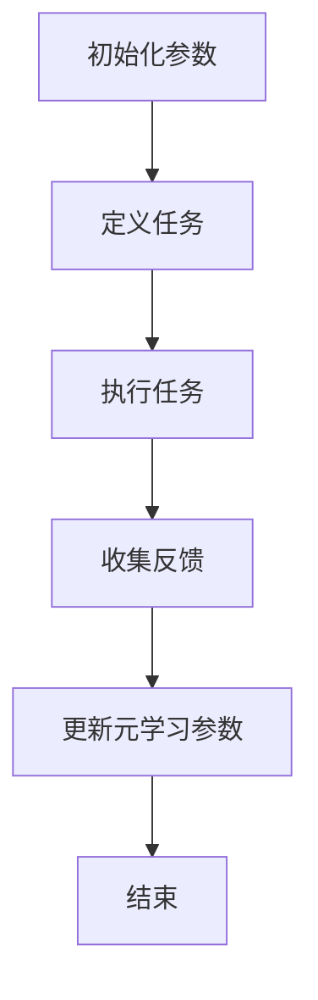
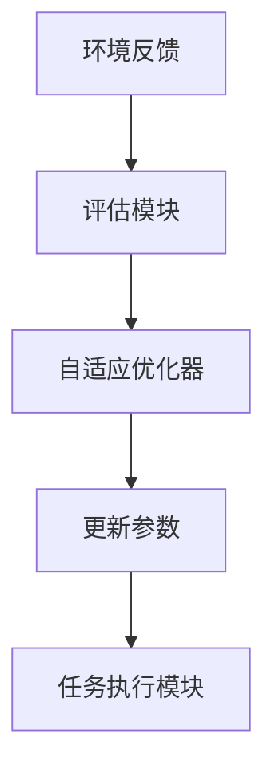
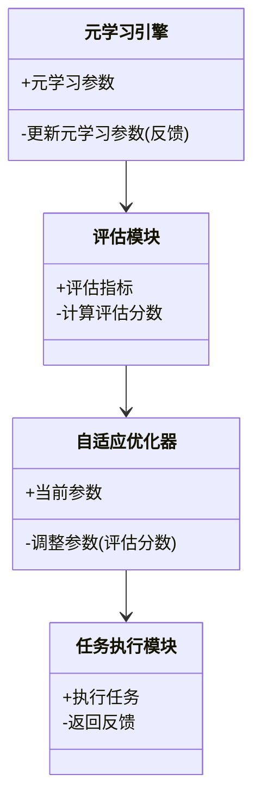
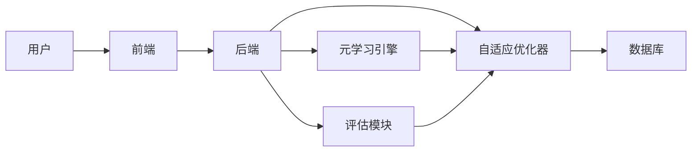

                 


# 元认知AI：具有自我评估能力的AI Agent

## 关键词：元认知AI，自我评估，AI Agent，元学习，自适应优化

## 摘要：元认知AI是一种具有自我评估能力的AI Agent，能够通过元学习和自适应优化机制，动态调整自身行为以提高决策效率和准确性。本文从背景、原理、算法、系统架构到项目实战，全面解析元认知AI的核心概念和实现方法，探讨其在智能系统中的应用前景。

---

# 第一部分: 元认知AI的背景与概念

## 第1章: 元认知AI的定义与背景

### 1.1 元认知AI的定义与核心概念
元认知AI（Metacognitive AI）是一种能够对自身的决策过程进行监控、评估和优化的智能系统。它通过元学习（Meta-Learning）机制，能够理解自己的知识边界，识别不确定性，并据此调整学习策略和行为模式。

#### 核心概念对比表
| 概念       | 描述                                                                 |
|------------|----------------------------------------------------------------------|
| 元认知     | 对认知过程的认知，包括监控、评估和调节思维活动的能力             |
| 元学习     | 通过学习如何学习，掌握通用学习策略，适用于不同任务           |
| 自适应优化 | 根据环境反馈动态调整参数或行为策略，以提高任务性能             |

### 1.2 元认知AI的发展背景
随着AI技术的快速发展，传统AI在特定任务上表现出色，但缺乏灵活性和自适应能力。元认知AI的出现，弥补了这一不足，使其能够更好地应对复杂多变的环境。

### 1.3 元认知AI的技术特点
- **动态调整**：能够根据环境反馈实时调整行为策略。
- **自我评估**：具备对自身决策过程的监控和评估能力。
- **通用性**：适用于多种任务和场景。

### 1.4 元认知AI的应用领域
- **智能助手**：提高交互效率。
- **自动驾驶**：优化决策过程。
- **教育科技**：个性化教学。

### 1.5 元认知AI与传统AI的区别
| 方面       | 元认知AI                              | 传统AI                               |
|------------|--------------------------------------|--------------------------------------|
| 决策机制   | 基于元学习和自适应优化                 | 基于预训练模型或规则                 |
| 灵活性     | 高                                   | 低                                   |
| 适应性     | 强                                   | 弱                                   |

---

## 第2章: 元认知AI的核心概念与联系

### 2.1 元认知机制的原理
元认知AI通过元学习和自适应优化机制，实现对自身决策过程的监控和调整。其核心是通过元学习掌握通用学习策略，并在实际任务中动态优化这些策略。

#### 元认知机制的流程图


### 2.2 元认知AI的评估模型
评估模型用于衡量AI的表现，并指导其行为调整。主要包括以下几个步骤：
1. **收集反馈**：通过环境反馈或用户输入获取评估信息。
2. **计算评估指标**：基于反馈计算评估分数。
3. **优化策略**：根据评估结果调整行为策略。

#### 评估模型的表格对比
| 指标       | 描述                               | 适用场景         |
|------------|------------------------------------|------------------|
| 精确率     | 正确分类的比例                     | 分类任务         |
| 召回率     | 找到所有相关结果的比例             | 检索任务         |
| F1分数     | 精确率和召回率的调和平均           | 综合评估任务性能 |

### 2.3 元认知AI的核心要素与关系
- **元学习引擎**：负责学习通用策略。
- **评估模块**：监控任务执行情况。
- **自适应优化器**：根据反馈调整参数。

#### 系统架构图


---

## 第3章: 元认知AI的算法原理

### 3.1 元学习算法
元学习算法通过学习如何学习，掌握通用策略。典型算法包括：

#### 元学习算法流程图


#### 元学习算法实现代码
```python
def meta_learning_update(params, gradients):
    # 元学习参数更新
    new_params = {}
    for key, value in params.items():
        new_params[key] = value + learning_rate * gradients[key]
    return new_params
```

### 3.2 基于元认知的自适应优化算法
自适应优化算法根据环境反馈动态调整参数，以提高任务性能。

#### 自适应优化算法流程图


#### 自适应优化算法实现代码
```python
def adaptive_optimization(params, gradient, learning_rate):
    return {key: value - learning_rate * gradient[key] for key, value in params.items()}
```

### 3.3 元认知AI的数学模型
元认知AI的数学模型主要由以下几个部分组成：

#### 评估函数
$$评估分数 = \sum_{i=1}^{n} w_i \cdot f_i(x)$$

其中，$w_i$ 是评估指标的权重，$f_i(x)$ 是具体评估指标。

#### 元学习更新规则
$$\theta_{t+1} = \theta_t + \alpha \cdot g(\theta_t, x_t, y_t)$$

其中，$\theta$ 是元学习参数，$\alpha$ 是学习率，$g$ 是梯度函数。

---

## 第4章: 元认知AI的系统分析与架构设计

### 4.1 问题场景介绍
假设我们正在开发一个智能客服系统，需要通过元认知AI优化交互流程。

### 4.2 系统功能设计
- **用户需求分析**：识别用户意图。
- **任务执行**：根据需求提供服务。
- **反馈收集**：记录用户满意度。

#### 系统功能设计类图


### 4.3 系统架构设计
- **前端**：用户交互界面。
- **后端**：元学习引擎、评估模块、自适应优化器。
- **数据库**：存储用户反馈和系统日志。

#### 系统架构图


### 4.4 系统接口设计
- **输入接口**：接收用户请求。
- **输出接口**：返回处理结果。
- **反馈接口**：收集用户满意度。

---

## 第5章: 元认知AI的项目实战

### 5.1 环境安装
安装必要的依赖：
```bash
pip install numpy matplotlib scikit-learn
```

### 5.2 核心代码实现
```python
# 元学习引擎
class MetaLearningEngine:
    def __init__(self, params):
        self.params = params

    def update_params(self, gradients):
        new_params = {}
        for key, value in self.params.items():
            new_params[key] = value + learning_rate * gradients[key]
        return new_params

# 评估模块
class EvaluationModule:
    def __init__(self, metrics):
        self.metrics = metrics

    def compute_score(self, outputs, labels):
        scores = {}
        for metric in self.metrics:
            scores[metric] = metric(outputs, labels)
        return scores

# 自适应优化器
class AdaptiveOptimizer:
    def __init__(self, params):
        self.params = params

    def adjust_params(self, scores):
        new_params = {}
        for key, value in self.params.items():
            new_params[key] = value - learning_rate * scores[key]
        return new_params
```

### 5.3 案例分析
通过一个分类任务案例，展示元认知AI的实现和效果。

### 5.4 项目总结
元认知AI能够显著提高系统的自适应能力和决策效率。

---

## 第6章: 最佳实践与小结

### 6.1 最佳实践
- 定期更新模型。
- 监控系统性能。
- 收集用户反馈。

### 6.2 小结
元认知AI通过元学习和自适应优化，能够动态调整自身行为，提高决策效率和准确性。

### 6.3 注意事项
- 数据质量影响效果。
- 参数设置需要谨慎。
- 系统维护不可忽视。

### 6.4 拓展阅读
推荐阅读《元学习：从基础到前沿》和《自适应学习系统设计》。

---

# 作者：AI天才研究院 & 禅与计算机程序设计艺术

---

以上是文章的完整目录和内容框架，您可以根据需要进一步补充具体细节和代码实现。

