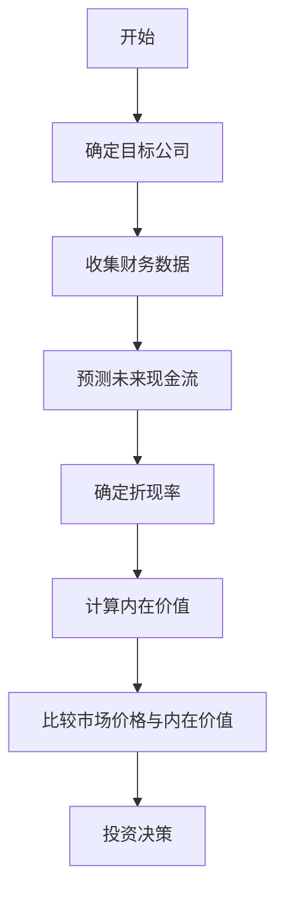
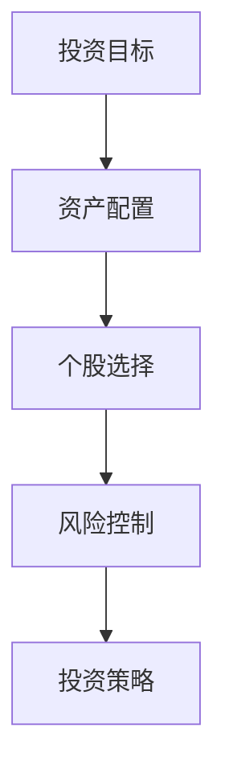

                 

# 第一部分: 深度价值投资概述

## 第1章: 深度价值投资的核心理念

### 1.1 深度价值投资的定义与背景

#### 1.1.1 价值投资的基本概念
价值投资是一种投资策略，强调以低于内在价值的价格购买优质资产。其核心理念是寻找市场低估的股票，长期持有，等待其价值回归。

#### 1.1.2 深度价值投资的起源与发展
深度价值投资起源于20世纪初，由本杰明·格雷厄姆和戴维·多德提出，强调安全边际和对公司内在价值的深入分析。

#### 1.1.3 深度价值投资的核心理念
- 价格与价值的分离：市场价格围绕内在价值波动，投资者的任务是找到价格低于价值的股票。
- 安全边际：买入价格远低于内在价值的股票，以降低风险并提高回报。

### 1.2 深度价值投资的哲学与方法

#### 1.2.1 投资的三重维度
- 质量：公司的基本面、行业地位和竞争优势。
- 价格：股票的市场估值与内在价值。
- 时间：长期持有，等待价值回归。

#### 1.2.2 深度价值投资的三大支柱
1. **内在价值评估**：通过财务分析和估值模型确定公司的内在价值。
2. **安全边际**：买入价格低于内在价值，确保投资的安全性。
3. **长期视角**：坚持长期持有，避免短期市场波动的干扰。

#### 1.2.3 投资者的心理与行为
- 恐慌与贪婪：市场的非理性波动为深度价值投资者提供了机会。
- 理性决策：投资者需要克服情绪干扰，坚持基本面分析。

---

## 第2章: 深度价值投资的理论基础

### 2.1 价值投资的理论框架

#### 2.1.1 股票的内在价值与市场价格
- 内在价值：基于公司基本面的合理估值。
- 市场价格：受市场情绪和短期因素影响的价格。

#### 2.1.2 市场先生与投资者的心态
- 市场先生：格雷厄姆提出的一个比喻，代表市场的波动性和非理性。
- 投资者心态：投资者应保持冷静，利用市场的非理性获得超额收益。

#### 2.1.3 股价波动与投资机会
- 股价波动：市场的短期波动为长期投资者提供了买入机会。
- 投资机会：当市场价格低于内在价值时，投资者可以买入并长期持有。

### 2.2 资产评估的核心原理

#### 2.2.1 股票的价值评估模型
- 现金流折现法（DCF模型）：通过预测未来现金流，折现到现值，确定内在价值。
- 市盈率（P/E）：市价与每股收益的比率，衡量股票的估值水平。
- 市净率（P/B）：市价与每股净资产的比率，衡量资产的估值。

#### 2.2.2 现金流折现法（DCF模型）的计算公式
DCF模型的核心是将未来现金流折现为现值，公式如下：
$$
\text{内在价值} = \sum_{t=1}^{n} \frac{\text{CF}_t}{(1 + r)^t} + \frac{\text{残值}}{(1 + r)^n}
$$
其中，$\text{CF}_t$ 是第$t$年的现金流，$r$ 是折现率，$n$ 是预计的持有年限。

#### 2.2.3 市盈率与市净率的比较
- 市盈率：适用于盈利稳定的公司，反映市场对收益的预期。
- 市净率：适用于资产密集型行业，反映市场对资产价值的评估。

### 2.3 深度价值投资的边界与外延

#### 2.3.1 投资的边界条件
- 市场有效性：市场越无效，深度价值投资机会越多。
- 行业选择：深度价值投资在某些行业更容易找到低估股票。

#### 2.3.2 深度价值投资的适用范围
- 适用于长期投资者，不适用于短期投机者。
- 适用于对公司基本面分析能力强的投资者。

#### 2.3.3 投资与投机的区分
- 投资：基于基本面分析，追求长期收益。
- 投机：基于市场情绪，追求短期收益。

---

## 第3章: 财务报表分析与企业估值

### 3.1 财务报表分析基础

#### 3.1.1 利润表分析
- 收入与成本：分析公司的盈利能力和成本控制能力。
- 净利润：衡量公司整体盈利能力。

#### 3.1.2 资产负债表分析
- 资产结构：分析公司的资产分布和质量。
- 负债水平：衡量公司的财务杠杆和偿债能力。

#### 3.1.3 现金流量表分析
- 经营活动现金流：反映公司主营业务的现金流健康。
- 投资活动现金流：分析公司的投资活动和资本支出。

### 3.2 企业内在价值的评估方法

#### 3.2.1 现金流折现法（DCF）的详细步骤
1. **预测未来现金流**：基于公司历史业绩和行业趋势，预测未来5-10年的现金流。
2. **确定折现率**：使用合适的折现率（如WACC）将未来现金流折现为现值。
3. **计算内在价值**：将折现后的现金流加总，得到公司的内在价值。

#### 3.2.2 市盈率与市净率的比较分析
- 市盈率：适用于盈利稳定的公司，反映市场对收益的预期。
- 市净率：适用于资产密集型行业，反映市场对资产价值的评估。

#### 3.2.3 股东权益收益率（ROE）的评估
- ROE：衡量公司股东投资的回报率，反映公司的盈利能力和资本使用效率。

### 3.3 财务指标的综合运用

#### 3.3.1 财务健康状况的评估
- 流动比率：衡量公司短期偿债能力。
- 速动比率：进一步衡量公司短期偿债能力。

#### 3.3.2 财务风险的识别
- 负债比率：衡量公司财务杠杆和偿债压力。
- 利息覆盖倍数：衡量公司偿付利息的能力。

#### 3.3.3 财务数据与股价的关系
- 股价与盈利能力：高盈利能力通常对应较高股价。
- 股价与成长潜力：高成长潜力通常对应较高股价。

---

## 第4章: 寻找极度低估的股票

### 4.1 极度低估股票的定义与特征

#### 4.1.1 极度低估股票的判定标准
- 市价低于内在价值。
- 具备安全边际。

#### 4.1.2 极度低估股票的市场特征
- 市场波动较大，投资者情绪低落。
- 市场对公司的负面看法过度放大。

#### 4.1.3 极度低估股票的投资价值
- 长期回报高。
- 风险低。

### 4.2 极度低估股票的筛选方法

#### 4.2.1 基于财务指标的筛选
- 低市盈率：P/E < 市场平均水平。
- 低市净率：P/B < 市场平均水平。

#### 4.2.2 基于市场估值的筛选
- 市价低于DCF估值。
- 市价低于行业平均水平。

#### 4.2.3 基于行业地位的筛选
- 行业龙头公司。
- 具备竞争优势。

### 4.3 极度低估股票的案例分析

#### 4.3.1 成功案例
- 某公司案例：分析其财务数据、估值指标和市场表现。

#### 4.3.2 失败案例
- 某公司案例：分析其财务数据、估值指标和市场表现。

---

## 第5章: 深度价值投资的风险管理

### 5.1 投资风险的识别与评估

#### 5.1.1 系统性风险
- 市场波动。
- 经济周期。

#### 5.1.2 非系统性风险
- 公司特定风险。
- 行业风险。

### 5.2 风险管理策略

#### 5.2.1 分散投资
- 多个行业、多只股票分散投资。

#### 5.2.2 安全边际
- 买入价格低于内在价值，降低风险。

#### 5.2.3 定期再评估
- 定期检查投资组合，调整持仓。

### 5.3 风险与收益的平衡

#### 5.3.1 风险厌恶者
- 低风险，低收益。

#### 5.3.2 风险偏好者
- 高风险，高收益。

---

## 第6章: 深度价值投资的实战案例

### 6.1 案例背景介绍

#### 6.1.1 投资标的
- 具体公司案例，如某制造业公司。

#### 6.1.2 财务分析
- 利润表、资产负债表、现金流量表分析。

#### 6.1.3 估值模型
- DCF模型计算内在价值。

### 6.2 投资策略的制定

#### 6.2.1 投资目标
- 确定投资目标和收益预期。

#### 6.2.2 投资计划
- 资金分配、买入价格、持仓时间。

### 6.3 投资结果与反思

#### 6.3.1 实际收益
- 投资收益与预期的比较。

#### 6.3.2 反思与改进
- 分析投资结果，总结经验教训。

---

## 第7章: 深度价值投资的总结与展望

### 7.1 深度价值投资的核心总结

#### 7.1.1 核心理念
- 价格与价值分离，寻找低估股票。

#### 7.1.2 投资策略
- 长期持有，安全边际。

### 7.2 深度价值投资的未来展望

#### 7.2.1 市场变化
- 市场有效性的提高，投资机会减少。

#### 7.2.2 投资者教育
- 提高投资者的财务分析能力。

#### 7.2.3 技术进步
- 利用大数据和AI技术辅助投资决策。

---

## 附录: 深度价值投资工具与资源推荐

### 附录A: 财务分析工具

#### 1. 财务报表分析工具
- Excel插件：用于财务数据的快速分析。
- 专业的财务分析软件：如Sageworks、Banksys。

#### 2. 估值模型工具
- DCF模型模板：用于快速计算内在价值。
- 市盈率和市净率计算器。

### 附录B: 深度价值投资书籍推荐

#### 1. 经典书籍
- 《The Intelligent Investor》 by Benjamin Graham
- 《The Analysis and Use of Financial Statements》 by Bruce J. Benson

#### 2. 现代书籍
- 《Value Investing: Tools and Techniques for Intelligent Investment》 by Matthew D. Ring
- 《Deep Value: Extreme Investors and How to Think Like Them》 by Ken Fisher

---

## 图表部分

### 图表1: DCF模型流程图

### 图表2: 财务指标对比表
| 指标类型 | 公司A | 公司B | 行业平均 |
|----------|-------|-------|----------|
| 市盈率   | 10    | 15    | 12       |
| 市净率   | 1.5    | 2.0    | 1.8       |
| 净利润增长率 | 20% | 15% | 18%       |

### 图表3: 投资组合架构图

---

## 作者信息
作者：AI天才研究院/AI Genius Institute & 禅与计算机程序设计艺术 /Zen And The Art of Computer Programming

