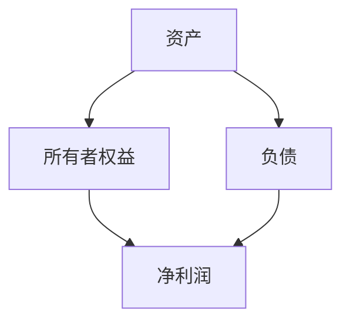
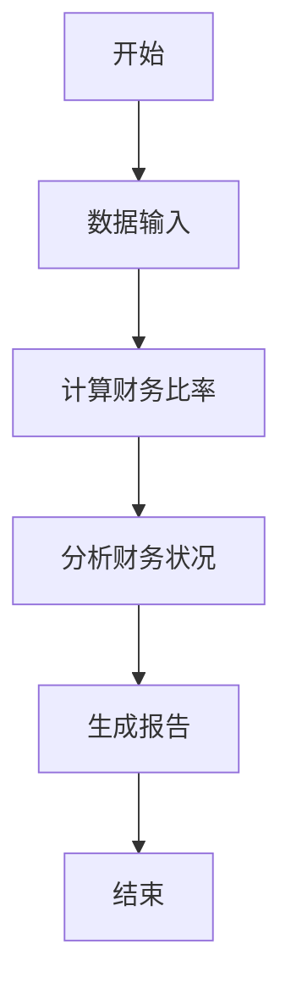
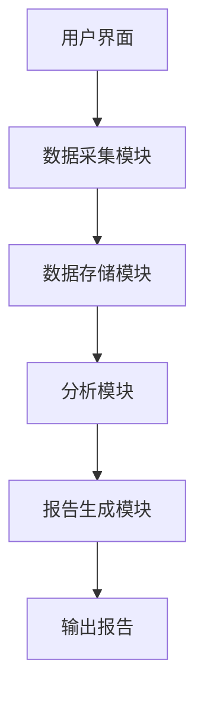
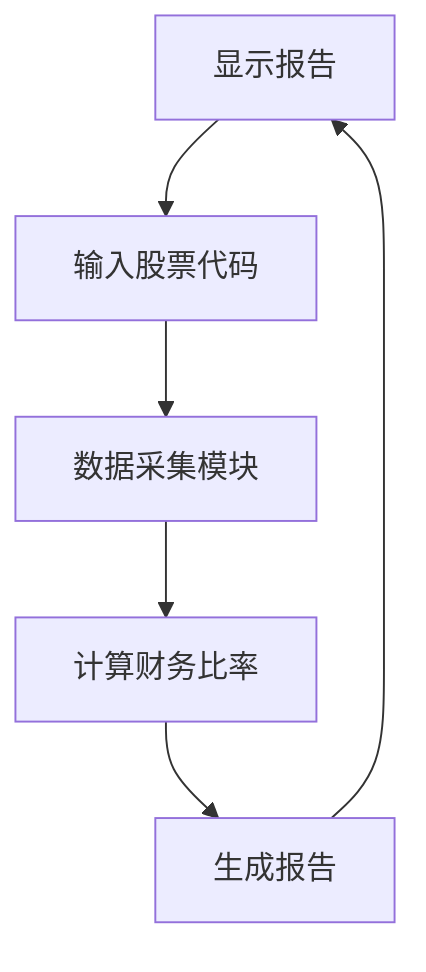

                 


# 克里斯托弗·布朗尼的隐蔽价值投资：发掘资产负债表的秘密

> 关键词：价值投资、资产负债表、财务分析、投资策略、财务比率

> 摘要：本文深入探讨了克里斯托弗·布朗尼的价值投资方法，重点分析了资产负债表在投资决策中的重要性。通过详细讲解财务比率、系统架构和实际案例，展示了如何通过资产负债表发现投资机会和风险，帮助投资者制定科学的投资策略。

---

## 第一部分：背景介绍

### 1.1 核心概念

- **价值投资**：一种以内在价值为导向的投资策略，寻找市场价格低于其内在价值的公司。
- **资产负债表**：反映公司在某一特定时点的财务状况，包括资产、负债和所有者权益。

### 1.2 问题背景

传统投资分析常忽略公司财务健康状况，导致投资决策失误。通过分析资产负债表，投资者能深入理解公司财务结构，识别潜在风险，发现低估机会。

### 1.3 问题解决

通过分析资产负债表，识别公司财务健康状况，评估偿债能力和盈利能力，从而制定科学投资决策。

### 1.4 边界与外延

仅分析财务报表，不考虑市场波动和其他宏观经济因素。本文专注于财务分析，未涉及其他投资策略。

### 1.5 核心要素

- 资产：公司拥有或控制的资源。
- 负债：公司欠款。
- 所有者权益：公司净资产。

## 第二部分：核心概念与联系

### 2.1 概念原理

- 资产负债表反映公司财务状况，帮助投资者评估公司价值。
- 财务比率分析量化公司财务表现，为投资决策提供依据。

### 2.2 概念对比

| 比较维度 | 资产 | 负债 | 所有者权益 |
|----------|------|------|------------|
| 定义     | 资源 | 债务 | 净资产     |
| 重要性   | 核心 | 关键 | 核心       |
| 影响     | 资产负债表健康 | 偿债能力 | 股东价值 |

### 2.3 实体关系图



## 第三部分：算法原理

### 3.1 算法流程



### 3.2 Python实现

```python
import pandas as pd

# 示例代码：计算市盈率
def calculate_pe(ticker):
    # 获取股价
    price = get_price(ticker)
    # 获取每股收益
    eps = get_eps(ticker)
    if eps == 0:
        return 0
    pe_ratio = price / eps
    return pe_ratio

# 示例代码：计算市净率
def calculate_pb(ticker):
    price = get_price(ticker)
    book_value = get_book_value(ticker)
    pb_ratio = price / book_value
    return pb_ratio

# 示例代码：分析财务状况
def analyze_financials(ticker):
    pe = calculate_pe(ticker)
    pb = calculate_pb(ticker)
    print(f"市盈率：{pe}")
    print(f"市净率：{pb}")
```

### 3.3 数学模型

- 市盈率：$$ PE = \frac{股价}{每股收益} $$
- 市净率：$$ PB = \frac{股价}{每股净资产} $$

## 第四部分：系统分析与架构

### 4.1 项目介绍

开发一个价值投资分析系统，帮助投资者分析公司财务状况，评估投资价值。

### 4.2 功能设计

- 数据采集模块：获取公司财务数据。
- 分析模块：计算财务比率，生成分析报告。
- 报告生成模块：输出投资建议。

### 4.3 架构设计



### 4.4 接口设计

- 数据接口：从Yahoo Finance获取数据。
- 报告接口：生成PDF报告。

### 4.5 交互设计



## 第五部分：项目实战

### 5.1 环境安装

```bash
pip install pandas numpy matplotlib
```

### 5.2 核心代码实现

```python
import pandas as pd
import requests

def get_financial_data(ticker):
    # 获取数据
    url = f"https://query1.finance.yahoo.com/ws/v1/finance/quote/{ticker}"
    response = requests.get(url)
    data = response.json()
    financial_data = {
        'Revenue': data['quoteResponse']['result'][0]['revenue'],
        'NetIncome': data['quoteResponse']['result'][0]['netIncome'],
        'TotalAssets': data['quoteResponse']['result'][0]['totalAssets'],
        'TotalLiabilities': data['quoteResponse']['result'][0]['totalLiabilities'],
        'Equity': data['quoteResponse']['result'][0]['totalEquity']
    }
    return financial_data

# 示例代码：计算ROE
def calculate_roe(financial_data):
    return financial_data['NetIncome'] / financial_data['Equity']

# 示例代码：生成报告
def generate_report(ticker, roe):
    print(f"股票代码：{ticker}")
    print(f"ROE: {roe}")
```

### 5.3 案例分析

分析苹果公司（AAPL）的ROE：

```python
data = get_financial_data('AAPL')
roe = calculate_roe(data)
print(f"Apple的ROE为：{roe}")
```

### 5.4 项目小结

通过代码实现，展示了如何利用Python进行财务数据分析，帮助投资者制定决策。

## 第六部分：最佳实践

### 6.1 注意事项

- 数据准确性：确保数据来源可靠。
- 模型局限性：财务比率分析有其局限性，需结合其他因素。

### 6.2 小结

通过本文的学习，读者掌握了如何利用资产负债表进行价值投资，提升了财务分析能力。

### 6.3 拓展阅读

推荐学习其他财务分析方法和投资策略，如现金流分析、杜邦分析等。

---

作者：AI天才研究院/AI Genius Institute & 禅与计算机程序设计艺术 /Zen And The Art of Computer Programming

