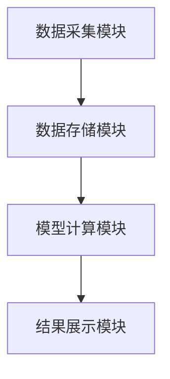
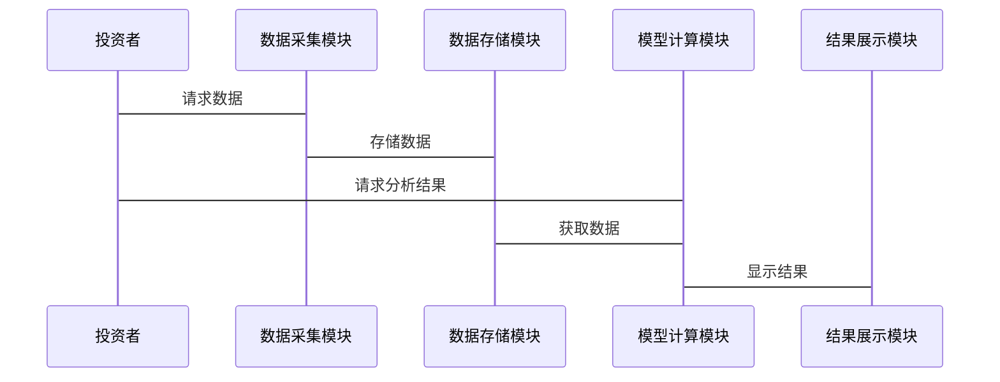

                 

# 克里斯托弗·布朗的全球价值投资机会识别

> 关键词：价值投资，机会识别，全球市场，投资策略，风险管理

> 摘要：本文深入探讨了克里斯托弗·布朗在全球价值投资机会识别方面的独特见解和方法。通过分析投资的基本概念、全球市场趋势、财务指标分析以及技术手段的应用，结合实际案例，帮助读者系统性地识别和评估投资机会，提升投资决策的科学性和效率。

---

# 第一部分: 价值投资的核心概念与背景

## 第1章: 价值投资的定义与历史发展

### 1.1 价值投资的起源与核心理念

#### 1.1.1 价值投资的起源
价值投资是一种以基本面分析为基础的投资策略，起源于20世纪初。本杰明·格雷厄姆和戴维·多德是该理论的奠基人。他们强调以低于内在价值的价格购买优质资产，长期持有，等待市场回归理性。

#### 1.1.2 全球化背景下的价值投资演变
随着全球经济一体化和金融市场的全球化，价值投资的理念在全球范围内得到了广泛应用。投资者不再局限于本地市场，而是关注全球范围内的投资机会。

#### 1.1.3 克里斯托弗·布朗的价值投资方法论
克里斯托弗·布朗将价值投资的理念与现代金融工具相结合，提出了基于量化分析和风险管理的投资策略。他的方法论强调在市场波动中寻找低估资产，同时结合宏观经济分析，优化投资组合。

### 1.2 投资机会识别的基本原理

#### 1.2.1 投资机会的构成要素
- **资产质量**：资产的内在价值，包括盈利能力、财务状况等。
- **市场估值**：资产的市场价格与内在价值的偏离程度。
- **宏观经济环境**：经济增长、利率、通货膨胀等宏观经济因素对资产价格的影响。

#### 1.2.2 市场周期与投资机会的关系
市场周期分为复苏期、增长期、成熟期和衰退期。在不同周期中，不同类型的资产会有不同的表现。例如，在衰退期，债券可能比股票更安全；在增长期，科技股可能更具吸引力。

#### 1.2.3 经济指标对投资机会的影响
- **GDP增长率**：反映整体经济活力。
- **利率水平**：影响债券和股票的相对吸引力。
- **通货膨胀率**：影响货币的时间价值和资产的实际回报。

---

## 第2章: 价值投资的策略与流程

### 2.1 价值投资的核心策略

#### 2.1.1 股票分析方法
- **基本面分析**：分析公司的财务报表，评估其盈利能力、成长性和财务健康状况。
- **相对估值法**：通过比较同类资产的估值指标（如市盈率、市净率）来判断资产是否被低估。

#### 2.1.2 财务指标分析
- **市盈率（P/E）**：股价与每股收益的比率，反映市场对公司盈利能力的预期。
- **市净率（P/B）**：股价与每股净资产的比率，适用于评估资产密集型行业。
- **股息率**：反映公司的分红能力，通常用于评估收益稳定性的资产。

#### 2.1.3 行业分析与竞争分析
- **行业分析**：分析行业的增长潜力、竞争结构和周期性特征。
- **竞争分析**：评估公司在行业中的地位，包括市场份额、竞争优势等。

### 2.2 投资机会识别的流程

#### 2.2.1 信息收集与数据整理
- **数据来源**：包括财务报表、行业报告、市场研究等。
- **数据整理**：对收集到的数据进行清洗和整理，确保数据的准确性和完整性。

#### 2.2.2 估值模型的应用
- **DCF模型**：现金流折现模型，用于评估公司的内在价值。
- **相对估值法**：通过比较同类资产的估值指标，判断资产是否被低估。

#### 2.2.3 投资决策的制定
- **资产配置**：根据市场环境和风险偏好，确定投资组合的构成。
- **风险管理**：制定风险控制策略，包括止损、分散投资等。

---

# 第二部分: 全球市场分析与机会识别

## 第3章: 全球经济与市场分析

### 3.1 全球经济环境分析

#### 3.1.1 主要经济体的经济指标
- **美国**：关注美联储的货币政策、GDP增长率和通货膨胀率。
- **欧洲**：关注欧盟的经济政策、债务问题和地缘政治风险。
- **亚洲**：关注中国经济增长、贸易政策和区域合作。

#### 3.1.2 全球货币政策与经济周期
- **货币政策**：央行的利率政策和货币政策工具对市场的影响。
- **经济周期**：不同经济周期对资产价格的影响。

#### 3.1.3 地缘政治对市场的冲击
- **贸易摩擦**：如中美贸易摩擦对全球市场的影响。
- **地缘政治冲突**：如俄乌冲突对能源价格和供应链的影响。

### 3.2 行业趋势与投资机会

#### 3.2.1 高成长行业的识别
- **科技行业**：人工智能、云计算等高成长行业。
- **新能源行业**：电动汽车、太阳能等绿色能源行业。

#### 3.2.2 周期性行业的波动
- **周期性行业**：如钢铁、汽车等行业受经济周期影响较大，但在经济复苏期可能有较好的投资机会。

#### 3.2.3 结构性变化带来的投资机会
- **数字化转型**：企业数字化转型带来的投资机会。
- **绿色经济**：碳中和目标下的绿色投资机会。

---

## 第4章: 区域市场分析

### 4.1 美国市场分析

#### 4.1.1 美国经济的基本情况
- 美国作为全球最大的经济体，其货币政策和经济指标对全球市场有重要影响。

#### 4.1.2 美国股市的投资机会
- **科技股**：如苹果、微软等公司在全球市场中占据重要地位。
- **周期性股票**：如银行股在经济复苏期可能表现良好。

#### 4.1.3 美国科技股的估值分析
- **市盈率分析**：科技股通常市盈率较高，需结合未来增长潜力进行评估。

### 4.2 欧洲市场分析

#### 4.2.1 欧洲经济的基本情况
- 欧洲经济受债务问题和地缘政治风险影响较大，但也有新能源、高端制造等高成长行业。

#### 4.2.2 欧洲股市的投资机会
- **新能源行业**：如德国的新能源企业在全球绿色经济中占据重要地位。
- **高端制造业**：如德国的汽车制造企业在技术创新方面具有优势。

#### 4.2.3 欧洲能源转型带来的投资机会
- **可再生能源**：如风能、太阳能等行业的投资机会。
- **绿色金融**：如绿色债券等金融工具的发展。

### 4.3 亚洲市场分析

#### 4.3.1 亚洲经济的基本情况
- 亚洲经济受中国增长模式和区域合作影响较大。

#### 4.3.2 亚洲股市的投资机会
- **中国科技股**：如阿里巴巴、腾讯等公司在全球科技行业中具有重要地位。
- **新兴市场**：如印度、东南亚等新兴市场的高成长行业。

#### 4.3.3 中国市场的特殊性与机会
- **政策支持**：如中国政府对科技、新能源等行业的政策支持。
- **市场流动性**：中国市场的高流动性为投资者提供了更多的交易机会。

---

# 第三部分: 投资分析方法与工具

## 第5章: 财务指标分析与估值模型

### 5.1 财务指标分析

#### 5.1.1 常用财务指标对比
- 通过对比市盈率、市净率、股息率等指标，判断资产的估值水平。

#### 5.1.2 财务健康状况的评估
- 通过分析资产负债表、利润表和现金流量表，评估公司的财务健康状况。

#### 5.1.3 财务指标对投资决策的影响
- 财务指标可以帮助投资者识别高风险资产，优化投资组合。

### 5.2 估值模型的应用

#### 5.2.1 市盈率与市净率分析
- 市盈率 = 股价 / 每股收益
- 市净率 = 股价 / 每股净资产

#### 5.2.2 现金流折现模型
- DCF模型：通过预测未来现金流，折现到现值，评估公司的内在价值。

#### 5.2.3 企业价值评估的其他方法
- **EV/EBITDA**：企业价值与息税折旧及摊销前利润的比率。
- **杠杆比率**：评估公司的财务杠杆和偿债能力。

## 第6章: 量化分析与技术手段

### 6.1 量化投资的基本原理

#### 6.1.1 数据驱动的投资决策
- 通过大数据分析和机器学习算法，优化投资决策。

#### 6.1.2 量化模型的应用
- 使用回归分析、时间序列分析等统计方法，预测资产价格走势。

### 6.2 机器学习在投资中的应用

#### 6.2.1 机器学习算法简介
- **线性回归**：用于预测资产价格。
- **决策树**：用于分类资产的风险等级。
- **随机森林**：用于多特征的资产筛选。

#### 6.2.2 机器学习模型的实现
- 使用Python的Scikit-learn库，构建回归模型，预测股票价格。

#### 6.2.3 机器学习在风险管理中的应用
- 使用聚类算法，识别市场风险。

### 6.3 技术分析与市场预测

#### 6.3.1 技术分析的基本原理
- 通过分析历史价格走势，预测未来价格走势。

#### 6.3.2 常用技术指标
- **移动平均线（MA）**：用于判断价格趋势。
- **相对强弱指数（RSI）**：用于判断超买超卖状态。
- **MACD指标**：用于判断价格动能。

---

# 第四部分: 系统架构与设计方案

## 第7章: 系统架构设计

### 7.1 问题场景介绍
- 投资者需要在全球范围内识别价值投资机会，优化投资组合。

### 7.2 系统功能设计

#### 7.2.1 数据采集模块
- **数据来源**：收集全球市场的财务数据、经济指标和新闻资讯。
- **数据清洗**：对数据进行清洗和整理，确保数据的准确性和完整性。

#### 7.2.2 模型计算模块
- **估值模型**：应用DCF模型、相对估值法等模型，计算资产的内在价值。
- **风险管理模型**：评估投资组合的风险，制定风险控制策略。

#### 7.2.3 结果展示模块
- **可视化工具**：使用图表展示投资机会、风险分析和市场趋势。

### 7.3 系统架构设计

#### 7.3.1 系统架构图

#### 7.3.2 接口设计
- **API接口**：提供RESTful API，方便其他系统调用数据和分析结果。

#### 7.3.3 系统交互图

### 7.4 系统实现

#### 7.4.1 数据采集模块的实现
- 使用Python的Pandas库进行数据清洗和整理。

#### 7.4.2 模型计算模块的实现
- 使用NumPy库进行数值计算，构建DCF模型。

#### 7.4.3 结果展示模块的实现
- 使用Matplotlib库绘制图表，展示投资机会和风险分析。

---

# 第五部分: 项目实战

## 第8章: 价值投资实战案例

### 8.1 项目介绍

#### 8.1.1 项目背景
- 分析苹果公司的投资价值。

#### 8.1.2 项目目标
- 使用DCF模型评估苹果公司的内在价值。

### 8.2 项目实现

#### 8.2.1 数据收集与整理
- 收集苹果公司的财务数据和行业报告。

#### 8.2.2 模型选择与实现
- 使用DCF模型计算苹果公司的自由现金流，折现到现值，评估其内在价值。

#### 8.2.3 结果分析
- 对比苹果公司的市场价格和内在价值，判断其是否被低估。

### 8.3 项目总结

#### 8.3.1 项目成果
- 通过DCF模型，得出苹果公司的内在价值为XXX美元，市场价格为YYY美元，判断其是否被低估。

#### 8.3.2 项目经验
- 强调模型的局限性，需结合市场环境和行业趋势进行综合判断。

---

# 第六部分: 总结与展望

## 第9章: 总结与展望

### 9.1 总结
- 本文系统性地介绍了克里斯托弗·布朗的全球价值投资机会识别方法，结合理论分析和实战案例，帮助读者掌握投资机会识别的核心技巧。

### 9.2 展望
- 随着人工智能和大数据技术的发展，价值投资机会识别将更加精准和高效。未来的研究可以进一步探索量化分析与基本面分析的结合，优化投资决策。

---

# 作者：AI天才研究院/AI Genius Institute & 禅与计算机程序设计艺术 /Zen And The Art of Computer Programming

