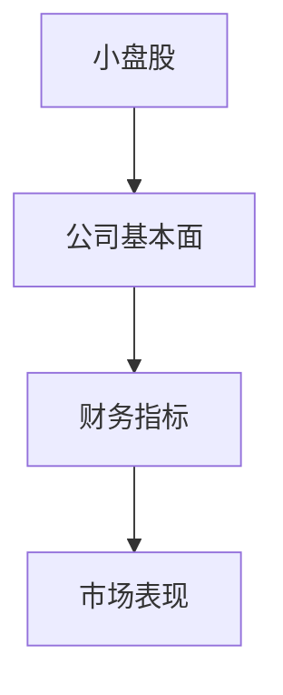
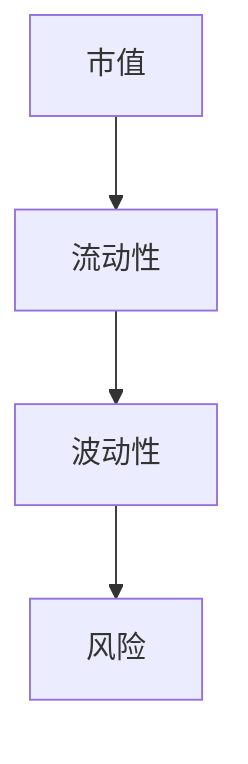
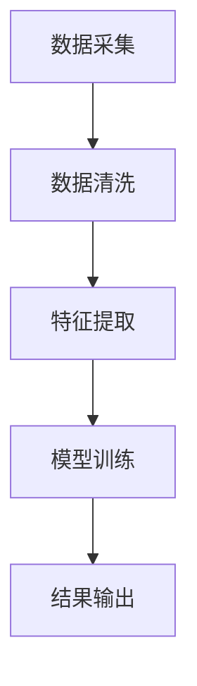
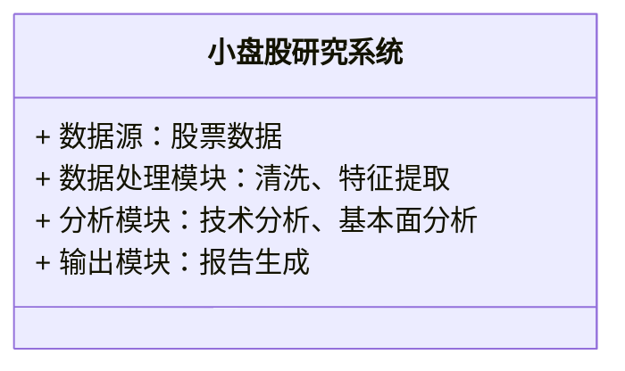
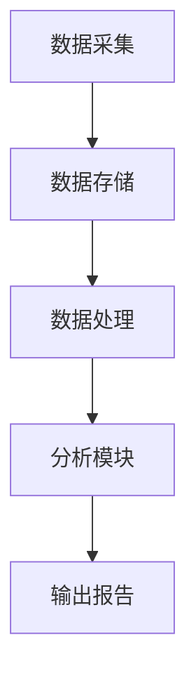
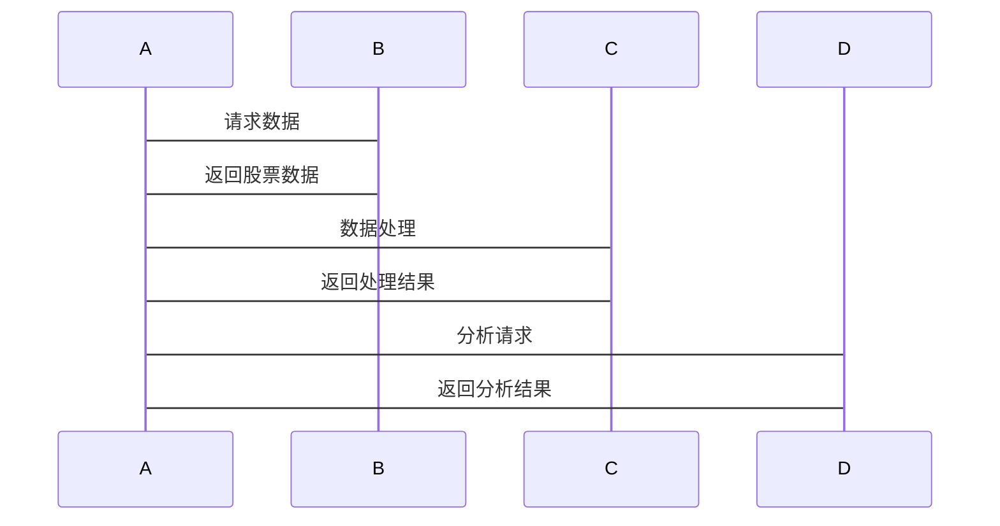

                 


# 克里斯托弗·布朗的小盘股研究方法论

> 关键词：小盘股、投资策略、股票分析、技术分析、基本面分析

> 摘要：克里斯托弗·布朗的小盘股研究方法论通过系统的分析框架和实战案例，揭示了小盘股研究的核心逻辑和方法。本文从背景、概念、算法、系统架构、项目实战等多个维度展开，深入剖析小盘股研究的各个方面，帮助读者掌握小盘股研究的精髓。

---

# 第1章: 小盘股研究的背景与意义

## 1.1 小盘股的定义与特点

### 1.1.1 小盘股的定义
小盘股是指市值较小的公司股票，通常在50亿以下。这些公司通常处于成长阶段，具有较高的增长潜力。

### 1.1.2 小盘股的特点
- 市值小：市值通常在50亿以下。
- 波动性高：价格波动较大，容易受市场情绪影响。
- 成长潜力大：许多小盘股公司具有较高的增长潜力。
- 流动性有限：交易量较小，有时难以快速买卖。

### 1.1.3 小盘股研究的必要性
- 抓住成长机会：小盘股公司可能成长为大盘股，带来超额收益。
- 分散风险：通过研究小盘股，投资者可以分散投资风险。
- 市场机会：小盘股通常被市场忽视，存在低估的机会。

## 1.2 小盘股研究的核心问题

### 1.2.1 问题背景
小盘股市场波动大，信息不透明，研究难度高。

### 1.2.2 问题描述
投资者需要找到一种有效的方法，从小盘股中挖掘出具有成长潜力的公司。

### 1.2.3 问题解决
通过基本面分析和技术分析相结合的方法，筛选出具有成长潜力的小盘股。

### 1.2.4 边界与外延
- 研究范围：市值在50亿以下的公司。
- 研究时间：长期跟踪，关注公司成长性。

### 1.2.5 概念结构与核心要素
- 核心要素：市值、成长性、估值、风险。
- 关键概念：市盈率、市净率、ROE、营业收入增长率。

---

# 第2章: 小盘股研究的核心概念与联系

## 2.1 核心概念原理

### 2.1.1 小盘股研究的关键要素
- 市盈率（P/E）：衡量公司估值的指标。
- 市净率（P/B）：衡量公司资产的合理价格。
- 营业收入增长率：衡量公司成长性。
- 净利润增长率：衡量公司盈利能力。

### 2.1.2 相关概念对比表

| 指标         | 小盘股特点         | 大盘股特点         |
|--------------|------------------|------------------|
| 市值         | 较小              | 较大              |
| 波动性       | 高               | 低               |
| 成长性       | 高               | 稳定             |
| 估值         | 低估机会多        | 低估机会少        |

### 2.1.3 ER实体关系图


## 2.2 核心概念的联系

### 2.2.1 Mermaid流程图


---

# 第3章: 小盘股研究的算法原理

## 3.1 算法原理讲解

### 3.1.1 算法流程图


### 3.1.2 示例代码
```python
# 示例代码：计算小盘股的市盈率
import pandas as pd

def calculate_pe_ratio(data):
    return data['净利润'] / data['股价']

data = pd.read_csv('stock_data.csv')
pe_ratio = calculate_pe_ratio(data)
print(pe_ratio)
```

## 3.2 数学模型与公式

### 3.2.1 移动平均线公式
$$MA_n = \frac{1}{n} \sum_{i=1}^{n} P_i$$
其中，\(P_i\) 表示第 \(i\) 天的价格。

### 3.2.2 相关系数公式
$$r = \frac{\sum (x_i - \bar{x})(y_i - \bar{y})}{\sqrt{\sum (x_i - \bar{x})^2 \sum (y_i - \bar{y})^2}}$$

---

# 第4章: 小盘股研究的系统架构设计

## 4.1 系统功能设计

### 4.1.1 领域模型类图


### 4.1.2 系统架构图


### 4.1.3 系统接口设计
- 数据接口：从数据库或API获取股票数据。
- 分析接口：调用技术分析和基本面分析模块。
- 输出接口：生成报告并输出结果。

### 4.1.4 系统交互序列图


---

# 第5章: 小盘股研究的项目实战

## 5.1 环境安装

### 5.1.1 安装Python环境
```bash
python --version
pip install pandas numpy matplotlib
```

## 5.2 核心代码实现

### 5.2.1 数据清洗代码
```python
import pandas as pd

def clean_data(data):
    # 删除缺失值
    data.dropna(inplace=True)
    # 处理异常值
    data.replace(to_replace='异常值', value=np.nan, inplace=True)
    return data

data = pd.read_csv('stock_data.csv')
cleaned_data = clean_data(data)
print(cleaned_data.head())
```

### 5.2.2 技术分析代码
```python
import pandas as pd
import matplotlib.pyplot as plt

def calculate_ma(data, window):
    return data['收盘价'].rolling(window).mean()

data = pd.read_csv('stock_data.csv')
ma_20 = calculate_ma(data, 20)
ma_20.plot()
plt.show()
```

## 5.3 案例分析

### 5.3.1 实际案例分析
假设我们有一个小盘股公司，其市盈率为20，市净率为1.5，营业收入增长率为30%，净利润增长率为20%。

### 5.3.2 代码实现与解读
```python
import pandas as pd

data = pd.read_csv('stock_data.csv')
data['市盈率'] = data['净利润'] / data['股价']
data['市净率'] = data['股价'] / data['每股净资产']
data['营业收入增长率'] = (data['营业收入'] - data['营业收入'].shift(1)) / data['营业收入'].shift(1)
data['净利润增长率'] = (data['净利润'] - data['净利润'].shift(1)) / data['净利润'].shift(1)

print(data[['市盈率', '市净率', '营业收入增长率', '净利润增长率']].head())
```

## 5.4 项目小结
通过本项目，我们掌握了小盘股研究的核心方法，包括数据清洗、特征提取、技术分析和基本面分析。

---

# 第6章: 小盘股研究的最佳实践

## 6.1 投资建议

### 6.1.1 风险管理
- 设置止损位，避免重大损失。
- 分散投资，降低风险。

### 6.1.2 选股策略
- 优先选择基本面良好、成长性高的小盘股。
- 结合技术分析，寻找买入机会。

## 6.2 小结
小盘股研究需要结合基本面和技术分析，找到具有成长潜力的公司。

## 6.3 注意事项

### 6.3.1 投资风险
小盘股市场波动大，投资需谨慎。

### 6.3.2 数据质量
确保数据来源可靠，避免错误分析。

## 6.4 拓展阅读

### 6.4.1 推荐书籍
- 《股票作手回忆录》
- 《投资学原理》

### 6.4.2 推荐网站
- Yahoo Finance
- 财经新闻网站

---

# 作者：AI天才研究院/AI Genius Institute & 禅与计算机程序设计艺术 /Zen And The Art of Computer Programming

