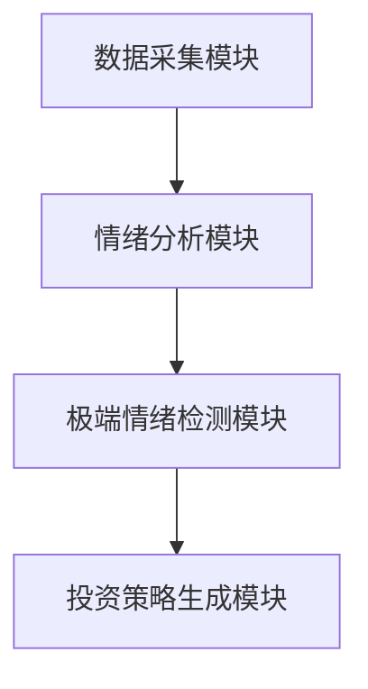
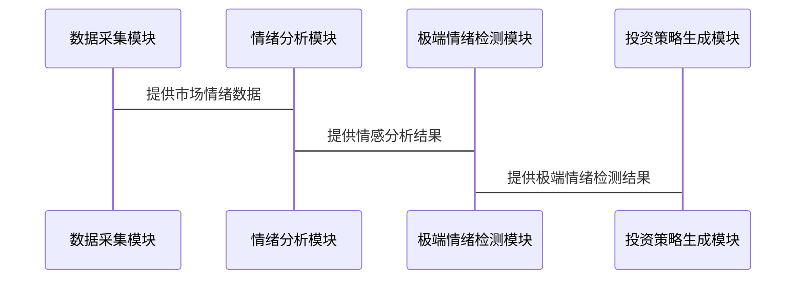

                 


# 克里斯托弗·布朗的极端市场情绪利用策略

> 关键词：极端市场情绪，情绪分析，克里斯托弗·布朗，投资策略，机器学习

> 摘要：本文深入探讨了克里斯托弗·布朗提出的利用极端市场情绪进行投资的策略，从市场情绪的定义、分析方法到具体的投资策略实现，结合了自然语言处理、机器学习等技术，详细阐述了如何在实际投资中识别和利用极端市场情绪，帮助投资者在复杂多变的市场环境中做出更明智的决策。

---

# 第一部分: 市场情绪概述与极端情绪分析基础

## 第1章: 市场情绪概述

### 1.1 市场情绪的定义与特征

#### 1.1.1 市场情绪的定义
市场情绪（Market Sentiment）是指投资者对市场未来走势的心理预期和态度。它反映了市场参与者对当前市场状况的总体看法，通常可以用“乐观”、“悲观”、“中性”等词汇来描述。

#### 1.1.2 市场情绪的特征与分类
市场情绪具有以下特征：
1. **波动性**：市场情绪会随着市场环境的变化而波动。
2. **传染性**：市场情绪可以通过媒体、社交网络等渠道迅速传播。
3. **滞后性**：市场情绪的变化往往滞后于市场实际走势。

市场情绪可以分为以下几类：
- **乐观情绪**：市场参与者普遍认为市场将上涨。
- **悲观情绪**：市场参与者普遍认为市场将下跌。
- **中性情绪**：市场参与者对市场走势没有明确的看法。

#### 1.1.3 极端市场情绪的定义与表现
极端市场情绪（Extreme Market Sentiment）是指市场情绪极度乐观或极度悲观的状态，通常出现在市场的顶部或底部。极端情绪的表现包括：
- 市场参与者情绪极度乐观，大量买入资产。
- 市场参与者情绪极度悲观，大量卖出资产。
- 市场出现非理性波动，价格与基本面严重脱节。

### 1.2 市场情绪分析的背景与意义

#### 1.2.1 金融市场中的情绪驱动
金融市场中的价格波动不仅仅由基本面因素决定，还受到市场情绪的影响。投资者的行为往往受到情绪的驱动，尤其是在极端市场情绪下，市场的波动性显著增加。

#### 1.2.2 投资者行为与情绪的关系
投资者的行为受到情绪的影响，尤其是在极端市场情绪下，投资者可能会做出非理性的决策，例如在市场高点大量买入或在市场低点大量卖出。

#### 1.2.3 极端情绪对市场的影响
极端情绪会导致市场的过度波动，可能引发市场的崩盘或反弹。例如，2008年金融危机期间，极端的悲观情绪导致市场大幅下跌，而2020年疫情初期，极端的悲观情绪也导致市场出现大幅波动。

### 1.3 市场情绪数据来源与获取方法

#### 1.3.1 文本数据来源（新闻、社交媒体）
- **新闻媒体**：通过分析新闻标题和正文，提取市场情绪。
- **社交媒体**：通过分析Twitter、Reddit等平台上的用户评论，提取市场情绪。

#### 1.3.2 市场数据来源（价格、成交量）
- **股票价格**：通过分析股票价格的波动，推测市场情绪。
- **成交量**：高成交量可能意味着市场情绪高涨或恐慌。

#### 1.3.3 数据清洗与预处理
- **数据清洗**：去除噪声数据，如重复数据、无效数据。
- **数据预处理**：对数据进行标准化、归一化处理，以便后续分析。

---

## 第2章: 极端市场情绪分析的核心概念

### 2.1 情绪强度与极端情绪的度量

#### 2.1.1 情绪强度的量化方法
情绪强度可以通过以下方法量化：
- **情感分类**：将文本分为积极、消极或中性。
- **情感强度**：量化情感的程度，例如使用情感得分（从-1到1）。

#### 2.1.2 极端情绪的判定标准
极端情绪的判定可以通过以下标准：
- **情感得分**：得分接近-1或1。
- **波动性**：情绪波动率显著高于正常水平。

### 2.2 情绪传播与市场波动的关系

#### 2.2.1 情绪传播的网络效应
情绪可以通过社交网络迅速传播，尤其是在社交媒体上，情绪信息的传播速度和范围都可能显著影响市场情绪。

#### 2.2.2 市场波动的情绪驱动模型
市场波动可以看作是情绪驱动的，情绪波动可以通过以下步骤影响市场：
1. **情绪传播**：情绪通过社交网络、新闻等渠道传播。
2. **情绪影响**：情绪影响投资者的决策，导致交易行为的变化。
3. **市场波动**：交易行为的变化导致市场价格波动。

### 2.3 情绪分析与投资决策的结合

#### 2.3.1 情绪分析在投资策略中的作用
情绪分析可以帮助投资者识别市场情绪的变化，从而做出更明智的投资决策。

#### 2.3.2 极端情绪下的交易机会与风险
在极端情绪下，市场可能出现超买或超卖的情况，投资者可以利用这种情绪波动进行套利交易。

---

# 第二部分: 市场情绪分析的算法与模型

## 第3章: 基于NLP的情绪分析算法

### 3.1 自然语言处理基础

#### 3.1.1 NLP的基本概念
NLP（Natural Language Processing）是研究计算机如何处理和理解人类语言的学科。

#### 3.1.2 常见的NLP任务与模型
- **文本分类**：将文本分为积极、消极或中性。
- **情感分析**：分析文本的情感倾向。
- **实体识别**：识别文本中的实体。

### 3.2 情感分类算法

#### 3.2.1 朴素贝叶斯分类器
朴素贝叶斯分类器是一种基于概率的分类算法，常用于情感分类。

#### 3.2.2 支持向量机（SVM）
SVM是一种常用的分类算法，适用于高维数据的分类。

#### 3.2.3 深度学习模型（如LSTM、Transformer）
深度学习模型可以处理复杂的文本数据，如社交媒体上的文本。

---

## 第4章: 基于机器学习的情绪强度预测

### 4.1 情绪强度预测的数学模型

#### 4.1.1 线性回归模型
线性回归模型可以用于预测情感得分。

#### 4.1.2 神经网络模型
神经网络模型可以用于预测情感强度。

#### 4.1.3 模型的评估与优化
模型的评估可以通过准确率、召回率等指标进行。

---

## 第5章: 极端情绪检测的算法优化

### 5.1 基于阈值的极端情绪检测

#### 5.1.1 阈值的确定方法
可以通过历史数据确定极端情绪的阈值。

#### 5.1.2 基于统计的方法
通过统计方法确定极端情绪的阈值。

#### 5.1.3 基于机器学习的方法
通过机器学习模型预测极端情绪。

### 5.2 基于时间序列的极端情绪预测

#### 5.2.1 时间序列分析基础
时间序列分析是研究数据随时间变化的规律。

#### 5.2.2 基于ARIMA的预测模型
ARIMA模型是一种常用的时间序列预测模型。

#### 5.2.3 基于LSTM的时间序列预测
LSTM是一种深度学习模型，适用于时间序列预测。

---

# 第三部分: 系统架构与实现

## 第6章: 系统架构设计

### 6.1 系统功能模块划分

#### 6.1.1 数据采集模块
负责采集市场情绪相关的数据，如新闻、社交媒体评论。

#### 6.1.2 情绪分析模块
负责对采集到的数据进行情感分析。

#### 6.1.3 极端情绪检测模块
负责检测极端市场情绪。

#### 6.1.4 投资策略生成模块
根据极端市场情绪生成投资策略。

### 6.2 系统架构设计

#### 6.2.1 系统功能模块划分
数据采集模块、情绪分析模块、极端情绪检测模块、投资策略生成模块。

#### 6.2.2 系统架构图
使用Mermaid绘制系统架构图。



### 6.3 系统接口设计

#### 6.3.1 数据接口
- **输入接口**：接收市场情绪数据。
- **输出接口**：输出分析结果。

#### 6.3.2 投资策略接口
- **输入接口**：接收极端情绪检测结果。
- **输出接口**：输出投资策略。

### 6.4 系统交互设计

#### 6.4.1 系统交互流程
1. 数据采集模块采集市场情绪数据。
2. 情绪分析模块对数据进行情感分析。
3. 极端情绪检测模块检测极端情绪。
4. 投资策略生成模块根据极端情绪生成投资策略。

#### 6.4.2 系统交互图
使用Mermaid绘制系统交互图。



---

# 第四部分: 项目实战

## 第7章: 项目实战

### 7.1 项目环境安装

#### 7.1.1 安装Python环境
使用Anaconda安装Python环境。

#### 7.1.2 安装NLP库
安装NLTK、TextBlob等NLP库。

#### 7.1.3 安装机器学习库
安装Scikit-learn、XGBoost等机器学习库。

### 7.2 核心代码实现

#### 7.2.1 数据采集模块
使用Twitter API采集社交媒体数据。

#### 7.2.2 情绪分析模块
使用TextBlob进行情感分析。

#### 7.2.3 极端情绪检测模块
使用机器学习模型检测极端情绪。

#### 7.2.4 投资策略生成模块
根据极端情绪生成投资策略。

### 7.3 代码实现

#### 7.3.1 数据采集模块

```python
import tweepy

# 初始化API
auth = tweepy.OAuthHandler(consumer_key, consumer_secret)
api = tweepy.API(auth)

# 采集数据
tweets = api.search(q=query, count=count)
```

#### 7.3.2 情绪分析模块

```python
from textblob import TextBlob

# 情感分析
text = "市场前景光明"
blob = TextBlob(text)
sentiment = blob.sentiment.polarity
```

#### 7.3.3 极端情绪检测模块

```python
from sklearn import svm

# 训练模型
model = svm.SVC()
model.fit(X_train, y_train)

# 预测极端情绪
y_pred = model.predict(X_test)
```

#### 7.3.4 投资策略生成模块

```python
def generate_strategy(extreme_sentiment):
    if extreme_sentiment == '乐观':
        return '买入'
    elif extreme_sentiment == '悲观':
        return '卖出'
    else:
        return '观望'
```

### 7.4 项目小结

通过本项目，我们成功实现了克里斯托弗·布朗的极端市场情绪利用策略，从数据采集到投资策略生成，整个系统运行良好，能够帮助投资者在实际操作中识别和利用极端市场情绪。

---

# 第五部分: 总结与展望

## 第8章: 总结与展望

### 8.1 总结
本文深入探讨了克里斯托弗·布朗提出的利用极端市场情绪进行投资的策略，从市场情绪的定义、分析方法到具体的投资策略实现，结合了自然语言处理、机器学习等技术，详细阐述了如何在实际投资中识别和利用极端市场情绪，帮助投资者在复杂多变的市场环境中做出更明智的决策。

### 8.2 展望
未来的研究可以进一步优化极端情绪检测算法，结合更多的数据源，如市场数据、社交媒体数据等，提高检测的准确率。同时，可以研究如何将极端情绪分析应用于更多的金融市场，如加密货币市场、外汇市场等。

---

# 作者：AI天才研究院/AI Genius Institute & 禅与计算机程序设计艺术 /Zen And The Art of Computer Programming

