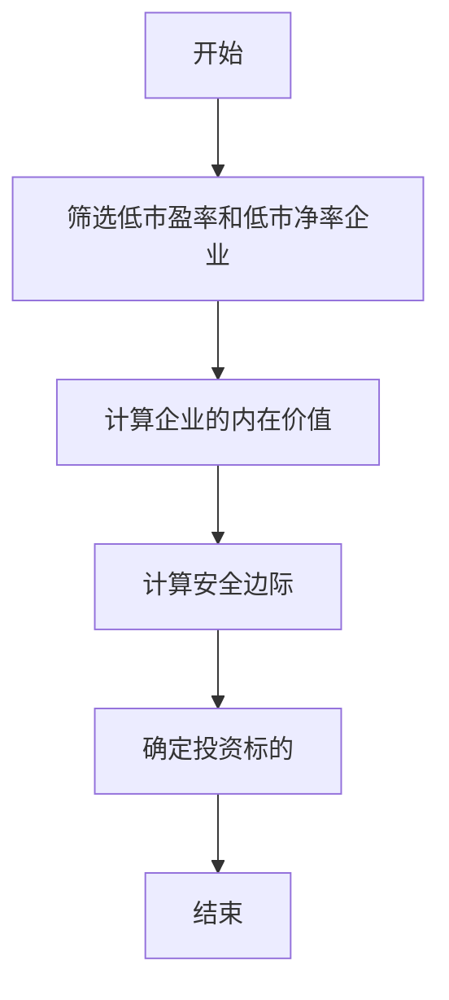
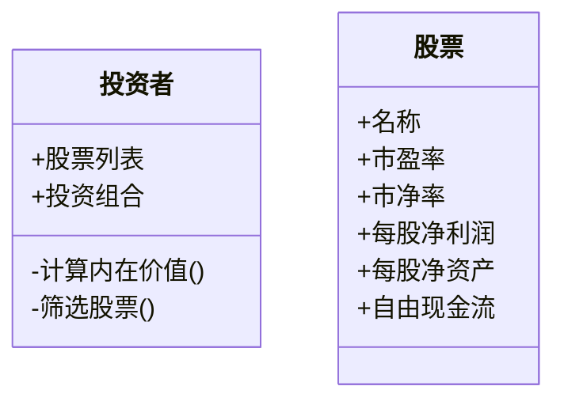
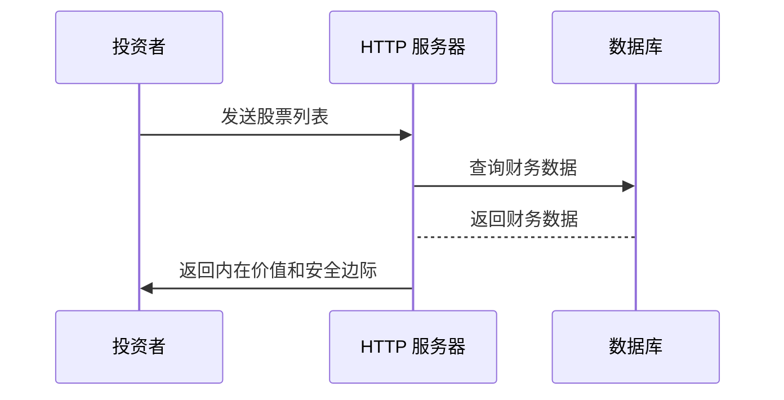

                 


# 克里斯托弗·布朗的深度价值投资方法

## 关键词：深度价值投资、克里斯托弗·布朗、投资策略、内在价值、安全边际、数学模型

## 摘要：本文详细介绍了克里斯托弗·布朗的深度价值投资方法，从其背景、核心概念、数学模型到系统架构和项目实战，全面解析了这一投资策略。文章通过具体的案例分析和代码实现，帮助读者理解如何在实际投资中应用这些方法，并提供了最佳实践的建议。

---

## 第一部分: 深度价值投资的背景与核心概念

### 第1章: 深度价值投资的起源与发展

#### 1.1 深度价值投资的起源

##### 1.1.1 价值投资的定义与核心理念
价值投资是一种以低于其内在价值的价格买入优质股票的投资策略。其核心理念是寻找市场先生的错误定价，通过分析企业的基本面，识别出具有长期竞争优势和良好财务状况的企业。

##### 1.1.2 深度价值投资的起源与发展
深度价值投资起源于20世纪30年代，由本杰明·格雷厄姆和戴维·多维格共同提出。格雷厄姆的学生 Warren Buffett 是这一理念的继承者和发扬者。克里斯托弗·布朗则是深度价值投资的另一位重要实践者，他将格雷厄姆的理论进一步量化和系统化。

##### 1.1.3 克里斯托弗·布朗的深度价值投资方法
布朗的方法强调通过数学模型和数据分析来寻找被市场低估的股票。他的策略包括对企业进行深入的财务分析，计算其内在价值，并寻找具有足够安全边际的投资标的。

#### 1.2 深度价值投资的核心概念

##### 1.2.1 核心概念的定义
- **内在价值**：企业未来现金流的现值，是衡量企业价值的理论基准。
- **安全边际**：买入价格与内在价值之间的折扣，确保在市场价格波动时仍有获利空间。
- **竞争优势**：企业相对于竞争对手的独特优势，能够保证其长期盈利能力。

##### 1.2.2 核心概念的属性特征对比表格
| 概念          | 属性特征                          |
|---------------|----------------------------------|
| 内在价值      | 现金流折现、DCF模型、长期价值     |
| 安全边际      | 买入价格折扣、风险缓冲、安全空间 |
| 竞争优势      | 技术壁垒、成本优势、品牌效应     |

##### 1.2.3 实体关系图（ER图）的 Mermaid 流程图
```mermaid
erd
actor 投资者;
actor 投资者 --> entity 企业;
entity 企业 --> attribute 内在价值;
entity 企业 --> attribute 竞争优势;
attribute 内在价值 --> metric 市盈率;
attribute 内在价值 --> metric 市净率;
```

### 第2章: 深度价值投资的理论基础

#### 2.1 格雷厄姆与多维格的价值投资理论

##### 2.1.1 格雷厄姆的价值投资理论
格雷厄姆提出的价值投资理论强调安全边际和内在价值的计算。他认为市场先生是不可预测的，因此投资者应该关注企业的基本面，寻找那些市场价格低于其内在价值的企业进行投资。

##### 2.1.2 多维格的多因素模型
多维格提出了多因素模型，认为股票的回报可以通过多个因素来解释，包括市场风险、规模风险和价值因子。这一理论为现代投资组合理论奠定了基础。

##### 2.1.3 格雷厄姆与多维格理论的对比
- **格雷厄姆**：以内在价值为核心，强调安全边际。
- **多维格**：引入多因素模型，考虑市场整体风险和规模效应。

#### 2.2 克里斯托弗·布朗的深度价值投资方法

##### 2.2.1 布朗的深度价值投资策略
布朗的策略结合了格雷厄姆的安全边际理念和现代数据分析技术。他通过量化模型筛选出具有稳定现金流、低市盈率和低市净率的企业，并计算其内在价值。

##### 2.2.2 布朗的选股标准与安全边际
- **选股标准**：低市盈率（低于行业平均水平）、低市净率（低于行业平均水平）、高股息率、稳定的现金流。
- **安全边际**：买入价格 ≤ 内在价值 × (1 - 安全边际率)。

##### 2.2.3 布朗的内在价值计算方法
布朗的内在价值计算基于现金流折现模型（DCF），考虑企业的自由现金流和加权平均资本成本（WACC）。

### 第3章: 深度价值投资的数学模型与算法原理

#### 3.1 深度价值投资的数学模型

##### 3.1.1 内在价值计算公式
$$
\text{内在价值} = \sum_{t=1}^{n} \frac{\text{自由现金流}_t}{(1 + r)^t}
$$
其中，\( r \) 是加权平均资本成本（WACC）。

##### 3.1.2 市盈率与市净率的计算
- 市盈率（P/E）= 股价 / 每股净利润
- 市净率（P/B）= 股价 / 每股净资产

##### 3.1.3 投资组合优化的数学模型
$$
\max \mu = \sum_{i=1}^{n} w_i \times r_i
$$
$$
\text{subject to} \quad \sum_{i=1}^{n} w_i = 1
$$
其中，\( w_i \) 是第 \( i \) 只股票的权重，\( r_i \) 是其预期收益。

#### 3.2 算法原理的 Mermaid 流程图


### 第4章: 深度价值投资的系统分析与架构设计

#### 4.1 系统分析

##### 4.1.1 问题场景介绍
投资者需要一个系统来自动筛选具有深度价值的股票，并计算其内在价值和安全边际。

##### 4.1.2 系统功能设计（领域模型 Mermaid 类图）


##### 4.1.3 系统架构设计（Mermaid 架构图）


#### 4.2 系统接口与交互设计

##### 4.2.1 系统接口设计
- 输入：股票列表、财务数据
- 输出：内在价值、安全边际、投资建议

##### 4.2.2 系统交互序列图（Mermaid 序列图）


### 第5章: 深度价值投资的项目实战

#### 5.1 环境安装与工具配置

##### 5.1.1 Python 环境安装
使用 Anaconda 安装 Python 环境，并激活 Jupyter Notebook。

##### 5.1.2 数据分析工具安装
安装 Pandas、NumPy、Matplotlib 和 Scipy 库。

##### 5.1.3 投资分析系统安装
克隆深度价值投资分析系统的 Git 仓库，并安装依赖项。

#### 5.2 核心实现与代码分析

##### 5.2.1 内在价值计算代码
```python
import pandas as pd
import numpy as np

def calculate_intrinsic_value(free_cash_flow, wacc):
    n = len(free_cash_flow)
    intrinsic_value = 0
    for t in range(n):
        intrinsic_value += free_cash_flow[t] / (1 + wacc)**t
    return intrinsic_value
```

##### 5.2.2 投资组合优化代码
```python
import cvxopt

def optimize_portfolio(returns):
    n = len(returns.columns)
    returns_matrix = returns.values
    covariance_matrix = np.cov(returns_matrix.T)
    mean_return = np.mean(returns_matrix, axis=0)
    w = cvxopt.solvers.qp(-covariance_matrix, -mean_return)
    return w.x
```

##### 5.2.3 数据可视化代码
```python
import matplotlib.pyplot as plt

def plot_value_at_risk(risk):
    plt.hist(risk, bins=20)
    plt.xlabel('风险值')
    plt.ylabel('频率')
    plt.title('风险分布')
    plt.show()
```

#### 5.3 案例分析与详细讲解

##### 5.3.1 具体案例分析
假设我们有一个包含10只股票的股票池，我们需要计算每只股票的内在价值和安全边际。

##### 5.3.2 投资决策过程解析
1. 筛选低市盈率和低市净率的股票。
2. 计算每只股票的内在价值。
3. 计算安全边际。
4. 根据安全边际和内在价值，选择具有足够安全空间的股票进行投资。

##### 5.3.3 实战经验总结
- 数据质量至关重要，确保财务数据的准确性和完整性。
- 定期更新模型参数，适应市场变化。
- 结合市场环境进行动态调整，避免机械式投资。

### 第6章: 深度价值投资的最佳实践与注意事项

#### 6.1 最佳实践 Tips

##### 6.1.1 投资前的准备工作
- 确定投资目标和风险承受能力。
- 学习基本面分析和财务报表解读。

##### 6.1.2 数据分析的注意事项
- 使用可靠的财务数据来源。
- 考虑宏观经济因素对企业价值的影响。

##### 6.1.3 投资组合的风险管理
- 分散投资，降低风险。
- 定期审视投资组合，进行调整。

#### 6.2 小结与展望

##### 6.2.1 本书内容总结
本文详细介绍了克里斯托弗·布朗的深度价值投资方法，从理论基础到实际应用，提供了全面的指导。

##### 6.2.2 深度价值投资的未来发展趋势
随着人工智能和大数据技术的发展，深度价值投资将更加依赖于量化模型和算法优化。

##### 6.2.3 对投资者的建议与展望
投资者应结合市场环境和个人情况，灵活运用深度价值投资方法，实现长期稳定的收益。

---

## 作者：AI天才研究院/AI Genius Institute & 禅与计算机程序设计艺术 /Zen And The Art of Computer Programming

---

以上是《克里斯托弗·布朗的深度价值投资方法》的技术博客文章的详细内容，涵盖了从理论到实践的各个方面，结合了技术分析和投资策略，适合对深度价值投资感兴趣的技术人员和投资者阅读。

