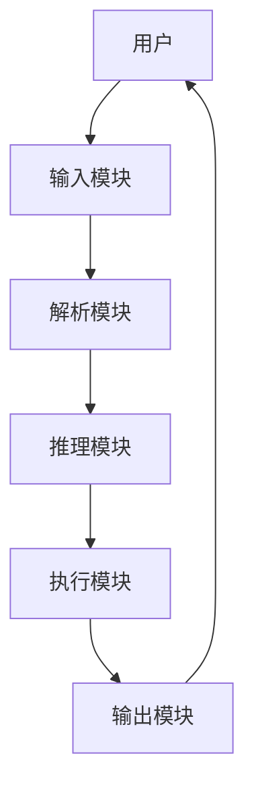
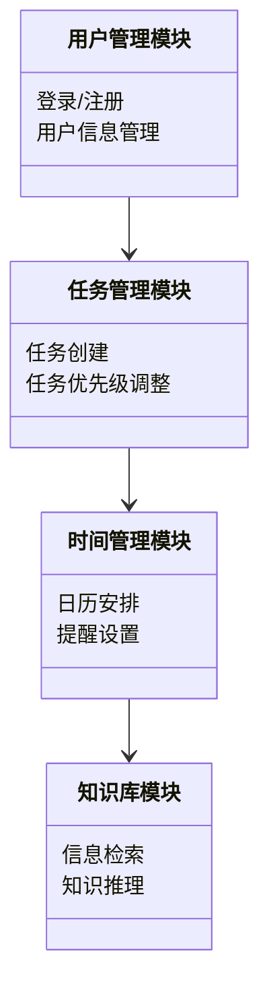

                 


# 全方位生活助手AI Agent：LLM驱动的个人管理系统

> 关键词：AI Agent, LLM, 个人管理系统, 人工智能, 个人助手, 生活管理, 技术博客

> 摘要：本文深入探讨了基于大语言模型（LLM）的AI Agent技术在个人管理中的应用。通过系统化的分析和设计，结合实际项目案例，展示了如何构建一个智能化的个人管理系统。文章涵盖了技术基础、系统架构、项目实战、高级应用及安全伦理等多个方面，旨在为读者提供全面的技术视角和实践指导。

---

# 第一部分: 全方位生活助手AI Agent概述

## 第1章: AI Agent与个人管理系统的背景介绍

### 1.1 问题背景

#### 1.1.1 当前个人管理的主要挑战

在现代生活中，个人管理已成为一项复杂的系统工程，涉及时间管理、任务安排、信息检索、健康监测等多个方面。传统的个人管理工具，如日历应用、任务清单等，虽然在一定程度上解决了部分问题，但存在以下主要挑战：

1. **信息孤岛**：各个管理工具之间缺乏协同，数据无法共享，导致用户需要在多个工具之间切换操作。
2. **效率低下**：手动输入、查找和更新信息的过程耗时耗力，难以适应快节奏的生活。
3. **决策支持不足**：现有工具通常仅提供存储和提醒功能，缺乏智能的决策支持，难以应对复杂的任务优先级和情境判断。

#### 1.1.2 AI技术在个人管理中的应用潜力

随着人工智能技术的快速发展，尤其是大语言模型（LLM）的崛起，AI在个人管理中的应用展现出巨大潜力。LLM能够通过自然语言处理技术，帮助用户完成信息检索、任务规划、决策支持等复杂任务，显著提升管理效率。AI Agent作为智能化的个人助手，能够实时响应用户需求，提供个性化的服务，是解决传统管理工具局限性的理想选择。

#### 1.1.3 LLM驱动的AI Agent的核心价值

LLM驱动的AI Agent通过以下方式实现其核心价值：

1. **智能化交互**：支持自然语言对话，用户可以通过简单的语言指令完成复杂的任务。
2. **动态规划与执行**：根据实时信息和用户反馈，动态调整任务优先级和执行计划。
3. **多任务协同**：能够同时处理多个任务，并在不同任务之间实现信息共享和协同。

### 1.2 核心概念与问题描述

#### 1.2.1 AI Agent的定义与核心要素

AI Agent是一种智能化的计算机程序，能够感知环境、理解用户需求，并通过自主决策和执行来完成任务。AI Agent的核心要素包括：

1. **感知模块**：通过传感器或API获取环境信息。
2. **推理模块**：基于感知信息进行分析和推理。
3. **决策模块**：根据推理结果制定行动计划。
4. **执行模块**：通过API或用户界面执行行动计划。
5. **学习模块**：通过机器学习不断优化自身性能。

#### 1.2.2 LLM在AI Agent中的作用

大语言模型（LLM）在AI Agent中扮演着关键角色，主要体现在以下几个方面：

1. **自然语言理解**：通过LLM理解用户的意图和需求。
2. **知识检索**：利用LLM进行信息检索和知识推理。
3. **生成与表达**：通过LLM生成自然流畅的回复或行动计划。

#### 1.2.3 全方位生活助手的系统目标与边界

系统的总体目标是构建一个智能化的个人管理助手，能够覆盖生活的方方面面，包括任务管理、时间规划、信息检索、健康监测等。系统的边界包括：

1. **用户范围**：主要面向个人用户，不支持多用户协作。
2. **功能范围**：聚焦于生活管理，不涉及企业级管理功能。
3. **数据范围**：仅处理与个人生活相关的数据，不涉及企业或敏感数据。

---

## 第2章: AI Agent的核心概念与联系

### 2.1 核心概念原理

#### 2.1.1 LLM的工作原理

大语言模型（LLM）通过大量数据的预训练，掌握了语言的生成和理解能力。其工作原理可以概括为以下步骤：

1. **输入处理**：接收用户输入的自然语言指令。
2. **编码表示**：将输入文本转换为模型可理解的向量表示。
3. **解码生成**：基于向量表示生成相应的输出文本。
4. **反馈优化**：根据用户反馈不断优化生成结果。

#### 2.1.2 AI Agent的决策机制

AI Agent的决策机制是一个复杂的系统，主要包括以下几个步骤：

1. **目标识别**：识别用户的需求或目标。
2. **信息检索**：从知识库中检索相关信息。
3. **推理与规划**：基于检索信息进行推理，制定行动计划。
4. **执行与反馈**：执行计划并根据反馈调整策略。

#### 2.1.3 人机交互的核心流程

人机交互的核心流程包括：

1. **用户输入**：用户通过自然语言或图形界面输入需求。
2. **解析需求**：系统解析用户需求并生成响应。
3. **执行任务**：系统根据需求执行相应的任务。
4. **反馈结果**：系统将结果反馈给用户。

### 2.2 概念属性特征对比表

以下表格对比了LLM驱动的AI Agent与传统规则驱动系统的区别：

```plaintext
| 概念       | 输入方式 | 输出方式 | 决策方式 | 交互方式 |
|------------|----------|----------|----------|----------|
| LLM驱动    | 文本输入  | 文本输出  | 模型推理 | 自然语言 |
| 规则驱动    | 结构化输入| 结构化输出| 条件判断 | 图形界面  |
```

### 2.3 ER实体关系图

以下是系统的核心实体关系图：

```mermaid
erd
    账户
    用户
    任务
    时间表
    提醒
    通知
    日志
    设置
    AI模型
    交互记录
```

---

## 第3章: AI Agent的技术基础

### 3.1 LLM的数学模型与算法原理

大语言模型的核心算法是基于Transformer架构的Transformer模型。其数学模型可以表示为：

$$
\text{Output} = \text{Attention}(Q, K, V)
$$

其中，$Q$、$K$、$V$分别表示查询、键和值向量。

### 3.2 AI Agent的系统架构设计

以下是系统的模块划分和交互流程：



### 3.3 系统功能设计

以下是系统的功能模块划分：



---

## 第4章: AI Agent的项目实战

### 4.1 环境安装与配置

以下是项目所需的环境配置：

```bash
# 安装Python和依赖
pip install python
pip install numpy
pip install transformers
```

### 4.2 核心代码实现

以下是AI Agent的核心代码实现：

```python
class AI-Agent:
    def __init__(self):
        self.model = LLM_model()
        self.task_manager = TaskManager()
        self.time_manager = TimeManager()
    
    def process_request(self, user_input):
        # 解析用户输入
        intent = self.model.parse(user_input)
        # 执行相应任务
        response = self.execute_task(intent)
        return response

class TaskManager:
    def create_task(self, task_description):
        # 创建任务
        pass
```

### 4.3 代码解读与分析

上述代码实现了AI Agent的基本功能，包括用户输入解析、任务创建和执行等核心功能。通过调用大语言模型，AI Agent能够理解用户的意图并执行相应的操作。

### 4.4 实际案例分析

以下是一个实际案例分析：

用户输入：“提醒我明天早上8点开会。”

1. **解析输入**：AI Agent识别出任务类型为“提醒”。
2. **创建任务**：任务管理模块创建一个提醒任务。
3. **执行任务**：时间管理模块设置闹钟。

---

## 第5章: AI Agent的高级应用与扩展

### 5.1 多模态交互设计

AI Agent可以通过多模态交互方式提升用户体验，例如：

1. **视觉交互**：通过图形界面展示任务进度。
2. **语音交互**：支持语音输入和输出。

### 5.2 自适应学习机制

AI Agent可以通过自适应学习机制不断优化自身性能，例如：

1. **强化学习**：通过用户反馈优化决策策略。
2. **迁移学习**：将知识迁移到新场景中。

### 5.3 多任务协作能力

AI Agent可以实现多任务协作，例如：

1. **任务协同**：在不同任务之间共享信息。
2. **资源分配**：根据任务优先级分配资源。

---

## 第6章: AI Agent的安全与伦理

### 6.1 数据隐私与安全

AI Agent需要确保用户数据的安全，防止数据泄露和滥用。

### 6.2 模型的伦理问题

AI Agent的决策可能涉及伦理问题，例如：

1. **信息的真实性**：生成的信息是否真实可靠。
2. **决策的透明性**：用户是否能够理解AI的决策过程。

### 6.3 使用规范与建议

为确保AI Agent的合理使用，建议制定以下规范：

1. **数据使用规范**：明确数据的使用范围和权限。
2. **伦理审查机制**：建立伦理审查机制，确保AI行为符合伦理标准。

---

## 第7章: AI Agent的未来发展

### 7.1 技术发展趋势

未来，AI Agent将朝着以下几个方向发展：

1. **多模态交互**：支持更多样的交互方式。
2. **更强的推理能力**：提升模型的推理能力。
3. **更广泛的应用场景**：扩展到更多领域。

### 7.2 挑战与机遇

尽管AI Agent技术前景广阔，但仍面临诸多挑战，例如：

1. **技术瓶颈**：模型的泛化能力和推理能力有待提升。
2. **伦理问题**：如何确保AI行为符合伦理规范。

### 7.3 未来展望

随着技术的进步，AI Agent将逐渐成为个人生活不可或缺的一部分，为用户提供更加智能、高效的服务。

---

# 结语

通过本文的系统分析，我们可以看到，基于LLM的AI Agent技术在个人管理中的应用前景广阔。随着技术的不断进步，AI Agent将为用户带来更加智能化、个性化的服务，帮助我们更好地应对生活中的各种挑战。

---

作者：AI天才研究院/AI Genius Institute & 禅与计算机程序设计艺术/Zen And The Art of Computer Programming

