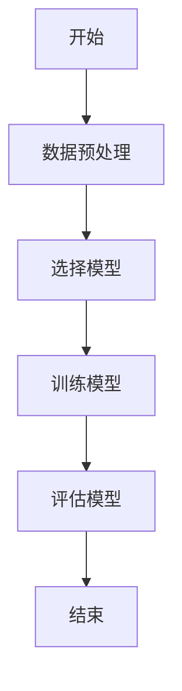
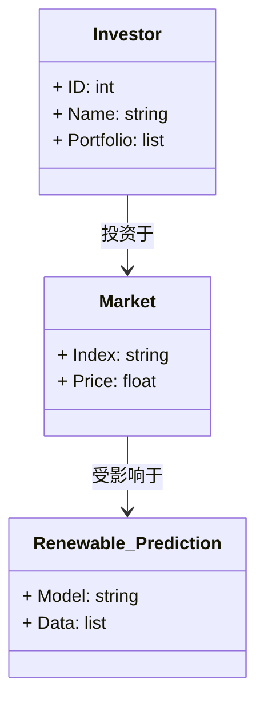
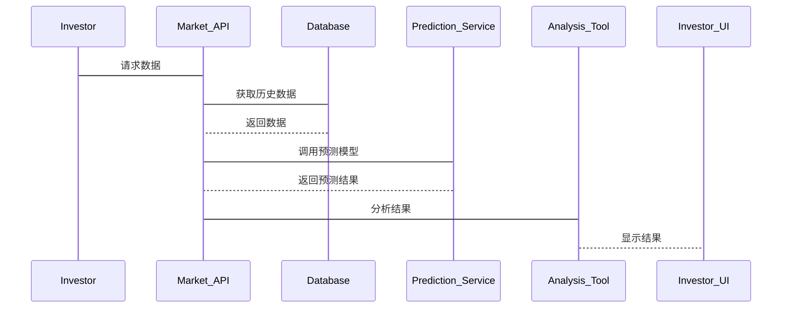

                 


# 全球股市估值与可再生能源预测技术的关系

> 关键词：全球股市估值、可再生能源预测技术、时间序列分析、机器学习、ARIMA模型、股票估值模型、能源市场分析

> 摘要：本文探讨了全球股市估值与可再生能源预测技术之间的关系，通过分析可再生能源预测技术如何影响股市估值，提出了结合时间序列分析和机器学习的预测模型，并展示了如何通过系统架构设计实现这一目标。

---

# 第1章 全球股市估值与可再生能源预测技术的背景介绍

## 1.1 全球股市估值的定义与作用

### 1.1.1 股票估值的基本概念
股票估值是指通过对公司财务数据、市场环境和行业趋势等多方面因素的分析，确定股票的内在价值，从而为投资者提供决策依据。

### 1.1.2 股市估值对投资者的重要性
股市估值帮助投资者评估股票的合理价格区间，避免盲目投资，降低投资风险。

### 1.1.3 全球化背景下的股市估值特点
全球化使得股市估值受到全球经济环境、国际贸易政策和国际资本流动的影响。

---

## 1.2 可再生能源预测技术的定义与应用

### 1.2.1 可再生能源的基本概念
可再生能源是指风能、太阳能、水能等可循环利用的能源形式。

### 1.2.2 可再生能源预测技术的分类
可再生能源预测技术包括负荷预测、发电预测和市场预测，主要应用于电力系统规划和优化。

### 1.2.3 可再生能源在能源市场中的重要性
随着全球能源结构转型，可再生能源的预测技术对能源市场的稳定性与经济性至关重要。

---

## 1.3 全球股市估值与可再生能源预测技术的关联性

### 1.3.1 经济因素对股市估值的影响
经济政策、行业趋势和市场预期等经济因素直接影响股市估值。

### 1.3.2 可再生能源对能源市场的冲击
可再生能源的快速发展可能改变传统能源企业的盈利模式，从而影响其股票估值。

### 1.3.3 可再生能源预测技术对股市估值的潜在影响
通过预测可再生能源的市场走势，投资者可以更准确地评估相关企业的股票价值。

---

## 1.4 本章小结
本章介绍了全球股市估值和可再生能源预测技术的基本概念及其关联性，为后续分析奠定了基础。

---

# 第2章 全球股市估值与可再生能源预测技术的核心概念与联系

## 2.1 核心概念的原理分析

### 2.1.1 股市估值的核心模型
股票估值的核心模型包括市盈率（P/E）和市净率（P/B）等。

### 2.1.2 可再生能源预测技术的数学模型
可再生能源预测技术常用时间序列分析和机器学习模型。

### 2.1.3 两者之间的潜在联系
可再生能源的市场波动可能通过能源企业的盈利变化影响股市估值。

---

## 2.2 核心概念的对比分析

### 2.2.1 股市估值与可再生能源预测技术的对比表格

| 对比维度             | 股市估值                     | 可再生能源预测技术         |
|----------------------|------------------------------|--------------------------|
| 数据类型             | 财务数据、市场数据           | 电力数据、气象数据       |
| 方法类型             | 统计分析、机器学习           | 时间序列分析、机器学习   |
| 应用场景             | 投资决策、风险管理           | 电力系统规划、市场预测   |

### 2.2.2 ER实体关系图架构的 Mermaid 流程图

```mermaid
erDiagram
    investor --> stock : 持有
    company --> stock : 发行
    market --> stock : 影响价格
    renewable_pred --> market : 预测
    investor --> renewable_pred : 使用预测结果
```

---

# 第3章 可再生能源预测技术的算法原理与数学模型

## 3.1 算法原理讲解

### 3.1.1 可再生能源预测技术的主流算法
时间序列分析和机器学习算法是可再生能源预测的主流方法。

### 3.1.2 时间序列分析的 Mermaid 流程图



### 3.1.3 机器学习算法的实现步骤
数据预处理、特征提取、模型训练、模型评估和优化。

---

## 3.2 数学模型与公式

### 3.2.1 时间序列分析的数学模型
ARIMA模型：
$$ ARIMA(p, d, q) $$

### 3.2.2 机器学习模型的损失函数
均方误差：
$$ L = \frac{1}{n}\sum_{i=1}^{n}(y_i - \hat{y}_i)^2 $$

---

## 3.3 举例说明：基于ARIMA模型的可再生能源预测
使用ARIMA模型预测风能发电量，步骤包括数据收集、模型选择、参数估计和预测结果分析。

---

# 第4章 全球股市估值的数学模型与系统架构设计

## 4.1 股市估值的数学模型

### 4.1.1 市盈率（P/E）模型
$$ P/E = \frac{Price}{Earnings} $$

### 4.1.2 市净率（P/B）模型
$$ P/B = \frac{Price}{Book\ Value} $$

---

## 4.2 系统架构设计

### 4.2.1 项目场景介绍
设计一个基于可再生能源预测技术的股市估值系统。

### 4.2.2 系统功能设计
领域模型类图：



---

## 4.3 系统架构设计


---

## 4.4 接口设计与交互序列图

### 4.4.1 接口设计
API接口定义数据输入、模型调用和结果返回。

### 4.4.2 交互序列图



---

# 第5章 项目实战

## 5.1 环境安装
安装Python、NumPy、Pandas、Scikit-learn和Mermaid工具。

## 5.2 系统核心实现源代码

### 5.2.1 数据预处理代码
```python
import pandas as pd
data = pd.read_csv('renewable.csv')
data = data.dropna()
```

### 5.2.2 ARIMA模型实现
```python
from statsmodels.tsa.arima_model import ARIMA
model = ARIMA(data, order=(5,1,0))
model_fit = model.fit()
```

### 5.2.3 模型评估
```python
from sklearn.metrics import mean_squared_error
 predictions = model_fit.forecast(steps=len(test_data))
 mse = mean_squared_error(test_data, predictions)
```

---

## 5.3 实际案例分析与解读
以某地区风能发电量预测为例，展示模型的预测精度和对股市估值的影响。

---

## 5.4 项目小结
通过项目实战，验证了可再生能源预测技术在股市估值中的应用价值。

---

# 第6章 总结与展望

## 6.1 最佳实践 tips
定期更新模型、结合多种预测方法、注重数据质量和模型解释性。

## 6.2 小结
本文探讨了全球股市估值与可再生能源预测技术的关系，提出了结合时间序列分析和机器学习的预测模型。

## 6.3 注意事项
模型的准确性和数据的质量直接影响预测结果，需谨慎处理。

## 6.4 拓展阅读
推荐相关书籍和论文，进一步深入研究。

---

# 作者

作者：AI天才研究院/AI Genius Institute & 禅与计算机程序设计艺术/Zen And The Art of Computer Programming

