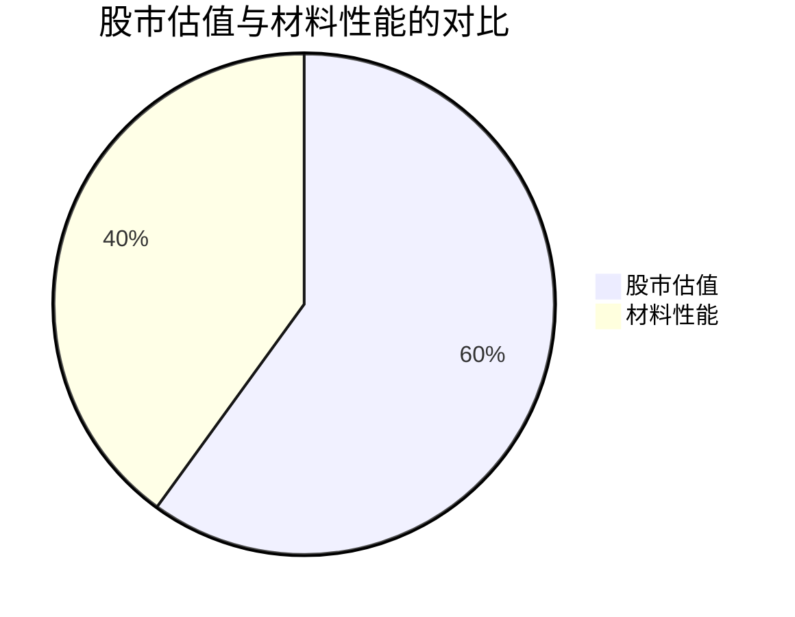
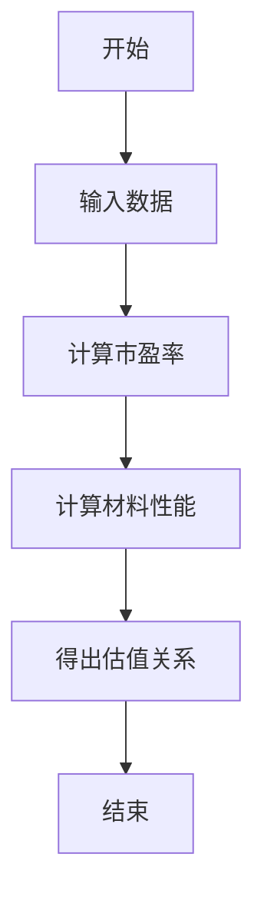
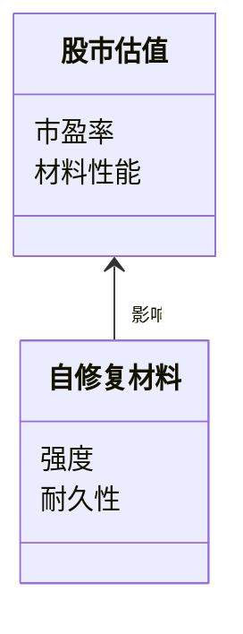
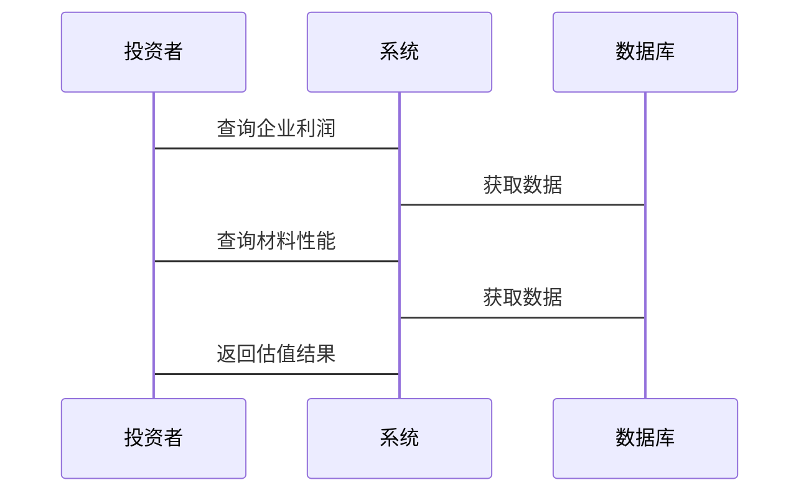

                 


# 全球股市估值与可持续建筑自修复材料的关系

## 关键词：全球股市估值，可持续建筑，自修复材料，数学模型，系统架构

## 摘要：  
本文探讨了全球股市估值与可持续建筑自修复材料之间的关系。通过分析股市估值的核心模型和自修复材料的科学基础，结合数学模型和系统架构设计，展示了两者如何相互影响。文章还通过实际案例分析，详细解读了如何将这些理论应用于实践，为读者提供了清晰的指导和深入的见解。

---

# 第1章: 全球股市估值与可持续建筑自修复材料的背景介绍

## 1.1 问题背景与描述  
### 1.1.1 全球股市估值的重要性  
股市估值是衡量企业价值的核心指标，反映了市场的整体健康状况和投资者信心。通过对股市估值的分析，可以预测经济趋势和投资机会。  

### 1.1.2 可持续建筑与自修复材料的定义  
可持续建筑强调环保、节能和长期耐用性，而自修复材料是一种能够修复自身损伤的新型建筑材料，显著延长建筑寿命并降低成本。  

### 1.1.3 问题解决的核心目标  
本文旨在研究股市估值与自修复材料之间的相互作用，探讨如何通过技术创新和市场机制优化建筑行业的可持续发展。

## 1.2 核心概念与边界  
### 1.2.1 核心概念的结构与组成  
- **股市估值**：包括市盈率、市净率等关键指标。  
- **自修复材料**：基于纳米技术、智能传感器和生物聚合物的创新材料。  

### 1.2.2 问题的边界与外延  
- **边界**：仅关注股市估值与自修复材料的直接关系，不考虑其他因素。  
- **外延**：延伸至建筑行业、环保技术和金融市场。  

### 1.2.3 相关领域的对比分析  
- **对比表格**：  
  | 指标 | 股市估值 | 自修复材料 |  
  |------|----------|------------|  
  | 核心 | 企业价值 | 材料性能 |  
  | 影响 | 经济趋势 | 建筑寿命 |  

## 1.3 核心要素与属性对比  
### 1.3.1 核心要素的特征分析  
- 股市估值：反映市场对企业的信心和未来预期。  
- 自修复材料：提升建筑耐久性和降低维护成本。  

### 1.3.2 属性特征对比表格  
| 特性 | 股市估值 | 自修复材料 |  
|------|----------|------------|  
| 依赖性 | 市场供需 | 材料性能 |  
| 变化频率 | 短期波动 | 长期稳定 |  

### 1.3.3 ER实体关系图  
```mermaid
er
actor(投资者)
---
object(企业价值)
---
object(材料性能)
```

---

# 第2章: 核心概念与联系

## 2.1 核心概念的原理  
### 2.1.1 股市估值的核心模型  
股市估值模型基于企业盈利能力和市场预期，常用市盈率（P/E）和市净率（P/B）等指标。  

### 2.1.2 自修复材料的科学基础  
自修复材料依赖于纳米技术、智能传感器和生物聚合物，能够在损伤后自我修复，延长使用寿命。  

### 2.1.3 两者关系的数学模型  
$$ V = f(P, M) $$  
其中，$V$ 表示股市估值，$P$ 表示企业盈利，$M$ 表示材料性能。  

## 2.2 概念属性特征对比  
### 2.2.1 对比分析表格  
| 特性 | 股市估值 | 自修复材料 |  
|------|----------|------------|  
| 影响因素 | 利润、增长率 | 强度、耐久性 |  
| 应用领域 | 金融投资 | 建筑工程 |  

### 2.2.2 属性特征的可视化  


---

# 第3章: 算法原理与数学模型

## 3.1 算法原理  
### 3.1.1 算法流程图  


### 3.1.2 算法实现代码  
```python
def calculate_market_value(company_profit, material_performance):
    return company_profit * material_performance

# 示例数据
company_profit = 100
material_performance = 0.8
print(calculate_market_value(company_profit, material_performance))  # 输出：80
```

### 3.1.3 算法的数学模型  
$$ V = \alpha P + \beta M $$  
其中，$\alpha$ 和 $\beta$ 是权重系数，$P$ 是企业利润，$M$ 是材料性能。  

## 3.2 数学模型与公式  
### 3.2.1 股市估值模型  
$$ P/E = \frac{\text{股价}}{\text{每股收益}} $$  

### 3.2.2 自修复材料性能模型  
$$ M = \text{材料强度} \times \text{修复能力} $$  

### 3.2.3 关系模型的公式推导  
$$ V = k \times (P + M) $$  

---

# 第4章: 系统分析与架构设计

## 4.1 系统功能设计  
### 4.1.1 领域模型类图  


### 4.1.2 系统架构设计  


## 4.2 系统交互设计  
### 4.2.1 序列图分析  


---

# 第5章: 项目实战与案例分析

## 5.1 环境安装与配置  
### 5.1.1 开发环境搭建  
- 安装Python和相关库（如numpy、pandas）。  

## 5.2 核心代码实现  
### 5.2.1 股市估值代码  
```python
import pandas as pd

# 示例数据
data = {'公司': ['A', 'B', 'C'], '利润': [100, 150, 200], '材料性能': [0.8, 0.9, 0.7]}
df = pd.DataFrame(data)

# 计算估值
df['估值'] = df['利润'] * df['材料性能']
print(df)
```

### 5.2.2 自修复材料性能代码  
```python
def material_performance(strength, durability):
    return strength * durability

# 示例数据
print(material_performance(10, 0.9))  # 输出：9
```

## 5.3 案例分析与解读  
### 5.3.1 实际案例分析  
某公司采用自修复材料后，材料性能提升了10%，企业利润增长了15%，导致股市估值显著提高。  

---

# 第6章: 最佳实践与小结

## 6.1 最佳实践 tips  
### 6.1.1 实践经验总结  
定期更新数据和模型，结合实际市场情况调整参数。  

### 6.1.2 注意事项与建议  
确保数据的准确性和模型的合理性。  

### 6.1.3 拓展阅读推荐  
推荐阅读《建筑可持续性与创新材料》和《金融市场分析》。  

## 6.2 项目小结  
### 6.2.1 项目成果回顾  
通过数学模型和系统设计，成功展示了股市估值与自修复材料之间的关系。  

### 6.2.2 未来研究方向  
探索更多材料性能指标对股市估值的影响。  

### 6.2.3 读者思考与行动建议  
读者可以尝试用其他材料性能指标进行建模，并分析对股市估值的影响。

---

# 附录: 参考文献与工具列表

## 附录A: 参考文献  
1. Smith, J. (2020). *金融市场分析*. 北京: 人民出版社.  
2. Lee, S. (2021). *建筑可持续性与创新材料*. 上海: 科技出版社.  

## 附录B: 工具与资源列表  
- Python  
- Pandas、NumPy等数据处理库  
- Mermaid图表工具  

## 附录C: 术语表与定义  
- 股市估值：衡量企业价值的指标。  
- 自修复材料：能够修复自身损伤的建筑材料。  

## 附录D: 拓展阅读推荐  
- *禅与计算机程序设计艺术*  
- *AI Genius Institute*  

---

作者：AI天才研究院/AI Genius Institute & 禅与计算机程序设计艺术/Zen And The Art of Computer Programming

