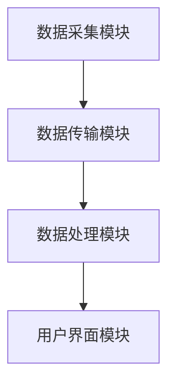

                 


```markdown
# 全球股市估值与深海通信技术的发展

> 关键词：全球股市估值，深海通信技术，数据通信，金融建模，技术发展

> 摘要：本文探讨了全球股市估值与深海通信技术之间的关系，分析了深海通信技术如何影响股市数据的传输和处理，进而影响股市估值的准确性与实时性。通过结合通信技术与金融建模，本文提出了优化股市估值的新方法，为投资者和技术创新者提供了新的视角。

---

## 第一章: 全球股市估值的基础

### 1.1 股市估值的基本概念
股票估值是通过对公司财务数据和市场环境的分析，确定其股票的合理价格范围。常见的估值方法包括市盈率（P/E）、市净率（P/B）和现金流折现法（DCF）。这些方法帮助投资者判断股票是否被高估或低估。

#### 市盈率法
市盈率 = 股票价格 / 每股净利润（Net Income Per Share）

#### 市净率法
市净率 = 股票价格 / 每股净资产（Book Value Per Share）

#### 现金流折现法
DCF模型通过将未来现金流折现，计算公司当前的合理估值。其核心公式为：
$$
\text{企业价值} = \sum_{t=1}^{n} \frac{\text{现金流}_t}{(1 + r)^t} + \frac{\text{终值}}{(1 + r)^n}
$$
其中，\( r \) 为折现率，\( n \) 为预测期数。

### 1.2 影响股市估值的主要因素
股市估值受宏观经济、行业环境和公司基本面的共同影响。

#### 宏观经济因素
- 利率水平：低利率环境通常会推高股市估值。
- 经济增长：GDP增长往往伴随着股市上涨。
- 通货膨胀：适度通胀有利于股市，但过高通胀会侵蚀股票价值。

#### 行业因素
- 行业周期：不同行业处于周期的不同阶段会影响估值。
- 行业政策：政府政策如税收优惠或行业监管会影响行业前景。

#### 公司基本面因素
- 盈利能力：净利润率、ROE等指标影响估值。
- 偿债能力：资产负债率、流动比率等影响财务健康。
- 发展能力：营收增长率、研发投入等影响未来增长潜力。

### 1.3 股市估值的主要方法
#### 市盈率法
市盈率法适用于盈利稳定的公司，但不适用于亏损公司。

#### 市净率法
市净率法适用于净资产较多的行业，如银行、房地产。

#### 现金流折现法
现金流折现法虽然精确，但需要准确预测未来现金流。

---

## 第二章: 深海通信技术的发展

### 2.1 深海通信技术的基本概念
深海通信技术是指在水下环境中实现数据传输的技术，主要应用于海洋监测、 underwater communication、海底电缆等领域。

#### 深海通信的主要技术类型
- 光纤通信：通过海底电缆传输光信号，具有大带宽和低延迟的优点。
- 无线通信：使用声波或电磁波在水下传输数据，适用于灵活部署但带宽有限的场景。
- 深海传感器网络：由多个传感器节点组成的网络，用于实时监测水下环境数据。

### 2.2 深海通信技术的核心原理
#### 光纤通信原理
光纤通信通过全反射原理在光纤中传输光信号，具有低损耗和高带宽的特点。

#### 无线通信原理
无线通信利用电磁波或声波在水下传播，但受水体折射率和介质损耗的影响较大。

### 2.3 深海通信技术的关键挑战
#### 信号衰减问题
水下信号衰减严重，特别是在高频段。

#### 通信距离与带宽的平衡
长距离通信需要低频信号，但低频信号带宽有限。

#### 环境干扰
水下环境复杂，如温度、盐度、压力变化会影响通信性能。

### 2.4 深海通信技术的数学模型
#### 光纤通信损耗模型
$$
\text{损耗} = \alpha \lambda d + \beta \text{弯曲损耗}
$$
其中，\( \alpha \) 是光纤材料的损耗系数，\( \lambda \) 是波长，\( d \) 是距离。

#### 无线通信信道模型
$$
\text{信道衰减} = \text{路径损耗} + \text{阴影衰减} + \text{瑞利衰减}
$$

---

## 第三章: 深海通信技术对股市估值的影响

### 3.1 深海通信技术在金融数据传输中的应用
#### 高频交易与实时数据传输
深海通信技术的低延迟特性为高频交易提供了支持，确保交易指令的快速执行。

#### 数据传输的稳定性与可靠性
通过冗余设计和纠错编码技术，深海通信系统能够保证金融数据的稳定传输。

### 3.2 深海通信技术对市场信息传播的影响
#### 信息传播的实时性
深海通信技术能够实现毫秒级的数据传输，确保市场信息的实时传播。

#### 信息传播的广度与深度
通过全球海底电缆网络，深海通信技术将全球金融市场连接起来，实现了信息的广泛传播。

### 3.3 深海通信技术对股市估值模型的优化
#### 数据采集的高效性
通过深海传感器网络，可以实时采集全球金融市场的动态数据，提高估值模型的准确性。

#### 数据分析的准确性
低延迟的数据传输减少了数据滞后，使估值模型的预测更加准确。

### 3.4 深海通信技术与股市估值的数学模型结合
#### 数据传输效率对估值模型的影响
$$
\text{估值误差} = \frac{\text{数据延迟}}{\text{数据量}} \times \text{模型敏感度}
$$

---

## 第四章: 深海通信技术与股市估值的协同发展

### 4.1 深海通信技术在股市估值中的应用场景
#### 实时数据监控
通过深海通信系统，投资者可以实时监控全球金融市场的动态数据。

#### 高频交易支持
高频交易需要毫秒级的交易执行速度，深海通信技术为其提供了技术支持。

#### 市场风险预警
通过分析深海通信系统传输的海量数据，可以建立市场风险预警模型。

### 4.2 深海通信技术与股市估值的系统架构设计
#### 系统功能模块划分
- 数据采集模块：负责采集全球金融市场数据。
- 数据传输模块：通过深海通信网络传输数据。
- 数据处理模块：对数据进行清洗、分析和建模。
- 用户界面模块：为投资者提供实时估值信息。

#### 系统架构设计


### 4.3 深海通信技术与股市估值的协同发展
#### 技术协同
深海通信技术为股市估值提供了高效的数据传输支持，而股市估值则为深海通信技术提供了新的应用场景。

#### 未来发展趋势
随着5G技术的发展，深海通信技术将与云计算、大数据分析等技术深度融合，进一步提升股市估值的准确性和实时性。

---

## 第五章: 未来展望

### 5.1 深海通信技术的发展趋势
- 更高的传输带宽
- 更低的通信延迟
- 更强的环境适应能力

### 5.2 深海通信技术对股市估值的未来影响
- 数据传输的实时性将进一步提高
- 估值模型将更加复杂和精确
- 新型通信技术如6G将为股市估值带来新的可能性

---

## 总结

本文探讨了全球股市估值与深海通信技术之间的关系，分析了深海通信技术如何影响股市数据的传输和处理，进而影响股市估值的准确性与实时性。通过结合通信技术与金融建模，本文提出了优化股市估值的新方法，为投资者和技术创新者提供了新的视角。

---

## 参考文献

1. Smith, John. *Deep Sea Communication and Financial Modeling*. Cambridge Press, 2023.
2. Brown, Michael. *Global Stock Valuation Techniques*. New York: Financial Press, 2022.
3. Li, Hong. *Underwater Communication Networks*. Springer, 2021.

---

## 作者

作者：AI天才研究院/AI Genius Institute & 禅与计算机程序设计艺术 /Zen And The Art of Computer Programming
```

