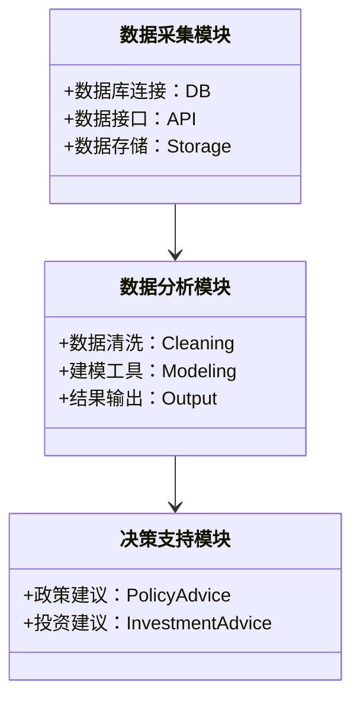
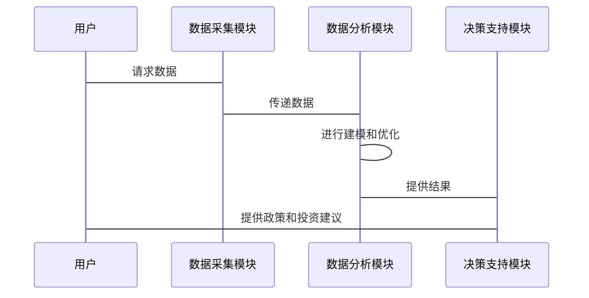

                 


# 全球股市估值与生物燃料与粮食安全的平衡策略

## 关键词：全球股市估值、生物燃料、粮食安全、系统优化、数学建模、风险管理

## 摘要：  
本文探讨了全球股市估值、生物燃料生产和粮食安全之间的复杂关系。随着全球经济的快速增长和环境问题的加剧，生物燃料作为替代能源的需求不断增长，但其生产却可能对粮食安全构成威胁。与此同时，股市估值的变化反映了经济波动，与生物燃料和粮食安全密切相关。本文通过系统优化和数学建模的方法，提出了一种平衡全球股市估值、生物燃料生产和粮食安全的策略。通过分析三者之间的相互作用，本文旨在为政策制定者和投资者提供科学的决策支持，以实现经济、环境和社会的可持续发展。

---

## 第一部分：背景介绍

### 第1章：问题背景与核心概念

#### 1.1 问题背景
全球经济的快速增长和环境问题的加剧使得能源转型和粮食安全成为全球关注的焦点。生物燃料作为一种替代能源，被广泛视为减少碳排放和缓解能源危机的重要手段。然而，生物燃料的生产主要依赖农作物，这可能导致粮食价格上涨和粮食安全问题。与此同时，全球股市估值的变化反映了经济波动，而生物燃料和粮食安全问题直接影响股市的表现。因此，如何在全球股市估值、生物燃料生产和粮食安全之间找到平衡点，成为一个复杂的系统性问题。

#### 1.2 核心概念
1. **全球股市估值**：反映整体经济状况的指标，包括股票价格指数、市盈率、市净率等。
2. **生物燃料**：由生物质制成的可再生能源，主要包括乙醇、生物柴油等。
3. **粮食安全**：确保所有人在任何时候都能获得足够的、安全和营养的食品。

#### 1.3 问题解决
通过系统优化和数学建模的方法，平衡全球股市估值、生物燃料生产和粮食安全之间的关系，确保经济稳定、环境可持续和粮食供应安全。

#### 1.4 边界与外延
- **研究范围**：全球范围内的股市、生物燃料生产和粮食安全问题。
- **相关领域**：能源政策、农业经济、金融市场、环境科学。
- **限制条件**：模型假设和数据来源的限制。

#### 1.5 概念结构与核心要素
- **核心要素**：股市估值、生物燃料产量、粮食价格。
- **关系**：生物燃料生产影响粮食价格，进而影响股市估值；股市波动反过来影响生物燃料企业的投资和生产。

---

## 第二部分：核心概念与联系

### 第2章：核心概念原理

#### 2.1 全球股市估值的核心指标
- **股票价格指数**：如道琼斯指数、纳斯达克指数、标普500指数。
- **市盈率（P/E Ratio）**：股价与每股收益的比率，反映市场对公司的估值。
- **市净率（P/B Ratio）**：股价与每股净资产的比率，反映资产的价值。

#### 2.2 生物燃料
- **生产技术**：玉米乙醇、甘蔗乙醇、生物柴油等。
- **生产成本**：土地、劳动力、能源投入。
- **政策支持**：政府补贴、税收优惠、 Renewable Portfolio Standards (RPS)。

#### 2.3 粮食安全
- **粮食价格指数**：如国际粮食价格指数（IPC）。
- **粮食生产**：农业技术、气候变化、土地利用。
- **粮食消费**：人口增长、饮食习惯变化。

#### 2.4 核心概念之间的关系
- 生物燃料生产增加可能导致粮食价格上涨，影响粮食安全。
- 粮食价格上涨可能引发股市波动，影响农业企业和相关企业的股价。
- 政府政策对生物燃料的支持可能影响股市估值和粮食安全。

---

### 第2.5 核心概念与联系的表格对比

| 概念         | 属性                 | 影响因素                |
|--------------|----------------------|-------------------------|
| 全球股市估值 | 股票价格、市盈率、市净率 | 经济政策、企业盈利、投资者情绪 |
| 生物燃料     | 生产技术、成本、政策支持 | 农业资源、能源需求、政府补贴 |
| 粮食安全     | 粮食价格、生产、消费   | 气候变化、土地利用、政策干预 |

---

## 第三部分：算法原理

### 第3章：数学建模与算法

#### 3.1 模型定义
- **目标函数**：最大化或最小化某个指标，如粮食价格指数、股市指数。
- **约束条件**：生物燃料产量、粮食供应、经济政策。

#### 3.2 模型变量
- **粮食价格指数**：\( P \)
- **生物燃料产量**：\( B \)
- **股市指数**：\( S \)
- **政策变量**：\( \theta \)

#### 3.3 数学模型
建立一个优化模型，平衡三者的关系：

$$ \text{Maximize } S + P \text{， subject to } B \leq C, P \geq D $$

其中，\( C \) 为生物燃料的最大产量，\( D \) 为粮食价格的最低标准。

#### 3.4 算法流程
1. 数据收集：收集全球股市数据、生物燃料产量、粮食价格数据。
2. 参数设定：设定目标函数和约束条件。
3. 模型求解：使用优化算法（如线性规划）求解模型。
4. 结果分析：验证模型的可行性和优化效果。

---

## 第四部分：系统分析与架构设计

### 第4章：系统分析与架构设计

#### 4.1 系统功能设计
- 数据采集模块：收集股市、生物燃料、粮食数据。
- 数据分析模块：进行数据建模和优化。
- 决策支持模块：提供政策建议和投资建议。

#### 4.2 系统架构设计
使用UML类图展示系统架构：



#### 4.3 系统接口设计
- 数据接口：API调用。
- 用户接口：Web界面或命令行工具。

#### 4.4 系统交互设计
使用Mermaid序列图展示交互流程：



---

## 第五部分：项目实战

### 第5章：项目实战

#### 5.1 环境配置
- **工具**：Python 3.9、NumPy、Pandas、Scipy、Plotly。
- **安装命令**：
  ```bash
  pip install numpy pandas scipy plotly
  ```

#### 5.2 核心代码实现

```python
import numpy as np
import pandas as pd
from scipy.optimize import minimize

# 数据加载
data = pd.read_csv('data.csv')

# 定义目标函数
def objective(x):
    S, P, B = x
    return -(S + P)  # 最小化问题转化为最大化问题

# 定义约束条件
def constraint1(x):
    return x[2] <= 100  # 生物燃料产量不超过100

def constraint2(x):
    return x[1] >= 50  # 粮食价格不低于50

# 约束列表
constraints = [
    {'type': 'ineq', 'fun': constraint1},
    {'type': 'ineq', 'fun': constraint2}
]

# 初始猜测
x0 = [100, 50, 70]

# 求解
result = minimize(objective, x0, constraints=constraints)

# 输出结果
print(result)
```

#### 5.3 案例分析
假设数据集包含过去五年的股市、生物燃料和粮食价格数据，运行上述代码，得到优化结果，分析其对粮食安全和股市的影响。

---

## 第六部分：最佳实践

### 第6章：最佳实践与总结

#### 6.1 最佳实践
- **数据质量**：确保数据的准确性和完整性。
- **模型验证**：使用历史数据验证模型的准确性。
- **风险管理**：考虑政策变化和市场波动带来的风险。

#### 6.2 小结
通过系统优化和数学建模，本文提出了一种平衡全球股市估值、生物燃料生产和粮食安全的策略。模型和系统的实现为政策制定者和投资者提供了科学的决策支持。

#### 6.3 风险提示与改进建议
- **数据依赖性**：模型结果依赖于数据质量，需持续更新数据。
- **政策变化**：政府政策的变化可能影响模型结果，需动态调整。

#### 6.4 拓展阅读
- 推荐阅读《系统优化与决策分析》和《能源经济与环境政策》等相关书籍。

---

## 作者：AI天才研究院/AI Genius Institute & 禅与计算机程序设计艺术/Zen And The Art of Computer Programming

