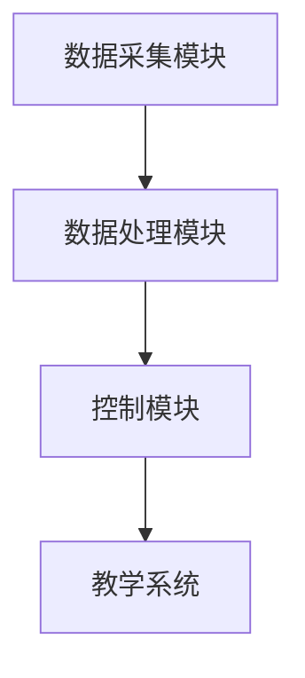

                 


# 全球股市估值与脑机接口在教育个性化中的应用

---

## 关键词：
- 全球股市估值  
- 脑机接口  
- 教育个性化  
- 机器学习  
- 系统架构  

---

## 摘要：
本文探讨了全球股市估值与脑机接口在教育个性化中的应用。第一部分深入分析了全球股市估值的核心概念、模型与算法，结合技术分析与机器学习方法，提出了基于机器学习的股市估值系统架构。第二部分聚焦于脑机接口技术在教育领域的应用，从脑电数据采集到个性化教育系统设计，展示了脑机接口如何推动教育的智能化与个性化。本文通过理论分析与实战案例相结合的方式，为读者提供了全面的技术视角。

---

# 第一部分：全球股市估值分析

## 第1章：全球股市估值概述

### 1.1 股市估值的基本概念

#### 1.1.1 股市估值的定义与意义
股市估值是通过对公司财务数据和市场信息进行分析，评估其股票的合理价格范围。它帮助投资者判断市场是否被高估或低估，从而做出投资决策。

#### 1.1.2 股市估值的核心要素
- **公司基本面**：收入、利润、资产等财务指标。
- **市场环境**：宏观经济、行业趋势、政策影响。
- **市场情绪**：投资者情绪和市场参与度。

#### 1.1.3 股市估值的边界与外延
- 股市估值受市场波动、政策变化和不可预测事件的影响。
- 外延包括行业估值、指数估值和个股估值。

### 1.2 全球股市估值的背景与现状

#### 1.2.1 全球经济与股市估值的关系
全球经济波动直接影响股市估值，例如全球经济衰退可能导致股市整体估值下降。

#### 1.2.2 当前全球股市估值的主要趋势
- 美国股市估值偏高，新兴市场估值相对较低。
- 全球化背景下，跨国公司的估值受到多国经济和政策的影响。

#### 1.2.3 不同市场环境下的估值差异
- 发达市场 vs. 新兴市场：发达市场的估值更稳定，新兴市场波动性更大。
- 行业周期：科技行业估值较高，传统行业估值较低。

---

## 第2章：股市估值的核心模型与方法

### 2.1 常用股市估值模型

#### 2.1.1 市盈率（P/E）模型
市盈率 = 股价 / 每股净利润。适用于盈利稳定的公司。


#### 2.1.2 市净率（P/B）模型
市净率 = 股价 / 每股净资产。适用于资产密集型行业。

#### 2.1.3 现金流折现模型（DCF）
DCF模型基于未来现金流的现值计算公司价值。

#### 2.1.4 其他常用估值模型对比
- EV/EBITDA：企业价值倍数。
- 市销率：股价/营收。

### 2.2 技术分析与股市估值

#### 2.2.1 技术分析的基本原理
技术分析通过分析价格和成交量预测未来走势。

#### 2.2.2 K线图与趋势分析
K线图显示开盘价、收盘价、最高价和最低价。

#### 2.2.3 均线与成交量分析
- 短期均线：5日、10日均线。
- 长期均线：50日、200日均线。

#### 2.2.4 技术指标的应用
- RSI（相对强弱指数）：衡量超买超卖。
- MACD（移动平均收敛散度）：判断趋势和动能。

---

## 第3章：机器学习在股市估值中的应用

### 3.1 机器学习与股市估值的结合

#### 3.1.1 机器学习在金融领域的潜力
- 数据驱动：利用海量数据进行预测。
- 非线性关系：捕捉传统模型难以发现的模式。

#### 3.1.2 股市数据的特征提取与处理
- 数据清洗：处理缺失值、异常值。
- 特征工程：选择关键指标（如营收增长率、市盈率）。

### 3.2 基于机器学习的股市估值算法

#### 3.2.1 线性回归模型
线性回归用于预测连续变量，如股价。

$$ y = \beta_0 + \beta_1 x_1 + \beta_2 x_2 + \dots + \beta_n x_n $$

#### 3.2.2 支持向量回归（SVR）
SVR通过构建超平面进行回归。

#### 3.2.3 随机森林回归
随机森林通过集成多个决策树提高预测准确性。

#### 3.2.4 LSTM神经网络
LSTM用于时间序列预测，捕捉股价的长期依赖关系。

---

# 第二部分：脑机接口在教育个性化中的应用

## 第4章：脑机接口在教育中的应用概述

### 4.1 脑机接口的基本原理

#### 4.1.1 脑电数据采集
- EEG（脑电图）：记录大脑神经活动的电位变化。
- 采集设备： EEG帽、头戴式设备。

#### 4.1.2 脑机接口的工作原理
- 数据采集：EEG信号。
- 数据处理：滤波、降噪、特征提取。
- 信号解码：将脑电信号转化为控制指令。

### 4.2 脑机接口在教育中的应用潜力

#### 4.2.1 个性化学习
- 根据学生注意力集中度调整教学内容。
- 实时反馈：检测学生情绪状态，优化教学节奏。

#### 4.2.2 特殊教育
- 帮助自闭症儿童改善社交能力。
- 助力残障人士通过脑机接口进行交流。

---

## 第5章：脑机接口在教育中的数据采集与分析

### 5.1 脑电数据采集与处理

#### 5.1.1 数据采集工具
- 开源工具：OpenBCI、EEGLAB。
- 商业设备：Emotiv、NeuroNode。

#### 5.1.2 数据预处理
- 去噪：去除EEG信号中的噪声。
- 滤波：使用带通滤波器提取特定频段信号。

### 5.2 基于脑机接口的教育数据分析

#### 5.2.1 注意力分析
- 基于EEG特征（如θ、α频段）分析学生注意力集中度。

#### 5.2.2 情绪识别
- 使用情感计算技术分析学生的心理状态。

---

## 第6章：脑机接口在教育中的系统设计与实现

### 6.1 系统架构设计

#### 6.1.1 系统功能模块
- 数据采集模块：EEG信号采集。
- 数据处理模块：信号预处理与特征提取。
- 控制模块：根据EEG信号调整教学内容。

#### 6.1.2 系统架构图



### 6.2 系统交互设计

#### 6.2.1 实时反馈机制
- 根据学生注意力集中度调整教学节奏。

#### 6.2.2 用户界面设计
- 友好的可视化界面：显示学生注意力状态、教学进度。

---

## 第7章：脑机接口在教育中的项目实战

### 7.1 项目环境与工具安装

#### 7.1.1 开发环境
- 操作系统：Linux或Windows。
- 开发工具：Python、Matplotlib、Scikit-learn。

#### 7.1.2 数据采集工具安装
- 安装OpenBCI： pip install pyOpenBCI。

### 7.2 核心代码实现

#### 7.2.1 数据采集与预处理
```python
import pyOpenBCI
import numpy as np

# 初始化采集器
g = pyOpenBCI.Ganglion()

# 采集数据
data = []
g.start_stream()
for _ in range(1000):
    sample = g.get_sample()
    data.append(sample)
g.stop_stream()
```

#### 7.2.2 数据分析与可视化
```python
import matplotlib.pyplot as plt

# 绘制EEG信号
plt.figure()
plt.plot(data)
plt.title('EEG Signal')
plt.xlabel('Time')
plt.ylabel('Amplitude')
plt.show()
```

### 7.3 实际案例分析

#### 7.3.1 案例背景
- 学生注意力不集中，学习效率低。

#### 7.3.2 系统实现
- 实时采集EEG信号。
- 根据注意力状态调整教学内容。

#### 7.3.3 结果分析
- 学生注意力集中度提高，学习效率提升。

---

## 总结与展望

### 8.1 总结
- 本文探讨了全球股市估值与脑机接口在教育中的应用。
- 结合机器学习与脑机接口技术，提出了创新的解决方案。

### 8.2 展望
- 股市估值：未来将结合深度学习模型，进一步提高预测精度。
- 教育应用：脑机接口技术将推动个性化教育的发展，实现真正的因材施教。

---

## 作者：AI天才研究院 & 禅与计算机程序设计艺术

---

通过本文的系统分析与实践，我们展示了如何将前沿技术应用于金融与教育领域，为读者提供了深入的技术视角与实践指南。

