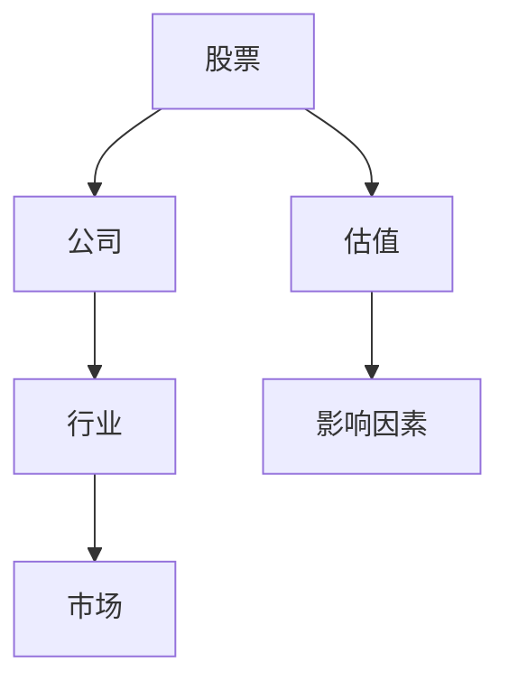
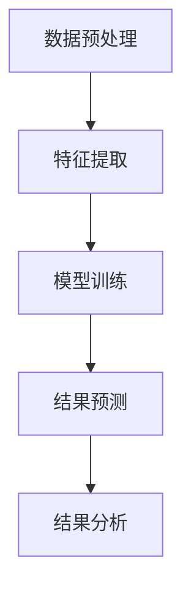
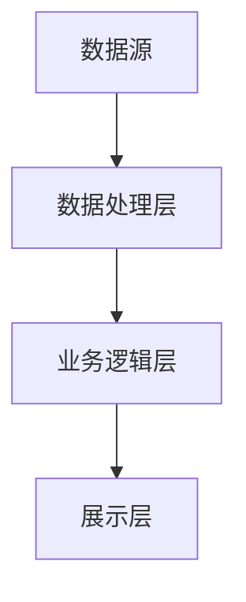
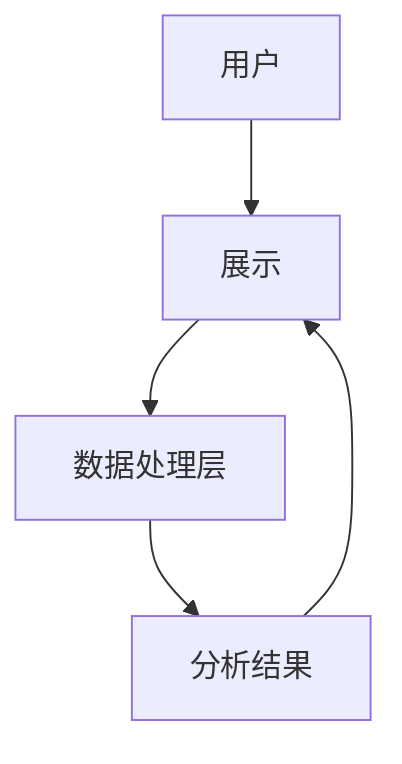

                 


# 全球股市估值与航空航天产业的关联

> 关键词：全球股市估值、航空航天产业、股票关联、行业分析、数据建模

> 摘要：本文深入探讨全球股市估值与航空航天产业之间的关联性，从核心概念、算法原理、数学模型、系统架构到项目实战，全面分析两者之间的关系，结合实际案例，提出解决方案和优化建议。

---

## 第1章: 背景介绍

### 1.1 全球股市估值的基本概念
#### 1.1.1 股票估值的定义与意义
股票估值是通过对公司财务数据和市场因素的分析，确定股票的内在价值。它帮助投资者判断股票价格是否被高估或低估。

#### 1.1.2 全球股市估值的多样性
全球股市估值受多种因素影响，包括宏观经济指标、行业趋势、公司业绩等。不同市场的估值方法和标准存在差异。

#### 1.1.3 股票估值的核心指标
- 市盈率（P/E）：股价与每股收益的比率。
- 市净率（P/B）：股价与每股净资产的比率。
- 市销率（P/S）：股价与每股收入的比率。

### 1.2 航空航天产业的基本概念
#### 1.2.1 航空航天产业的定义与范围
航空航天产业包括民用航空、军用航空、航天器制造及相关服务。

#### 1.2.2 航空航天产业的关键领域
- 民用航空：飞机制造、航空服务。
- 军用航空：军用飞机、导弹制造。
- 航天器：卫星、火箭。

#### 1.2.3 航空航天产业的全球分布
美国、欧洲、中国是全球主要的航空航天制造中心。

### 1.3 问题背景与研究意义
#### 1.3.1 股市估值与产业关联的研究背景
近年来，航空航天产业受全球经济波动影响显著，股市估值与产业关联性增强。

#### 1.3.2 航空航天产业对股市估值的影响
产业政策、技术创新、市场需求等因素直接影响股市估值。

#### 1.3.3 研究的意义与价值
通过分析股市估值与航空航天产业的关联，为投资者和企业决策提供参考。

### 1.4 问题描述与解决路径
#### 1.4.1 股市估值与航空航天产业关联的核心问题
如何量化产业因素对股市估值的影响。

#### 1.4.2 关联的边界与外延
考虑宏观经济、行业政策、技术进步等多方面因素。

#### 1.4.3 解决问题的初步思路与方法
构建数学模型，分析产业因素对股市估值的贡献度。

## 第2章: 核心概念与联系

### 2.1 核心概念原理
#### 2.1.1 股市估值的核心要素
- 公司财务数据：收入、利润、资产。
- 市场因素：宏观经济、行业趋势。

#### 2.1.2 航空航天产业的核心特征
- 技术密集型。
- 市场垄断性。
- 政策依赖性。

#### 2.1.3 两者关联的内在逻辑
航空航天产业的业绩波动直接影响股市估值。

### 2.2 概念属性特征对比
| 属性 | 股市估值 | 航空航天产业 |
|------|----------|---------------|
| 数据来源 | 公司财务、市场数据 | 产业政策、技术专利 |
| 影响因素 | 宏观经济、投资者情绪 | 产业政策、技术创新 |
| 评估指标 | 市盈率、市净率 | 市场占有率、研发投入 |

### 2.3 ER实体关系图架构


## 第3章: 算法原理讲解

### 3.1 算法原理概述
#### 3.1.1 股市估值与产业关联的分析方法
- 回归分析。
- 时间序列分析。

#### 3.1.2 常用算法的原理与特点
回归分析：通过变量之间的关系预测股市估值。

#### 3.1.3 算法选择的依据与标准
选择算法时考虑数据特征、模型复杂度。

### 3.2 算法流程图


### 3.3 算法实现代码
```python
import pandas as pd
from sklearn.linear_model import LinearRegression

# 数据预处理
data = pd.read_csv('stock_aerospace.csv')
X = data[['revenue', 'profit', 'market_share']]
y = data['stock_price']

# 模型训练
model = LinearRegression()
model.fit(X, y)

# 预测结果
predictions = model.predict(X)
```

### 3.4 数学模型与公式
#### 3.4.1 回归模型
$$ y = \beta_0 + \beta_1 x_1 + \beta_2 x_2 + \epsilon $$

#### 3.4.2 解释变量
- $y$：股市估值。
- $x_1$：公司收入。
- $x_2$：研发投入。

## 第4章: 系统分析与架构设计

### 4.1 问题场景介绍
构建一个数据采集与分析系统，实时监控航空航天产业对股市估值的影响。

### 4.2 项目介绍
开发一个实时监控系统，分析产业动态对股市的影响。

### 4.3 系统功能设计
- 数据采集模块：收集公司财务数据和市场数据。
- 数据分析模块：计算股票估值和产业关联度。
- 可视化模块：展示分析结果。

### 4.4 系统架构设计


### 4.5 系统接口设计
- 数据接口：REST API。
- 用户接口：Web界面。

### 4.6 系统交互设计


## 第5章: 项目实战

### 5.1 环境安装
安装Python和相关库（pandas、scikit-learn）。

### 5.2 核心实现
编写代码，实现数据采集、分析和可视化。

### 5.3 代码解读
```python
import pandas as pd
from sklearn.linear_model import LinearRegression
import matplotlib.pyplot as plt

data = pd.read_csv('stock_data.csv')
X = data[['revenue', 'profit']]
y = data['stock_price']

model = LinearRegression()
model.fit(X, y)

plt.scatter(X['revenue'], y)
plt.plot(X['revenue'], model.predict(X), color='red')
plt.xlabel('Revenue')
plt.ylabel('Stock Price')
plt.show()
```

### 5.4 案例分析
以某航空航天公司为例，分析其股价波动与产业动态的关系。

### 5.5 结果分析
模型预测与实际数据对比，评估模型的准确性。

## 第6章: 总结与展望

### 6.1 最佳实践 tips
- 数据来源选择可靠。
- 模型优化与调整。

### 6.2 小结
通过分析，得出航空航天产业对股市估值有显著影响。

### 6.3 注意事项
- 模型的局限性。
- 数据的实时性。

### 6.4 拓展阅读
推荐相关领域的书籍和论文。

---

## 作者：AI天才研究院/AI Genius Institute & 禅与计算机程序设计艺术 /Zen And The Art of Computer Programming

