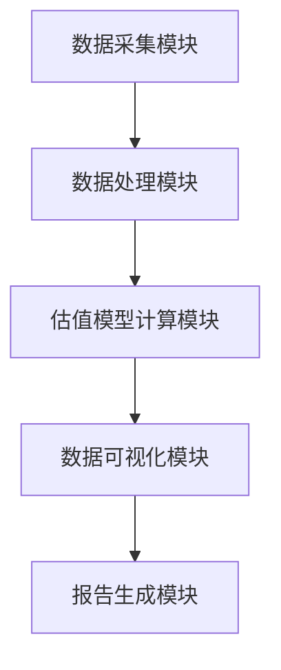
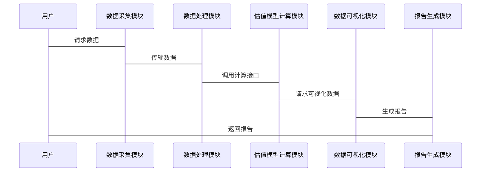
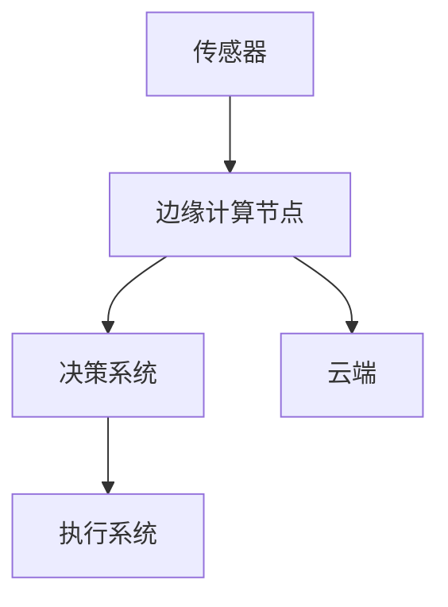

                 


# 全球股市估值与边缘计算在自动驾驶中的应用

## 关键词：全球股市估值、边缘计算、自动驾驶、技术应用、系统架构、算法原理

## 摘要：本文探讨了全球股市估值的核心概念、数学模型及其在实际应用中的重要性，同时深入分析了边缘计算在自动驾驶领域的技术原理和应用价值。通过结合全球股市估值和边缘计算在自动驾驶中的应用，本文旨在为读者提供一个全面的技术视角，帮助他们理解这两个领域的相互作用及其对未来科技发展的潜在影响。

---

# 第一部分：全球股市估值

## 第1章：全球股市估值概述

### 1.1 股市估值的基本概念

#### 1.1.1 股票估值的定义
股票估值是通过对公司财务数据和市场状况的分析，确定股票内在价值的过程。其目的是帮助投资者判断股票是否被高估或低估。

#### 1.1.2 股市估值的重要性
股市估值对于投资者、企业决策者和市场分析师至关重要。它帮助投资者做出投资决策，同时也影响市场的整体走势。

#### 1.1.3 全球股市的多样性
全球股市分布在不同的国家和地区，每个市场的经济环境、法律法规和市场参与者都有所不同。

---

### 1.2 股市估值的核心指标

#### 1.2.1 市盈率（P/E Ratio）
市盈率是股票价格与每股收益的比率，用于衡量投资者对每股收益的支付意愿。

$$ P/E = \frac{Price}{Earnings} $$

#### 1.2.2 市净率（P/B Ratio）
市净率是股票价格与每股净资产的比率，用于衡量股票价格相对于账面价值的高低。

$$ P/B = \frac{Price}{Book\ Value} $$

#### 1.2.3 股息率（Dividend Yield）
股息率是每股股息与股票价格的比率，用于衡量股票的投资回报率。

$$ Dividend\ Yield = \frac{Dividend\ per\ share}{Price\ per\ share} $$

#### 1.2.4 EV/EBITDA
企业价值与利息、税项、折旧及摊销前盈利的比率，用于衡量企业的整体价值。

$$ EV/EBITDA = \frac{Enterprise\ Value}{EBITDA} $$

---

### 1.3 全球股市估值的影响因素

#### 1.3.1 经济周期
经济周期的波动直接影响股市的整体表现。例如，在经济衰退期间，企业盈利下降，股市估值可能被压低。

#### 1.3.2 利率水平
低利率环境通常会推高股市估值，因为投资者会转向风险更高的资产以追求更高的回报。

#### 1.3.3 企业盈利状况
企业的盈利能力和增长潜力是股市估值的核心因素。高盈利和持续增长的企业通常享有较高的估值。

#### 1.3.4 市场情绪
市场情绪受投资者心理和市场参与者行为的影响，短期市场波动可能与基本面无关。

---

## 第2章：股市估值的数学模型与公式

### 2.1 常用估值模型

#### 2.1.1 市盈率模型
市盈率模型通过比较股票的当前价格与预期收益，帮助投资者判断股票是否被高估或低估。

#### 2.1.2 市净率模型
市净率模型适用于评估资产密集型企业的价值，尤其是银行和房地产公司。

#### 2.1.3 股息贴现模型（DDM）
股息贴现模型通过将未来股息的现值加总，计算股票的公允价值。

#### 2.1.4 内部收益率（IRR）模型
IRR模型用于评估投资项目的真实收益，帮助投资者判断投资的可行性。

---

### 2.2 股票估值公式

#### 2.2.1 市盈率公式
$$ P/E = \frac{Price}{Earnings} $$

#### 2.2.2 市净率公式
$$ P/B = \frac{Price}{Book\ Value} $$

#### 2.2.3 股息贴现模型公式
$$ DDM = \frac{Dividend}{Discount\ Rate} $$

---

### 2.3 估值模型的优缺点对比

#### 2.3.1 市盈率模型的优势与劣势
优势：简单易用，适用于盈利稳定的企业；
劣势：无法反映企业的资产价值，且在盈利下降时表现不佳。

#### 2.3.2 市净率模型的优势与劣势
优势：适用于资产密集型企业；
劣势：难以反映企业的盈利能力。

#### 2.3.3 股息贴现模型的优势与劣势
优势：考虑了股息的现值，适用于高分红企业；
劣势：假设股息增长率固定，实际可能不准确。

---

## 第3章：全球股市估值的系统分析与架构设计

### 3.1 系统功能设计

#### 3.1.1 数据采集模块
负责收集全球各交易所的实时数据，包括股票价格、成交量、财务指标等。

#### 3.1.2 估值模型计算模块
根据收集的数据，应用不同的估值模型计算股票的理论价值。

#### 3.1.3 数据可视化模块
将计算结果以图表形式展示，便于用户理解和分析。

#### 3.1.4 报告生成模块
自动生成估值报告，包括各股票的估值结果、市场趋势分析等。

---

### 3.2 系统架构设计



---

### 3.3 系统接口设计

#### 3.3.1 数据接口
定义数据的输入格式和接口调用方式。

#### 3.3.2 计算接口
定义估值模型的计算接口和参数传递方式。

#### 3.3.3 可视化接口
定义图表生成的接口和展示方式。

#### 3.3.4 报告生成接口
定义报告的生成方式和输出格式。

---

### 3.4 系统交互设计



---

# 第二部分：边缘计算在自动驾驶中的应用

## 第4章：边缘计算概述

### 4.1 边缘计算的基本概念

#### 4.1.1 边缘计算的定义
边缘计算是指在靠近数据源的地方进行数据处理和分析，减少对云端的依赖。

#### 4.1.2 边缘计算的重要性
边缘计算能够提高数据处理的实时性和可靠性，尤其是在自动驾驶等对延迟敏感的应用中。

#### 4.1.3 边缘计算的核心特征
- 分布式架构
- 低延迟
- 高实时性
- 高可靠性

---

### 4.2 边缘计算在自动驾驶中的应用背景

#### 4.2.1 自动驾驶的定义
自动驾驶是指车辆能够通过传感器和计算机系统实现自主导航和驾驶。

#### 4.2.2 自动驾驶的核心技术
- 传感器技术
- 数据处理与决策算法
- 通信技术

#### 4.2.3 自动驾驶的挑战
- 数据处理的实时性
- 网络延迟问题
- 数据安全与隐私保护

---

## 第5章：边缘计算在自动驾驶中的技术原理

### 5.1 边缘计算在自动驾驶中的应用价值

#### 5.1.1 提高数据处理的实时性
边缘计算能够快速处理传感器数据，减少延迟，提高自动驾驶的响应速度。

#### 5.1.2 降低网络依赖
通过在车辆本地处理数据，减少对云端的依赖，提高系统的可靠性。

#### 5.1.3 提高数据安全性
边缘计算可以在本地处理敏感数据，降低数据传输过程中的安全风险。

---

### 5.2 边缘计算在自动驾驶中的核心算法

#### 5.2.1 实时数据处理算法
边缘计算通过实时处理传感器数据，确保自动驾驶系统的准确性和及时性。

#### 5.2.2 决策算法
基于实时数据，边缘计算能够快速做出驾驶决策，如路径规划和避障。

#### 5.2.3 通信协议
边缘计算在自动驾驶中的通信协议设计，确保车辆之间的高效协同。

---

### 5.3 边缘计算在自动驾驶中的系统架构



---

## 第6章：边缘计算在自动驾驶中的项目实战

### 6.1 项目背景介绍

#### 6.1.1 项目目标
实现基于边缘计算的自动驾驶系统，提高数据处理的实时性和可靠性。

#### 6.1.2 项目需求
- 实时处理传感器数据
- 快速做出驾驶决策
- 保证数据安全

---

### 6.2 系统核心实现源代码

#### 6.2.1 数据采集模块
```python
import socket

sock = socket.socket(socket.AF_INET, socket.SOCK_DGRAM)
sock.bind(('localhost', 5000))
while True:
    data, addr = sock.recvfrom(1024)
    print(f"Received data: {data}")
```

#### 6.2.2 数据处理模块
```python
import numpy as np

def process_data(data):
    # 数据处理逻辑
    return processed_data
```

#### 6.2.3 决策模块
```python
def make_decision(processed_data):
    # 决策逻辑
    return action
```

---

### 6.3 项目小结

#### 6.3.1 项目实现的关键点
- 数据采集的实时性
- 数据处理的准确性
- 决策算法的高效性

#### 6.3.2 项目中的问题与解决方案
- 数据传输延迟问题：通过优化通信协议和增加本地缓存解决。
- 数据安全性问题：通过加密传输和访问控制解决。

---

## 第7章：边缘计算在自动驾驶中的案例分析

### 7.1 案例背景介绍

#### 7.1.1 案例目标
通过边缘计算实现一辆自动驾驶汽车的实时路径规划和避障功能。

#### 7.1.2 案例需求
- 实时感知环境
- 快速做出决策
- 确保行驶安全

---

### 7.2 案例分析

#### 7.2.1 数据采集与处理
自动驾驶汽车通过激光雷达、摄像头和超声波传感器采集环境数据，并通过边缘计算节点进行实时处理。

#### 7.2.2 决策与执行
边缘计算节点根据处理后的数据，快速做出路径规划和避障决策，并将指令传送给执行系统。

#### 7.2.3 系统优化
通过优化算法和增加本地缓存，进一步降低延迟，提高系统的响应速度。

---

## 第8章：边缘计算在自动驾驶中的系统优化与扩展

### 8.1 系统优化策略

#### 8.1.1 算法优化
通过改进算法结构和参数调整，提高数据处理的效率和准确性。

#### 8.1.2 系统架构优化
通过分布式架构设计，提高系统的扩展性和可靠性。

#### 8.1.3 通信协议优化
通过优化通信协议和增加本地缓存，降低网络延迟和数据传输成本。

---

### 8.2 系统扩展

#### 8.2.1 多车辆协同
通过边缘计算实现多辆自动驾驶汽车之间的协同工作，提高交通效率。

#### 8.2.2 多传感器融合
通过融合多种传感器的数据，提高自动驾驶系统的感知能力和决策准确性。

#### 8.2.3 边缘云结合
通过结合边缘计算和云计算，充分利用边缘计算的实时性和云计算的大数据处理能力。

---

## 第9章：边缘计算在自动驾驶中的未来发展趋势

### 9.1 技术发展趋势

#### 9.1.1 算法创新
随着人工智能和深度学习技术的发展，边缘计算在自动驾驶中的应用将更加智能化和高效化。

#### 9.1.2 系统集成
未来的自动驾驶系统将更加注重多技术的融合，如边缘计算、5G通信和人工智能。

#### 9.1.3 产业发展
随着汽车工业的智能化转型，边缘计算在自动驾驶中的应用将得到更广泛的发展。

---

## 第10章：边缘计算在自动驾驶中的最佳实践与注意事项

### 10.1 最佳实践

#### 10.1.1 系统设计
在设计自动驾驶系统时，应充分考虑边缘计算的实时性和可靠性。

#### 10.1.2 数据安全
在数据采集和传输过程中，应注重数据的加密和访问控制，确保数据安全。

#### 10.1.3 系统维护
定期对系统进行维护和更新，确保系统的稳定性和高效性。

---

### 10.2 注意事项

#### 10.2.1 系统复杂性
边缘计算在自动驾驶中的应用具有较高的技术复杂性，需要专业的技术团队进行开发和维护。

#### 10.2.2 网络依赖
边缘计算依赖于本地网络的稳定性和低延迟，因此在设计时应充分考虑网络环境的影响。

#### 10.2.3 数据隐私
在数据采集和传输过程中，应严格遵守相关法律法规，保护用户隐私和数据安全。

---

## 作者：AI天才研究院/AI Genius Institute & 禅与计算机程序设计艺术 /Zen And The Art of Computer Programming

