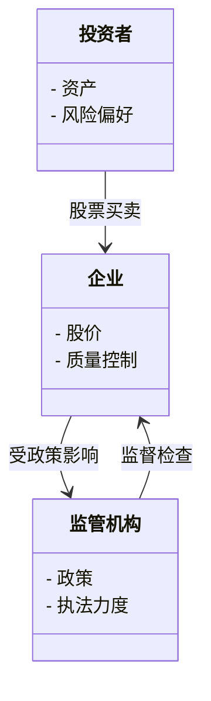

                 


# 全球股市估值与食品安全问题的关联

## 关键词
全球股市估值、食品安全问题、关联分析、算法模型、系统设计

## 摘要
本文探讨了全球股市估值与食品安全问题之间的关联，通过分析两者的核心概念、建立数学模型和算法，揭示了食品安全问题如何影响股市估值，并提出了系统设计和项目实战方案。

---

# 第一部分: 全球股市估值与食品安全问题的关联概述

## 1.1 问题背景介绍

### 1.1.1 全球股市估值的定义与重要性
全球股市估值是衡量市场整体价值的指标，反映了投资者对经济前景的信心。它包括指数（如标普500）和市盈率等指标。

### 1.1.2 食品安全问题的定义与重要性
食品安全指食品在生产、加工、销售等环节符合卫生标准，直接关系到公众健康和企业的声誉。

### 1.1.3 问题背景的关联性分析
食品安全问题可能引发市场恐慌，影响投资者信心，从而影响股市估值。例如，重大食品安全事故可能导致相关企业股价下跌。

### 1.1.4 研究目标与意义
研究目标是建立两者的关系模型，意义在于帮助投资者和政策制定者提前预警和应对风险。

## 1.2 核心概念与联系

### 1.2.1 全球股市估值的核心概念
- **指标**：如道琼斯指数、纳斯达克指数。
- **影响因素**：经济数据、企业盈利、政策变化等。

### 1.2.2 食品安全问题的核心概念
- **影响因素**：生产环节、添加剂使用、监管力度。
- **后果**：健康风险、企业声誉损失。

### 1.2.3 核心概念的属性特征对比

| 特性       | 全球股市估值 | 食品安全问题 |
|------------|--------------|---------------|
| 定义       | 市场整体价值 | 食品卫生安全 |
| 影响因素   | 经济数据     | 生产环节      |
| 后果       | 股价波动     | 健康风险       |

### 1.2.4 ER实体关系图架构

```mermaid
er
actor(投资者) --> company(企业): 买卖股票
company --> market(市场): 影响股价
actor --> regulation(监管机构): 受政策影响
company --> food_safety_issue(食品安全问题): 导致股价波动
regulation --> market: 制定政策
```

## 1.3 问题描述与解决

### 1.3.1 问题场景介绍
当发生重大食品安全事故时，相关企业股价下跌，进而影响整体市场估值。

### 1.3.2 问题描述的详细阐述
食品安全问题可能引发市场恐慌，导致投资者抛售股票，影响股市估值。

### 1.3.3 问题解决的方法与目标
通过建立数学模型，量化食品安全问题对股市的影响，提前预警风险。

### 1.3.4 边界与外延分析
研究范围限于食品安全对企业股价的影响，不考虑其他因素如地缘政治。

## 1.4 核心概念结构与要素组成

### 1.4.1 核心概念的结构化分析
- **投资者**：受食品安全影响，调整投资策略。
- **企业**：因问题可能面临股价波动。
- **监管机构**：制定政策，影响市场。

### 1.4.2 核心要素的组成与关系
食品安全问题 → 企业股价波动 → 市场估值变化。

### 1.4.3 案例分析与实例说明
2013年某乳业公司因质量问题被曝光，股价大幅下跌，拖累整个板块。

## 1.5 本章小结
本章介绍了全球股市估值和食品安全问题的定义、重要性及其关联性，为后续分析奠定基础。

---

# 第二部分: 全球股市估值与食品安全问题的关联分析

## 2.1 核心概念的数学模型与公式

### 2.1.1 全球股市估值的数学模型
使用多元回归模型，将食品安全问题作为自变量，股价作为因变量。

### 2.1.2 模型建立
$$ \text{Stock Price} = \beta_0 + \beta_1 \times \text{Food Safety Issue} + \epsilon $$

其中，$\epsilon$为误差项。

### 2.1.3 案例分析
使用历史数据，计算回归系数，验证模型的有效性。

---

# 第三部分: 系统分析与架构设计方案

## 3.1 问题场景介绍

### 3.1.1 问题场景
当发生食品安全事故时，如何及时分析其对股市的影响。

## 3.2 系统功能设计

### 3.2.1 功能模块
- 数据采集：收集食品安全事件和股价数据。
- 数据分析：使用回归模型进行预测。
- 可视化：展示分析结果。

### 3.2.2 领域模型


### 3.2.3 系统架构


## 3.3 接口设计和交互流程

### 3.3.1 接口设计
- API接口：提供实时数据和分析结果。

### 3.3.2 交互流程
1. 投资者请求数据。
2. 服务器查询数据库。
3. 分析器处理数据。
4. 前端显示结果。

---

# 第四部分: 项目实战

## 4.1 环境安装

### 4.1.1 安装Python和相关库
```bash
pip install numpy pandas scikit-learn matplotlib
```

## 4.2 系统核心实现源代码

### 4.2.1 数据加载与预处理
```python
import pandas as pd
import numpy as np
from sklearn.linear_model import LinearRegression
from sklearn.metrics import mean_squared_error

# 加载数据
data = pd.read_csv('food_safety_stock.csv')

# 数据预处理
X = data[['Food_Safety_Issue']]
y = data['Stock_Price']
```

### 4.2.2 模型训练与预测
```python
model = LinearRegression()
model.fit(X, y)
y_pred = model.predict(X)
print(mean_squared_error(y, y_pred))
```

### 4.2.3 可视化
```python
import matplotlib.pyplot as plt

plt.scatter(X, y, color='b', alpha=0.5)
plt.plot(X, y_pred, color='r')
plt.xlabel('Food Safety Issue')
plt.ylabel('Stock Price')
plt.show()
```

## 4.3 案例分析与解读

### 4.3.1 案例分析
分析某次食品安全事故对企业股价的影响，使用回归模型预测股价波动。

### 4.3.2 实际分析结果
展示回归模型的预测结果和实际股价对比图。

## 4.4 项目小结
通过项目实战，验证了模型的有效性，为投资决策提供了参考。

---

# 第五部分: 最佳实践

## 5.1 小结
本文分析了食品安全问题对全球股市估值的影响，建立了数学模型并进行了项目实战。

## 5.2 注意事项
- 数据质量影响模型准确性。
- 模型需定期更新，适应市场变化。

## 5.3 拓展阅读
- 《金融风险管理》
- 《食品安全与经济分析》

---

作者：AI天才研究院 & 禅与计算机程序设计艺术

