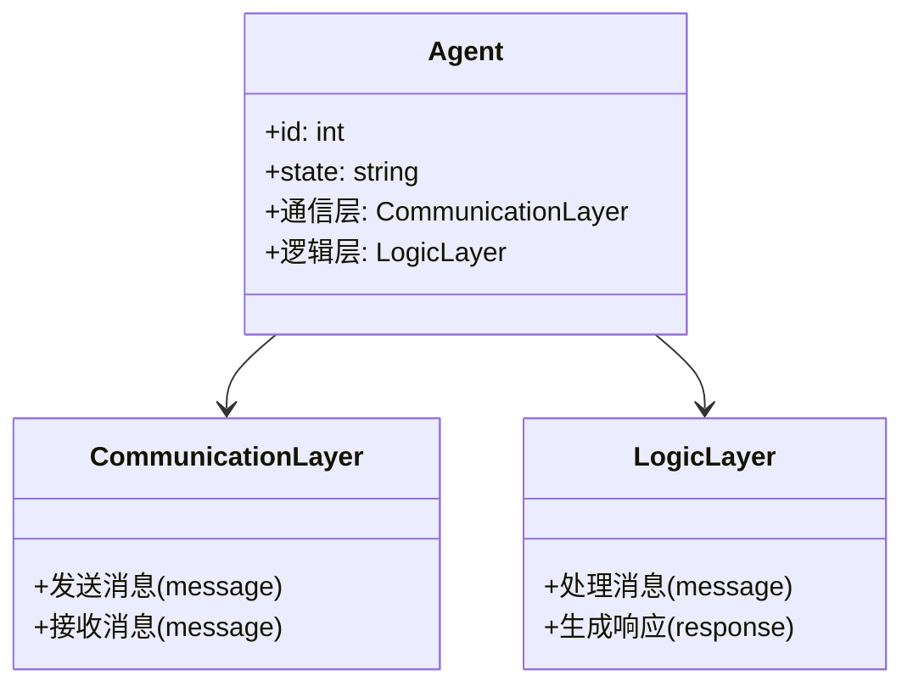
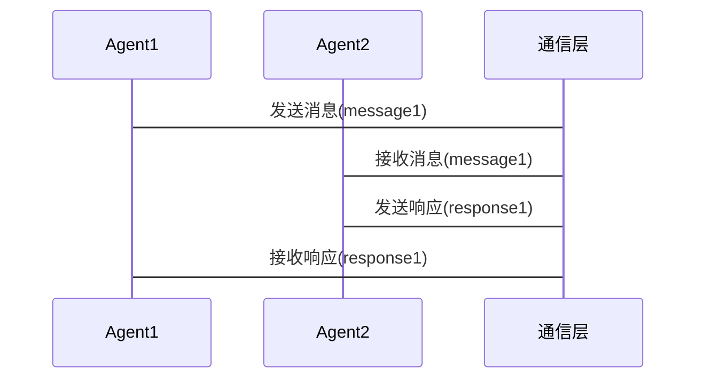

                 


# 第四章: 分布式AI Agent系统的数学模型与公式

## 4.1 分布式一致性算法的数学模型

### 4.1.1 一致性算法的数学表达
一致性算法的核心目标是确保分布式系统中所有节点的状态保持一致。一个典型的一致性算法可以表示为：
$$ \text{一致性条件} = \text{所有节点的状态相同} $$

这个条件可以通过以下步骤来实现：
1. **初始化状态**：所有节点的初始状态为相同的值。
2. **状态更新**：当一个节点的状态发生变化时，通过通信机制通知其他节点。
3. **状态同步**：其他节点在接收到更新通知后，将自己的状态更新为与源节点一致的状态。

### 4.1.2 一致性算法的收敛性分析
为了确保一致性算法的收敛性，我们可以使用以下数学模型：
$$ \text{收敛条件} = \lim_{t \to \infty} \text{所有节点的状态} = \text{一致} $$

这个模型表明，随着时间的推移，所有节点的状态会逐渐趋近于一致。在实际应用中，可以通过设置超时机制和重试机制来确保算法的收敛性。

## 4.2 多Agent协调算法的数学模型

### 4.2.1 协调算法的数学表达
多Agent协调算法的目标是确保多个Agent在协同工作时能够达成一致。一个典型的协调算法可以表示为：
$$ \text{协调条件} = \text{所有Agent达成一致} $$

这个条件可以通过以下步骤来实现：
1. **初始化状态**：所有Agent的初始状态为相同的值。
2. **状态更新**：当一个Agent的状态发生变化时，通过通信机制通知其他Agent。
3. **状态同步**：其他Agent在接收到更新通知后，将自己的状态更新为与源Agent一致的状态。

### 4.2.2 协调算法的收敛性分析
为了确保协调算法的收敛性，我们可以使用以下数学模型：
$$ \text{收敛条件} = \lim_{t \to \infty} \text{所有Agent的状态} = \text{一致} $$

这个模型表明，随着时间的推移，所有Agent的状态会逐渐趋近于一致。在实际应用中，可以通过设置超时机制和重试机制来确保算法的收敛性。

## 4.3 通信协议的数学模型

### 4.3.1 通信协议的数学表达
通信协议的数学模型可以表示为：
$$ \text{消息格式} = (\text{源节点}, \text{目标节点}, \text{消息内容}) $$

这个模型描述了一个消息的结构，其中源节点是发送消息的节点，目标节点是接收消息的节点，消息内容是发送的具体信息。

### 4.3.2 通信协议的实现步骤
通信协议的实现步骤如下：
1. **消息生成**：源节点生成消息，并将其发送给目标节点。
2. **消息接收**：目标节点接收消息，并进行处理。
3. **消息响应**：目标节点在处理完消息后，生成响应消息，并将其发送给源节点。
4. **消息确认**：源节点接收响应消息，并确认消息的接收。

通过以上步骤，可以确保通信协议的正确性和可靠性。

---

# 第五章: 分布式AI Agent系统的系统架构设计与实现

## 5.1 系统架构设计

### 5.1.1 系统架构的层次划分
分布式AI Agent系统的架构通常可以划分为以下几个层次：
1. **数据层**：负责数据的存储和管理。
2. **逻辑层**：负责业务逻辑的实现。
3. **通信层**：负责节点之间的通信和消息传递。
4. **应用层**：负责系统的对外接口和用户交互。

### 5.1.2 系统架构的类图设计
以下是系统架构的类图设计：


### 5.1.3 系统架构的交互设计
以下是系统架构的交互设计：


## 5.2 系统实现

### 5.2.1 系统实现的环境配置
为了实现分布式AI Agent系统，需要以下环境配置：
1. **操作系统**：Linux或Windows。
2. **编程语言**：Python或Java。
3. **框架与库**：使用如`socket`库（Python）或`Java Socket`进行通信，使用如`numpy`进行数据处理。

### 5.2.2 系统实现的核心代码

#### 1. 通信层的实现
以下是通信层的实现代码：
```python
import socket

class CommunicationLayer:
    def __init__(self, host, port):
        self.host = host
        self.port = port
        self.socket = None

    def connect(self):
        self.socket = socket.socket(socket.AF_INET, socket.SOCK_STREAM)
        self.socket.connect((self.host, self.port))

    def send_message(self, message):
        self.socket.sendall(message.encode())

    def receive_message(self):
        data = self.socket.recv(1024)
        return data.decode()
```

#### 2. 逻辑层的实现
以下是逻辑层的实现代码：
```python
class LogicLayer:
    def __init__(self):
        self.state = None

    def process_message(self, message):
        # 处理消息并更新状态
        self.state = self.state or message
        return f"响应：{self.state}"
```

#### 3. Agent的实现
以下是Agent的实现代码：
```python
from communication_layer import CommunicationLayer
from logic_layer import LogicLayer

class Agent:
    def __init__(self, id, host, port):
        self.id = id
        self.host = host
        self.port = port
        self.communication_layer = CommunicationLayer(host, port)
        self.logic_layer = LogicLayer()

    def run(self):
        self.communication_layer.connect()
        while True:
            message = self.communication_layer.receive_message()
            response = self.logic_layer.process_message(message)
            self.communication_layer.send_message(response)
```

### 5.2.3 系统实现的项目实战

#### 1. 项目案例分析
假设我们有一个智能交通系统，其中包含多个Agent，每个Agent负责监控一个交通信号灯的状态。以下是项目的实现步骤：
1. **环境配置**：安装Python和必要的库。
2. **核心代码实现**：实现通信层和逻辑层的代码。
3. **系统功能实现**：实现Agent的运行逻辑。
4. **系统功能测试**：测试系统的通信和协调能力。

#### 2. 核心代码实现
以下是核心代码的实现：
```python
class TrafficLightAgent(Agent):
    def __init__(self, id, host, port):
        super().__init__(id, host, port)
        self.status = "停止"

    def process_message(self, message):
        if message == "开始":
            self.status = "运行"
            return "开始运行"
        elif message == "停止":
            self.status = "停止"
            return "停止运行"
        else:
            return f"未知命令：{message}"
```

#### 3. 系统功能实现
以下是系统功能的实现：
```python
def main():
    agent = TrafficLightAgent(1, 'localhost', 1234)
    agent.run()

if __name__ == "__main__":
    main()
```

#### 4. 详细解读与分析
通过以上代码，我们可以看到：
- **通信层**：负责节点之间的通信，实现消息的发送和接收。
- **逻辑层**：负责业务逻辑的实现，处理接收到的消息，并生成响应。
- **Agent**：负责系统的运行，协调各个层的工作，实现系统的整体功能。

通过这个案例，我们可以看到分布式AI Agent系统的实现步骤和实现细节。

---

# 总结

## 5.3 系统实现的小结

### 5.3.1 项目小结
通过以上步骤，我们可以看到，分布式AI Agent系统的实现需要以下几个关键步骤：
1. **系统架构设计**：设计系统的层次结构和交互流程。
2. **系统实现**：实现各个层次的功能，并进行代码实现。
3. **系统测试**：测试系统的功能和性能，确保系统的正确性和可靠性。

### 5.3.2 项目总结
通过这个项目，我们可以看到，分布式AI Agent系统的实现需要结合多个方面的知识，包括分布式系统、人工智能、通信协议等。通过实践，我们可以更好地理解这些概念，并能够将其应用到实际项目中。

---

## 最佳实践 tips

### 5.4.1 小结
通过以上章节的讲解和项目实战，我们可以看到，分布式AI Agent系统的实现需要以下几个关键点：
1. **系统架构设计**：合理设计系统的层次结构和交互流程。
2. **算法实现**：选择合适的算法，并进行数学建模和公式推导。
3. **系统实现**：根据设计和算法，进行代码实现，并进行系统测试。

### 5.4.2 注意事项
在实现分布式AI Agent系统时，需要注意以下几点：
1. **通信延迟**：分布式系统中，节点之间的通信可能会有延迟，需要进行超时处理和重试机制。
2. **一致性问题**：需要确保系统的一致性，可以通过一致性算法来实现。
3. **安全性问题**：需要确保系统的安全性，防止数据泄露和恶意攻击。

### 5.4.3 拓展阅读
对于感兴趣的朋友，可以进一步阅读以下书籍和论文：
- **《分布式系统：概念与设计》**：深入讲解分布式系统的设计与实现。
- **《Multi-Agent Systems》**：详细讲解多智能体系统的设计与实现。
- **《通信协议设计与实现》**：介绍通信协议的设计与实现方法。

---

## 作者信息

### 作者：AI天才研究院/AI Genius Institute & 禅与计算机程序设计艺术 /Zen And The Art of Computer Programming

---

通过以上章节的详细讲解和项目实战，我们可以看到，分布式AI Agent系统的实现需要结合多个方面的知识，并且需要进行大量的实践和实验。希望这篇文章能够帮助读者更好地理解分布式AI Agent系统的设计与实现，并能够在实际项目中应用这些知识。

