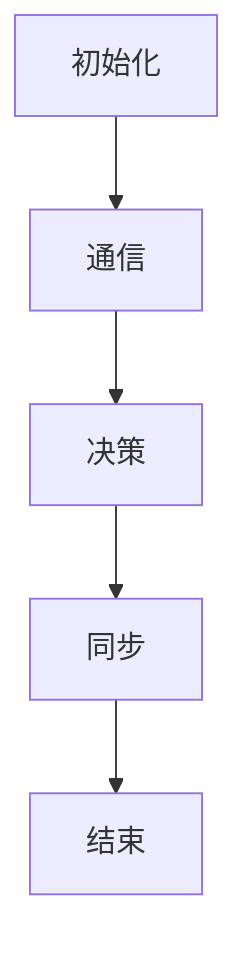
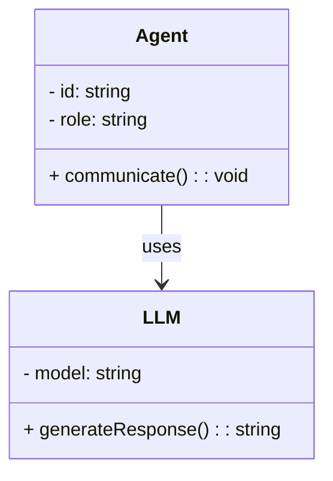
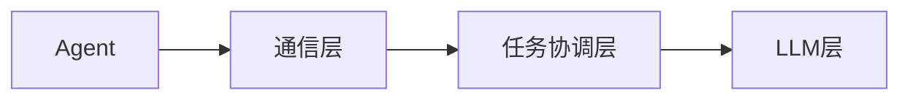
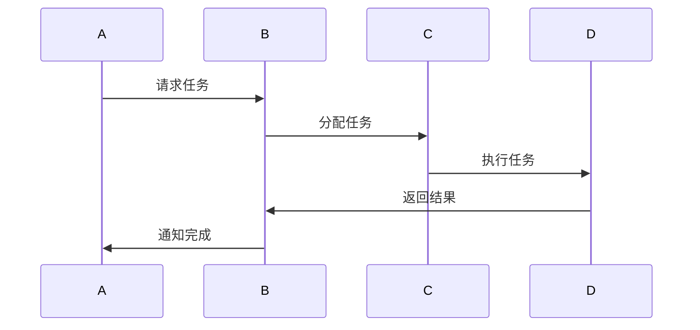

                 


# 分布式协作AI Agent：多LLM系统的群体智能

**关键词**：分布式协作、AI Agent、多LLM系统、群体智能、算法原理、系统架构、项目实战

**摘要**：本文探讨了分布式协作AI Agent在多LLM系统中的应用，分析了群体智能的核心算法和系统架构设计。通过实际案例，展示了多LLM系统的协作机制和应用场景，最后总结了技术发展的趋势和挑战。

---

## 第一部分: 分布式协作AI Agent与多LLM系统概述

### 第1章: 分布式协作AI Agent的背景与概念

#### 1.1 问题背景

**1.1.1 分布式协作AI Agent的定义**

- 分布式协作AI Agent是指多个独立的AI Agent通过分布式网络协同工作，共同完成复杂任务的系统。

**1.1.2 多LLM系统的核心问题**

- 多LLM系统的核心问题是如何高效地协调多个大语言模型，使其在分布式环境中协作。

**1.1.3 群体智能的定义与特点**

- 群体智能是通过多个个体的协作行为，产生比个体单干更有效的整体智能。

#### 1.2 问题描述

**1.2.1 分布式协作中的主要挑战**

- 分布式环境下的通信延迟和带宽限制。

**1.2.2 多LLM系统的关键问题**

- 模型之间的协调与同步。

**1.2.3 群体智能的应用场景**

- 智能客服、智能推荐、智能监控等。

#### 1.3 问题解决

**1.3.1 分布式协作AI Agent的解决方案**

- 采用分布式架构和高效的通信机制。

**1.3.2 多LLM系统的实现路径**

- 使用共识算法和任务分配机制。

**1.3.3 群体智能的核心技术**

- 分布式算法、一致性机制、任务分配策略。

#### 1.4 边界与外延

**1.4.1 分布式协作AI Agent的边界**

- 分布式协作的范围和限制条件。

**1.4.2 多LLM系统的应用范围**

- 针对特定任务设计的模型组合。

**1.4.3 群体智能的适用场景**

- 需要多智能体协作的任务。

#### 1.5 概念结构与核心要素

**1.5.1 分布式协作AI Agent的结构**

- 包括多个AI Agent、通信机制、协作协议。

**1.5.2 多LLM系统的组成要素**

- 多个LLM、分布式通信层、任务协调层。

**1.5.3 群体智能的核心概念**

- 群体行为、分布式决策、任务分配。

---

**图表示例：**

**概念结构图：**


**ER实体关系图：**

```mermaid
entity A(Agent)
entity B(LLM)
A -[通信协议]-> B
B -[任务分配]-> A
```

---

## 第二部分: 分布式协作AI Agent与多LLM系统的技术基础

### 第2章: 多LLM协作机制

#### 2.1 分布式协作AI Agent的原理

**2.1.1 分布式协作的基本原理**

- 多AI Agent通过分布式网络进行通信和协作。

**2.1.2 AI Agent的定义与属性**

- 每个AI Agent都有特定的功能和属性。

**2.1.3 多AI Agent的协作机制**

- 使用共识算法和任务分配策略。

#### 2.2 多LLM系统的原理

**2.2.1 多LLM系统的定义**

- 由多个大语言模型组成的系统。

**2.2.2 LLM在多系统中的角色**

- 每个LLM负责特定的任务。

**2.2.3 多LLM系统的协作方式**

- 通过通信协议和任务分配实现协作。

#### 2.3 群体智能的原理

**2.3.1 群体智能的定义**

- 通过多个个体的协作，产生整体智能。

**2.3.2 群体智能的核心算法**

- 使用分布式算法和一致性机制。

**2.3.3 群体智能的应用场景**

- 多智能体协作完成复杂任务。

---

### 第3章: 群体智能算法

#### 3.1 群体智能算法的设计

**3.1.1 算法流程**

- 初始化、通信、决策、同步。

**3.1.2 算法实现**

- 使用一致性评估和优化算法。

#### 3.2 算法流程图



#### 3.3 算法的数学模型

- 一致性评估公式：

$$ \text{一致性} = \frac{\sum_{i=1}^{n} |\text{意见}_i - \text{平均意见}|}{n} $$

---

## 第三部分: 分布式协作AI Agent与多LLM系统的系统架构设计

### 第4章: 系统架构设计

#### 4.1 系统功能设计

**4.1.1 领域模型**

- 使用Mermaid类图展示系统模块。



**4.1.2 系统架构**

- 使用Mermaid架构图展示系统结构。



#### 4.2 系统接口设计

**4.2.1 系统接口**

- 通信接口、任务分配接口。

**4.2.2 交互流程**

- 使用Mermaid序列图展示交互流程。



---

## 第四部分: 分布式协作AI Agent与多LLM系统的项目实战

### 第5章: 项目实战

#### 5.1 环境安装

- 安装必要的库和工具。

#### 5.2 核心代码实现

```python
def一致性评估():
    平均意见 = sum(意见列表) / len(意见列表)
    总一致性 = 0
    for 意见 in 意见列表:
        总一致性 += abs(意见 - 平均意见)
    return 总一致性 / len(意见列表)
```

#### 5.3 代码解读与分析

- 解释代码的功能和实现细节。

#### 5.4 案例分析

- 分析电商客服系统的实现和效果。

#### 5.5 项目小结

- 总结项目的经验和教训。

---

## 第五部分: 分布式协作AI Agent与多LLM系统的应用案例

### 第6章: 应用案例

#### 6.1 智能客服系统

**6.1.1 应用场景**

- 客服对话中的多LLM协作。

**6.1.2 系统设计**

- 设计任务分配和协作机制。

**6.1.3 实现分析**

- 分析系统的实现效果。

#### 6.2 智能推荐系统

**6.2.1 应用场景**

- 基于多LLM的推荐系统。

**6.2.2 系统设计**

- 设计推荐算法和协作机制。

**6.2.3 实现分析**

- 分析推荐效果。

#### 6.3 智能监控系统

**6.3.1 应用场景**

- 监控数据的分析与处理。

**6.3.2 系统设计**

- 设计监控任务分配和协作机制。

**6.3.3 实现分析**

- 分析监控效果。

---

## 第六部分: 分布式协作AI Agent与多LLM系统的未来发展

### 第7章: 未来发展趋势

#### 7.1 技术进步

**7.1.1 算法优化**

- 提高一致性和效率。

**7.1.2 系统架构优化**

- 优化通信和任务分配机制。

#### 7.2 主要挑战

**7.2.1 通信延迟**

- 如何减少通信延迟。

**7.2.2 带宽限制**

- 如何在带宽受限的环境下协作。

**7.2.3 一致性问题**

- 如何提高一致性。

#### 7.3 未来研究方向

**7.3.1 更高效的算法**

- 研究更高效的分布式算法。

**7.3.2 更优的系统架构**

- 研究更优的系统架构设计。

---

**作者：AI天才研究院/AI Genius Institute & 禅与计算机程序设计艺术 /Zen And The Art of Computer Programming**

