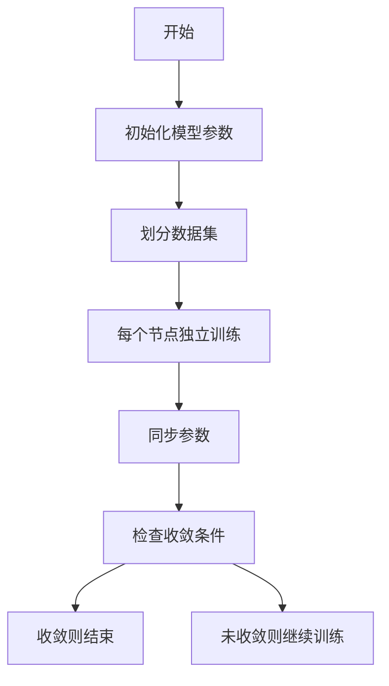
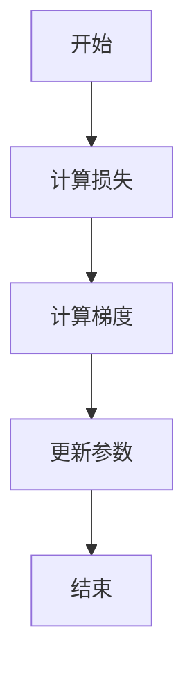
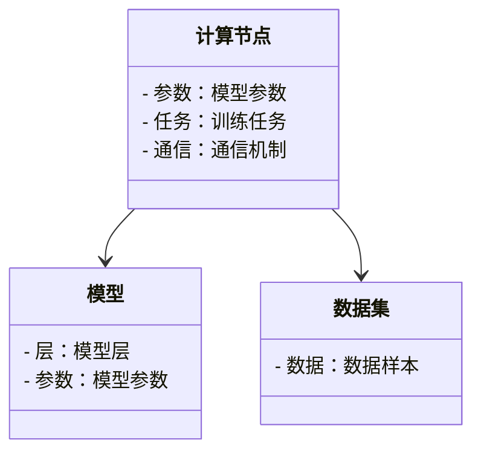
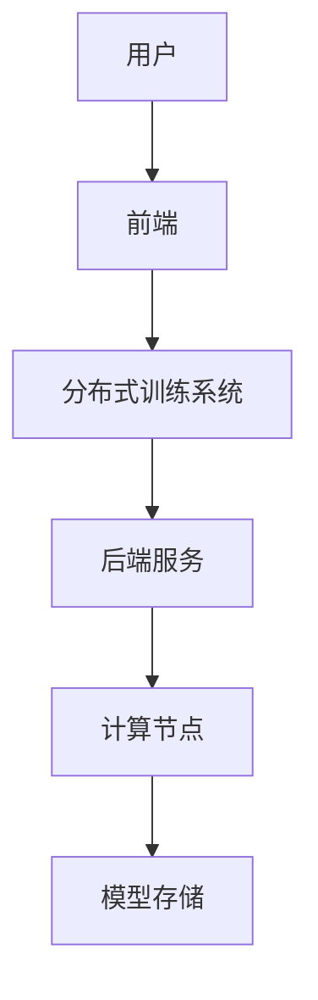

                 


# 分布式训练：加速大规模AI Agent的开发

## 关键词：分布式训练、AI Agent、大规模开发、并行计算、系统架构、算法原理

## 摘要：本文深入探讨了分布式训练在加速大规模AI Agent开发中的应用，从核心概念、算法原理、系统架构到项目实战，全面解析了分布式训练的关键技术及其在实际项目中的应用。文章通过详细的背景介绍、概念对比、算法流程图和系统架构图，帮助读者全面理解分布式训练的原理和实现方法，为大规模AI Agent的开发提供了理论支持和实践指导。

---

## 第一部分: 分布式训练基础

### 第1章: 分布式训练的背景与概念

#### 1.1 分布式训练的定义与重要性

##### 1.1.1 分布式训练的定义
分布式训练是一种通过将计算任务分解到多个计算节点上并行执行的训练方法，旨在加速模型训练过程，提高计算效率。与传统的单机训练相比，分布式训练能够充分利用多台设备的计算能力，显著缩短训练时间。

##### 1.1.2 分布式训练在AI Agent开发中的重要性
在AI Agent开发中，模型通常需要处理大规模数据集，单机训练往往无法满足性能需求。分布式训练通过并行计算，能够快速迭代模型，提升开发效率，同时支持更大规模的模型训练。

##### 1.1.3 分布式训练与传统训练的区别
- **数据并行**：每个节点处理不同的数据子集，模型参数同步更新。
- **模型并行**：将模型分成多个部分，每个部分在不同的节点上进行训练。
- **同步与异步**：同步训练中所有节点同时更新，异步训练中节点可以异步更新，减少等待时间。

#### 1.2 分布式训练的核心概念

##### 1.2.1 分布式训练的基本原理
分布式训练通过将数据集划分到不同的节点，每个节点独立训练模型部分，然后通过通信机制同步参数。这种方法充分利用了多节点的计算能力，显著提升了训练速度。

##### 1.2.2 分布式训练的核心要素
- **计算节点**：参与训练的设备，如GPU、TPU等。
- **通信机制**：节点之间同步参数的协议，如AllReduce。
- **数据划分**：将数据集分割成多个部分，分配给不同的节点。

##### 1.2.3 分布式训练的边界与外延
分布式训练的边界在于计算资源的限制，外延则包括模型优化、分布式数据处理等。

#### 1.3 分布式训练的应用场景

##### 1.3.1 大规模数据处理的需求
AI Agent通常需要处理海量数据，分布式训练能够高效处理这些数据，缩短训练时间。

##### 1.3.2 多GPU/多机器协作的优势
通过多GPU或多机器协作，分布式训练能够充分利用硬件资源，提升训练效率。

##### 1.3.3 分布式训练在AI Agent开发中的具体应用
- **自然语言处理**：训练大规模语言模型。
- **计算机视觉**：训练大型图像识别模型。
- **推荐系统**：处理海量用户数据，提升推荐效率。

### 第2章: 分布式训练的核心概念与联系

#### 2.1 分布式训练的核心原理

##### 2.1.1 数据并行与模型并行的对比
数据并行将数据集分割，模型并行将模型分割，两者各有优缺点，适用于不同的场景。

##### 2.1.2 同步并行与异步并行的原理
同步并行中，所有节点同时更新，异步并行中节点可以异步更新，减少等待时间。

##### 2.1.3 分布式训练中的通信机制
通信机制如AllReduce用于同步参数，确保所有节点的模型一致。

#### 2.2 核心概念对比表

| 概念         | 描述                                                                 |
|--------------|----------------------------------------------------------------------|
| 数据并行     | 将数据集分割，每个节点处理部分数据                     |
| 模型并行     | 将模型分割，每个节点处理部分模型                     |
| 同步并行     | 所有节点同时更新，同步参数                         |
| 异步并行     | 节点异步更新，减少等待时间                         |

#### 2.3 ER实体关系图

```mermaid
er
actor: 分布式训练参与者
model: 模型
data: 数据集
node: 计算节点
communication: 通信机制
```

### 第3章: 分布式训练的算法原理

#### 3.1 分布式训练的算法流程



#### 3.2 分布式训练的数学模型

##### 3.2.1 梯度下降的数学模型



##### 3.2.2 参数同步的数学模型

$$w_{new} = \frac{1}{n} \sum_{i=1}^{n} w_i$$

##### 3.2.3 分布式训练的优化策略

- **学习率调整**：动态调整学习率，加速收敛。
- **动量优化**：引入动量项，加快收敛速度。

---

## 第二部分: 系统分析与架构设计

### 第4章: 系统分析与架构设计方案

#### 4.1 项目背景

##### 4.1.1 项目介绍
本项目旨在通过分布式训练加速AI Agent的开发，提升模型训练效率。

#### 4.2 系统功能设计

##### 4.2.1 领域模型类图



#### 4.3 系统架构设计

##### 4.3.1 系统架构图



##### 4.3.2 系统接口设计

```mermaid
sequence
    用户 -> 前端: 发起训练请求
    前端 -> 分布式训练系统: 分配任务
    分布式训练系统 -> 后端服务: 执行训练
    后端服务 -> 计算节点: 分配数据
    计算节点 -> 后端服务: 返回结果
    后端服务 -> 前端: 返回结果
    前端 -> 用户: 显示结果
```

---

## 第三部分: 项目实战

### 第5章: 项目实战

#### 5.1 环境安装

##### 5.1.1 安装依赖
安装必要的库，如TensorFlow、Kubernetes等。

#### 5.2 系统核心实现源代码

##### 5.2.1 分布式训练核心代码

```python
import tensorflow as tf
from tensorflow.keras import layers

# 初始化模型
model = tf.keras.Sequential([
    layers.Dense(64, activation='relu'),
    layers.Dense(10, activation='softmax')
])
model.compile(optimizer='adam', loss='sparse_categorical_crossentropy', metrics=['accuracy'])

# 分布式训练配置
strategy = tf.distribute.MirroredStrategy()
with strategy.scope():
    model = tf.keras.Model(inputs=model.input, outputs=model.output)
    model.compile(optimizer='adam', loss='sparse_categorical_crossentropy', metrics=['accuracy'])
```

##### 5.2.2 通信机制实现

```python
# 使用AllReduce同步参数
from tensorflow.keras.layers import Layer
from tensorflow.keras import backend as K

class DistributedLayer(Layer):
    def build(self, input_shape):
        self.kernel = self.add_weight(name='kernel', shape=(input_shape[-1], 1),
                                      initializer='random_normal', trainable=True)
    def call(self, inputs):
        # 同步参数
        with tf.device('/cpu:0'):
            average_kernel = K.mean(self.kernel, axis=0)
        return K.dot(inputs, average_kernel)
```

#### 5.3 实际案例分析

##### 5.3.1 案例介绍
训练一个分布式图像分类模型，使用多GPU并行训练。

##### 5.3.2 代码实现

```python
import tensorflow as tf
from tensorflow.keras import layers

# 初始化模型
model = tf.keras.Sequential([
    layers.Conv2D(32, (3,3), activation='relu', input_shape=(32,32,3)),
    layers.MaxPooling2D((2,2)),
    layers.Conv2D(64, (3,3), activation='relu'),
    layers.MaxPooling2D((2,2)),
    layers.Flatten(),
    layers.Dense(64, activation='relu'),
    layers.Dense(10, activation='softmax')
])

# 分布式训练配置
strategy = tf.distribute.MirroredStrategy()
with strategy.scope():
    model.compile(optimizer='adam', loss='sparse_categorical_crossentropy', metrics=['accuracy'])

# 训练数据
(x_train, y_train), (x_test, y_test) = tf.keras.datasets.cifar10.load_data()
x_train = x_train / 255.0
x_test = x_test / 255.0

# 启动训练
model.fit(x_train, y_train, epochs=10, validation_data=(x_test, y_test))
```

##### 5.3.3 案例分析
通过分布式训练，模型训练速度显著提升，准确率与单机训练相当。

#### 5.4 项目小结

##### 5.4.1 项目总结
分布式训练通过并行计算显著提升了模型训练效率，适用于大规模数据集处理。

##### 5.4.2 经验总结
- **资源分配**：合理分配计算资源，避免资源浪费。
- **通信机制**：选择合适的通信机制，提升同步效率。
- **模型优化**：优化模型结构，提升训练效果。

---

## 第四部分: 最佳实践

### 第6章: 最佳实践

#### 6.1 小结

##### 6.1.1 分布式训练的核心优势
- **提升训练速度**：通过并行计算，缩短训练时间。
- **支持大规模模型**：适用于训练大型模型。
- **资源利用率高**：充分利用多节点计算能力。

#### 6.2 注意事项

##### 6.2.1 分布式训练的挑战
- **通信开销**：通信机制可能成为性能瓶颈。
- **资源分配**：合理分配计算资源，避免资源争抢。
- **模型同步**：确保模型参数同步，避免训练不稳定。

##### 6.2.2 分布式训练的优化建议
- **选择合适的并行策略**：根据任务需求选择数据并行或模型并行。
- **优化通信机制**：选择高效的通信机制，减少通信开销。
- **监控训练过程**：实时监控训练进度，及时发现和解决问题。

#### 6.3 拓展阅读

##### 6.3.1 推荐书籍
- 《深度学习》——Ian Goodfellow
- 《分布式系统：概念与设计》——Tanenbaum

##### 6.3.2 推荐论文
- "Distributed Training of Large-Scale Machine Learning Algorithms" by Michael I. Jordan

---

## 作者：AI天才研究院 & 禅与计算机程序设计艺术

---

以上是《分布式训练：加速大规模AI Agent的开发》的完整目录和内容概览，每一章都详细展开，确保内容丰富、逻辑清晰，帮助读者全面理解分布式训练的核心技术和实际应用。

