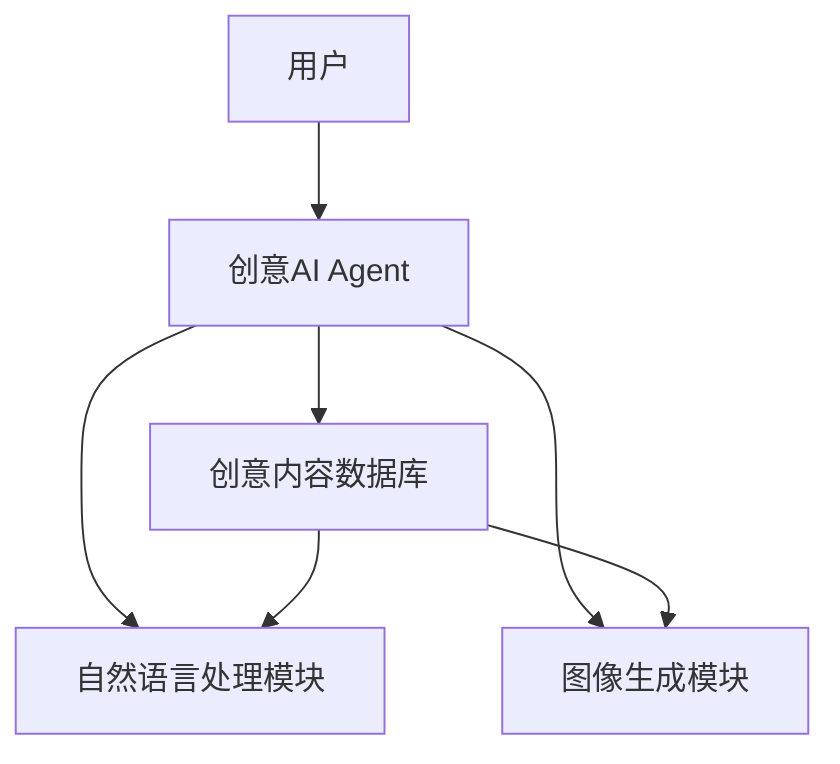

                 

# 创意AI Agent：辅助内容创作与设计

## 关键词：创意AI Agent，内容创作，AI辅助设计，自然语言处理，图像生成，机器学习

## 摘要：创意AI Agent是一种结合人工智能技术的智能辅助工具，旨在通过自然语言处理、图像生成和增强学习等算法，帮助用户提高创作效率、拓展创作可能性，并实现个性化与智能化的创作体验。本文将详细探讨创意AI Agent的核心概念、算法原理、系统架构及其在实际项目中的应用，为读者提供深入的技术解析和实践指导。

---

## 第一部分: 创意AI Agent的背景与概念

## 第1章: 创意AI Agent概述

### 1.1 创意AI Agent的基本概念

#### 1.1.1 创意AI Agent的定义
创意AI Agent是一种结合人工智能技术的智能辅助工具，能够通过自然语言处理、图像生成和增强学习等算法，帮助用户完成内容创作和设计任务。它不仅能够理解用户的创作需求，还能根据需求生成高质量的内容，如文本、图像和音频等。

#### 1.1.2 创意AI Agent的核心特点
创意AI Agent的核心特点包括：
1. **智能化**：通过深度学习算法，能够理解用户的创作意图并生成相应内容。
2. **高效性**：能够快速生成大量高质量的内容，显著提高创作效率。
3. **个性化**：可以根据用户的风格和偏好，生成个性化的内容。
4. **适应性**：能够根据反馈不断优化生成内容，适应不同的创作场景。

#### 1.1.3 创意AI Agent的边界与外延
创意AI Agent的边界在于其功能和应用场景。它主要用于辅助内容创作和设计，但并不直接替代人类的创作能力。其外延包括自然语言处理、图像生成、增强学习等技术领域。

### 1.2 创意AI Agent的背景与需求

#### 1.2.1 创意产业的数字化转型
随着数字化转型的推进，创意产业逐渐从传统的手工创作转向数字化、智能化的创作方式。创意AI Agent的出现正是这一转型的产物。

#### 1.2.2 AI技术在创意领域的应用现状
当前，AI技术在创意领域的应用主要集中在以下几个方面：
1. **自然语言处理**：用于文本生成、翻译和内容推荐。
2. **图像生成**：基于GAN（生成对抗网络）生成高质量图像和视觉内容。
3. **音频生成**：通过深度学习生成音乐、语音等音频内容。

#### 1.2.3 创意AI Agent的市场需求与痛点
市场需求：
1. 提高创作效率。
2. 拓展创作可能性。
3. 个性化与智能化创作。

痛点：
1. 创作工具的复杂性。
2. 内容生成的质量不稳定。
3. 创作过程的缺乏互动性。

### 1.3 创意AI Agent的核心价值

#### 1.3.1 提高创作效率
创意AI Agent能够快速生成大量内容，显著提高创作效率。例如，通过自然语言处理模型，用户可以在短时间内生成数百字的文章。

#### 1.3.2 拓展创作可能性
创意AI Agent能够帮助用户生成超出其能力范围的内容，例如复杂的图像设计或多种语言的翻译。

#### 1.3.3 个性化与智能化创作
通过学习用户的创作风格和偏好，创意AI Agent能够生成个性化的内容，满足用户的特定需求。

### 1.4 创意AI Agent的实现方式

#### 1.4.1 基于规则的创作辅助
基于规则的创作辅助是通过预定义的规则和模板，帮助用户生成内容。这种方式简单易用，但灵活性较低。

#### 1.4.2 基于深度学习的生成模型
基于深度学习的生成模型（如GPT、BERT）能够通过大量的训练数据，生成高质量的内容。这种方式灵活性高，但实现复杂。

#### 1.4.3 混合式AI Agent设计
混合式设计结合了基于规则和深度学习的优点，能够在保证内容质量的同时，提高创作效率。

### 1.5 本章小结
本章从基本概念、背景需求、核心价值和实现方式四个方面，全面介绍了创意AI Agent。通过理解这些内容，读者可以对创意AI Agent有一个初步的了解。

---

## 第二部分: 创意AI Agent的核心概念与联系

## 第2章: 创意AI Agent的核心原理

### 2.1 创意AI Agent的组成部分

#### 2.1.1 感知模块
感知模块负责接收用户的输入，并将其转化为可处理的格式。例如，用户输入一段文本描述，感知模块将其转化为自然语言处理模型的输入。

#### 2.1.2 决策模块
决策模块负责根据输入的内容，选择合适的生成模型和参数。例如，根据用户的需求选择文本生成或图像生成模型。

#### 2.1.3 执行模块
执行模块负责生成最终的内容，并将其返回给用户。例如，生成文本或图像，并通过界面展示给用户。

### 2.2 创意AI Agent的工作流程

#### 2.2.1 输入解析
输入解析是创意AI Agent工作的第一步，负责将用户的输入转化为可处理的格式。例如，用户输入一段中文描述，输入解析模块将其转化为自然语言处理模型的输入。

#### 2.2.2 内容生成
内容生成是创意AI Agent的核心步骤，负责根据解析后的输入，生成相应的内容。例如，生成一段文本或一张图像。

#### 2.2.3 输出优化
输出优化是对生成的内容进行进一步的优化，以提高内容的质量。例如，对生成的文本进行语法检查和润色。

### 2.3 创意AI Agent的核心算法

#### 2.3.1 自然语言处理模型
自然语言处理模型（如GPT）是创意AI Agent中常用的生成模型。它能够生成高质量的文本内容。

#### 2.3.2 图像生成模型
图像生成模型（如GAN）是创意AI Agent中用于生成图像的核心算法。它能够生成高质量的图像内容。

#### 2.3.3 增强学习算法
增强学习算法是一种通过强化学习生成内容的方法。它能够根据用户的反馈，不断优化生成的内容。

### 2.4 创意AI Agent与传统创作工具的对比

#### 2.4.1 功能对比
创意AI Agent的功能包括内容生成、风格转换等，而传统创作工具的功能主要是手动创作。

#### 2.4.2 优劣势分析
创意AI Agent的优势在于高效性和智能化，劣势在于生成内容的质量不稳定。传统创作工具的优势在于可控性，劣势在于效率低。

#### 2.4.3 适用场景对比
创意AI Agent适用于需要快速生成大量内容的场景，如广告创意、内容营销等。传统创作工具适用于需要高度个性化和精细控制的场景，如手绘插画、定制设计等。

### 2.5 创意AI Agent的实体关系图

### 2.6 本章小结
本章从组成部分、工作流程、核心算法和与传统创作工具的对比四个方面，详细介绍了创意AI Agent的核心原理。通过理解这些内容，读者可以对创意AI Agent的技术实现有更深入的理解。

---

## 作者：AI天才研究院/AI Genius Institute & 禅与计算机程序设计艺术 /Zen And The Art of Computer Programming

---

以上是前两章的内容，后续章节将按照目录大纲逐步展开，涵盖算法原理、系统分析与架构设计、项目实战、最佳实践等内容。

