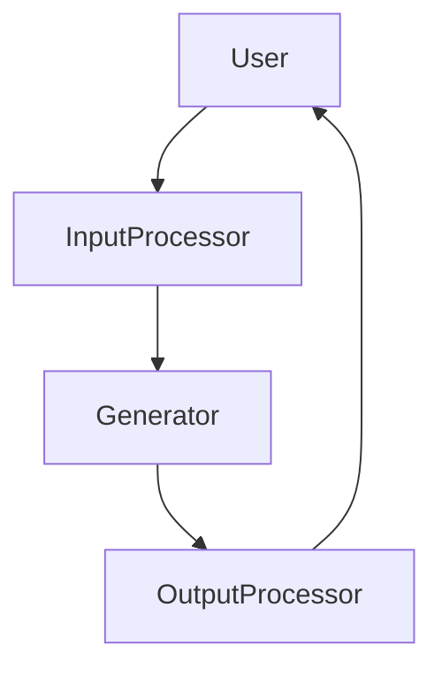

                 


# 创意写作 AI Agent：LLM 辅助内容创作与文案生成

> **关键词**: 创意写作，AI Agent，LLM，内容创作，文案生成

> **摘要**: 本文探讨了创意写作 AI Agent 的概念、原理及应用，结合大语言模型（LLM）的技术优势，详细分析其在文案生成、内容创作中的作用，并通过系统设计和项目实战，展示了如何利用 LLM 辅助创意写作。

---

## 第1章: 创意写作与AI Agent的背景介绍

### 1.1 创意写作的定义与特点

创意写作是指通过创新思维和艺术表达，创作出独特的文学作品、广告文案、剧本等内容的过程。其特点包括：

- **创新性**：强调独特的表达和创意。
- **多样性**：涵盖小说、诗歌、广告等多种形式。
- **情感性**：内容需触动读者的情感。

### 1.2 AI Agent的定义与特点

AI Agent 是智能代理的简称，具备以下特点：

- **自主性**：能在特定环境下自主决策。
- **反应性**：能感知环境并做出反应。
- **目标导向**：以实现特定目标为导向。

### 1.3 LLM的定义与特点

大语言模型（LLM）是基于深度学习的NLP模型，特点包括：

- **大规模训练**：使用海量数据训练。
- **生成能力**：能生成连贯的文本。
- **理解能力**：能理解上下文和语义。

### 1.4 创意写作 AI Agent的应用场景

AI Agent 在创意写作中的应用场景包括：

- **文案生成**：辅助广告文案创作。
- **内容创作**：帮助生成小说、诗歌等。
- **灵感激发**：提供创作思路。

---

## 第2章: 创意写作 AI Agent的核心概念与联系

### 2.1 核心概念原理

创意写作 AI Agent 的原理包括：

- **LLM 的生成能力**：通过生成文本辅助创作。
- **人机协作**：结合人类创造力和AI的效率。

### 2.2 核心概念属性特征对比

| **特征** | **传统写作工具** | **AI Agent** |
|----------|------------------|--------------|
| **创作速度** | 较慢            | 较快          |
| **创意来源** | 依赖人类        | 人机协作      |
| **适应性**  | 较低            | 较高          |

### 2.3 ER实体关系图架构

```mermaid
erd
    entity 创意写作AI Agent {
        id
        模型类型
        功能模块
    }
    entity 用户 {
        用户ID
        用户需求
    }
    entity 创意内容 {
        内容ID
        内容类型
    }
    创意写作AI Agent -[根据用户需求生成创意内容]-> 创意内容
    用户 -[发出指令]-> 创意写作AI Agent
```

---

## 第3章: 创意写作 AI Agent的算法原理讲解

### 3.1 算法原理概述

LLM 使用生成对抗网络（GAN）或变换器（Transformer）结构，通过概率生成文本。

### 3.2 生成过程

1. **输入处理**：将用户需求转化为向量。
2. **生成步骤**：模型生成文本序列。
3. **输出调整**：优化生成结果。

### 3.3 数学模型

损失函数：
$$ \text{Loss} = -\sum_{i=1}^{n} \log P(x_i| x_{<i}) $$

### 3.4 代码实现

```python
def generate_text(model, start_token):
    tokens = [start_token]
    while True:
        next_token = model.predict(tokens)
        tokens.append(next_token)
        if stop_condition:
            break
    return tokens
```

---

## 第4章: 系统架构设计

### 4.1 需求分析

- **用户需求**：生成高质量文案。
- **场景分析**：广告文案、小说创作。

### 4.2 系统功能设计

模块划分：
- **输入处理模块**：接收用户输入。
- **生成模块**：调用LLM生成内容。
- **输出模块**：展示生成结果。

### 4.3 系统架构图



---

## 第5章: 项目实战

### 5.1 环境安装

安装必要的库：
```bash
pip install transformers torch
```

### 5.2 核心实现

```python
from transformers import GPT2LMHeadModel, GPT2Tokenizer

model = GPT2LMHeadModel.from_pretrained('gpt2')
tokenizer = GPT2Tokenizer.from_pretrained('gpt2')
```

### 5.3 案例分析

生成广告文案：
```python
prompt = "Write an ad for a new smartphone."
response = model.generate(tokenizer.encode(prompt), max_length=50)
print(tokenizer.decode(response[0]))
```

---

## 第6章: 高级应用与最佳实践

### 6.1 优化策略

- **反馈机制**：优化生成内容。
- **多轮互动**：逐步完善创作。

### 6.2 注意事项

- **数据隐私**：保护用户数据。
- **模型局限性**：注意生成内容的质量。

---

## 第7章: 总结与展望

### 7.1 总结

本文详细介绍了创意写作 AI Agent 的概念、技术原理和应用场景，展示了其在文案生成和内容创作中的潜力。

### 7.2 未来展望

未来，随着技术进步，AI Agent 将更高效地辅助创意写作，实现更高质量的内容创作。

---

**作者**：AI天才研究院 & 禅与计算机程序设计艺术

