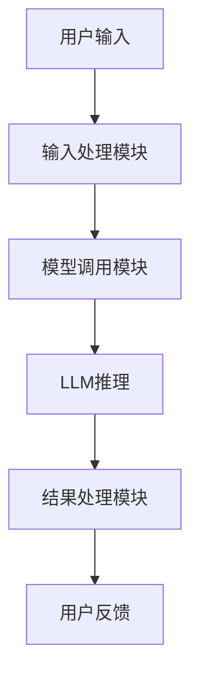
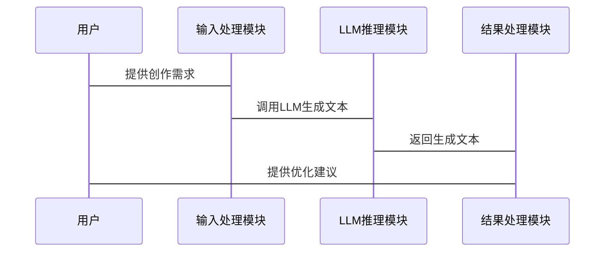
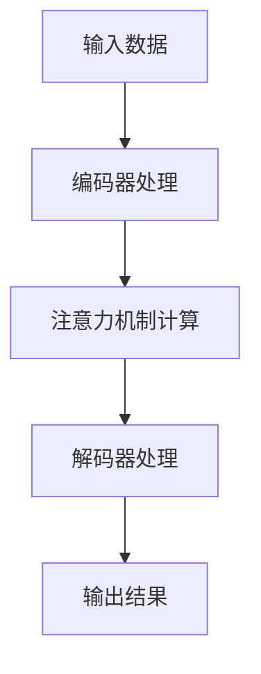

                 


# 创意写作AI Agent：LLM驱动的文学创作辅助系统

## 关键词：创意写作、AI代理、大语言模型（LLM）、文本生成、文学创作

## 摘要：  
随着人工智能技术的快速发展，大语言模型（LLM）在创意写作中的应用日益广泛。本文深入探讨了如何利用LLM构建一个智能化的创意写作AI代理系统，通过分析其背景、核心算法和系统架构，详细阐述了该系统在文学创作中的潜力和实现方法。文章不仅提供了理论支持，还通过实际案例和代码实现，展示了如何将AI技术融入文学创作过程，为创作者提供高效、智能的辅助工具。

---

# 第一部分: 创意写作AI Agent的背景与需求

## 第1章: 创意写作AI Agent的背景与需求

### 1.1 创意写作的现状与挑战  
创意写作是一种需要高度灵感和技巧的艺术形式，但传统写作过程往往面临以下挑战：  
- **创作瓶颈**：许多创作者在灵感枯竭时难以继续创作。  
- **效率低下**：从构思到成文的过程耗时较长，且需要多次修改。  
- **个性化需求**：每个创作者的风格和需求不同，通用工具难以满足个性化要求。  

### 1.2 大语言模型（LLM）的出现  
大语言模型（LLM）是一种基于深度学习的自然语言处理模型，具有以下特点：  
- **强大的文本生成能力**：能够生成连贯、自然的文本。  
- **学习能力**：通过大量数据训练，模型可以掌握多种语言风格和创作技巧。  
- **可定制性**：可以通过微调模型，使其适应特定领域的需求。  

### 1.3 创意写作AI Agent的需求分析  
创意写作AI Agent的目标是通过LLM技术为创作者提供实时辅助，包括：  
- **灵感激发**：根据用户输入的关键词或主题，生成创作灵感。  
- **文本生成**：根据用户的输入，生成符合要求的文本段落。  
- **风格匹配**：根据用户指定的风格或作家作品，生成相似风格的文本。  
- **实时反馈**：对生成的文本进行优化建议，帮助用户改进创作。  

---

## 第2章: 大语言模型（LLM）的核心概念

### 2.1 LLM的基本原理  
大语言模型基于Transformer架构，其核心组成部分包括：  
- **编码器（Encoder）**：将输入文本转化为向量表示。  
- **解码器（Decoder）**：根据编码器的输出生成目标文本。  
- **注意力机制（Attention）**：用于捕捉输入文本中不同词之间的关联性。  

### 2.2 LLM与创意写作的关系  
LLM通过以下方式影响创意写作：  
- **文本生成**：模型可以生成符合特定主题或风格的文本。  
- **风格匹配**：模型可以模仿特定作家的写作风格，帮助用户探索不同的创作方向。  
- **创作建议**：模型可以分析用户输入的文本，提供改进建议。  

### 2.3 LLM的核心算法与数学模型  
#### 2.3.1 Transformer模型  
Transformer模型由编码器和解码器组成，其核心公式如下：  
- **编码器**：  
  $$  
  \text{Encoder}(x) = \text{LayerNorm}(\text{Dropout}(x + \text{MultiHead}(x)))  
  $$  
- **解码器**：  
  $$  
  \text{Decoder}(y, \text{Encoder}(x)) = \text{LayerNorm}(\text{Dropout}(y + \text{MultiHead}(\text{Encoder}(x), y)))  
  $$  

#### 2.3.2 注意力机制  
注意力机制通过计算输入序列中每个词的重要性，生成位置权重：  
$$  
\alpha_i = \frac{\exp(\text{score}(x_i))}{\sum_{j}\exp(\text{score}(x_j))}  
$$  

#### 2.3.3 梯度下降优化方法  
常见的优化方法包括随机梯度下降（SGD）和Adam优化器，其更新公式为：  
$$  
\theta_{t+1} = \theta_t - \eta \cdot \nabla L(\theta_t)  
$$  

---

## 第3章: 创意写作AI Agent的系统架构设计

### 3.1 系统功能设计  
创意写作AI Agent的功能模块包括：  
- **输入处理模块**：接收用户的创作需求，如主题、风格等。  
- **模型调用模块**：调用预训练的LLM模型，生成文本内容。  
- **结果处理模块**：对生成的文本进行优化和格式化处理。  
- **反馈机制模块**：根据用户反馈调整生成策略。  

### 3.2 系统架构图  


### 3.3 系统接口设计  
- **输入接口**：支持多种输入方式，如文本输入、语音输入等。  
- **输出接口**：生成文本内容并通过界面或API返回。  
- **API接口**：提供开发者接口，方便其他应用集成。  

### 3.4 系统交互流程图  


---

# 第二部分: 创意写作AI Agent的实现与应用

## 第4章: 系统实现与算法原理

### 4.1 环境搭建与安装  
- 需要安装Python 3.8及以上版本。  
- 安装必要的库：`transformers`、`torch`、`numpy`。  

### 4.2 核心代码实现  
以下是创意写作AI Agent的核心代码示例：  
```python
from transformers import AutoModelForCausalLM, AutoTokenizer

class CreativeWritingAgent:
    def __init__(self, model_name="gpt2"):
        self.model = AutoModelForCausalLM.from_pretrained(model_name)
        self.tokenizer = AutoTokenizer.from_pretrained(model_name)

    def generate_text(self, prompt, max_length=50):
        inputs = self.tokenizer.encode(prompt, return_tensors="pt")
        outputs = self.model.generate(inputs, max_length=max_length, do_sample=True)
        return self.tokenizer.decode(outputs[0], skip_special_tokens=True)

    def optimize_text(self, text):
        # 示例优化逻辑，可以根据具体需求扩展
        pass
```

### 4.3 算法原理与流程图  
大语言模型的训练和推理过程如下：  


---

## 第5章: 实际案例与应用分析

### 5.1 环境搭建与代码运行  
- 按照上述代码示例，运行创意写作AI Agent。  
- 用户输入创作需求，系统生成相应文本。  

### 5.2 案例分析  
假设用户输入“一个科幻小说的开头”，系统生成以下内容：  
"在一个遥远的星球上，人类发现了一种神秘的能量源，这将彻底改变他们的命运。..."

---

## 第6章: 总结与展望

### 6.1 总结  
本文详细探讨了如何利用大语言模型构建创意写作AI Agent，涵盖了系统的背景、核心算法、架构设计和实现方法。通过实际案例分析，展示了该系统的潜力和应用价值。

### 6.2 展望  
未来，随着大语言模型的不断发展，创意写作AI Agent将具备更强的创作能力和更广泛的应用场景。创作者可以利用这一工具提高创作效率，探索更多创作可能性。

---

# 作者：AI天才研究院/AI Genius Institute & 禅与计算机程序设计艺术 /Zen And The Art of Computer Programming

