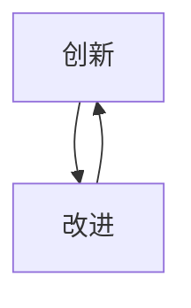
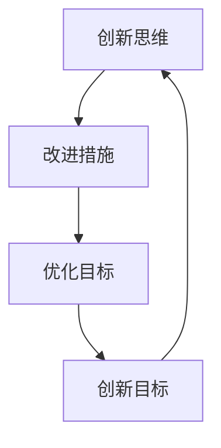
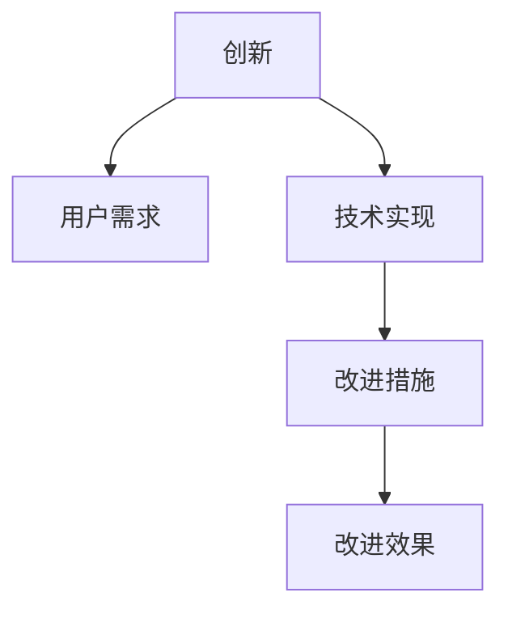
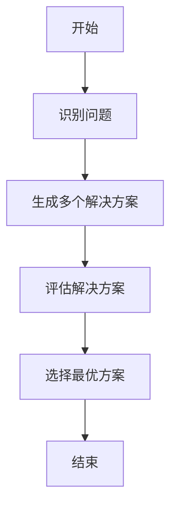
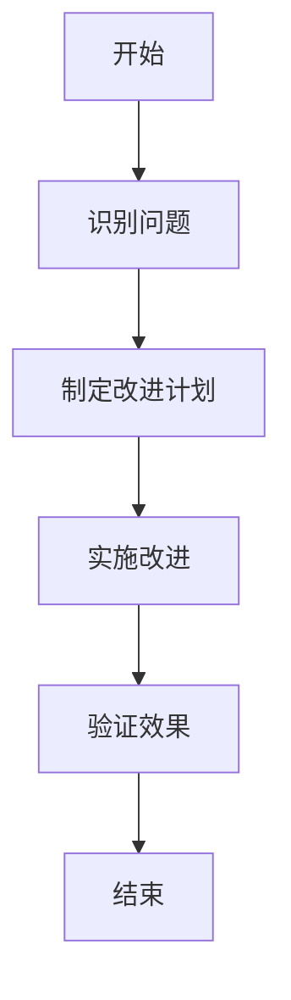
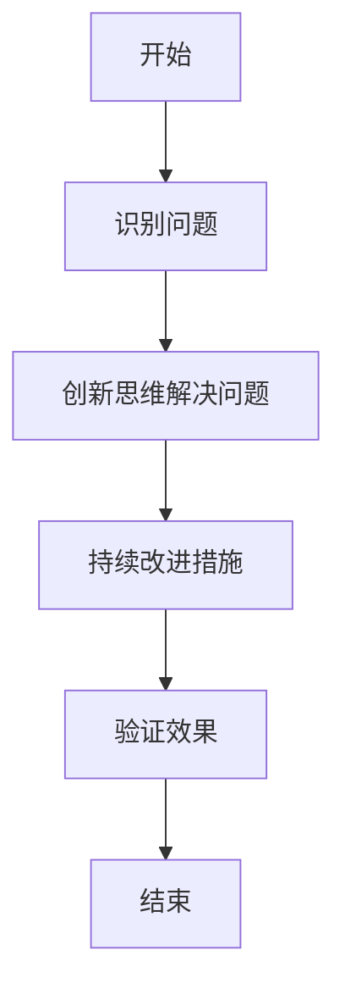
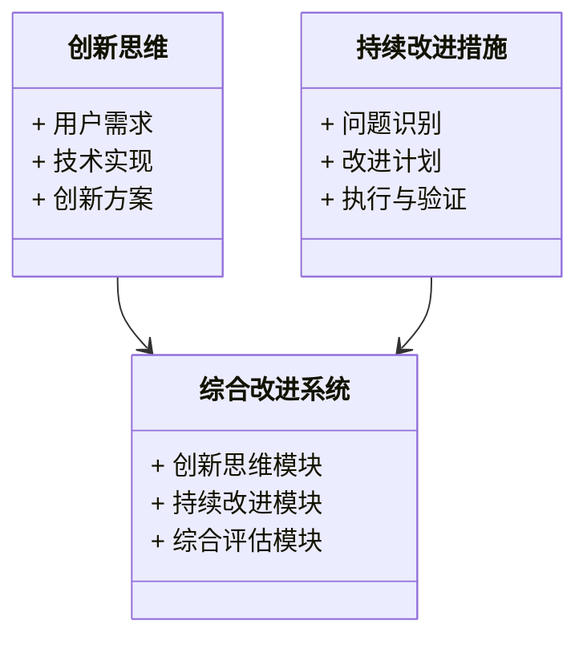
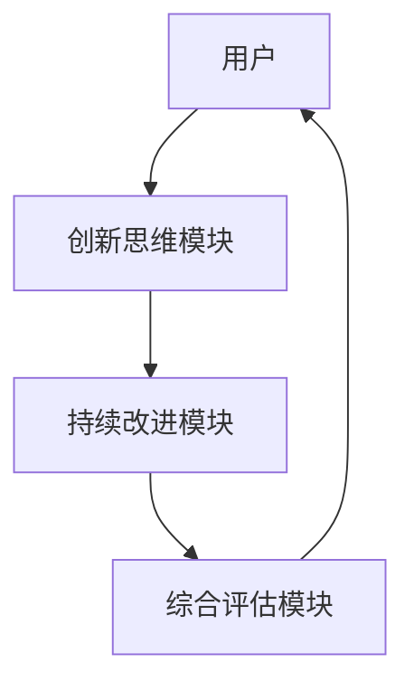
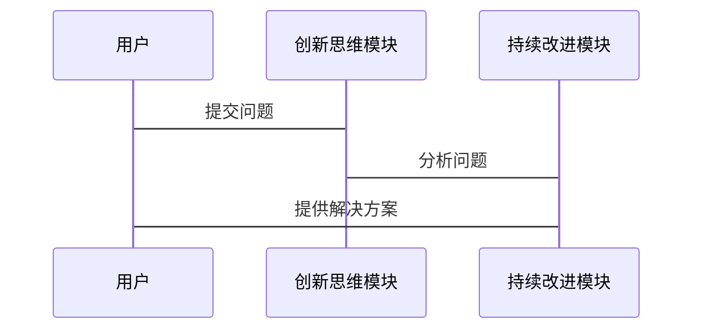

                 


# 创新与持续改进

> 关键词：创新，持续改进，系统架构，算法模型，项目实战，系统分析

> 摘要：本文深入探讨了创新与持续改进的核心概念、算法原理、系统架构和项目实战。通过系统化的分析和实际案例，本文展示了如何将创新思维与持续改进方法相结合，以推动组织和个人的高效发展。文章从理论到实践，结合丰富的图表和数学模型，全面解析了创新与持续改进的关系及其应用。

---

# 创新与持续改进

## 第1章 创新与持续改进的概述

### 1.1 创新与持续改进的核心概念

#### 1.1.1 创新与持续改进的定义

创新是指在现有基础上，通过引入新的思想、方法、技术或模式，创造出具有价值的产品、服务或解决方案的过程。创新的核心在于打破常规，探索未知领域，并通过创造性思维解决问题。

持续改进（Continuous Improvement）是一种通过不断发现问题、分析问题、制定改进措施并实施改进，以优化系统、流程或产品的方法。其核心在于追求卓越，通过小步快跑的方式逐步提升效率和质量。

#### 1.1.2 创新与持续改进的背景与重要性

在当今快速变化的商业环境中，创新是企业保持竞争力的关键。随着技术的进步和市场需求的多样化，组织需要不断调整策略和方法以适应变化。持续改进则为企业提供了优化现有流程、提升效率的框架，从而在竞争中占据优势。

#### 1.1.3 创新与持续改进的边界与外延

创新和持续改进并非孤立的概念，它们需要结合具体的业务场景和组织文化来实施。创新的外延包括产品创新、技术创新、管理创新等，而持续改进的外延则涵盖流程优化、质量提升、成本控制等方面。两者的边界在于创新更注重“打破现状”，而持续改进更注重“优化现状”。

### 1.2 创新与持续改进的核心要素

#### 1.2.1 创新思维与方法

创新思维是创新的核心驱动力。它包括发散思维、批判性思维、联想思维等多种形式。创新方法则包括设计思维（Design Thinking）、六顶思考帽（Six Thinking Hats）等工具和流程。

#### 1.2.2 持续改进的PDCA循环

PDCA（Plan-Do-Check-Act）是持续改进的基本框架。Plan阶段制定计划，Do阶段实施计划，Check阶段验证结果，Act阶段总结经验并持续改进。

#### 1.2.3 创新与持续改进的系统性特征

创新和持续改进都需要系统性的支持。创新需要组织具备开放的文化和灵活的结构，而持续改进则需要数据驱动的分析和系统化的流程优化。

### 1.3 创新与持续改进的关系

#### 1.3.1 创新与持续改进的内在联系

创新是持续改进的动力，而持续改进是创新的保障。创新为改进提供方向和目标，改进为创新提供资源和能力。

#### 1.3.2 创新驱动改进的机制

通过引入新技术和新方法，创新可以打破传统流程的瓶颈，从而推动改进。例如，引入敏捷开发方法可以提高软件开发效率。

#### 1.3.3 改进促进创新的路径

持续改进的过程可以帮助组织发现问题并提出创新解决方案。例如，通过分析用户反馈，可以发现新的市场需求并开发创新产品。

### 1.4 本章小结

本章通过定义创新与持续改进，分析它们的核心要素和内在联系，为后续章节的深入探讨奠定了基础。

---

## 第2章 创新与持续改进的核心原理

### 2.1 创新思维的原理

#### 2.1.1 创新思维的定义与特征

创新思维是一种以打破常规、探索新方法为特点的思维方式。它强调创造性解决问题，而非简单的线性思考。

#### 2.1.2 创新思维的分类与应用

创新思维可以分为发散思维、收敛思维、逆向思维等多种形式。例如，发散思维常用于头脑风暴，而逆向思维则常用于寻找替代解决方案。

#### 2.1.3 创新思维的数学模型

创新思维的强度可以通过以下公式表示：
$$
创新思维强度 = f(知识储备, 创新意识, 创新能力)
$$

### 2.2 持续改进的原理

#### 2.2.1 持续改进的定义与特征

持续改进是一种以数据驱动的优化方法，强调通过小步快跑的方式逐步提升效率和质量。

#### 2.2.2 持续改进的分类与应用

持续改进可以分为全面质量管理（TQM）、精益生产（Lean）等具体方法。例如，精益生产强调消除浪费，提高生产效率。

#### 2.2.3 持续改进的数学模型

持续改进的效果可以通过以下公式表示：
$$
改进效果 = f(问题识别, 改进措施, 执行与验证)
$$

### 2.3 创新与持续改进的关系模型

#### 2.3.1 创新与持续改进的关系图

以下是一个创新与持续改进关系的概念图：



#### 2.3.2 创新与持续改进的系统架构图

以下是创新与持续改进的系统架构图：



#### 2.3.3 创新与持续改进的ER实体关系图

以下是创新与持续改进的ER实体关系图：



### 2.4 本章小结

本章通过分析创新和持续改进的原理及其关系模型，为后续章节的算法设计和系统分析提供了理论基础。

---

## 第3章 创新与持续改进的算法原理

### 3.1 创新思维的算法模型

#### 3.1.1 创新思维的算法流程图

以下是创新思维的算法流程图：



#### 3.1.2 创新思维的数学模型

创新思维的强度可以通过以下公式表示：
$$
创新思维强度 = \alpha \times 知识储备 + \beta \times 创新意识 + \gamma \times 创新能力
$$
其中，$\alpha + \beta + \gamma = 1$。

### 3.2 持续改进的算法模型

#### 3.2.1 持续改进的算法流程图

以下是持续改进的算法流程图：



#### 3.2.2 持续改进的数学模型

持续改进的效果可以通过以下公式表示：
$$
改进效果 = \delta \times 问题识别 + \epsilon \times 改进措施 + \zeta \times 执行与验证
$$
其中，$\delta + \epsilon + \zeta = 1$。

### 3.3 创新与持续改进的联合算法模型

#### 3.3.1 联合算法流程图

以下是创新与持续改进的联合算法流程图：



#### 3.3.2 联合算法的数学模型

综合创新改进效果可以通过以下公式表示：
$$
综合创新改进效果 = \alpha \times 创新思维 + \beta \times 持续改进措施 + \gamma \times 执行与验证
$$
其中，$\alpha + \beta + \gamma = 1$。

### 3.4 本章小结

本章通过算法模型展示了创新与持续改进的内在联系，为后续章节的系统分析提供了理论依据。

---

## 第4章 创新与持续改进的系统分析与架构设计

### 4.1 创新与持续改进的系统分析

#### 4.1.1 问题场景介绍

假设我们正在为一家软件公司设计一个创新与持续改进的系统，以优化其软件开发流程。

#### 4.1.2 系统功能设计

以下是系统功能设计的类图：



#### 4.1.3 系统架构设计

以下是系统架构设计的架构图：



#### 4.1.4 系统接口设计

系统接口设计包括用户与系统的交互接口、创新思维模块与持续改进模块的接口，以及系统与外部数据源的接口。

#### 4.1.5 系统交互设计

以下是系统交互的序列图：



### 4.2 创新与持续改进的项目实战

#### 4.2.1 项目介绍

假设我们正在开发一个智能客服系统，目标是通过创新和持续改进优化客服流程。

#### 4.2.2 环境安装

需要安装Python、Java、数据库和相关开发工具。

#### 4.2.3 核心实现源代码

以下是系统的核心代码片段：

```python
def innovate(problem):
    return innovative_solution

def improve(solution):
    return optimized_solution

# 示例调用
problem = "用户反馈延迟"
solution = innovate(problem)
optimized_solution = improve(solution)
print("最终解决方案:", optimized_solution)
```

#### 4.2.4 代码应用解读与分析

代码片段展示了创新和持续改进的过程：首先通过创新思维解决问题，然后通过持续改进优化解决方案。

#### 4.2.5 案例分析

通过分析用户反馈，我们发现客服响应时间过长。通过创新思维提出了引入智能聊天机器人，然后通过持续改进优化了机器人的响应速度和准确性。

#### 4.2.6 项目小结

本项目展示了如何将创新与持续改进应用于实际场景，通过系统化的分析和优化，显著提升了客服效率。

### 4.3 本章小结

本章通过系统分析和项目实战，展示了如何将创新与持续改进应用于实际系统设计和优化中。

---

## 附录

### 附录A 创新与持续改进的工具清单

1. 创新工具：
   - 头脑风暴（Brainstorming）
   - 六顶思考帽（Six Thinking Hats）
   - 设计思维（Design Thinking）

2. 持续改进工具：
   - PDCA循环
   - 精益生产（Lean）
   - 敏捷开发（Agile）

### 附录B 创新与持续改进的数学模型

创新与持续改进的综合改进效果模型：
$$
综合改进效果 = \alpha \times 创新思维 + \beta \times 持续改进措施 + \gamma \times 执行与验证
$$

### 附录C 参考文献

1. 禅与计算机程序设计艺术
2. 《创新管理》
3. 《持续改进指南》

---

## 作者

作者：AI天才研究院/AI Genius Institute & 禅与计算机程序设计艺术 /Zen And The Art of Computer Programming

---

通过本文的系统化分析和实际案例，我们展示了创新与持续改进的核心概念、算法原理、系统架构和项目实战。创新与持续改进不仅是理论上的重要概念，更是实践中的关键方法。通过不断学习和应用这些方法，我们可以更好地推动组织和个人的高效发展。

---

