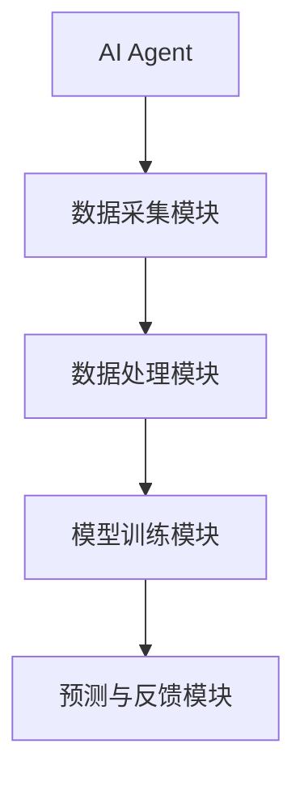
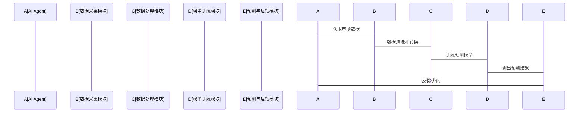

                 


# 利用AI agents构建动态市场份额预测模型：把握竞争态势

## 关键词：AI agents，市场份额预测，动态预测，竞争态势，机器学习，商业分析

## 摘要：  
本文将深入探讨如何利用AI agents构建动态市场份额预测模型，帮助企业在复杂多变的市场竞争中把握态势。通过分析AI agents的核心原理、动态市场份额预测的模型框架，以及实际项目中的系统架构设计，本文将为企业提供一套高效、可扩展的解决方案。同时，本文还将结合实际案例，详细讲解从数据准备、模型训练到结果分析的完整流程，帮助读者掌握如何利用AI技术提升商业决策能力。

---

# 第一部分: 利用AI agents构建动态市场份额预测模型概述

## 第1章: AI agents与市场份额预测概述

### 1.1 AI agents的基本概念

#### 1.1.1 AI agents的定义与分类  
AI agents（智能代理）是指能够感知环境、自主决策并执行任务的智能实体。根据功能和复杂度，AI agents可以分为简单反射型、基于模型的反射型、目标驱动型和效用驱动型四类。  

#### 1.1.2 AI agents的核心特征  
- **自主性**：能够在没有外部干预的情况下自主运行。  
- **反应性**：能够实时感知环境并做出响应。  
- **目标导向性**：通过设定目标来指导行为和决策。  
- **学习能力**：能够通过数据和经验不断优化自身性能。  

#### 1.1.3 AI agents在商业分析中的应用  
AI agents在商业分析中的应用广泛，包括市场趋势分析、竞争对手监测、客户行为预测等领域。特别是在市场份额预测中，AI agents能够实时捕捉市场动态，提供精准的预测结果。

---

### 1.2 动态市场份额预测的背景与意义

#### 1.2.1 市场竞争的动态性  
市场份额是一个动态变化的变量，受到市场环境、消费者偏好、竞争策略等多种因素的影响。传统的静态预测方法难以适应这种变化，因此需要一种动态预测模型。

#### 1.2.2 传统市场份额预测的局限性  
- **数据依赖性**：传统方法通常基于历史数据，难以捕捉实时变化。  
- **模型固定性**：传统模型假设市场环境稳定，无法应对突发性变化。  
- **计算复杂性**：传统方法需要大量人工干预，计算效率较低。  

#### 1.2.3 利用AI agents的优势  
AI agents能够实时采集和处理数据，快速适应市场变化，提供实时预测结果。通过机器学习和自然语言处理技术，AI agents可以更准确地捕捉市场动态，优化预测模型。

---

### 1.3 本书的核心目标与结构

#### 1.3.1 本书的目标  
本文旨在通过AI agents构建一个动态的市场份额预测模型，帮助企业实时监测市场变化，优化竞争策略。

#### 1.3.2 本书的结构安排  
本文将从AI agents的基本概念出发，逐步讲解动态市场份额预测的模型构建、算法实现和系统设计，并结合实际案例进行详细分析。

#### 1.3.3 预备知识与读者基础  
读者需要具备基本的编程知识和对机器学习的了解，熟悉Python和相关数据分析工具。

---

## 第2章: AI agents与市场份额预测的核心概念

### 2.1 AI agents的原理与工作流程

#### 2.1.1 AI agents的基本原理  
AI agents通过感知环境、分析数据、制定策略并执行操作来完成任务。其核心是通过机器学习算法不断优化自身的预测能力和决策能力。

#### 2.1.2 AI agents的工作流程  
1. 数据采集：通过API或爬虫获取市场数据。  
2. 数据处理：清洗、转换和特征提取。  
3. 模型训练：利用机器学习算法训练预测模型。  
4. 预测与反馈：根据实时数据进行预测，并根据反馈结果优化模型。

#### 2.1.3 AI agents的输入与输出  
- **输入**：市场数据、竞争对手信息、客户行为数据等。  
- **输出**：市场份额预测结果、竞争策略建议等。

---

### 2.2 动态市场份额预测的模型框架

#### 2.2.1 动态市场份额预测的定义  
动态市场份额预测是指基于实时数据，预测未来一段时间内市场份额的变化趋势。

#### 2.2.2 动态市场份额预测的关键要素  
- **时间维度**：预测的时间跨度和频率。  
- **市场数据**：包括销售额、市场份额、竞争对手数据等。  
- **预测模型**：包括回归模型、时间序列模型等。  

#### 2.2.3 动态市场份额预测的模型框架  
动态市场份额预测模型通常包括数据预处理、特征提取、模型训练和结果分析四个阶段。

---

### 2.3 AI agents与动态市场份额预测的结合

#### 2.3.1 AI agents在动态预测中的作用  
AI agents能够实时采集市场数据，快速更新预测模型，提供实时预测结果。

#### 2.3.2 动态市场份额预测的实现流程  
1. 数据采集：实时采集市场数据。  
2. 数据处理：清洗和转换数据。  
3. 模型训练：利用机器学习算法训练预测模型。  
4. 预测与反馈：输出预测结果，并根据反馈优化模型。

#### 2.3.3 AI agents与动态预测的交互机制  
AI agents通过API或事件驱动的方式，实时接收市场数据，更新预测模型，并输出预测结果。

---

## 第3章: AI agents与动态市场份额预测的核心概念对比

### 3.1 AI agents的核心属性对比

#### 3.1.1 不同AI agents的对比分析  
通过对比不同类型的AI agents，分析它们在动态市场份额预测中的适用性和优缺点。

#### 3.1.2 AI agents与传统算法的对比  
从计算效率、适应性和可解释性三个方面，对比AI agents与传统算法的优劣。

#### 3.1.3 AI agents的分类与应用场景  
根据功能和复杂度，将AI agents分为四类，并分析它们在市场份额预测中的应用场景。

---

## 第4章: AI agents与动态市场份额预测的实现

### 4.1 AI agents的实现框架

#### 4.1.1 AI agents的组成模块  
AI agents通常包括感知模块、决策模块和执行模块三个部分。

#### 4.1.2 动态市场份额预测的实现步骤  
1. 数据采集：通过API获取市场数据。  
2. 数据处理：清洗和转换数据。  
3. 模型训练：利用机器学习算法训练预测模型。  
4. 预测与反馈：输出预测结果，并根据反馈优化模型。

---

### 4.2 动态市场份额预测的算法实现

#### 4.2.1 算法选择与实现步骤  
选择合适的机器学习算法（如线性回归、随机森林等），并详细讲解实现步骤。

#### 4.2.2 算法实现的代码示例  
```python
import pandas as pd
from sklearn.linear_model import LinearRegression
from sklearn.metrics import mean_squared_error

# 数据加载
data = pd.read_csv('market_share.csv')

# 特征提取
X = data[['feature1', 'feature2']]
y = data['market_share']

# 模型训练
model = LinearRegression()
model.fit(X, y)

# 预测与评估
y_pred = model.predict(X)
print('均方误差:', mean_squared_error(y, y_pred))
```

#### 4.2.3 算法原理的数学模型  
动态市场份额预测的数学模型可以表示为：  
$$ y = \beta_0 + \beta_1x_1 + \beta_2x_2 + \epsilon $$  
其中，$y$是市场份额，$x_1$和$x_2$是影响市场份额的两个特征，$\beta_0$、$\beta_1$和$\beta_2$是回归系数，$\epsilon$是误差项。

---

## 第5章: 系统架构设计与实现

### 5.1 系统架构设计

#### 5.1.1 问题场景介绍  
本系统旨在通过AI agents实时预测市场份额，帮助企业优化竞争策略。

#### 5.1.2 系统功能设计  
- 数据采集模块：实时采集市场数据。  
- 数据处理模块：清洗和转换数据。  
- 模型训练模块：训练预测模型。  
- 预测与反馈模块：输出预测结果，并根据反馈优化模型。

#### 5.1.3 系统架构图  


---

### 5.2 系统接口设计

#### 5.2.1 数据接口设计  
- 数据输入接口：接收市场数据。  
- 数据输出接口：输出预测结果。

#### 5.2.2 模型接口设计  
- 模型训练接口：训练预测模型。  
- 模型预测接口：输出预测结果。

---

### 5.3 系统交互流程

#### 5.3.1 交互流程图  


---

## 第6章: 项目实战与案例分析

### 6.1 项目实战

#### 6.1.1 环境安装与配置  
安装必要的Python库，如pandas、numpy、scikit-learn等。

#### 6.1.2 系统核心实现代码  
```python
import pandas as pd
from sklearn.ensemble import RandomForestRegressor
from sklearn.metrics import mean_absolute_error

# 数据加载
data = pd.read_csv('market_share.csv')

# 特征提取
X = data[['feature1', 'feature2']]
y = data['market_share']

# 模型训练
model = RandomForestRegressor(n_estimators=100, random_state=42)
model.fit(X, y)

# 预测与评估
y_pred = model.predict(X)
print('平均绝对误差:', mean_absolute_error(y, y_pred))
```

#### 6.1.3 代码解读与分析  
详细解读代码实现，包括数据加载、特征提取、模型训练和结果评估。

---

### 6.2 案例分析

#### 6.2.1 实际案例分析  
以某行业的市场份额预测为例，详细分析数据准备、模型训练和结果解读的过程。

#### 6.2.2 案例结果与总结  
总结案例分析的结果，提出改进建议。

---

## 第7章: 高级话题与未来展望

### 7.1 模型优化与可解释性

#### 7.1.1 模型优化策略  
通过超参数调优和特征选择优化模型性能。

#### 7.1.2 可解释性分析  
利用SHAP值等方法，分析模型的可解释性。

---

### 7.2 未来展望

#### 7.2.1 新技术与新趋势  
探讨AI agents与动态市场份额预测领域的未来发展趋势。

#### 7.2.2 挑战与机遇  
分析当前技术面临的挑战和未来可能的机遇。

---

## 第8章: 总结与展望

### 8.1 总结  
本文详细介绍了利用AI agents构建动态市场份额预测模型的方法和实现过程，为企业提供了高效的解决方案。

### 8.2 展望  
未来，随着AI技术的不断发展，动态市场份额预测模型将更加智能化和精准化，为企业竞争提供更强有力的支持。

---

## 作者：AI天才研究院 & 禅与计算机程序设计艺术

--- 

以上是文章的完整目录大纲和部分正文内容，您可以根据实际需要进行调整和补充。

