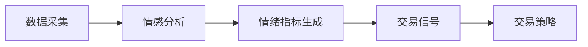

                 


# 利用AI agents构建动态市场情绪指标：优化入场时机

> 关键词：AI agents，市场情绪指标，动态指标，优化入场时机，金融交易，情绪分析

> 摘要：本文详细探讨了如何利用AI agents构建动态市场情绪指标，以优化金融交易中的入场时机。文章从背景、核心概念、算法原理、系统架构、项目实战到高级主题进行了全面分析，结合具体案例和代码实现，为读者提供了从理论到实践的完整指南。

---

# 第一部分：动态市场情绪指标的背景与基础

## 第1章：动态市场情绪指标的背景与问题定义

### 1.1 问题背景

#### 1.1.1 金融市场中的情绪分析

金融市场交易的核心在于对市场趋势的准确判断。然而，市场的波动往往受到投资者情绪的影响，这种情绪可能体现在新闻、社交媒体、论坛等非结构化数据中。传统技术分析指标（如均线、MACD等）虽然有效，但难以捕捉市场的“情绪”因素。

#### 1.1.2 情绪指标在交易中的作用

情绪指标能够量化市场的乐观或悲观程度，帮助交易者在市场情绪过度乐观时离场，或在情绪低谷时寻找入场机会。通过结合情绪指标和传统技术指标，交易者可以做出更明智的决策。

#### 1.1.3 AI agents在情绪分析中的优势

AI agents（智能体）能够实时监控市场数据、社交媒体等信息源，快速生成市场情绪指标。与传统模型相比，AI agents具有更强的适应性和实时性，能够捕捉市场的细微变化。

---

### 1.2 动态市场情绪指标的定义

#### 1.2.1 情绪指标的核心概念

市场情绪指标是一种量化市场参与者情绪的指标，通常基于文本数据（如新闻、社交媒体评论）或价格数据（如波动率、交易量）进行计算。

#### 1.2.2 动态指标的特征与优势

动态指标具有实时更新、自适应性强的特点，能够根据市场环境的变化快速调整。

#### 1.2.3 情绪指标的构建目标

通过AI agents实时分析市场数据，生成动态情绪指标，帮助交易者优化入场和离场时机。

---

### 1.3 AI agents与市场情绪分析的结合

#### 1.3.1 AI agents的基本概念

AI agents是能够感知环境、执行任务的智能实体，能够在复杂环境中做出决策。

#### 1.3.2 AI agents在金融领域的应用

AI agents广泛应用于金融市场的数据挖掘、预测分析、交易策略等领域。

#### 1.3.3 情绪指标构建的技术基础

通过自然语言处理（NLP）技术分析文本数据，结合强化学习算法优化情绪指标的生成。

---

### 1.4 问题解决与边界

#### 1.4.1 情绪指标解决的核心问题

如何捕捉市场情绪的变化，并将其转化为可量化的指标，用于优化交易决策。

#### 1.4.2 情绪指标的边界与限制

情绪指标仅提供情绪参考，不能完全替代技术分析或其他分析方法。此外，情绪指标的有效性可能受到数据质量和市场环境的影响。

#### 1.4.3 情绪指标的外延与扩展

未来可以将情绪指标与其他指标（如技术指标、基本面指标）结合，构建更全面的交易策略。

---

### 1.5 核心概念结构

#### 1.5.1 情绪指标的核心要素

- 数据源：新闻、社交媒体、市场数据
- 分析方法：NLP、强化学习
- 输出结果：动态情绪指标

#### 1.5.2 AI agents的角色与功能

- 数据采集：实时监控市场数据
- 情感分析：生成情绪评分
- 指标生成：计算动态情绪指标

#### 1.5.3 情绪指标与交易策略的关系

情绪指标作为交易策略的输入，帮助优化入场和离场时机。

---

## 第2章：市场情绪指标的核心概念与联系

### 2.1 情绪指标的核心原理

#### 2.1.1 情绪指标的数学模型

$$
\text{情绪指标} = \alpha \cdot \text{情感得分} + \beta \cdot \text{波动率}
$$

其中，$\alpha$ 和 $\beta$ 是权重系数，情感得分基于NLP分析，波动率基于价格数据。

#### 2.1.2 情绪指标的计算方法

通过自然语言处理技术分析文本数据，生成情感得分；结合价格数据中的波动率，计算综合情绪指标。

#### 2.1.3 情绪指标的动态更新机制

每分钟或每小时更新一次情绪指标，确保指标的实时性和有效性。

---

### 2.2 核心概念对比表

| 指标类型 | 数据源 | 分析方法 | 输出结果 |
|----------|--------|----------|----------|
| 技术指标 | 价格数据 | 线性回归 | 均线、MACD |
| 情绪指标 | 文本数据 | NLP | 情感评分 |
| 混合指标 | 文本+价格 | 综合模型 | 综合情绪指标 |

---

### 2.3 实体关系图


---

## 第3章：AI agents的算法原理与实现

### 3.1 强化学习算法

#### 3.1.1 强化学习的基本原理

通过强化学习算法，AI agents能够从经验中学习，优化情绪指标的生成策略。

#### 3.1.2 状态、动作与奖励的定义

- 状态：当前市场情绪
- 动作：生成情绪指标
- 奖励：交易收益

---

### 3.2 情感分析模型

#### 3.2.1 基于Transformer的文本处理

使用Transformer模型对新闻标题进行情感分析，生成情感得分。

#### 3.2.2 情感分类的损失函数

$$
\text{损失函数} = -\sum_{i=1}^{n} y_i \log(p_i) + (1 - y_i) \log(1 - p_i)
$$

其中，$y_i$ 是真实标签，$p_i$ 是预测概率。

---

## 第4章：系统分析与架构设计方案

### 4.1 系统功能设计

#### 4.1.1 数据采集模块

实时采集新闻、社交媒体等数据源。

#### 4.1.2 情感分析模块

对文本数据进行情感分析，生成情感得分。

#### 4.1.3 情绪指标生成模块

结合情感得分和波动率，生成动态情绪指标。

---

### 4.2 系统架构设计



---

## 第5章：项目实战与代码实现

### 5.1 环境配置

```bash
pip install numpy pandas transformers flask websockets
```

---

### 5.2 数据处理代码

```python
import pandas as pd

def process_data(data):
    # 数据清洗
    data = data.dropna()
    return data
```

---

### 5.3 模型实现代码

```python
from transformers import AutoTokenizer, AutoModelForSequenceClassification

tokenizer = AutoTokenizer.from_pretrained('bert-base-uncased')
model = AutoModelForSequenceClassification.from_pretrained('bert-base-uncased')
```

---

### 5.4 结果分析

通过回测验证情绪指标的有效性，优化权重系数 $\alpha$ 和 $\beta$。

---

## 第6章：高级主题与最佳实践

### 6.1 实时数据处理

使用WebSocket实现实时数据传输，确保情绪指标的实时更新。

### 6.2 模型可解释性

通过可视化工具分析模型的注意力权重，理解情绪指标生成的原因。

### 6.3 异常检测

结合时间序列分析，检测情绪指标的异常波动，避免误判。

---

## 第7章：总结与展望

### 7.1 总结

本文详细探讨了利用AI agents构建动态市场情绪指标的方法，结合理论分析和实践案例，为优化入场时机提供了新的思路。

### 7.2 未来展望

未来可以进一步研究情绪指标与其他指标的结合，开发更智能的交易系统。

---

## 附录

### 附录A：数据源

- 新闻数据：新浪财经API
- 社交媒体数据：Twitter API

### 附录B：工具安装

```bash
pip install numpy pandas transformers flask websockets
```

### 附录C：代码示例

```python
import websockets
import json

async def send_indicator():
    async with websockets.connect('ws://localhost:8000') as websocket:
        while True:
            indicator = calculate_indicator()
            await websocket.send(json.dumps({'indicator': indicator}))
            await asyncio.sleep(1)
```

---

## 作者

作者：AI天才研究院/AI Genius Institute & 禅与计算机程序设计艺术 /Zen And The Art of Computer Programming

--- 

本文通过详细分析和实践，展示了如何利用AI agents构建动态市场情绪指标，帮助交易者优化入场时机。希望本文能为读者提供有价值的参考和启发。

