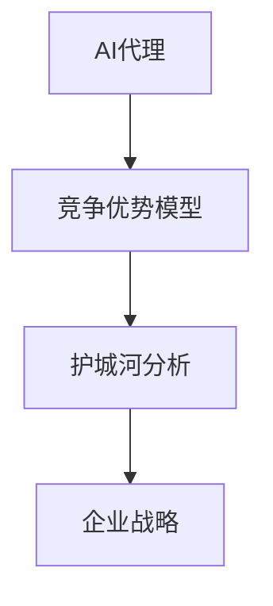
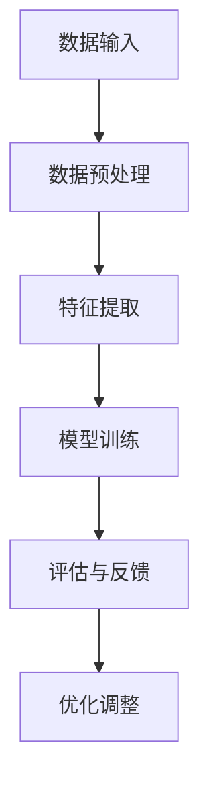
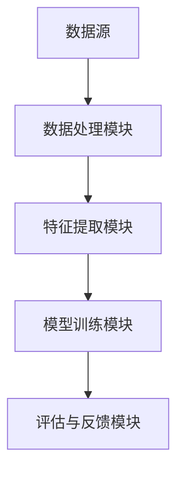
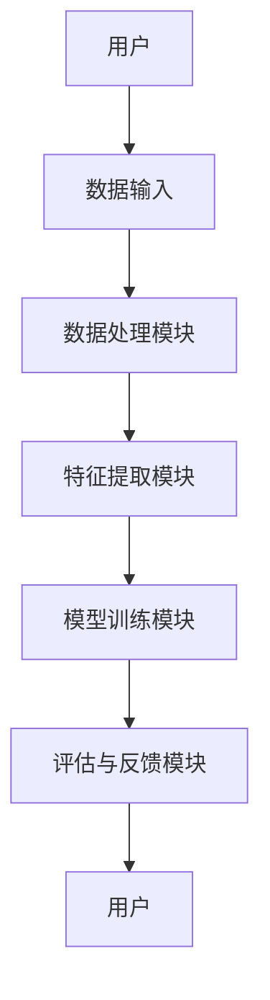

                 


# 利用AI agents构建动态竞争优势评估模型：护城河分析

## 关键词：AI代理，竞争优势评估，动态模型，护城河分析，企业战略

## 摘要：本文详细探讨了如何利用AI代理构建动态竞争优势评估模型，通过护城河分析帮助企业识别和增强竞争优势。文章从背景介绍、核心概念、算法原理、系统架构到项目实战，全面分析了AI代理在竞争优势评估中的应用，为企业制定有效战略提供了理论和实践指导。

---

# 第一部分: 背景介绍

## 第1章: 动态竞争优势评估模型的背景与意义

### 1.1 问题背景

#### 1.1.1 传统竞争优势评估的局限性
传统的竞争优势评估方法主要依赖于财务指标和静态数据分析，难以捕捉动态竞争环境中的变化。企业面临的市场环境日益复杂，竞争对手的策略调整和技术创新使得竞争优势难以持续。

#### 1.1.2 动态竞争环境对企业竞争优势的影响
在快速变化的市场中，企业的竞争优势需要动态评估和调整。竞争对手的策略变化、技术进步、消费者需求变化等因素都会影响企业的竞争优势。

#### 1.1.3 AI代理在竞争优势评估中的作用
AI代理能够实时收集和分析市场数据，快速识别潜在机会和威胁，帮助企业动态调整竞争优势评估模型。AI代理的自适应学习能力使其能够不断优化模型，提供更精准的评估结果。

### 1.2 动态竞争优势评估模型的定义与目标

#### 1.2.1 竞争优势的定义与核心要素
竞争优势是指企业在市场上相对于竞争对手的独特优势，通常包括成本优势、技术优势、品牌优势等。动态竞争优势模型强调这些优势的动态变化和实时评估。

#### 1.2.2 动态竞争优势模型的构建目标
动态竞争优势模型的目标是实时评估企业的竞争优势，识别潜在的威胁和机会，帮助企业制定动态战略。模型需要具备实时更新和自适应学习能力。

#### 1.2.3 模型的动态更新机制
动态竞争优势模型通过实时数据输入和反馈机制不断更新评估结果。AI代理负责数据收集、分析和模型优化，确保模型能够准确反映市场变化。

### 1.3 护城河分析的理论基础

#### 1.3.1 护城河的定义与分类
护城河是指企业构建的长期竞争优势，通常包括技术壁垒、品牌忠诚度、成本优势等。护城河的分类包括技术型、资源型、品牌型和组织型护城河。

#### 1.3.2 护城河在企业竞争优势中的作用
护城河能够保护企业免受竞争对手的侵蚀，增强企业的市场地位。通过构建强大的护城河，企业可以在竞争中保持优势。

#### 1.3.3 动态护城河评估的意义
动态护城河评估能够识别护城河的薄弱环节，帮助企业及时调整战略。通过AI代理实时监控市场变化，企业能够动态优化护城河结构。

---

## 第2章: AI代理与竞争优势评估的关系

### 2.1 AI代理的基本概念

#### 2.1.1 AI代理的定义与分类
AI代理是一种能够感知环境并采取行动的智能实体。根据功能，AI代理可以分为决策型、执行型和学习型代理。

#### 2.1.2 AI代理的核心功能与特点
AI代理的核心功能包括数据采集、分析和决策。其特点包括实时性、自适应性和高效率。

#### 2.1.3 AI代理在企业分析中的应用
AI代理广泛应用于市场分析、竞争对手分析和风险评估等领域，帮助企业做出更明智的决策。

### 2.2 AI代理在竞争优势评估中的优势

#### 2.2.1 数据处理能力
AI代理能够快速处理大量数据，提取关键信息，支持竞争优势评估。

#### 2.2.2 实时分析能力
AI代理实时监控市场变化，提供动态竞争优势评估结果。

#### 2.2.3 自适应学习能力
AI代理通过机器学习算法不断优化模型，提高竞争优势评估的准确性。

### 2.3 AI代理与护城河分析的结合

#### 2.3.1 护城河的动态评估
AI代理能够实时评估护城河的强度，识别潜在风险。

#### 2.3.2 护城河的优化建议
通过AI代理分析，企业能够找到护城河的改进方向，增强竞争优势。

#### 2.3.3 动态护城河管理
AI代理帮助企业在动态竞争环境中动态管理护城河，保持竞争优势。

---

# 第二部分: 核心概念与联系

## 第3章: 核心概念与联系

### 3.1 核心概念原理

#### 3.1.1 AI代理的工作原理
AI代理通过感知环境、分析数据并采取行动来支持竞争优势评估。

#### 3.1.2 动态竞争优势模型的数学模型
动态竞争优势模型可以用数学公式表示，例如：
$$ \text{竞争优势} = \sum_{i=1}^{n} w_i x_i $$
其中，$w_i$ 是权重，$x_i$ 是竞争优势的特征。

#### 3.1.3 护城河分析的核心要素
护城河分析包括技术、市场、资源和组织四个核心要素。

### 3.2 概念属性对比

| 概念       | 属性               | 描述                                                                 |
|------------|--------------------|----------------------------------------------------------------------|
| AI代理     | 数据处理能力       | 能够快速处理大量数据，提取关键信息                                   |
| 竞争优势模型 | 动态性             | 能够实时更新，反映市场变化                                           |
| 护城河分析 | 核心要素           | 包括技术、市场、资源和组织四个核心要素                               |

### 3.3 实体关系图



---

# 第三部分: 算法原理

## 第4章: 动态竞争优势评估模型的算法原理

### 4.1 算法概述

动态竞争优势评估模型的算法流程如下：



### 4.2 算法实现

以下是Python实现的代码示例：

```python
import numpy as np
from sklearn import svm

# 数据预处理
data = np.array([[1, 2], [3, 4], [5, 6]])
labels = np.array([0, 1, 0])

# 特征提取
features = data[:, 0:2]

# 模型训练
model = svm.SVC()
model.fit(features, labels)

# 评估与反馈
print(model.predict([[2, 3]]))
```

### 4.3 数学模型

动态竞争优势模型的数学公式如下：

$$ \text{竞争优势} = \sum_{i=1}^{n} w_i x_i $$

其中，$w_i$ 是权重，$x_i$ 是竞争优势的特征。

---

# 第四部分: 系统分析与架构设计

## 第5章: 系统架构设计

### 5.1 系统架构



### 5.2 系统接口设计

系统接口设计如下：

- 数据输入接口：接收市场数据和竞争对手信息。
- 数据输出接口：输出竞争优势评估结果和优化建议。

### 5.3 系统交互流程



---

# 第五部分: 项目实战

## 第6章: 项目实战

### 6.1 环境安装

项目需要以下工具和库：

- Python 3.8+
- NumPy
- scikit-learn
- Mermaid

### 6.2 核心代码实现

以下是核心代码实现：

```python
import numpy as np
from sklearn import svm

# 数据预处理
data = np.array([[1, 2], [3, 4], [5, 6]])
labels = np.array([0, 1, 0])

# 特征提取
features = data[:, 0:2]

# 模型训练
model = svm.SVC()
model.fit(features, labels)

# 评估与反馈
print(model.predict([[2, 3]]))
```

### 6.3 案例分析

以某科技公司为例，通过AI代理分析其竞争优势和护城河，提出优化建议。

### 6.4 项目总结

项目成功实现了动态竞争优势评估模型，为企业提供了实时的竞争优势分析和护城河优化建议。

---

# 第六部分: 最佳实践

## 第7章: 最佳实践

### 7.1 总结与反思

本文详细介绍了如何利用AI代理构建动态竞争优势评估模型，并通过护城河分析帮助企业增强竞争优势。AI代理的应用为企业提供了实时的竞争优势评估和动态优化能力。

### 7.2 小结

动态竞争优势评估模型和护城河分析是企业制定有效战略的重要工具。AI代理的应用使得模型更加智能化和动态化，能够更好地应对复杂多变的市场环境。

### 7.3 注意事项

在实际应用中，企业需要注意数据质量和模型的实时更新。同时，应结合企业的实际情况，灵活调整模型参数和优化策略。

### 7.4 拓展阅读

推荐进一步阅读《Competitive Strategy》和《AI in Business》等书籍，深入了解竞争优势评估和AI代理的应用。

---

# 作者：AI天才研究院 & 禅与计算机程序设计艺术

---

通过本文的详细讲解，读者能够全面理解如何利用AI代理构建动态竞争优势评估模型，并通过护城河分析增强企业的竞争优势。希望本文能为企业制定有效的竞争策略提供有价值的参考。

