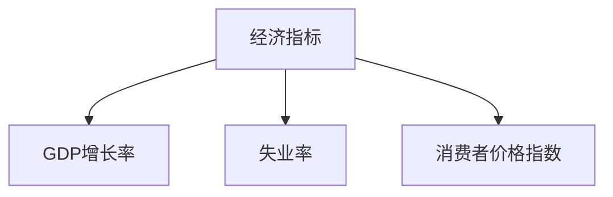
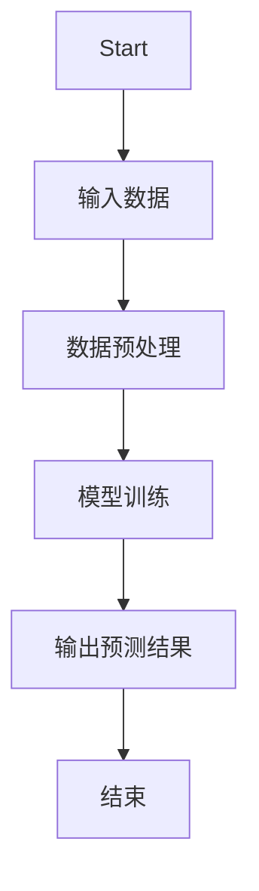
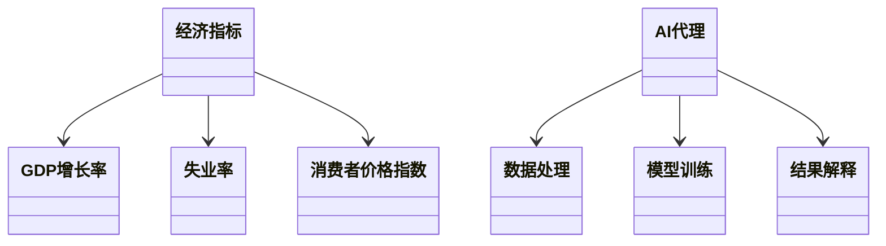
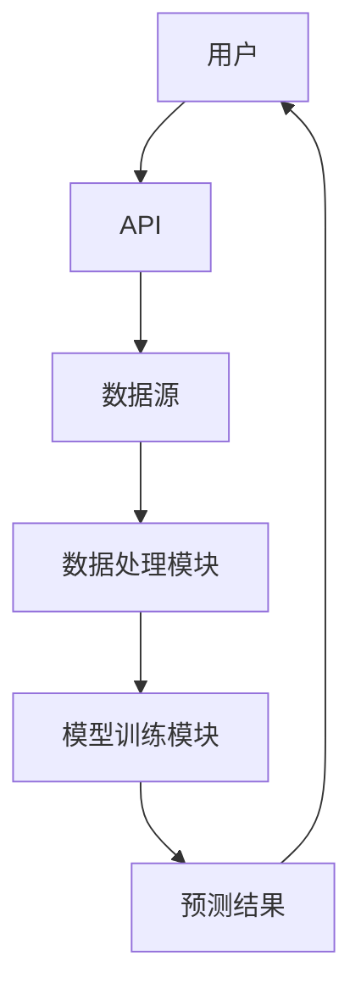
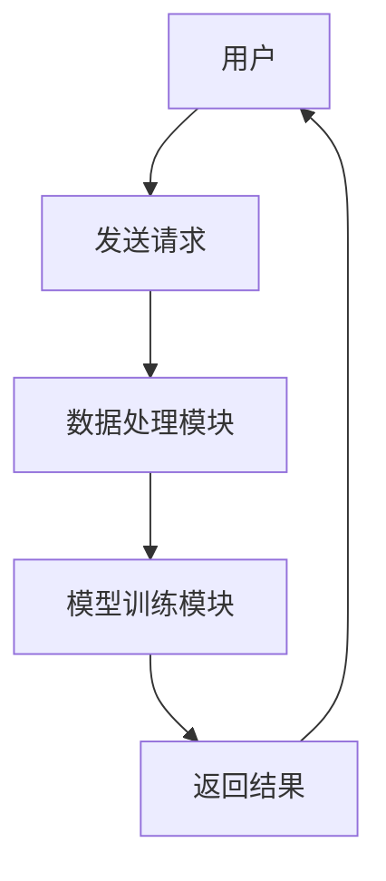

                 


# 利用AI agents构建动态经济周期指标：把握宏观投资时机

> 关键词：AI代理，经济周期，动态指标，投资决策，时间序列分析

> 摘要：本文详细探讨了如何利用AI代理构建动态经济周期指标，以帮助投资者更好地把握宏观投资时机。通过分析经济周期的基本概念、AI代理的核心原理、时间序列分析的算法、系统架构设计以及项目实战，本文为读者提供了从理论到实践的全面指导。

---

# 第1章 经济周期与AI代理概述

## 1.1 经济周期的基本概念

### 1.1.1 经济周期的定义与特征

经济周期是指经济活动在时间上的波动，通常包括复苏、繁荣、衰退和萧条四个阶段。每个阶段的特点不同，对投资决策的影响也各异。

### 1.1.2 经济周期的阶段划分

- **复苏阶段**：经济开始恢复，企业利润逐渐回升。
- **繁荣阶段**：经济增长迅速，市场活跃。
- **衰退阶段**：经济活动下降，企业利润减少。
- **萧条阶段**：经济低迷，失业率上升。

### 1.1.3 经济周期对投资决策的影响

投资者需要根据经济周期的变化调整投资策略。例如，在衰退阶段，可能更适合投资防御性资产；在繁荣阶段，可能更适合投资风险资产。

## 1.2 AI代理的核心概念

### 1.2.1 AI代理的定义与分类

AI代理是一种能够感知环境并采取行动以实现目标的智能实体。根据智能水平，AI代理可以分为反应式代理、基于模型的代理和混合代理。

### 1.2.2 AI代理的基本原理

AI代理通过感知输入数据，利用算法进行处理，并根据结果采取行动。其核心包括数据处理、模型训练和决策制定。

### 1.2.3 AI代理在经济分析中的应用

AI代理可以用于经济预测、投资决策优化和风险评估等领域。

## 1.3 动态经济指标的重要性

### 1.3.1 经济指标的分类与作用

经济指标可以分为先行指标、同步指标和滞后指标。动态经济指标能够实时反映经济变化，帮助投资者及时调整策略。

### 1.3.2 动态经济指标的优势

动态经济指标具有实时性、敏感性和预测性，能够更准确地反映经济趋势。

### 1.3.3 动态经济指标在投资中的应用

投资者可以利用动态经济指标预测市场走势，优化投资组合，并降低风险。

## 1.4 本章小结

本章介绍了经济周期的基本概念、AI代理的核心原理以及动态经济指标的重要性。AI代理能够帮助投资者更准确地预测经济趋势，从而做出更明智的投资决策。

---

# 第2章 AI代理与经济指标的关系

## 2.1 AI代理在经济指标分析中的作用

### 2.1.1 数据处理与特征提取

AI代理能够处理大量经济数据，并提取有用的特征，例如GDP增长率、失业率和消费者价格指数。

### 2.1.2 模型训练与预测

通过训练AI模型，可以预测未来经济指标的变化趋势。

### 2.1.3 结果解释与反馈优化

AI代理可以解释预测结果，并根据反馈不断优化模型。

## 2.2 经济指标的动态性与AI代理的适应性

### 2.2.1 动态经济指标的特性

动态经济指标具有实时性、连续性和复杂性。

### 2.2.2 AI代理的自适应能力

AI代理能够根据环境变化调整自身的算法和参数，以适应动态经济指标的变化。

### 2.2.3 经济指标与AI代理的协同优化

通过协同优化，AI代理可以更准确地预测经济指标，从而提高投资决策的准确性。

## 2.3 核心概念与联系

### 2.3.1 经济指标的实体关系图



### 2.3.2 AI代理的算法流程图



## 2.4 本章小结

本章探讨了AI代理在经济指标分析中的作用，包括数据处理、模型训练和结果解释。同时，分析了动态经济指标与AI代理的协同优化关系。

---

# 第3章 时间序列分析与动态指标预测

## 3.1 时间序列分析的基本原理

### 3.1.1 时间序列的分解

时间序列可以分解为趋势、周期性、季节性和随机性成分。

### 3.1.2 平稳性检验与处理

通过检验数据的平稳性，可以决定是否需要进行差分或其他预处理步骤。

### 3.1.3 时间序列模型的选择

根据数据特征选择合适的模型，如ARIMA、LSTM或Prophet。

## 3.2 常见的时间序列模型

### 3.2.1 ARIMA模型

ARIMA（自回归积分滑动平均模型）适用于线性时间序列数据。

### 3.2.2 LSTM网络

长短期记忆网络适用于非线性时间序列数据。

### 3.2.3 Prophet模型

Prophet模型由Facebook开发，适用于具有明确时间结构的数据。

## 3.3 基于AI代理的时间序列预测

### 3.3.1 LSTM模型的原理

LSTM通过门控机制处理长期依赖关系，能够捕捉时间序列中的复杂模式。

```python
# LSTM模型的代码示例
import keras
from keras.layers import LSTM, Dense
from keras.models import Sequential

model = Sequential()
model.add(LSTM(64, input_shape=(timesteps, features)))
model.add(Dense(1))
model.compile(optimizer='adam', loss='mean_squared_error')
```

### 3.3.2 ARIMA模型的实现

ARIMA模型通过自回归和滑动平均部分拟合数据。

```python
# ARIMA模型的代码示例
from statsmodels.tsa.arima.model import ARIMA

model = ARIMA(data, order=(5,1,0))
model_fit = model.fit()
```

## 3.4 本章小结

本章介绍了时间序列分析的基本原理和常见模型，重点讲解了LSTM和ARIMA模型的原理和实现。AI代理可以通过这些模型进行动态经济指标的预测。

---

# 第4章 系统架构设计与实现

## 4.1 问题场景介绍

投资者需要实时监测经济指标，并根据预测结果调整投资策略。

## 4.2 系统功能设计

### 4.2.1 领域模型



### 4.2.2 系统架构设计



## 4.3 系统接口设计

### 4.3.1 数据接口

定义数据输入和输出的格式，例如使用JSON格式。

### 4.3.2 API接口

提供RESTful API供用户调用模型预测结果。

## 4.4 系统交互设计

### 4.4.1 交互流程图



## 4.5 本章小结

本章设计了系统的架构，包括领域模型、系统架构图和接口设计。通过这些设计，投资者可以方便地调用AI代理进行经济指标预测。

---

# 第5章 项目实战与案例分析

## 5.1 环境安装与配置

### 5.1.1 安装Python

安装Python 3.8以上版本。

### 5.1.2 安装依赖库

安装必要的库，如numpy、pandas、keras和statsmodels。

## 5.2 核心代码实现

### 5.2.1 数据加载与预处理

```python
import pandas as pd
import numpy as np

data = pd.read_csv('economic_indicators.csv')
data = data.dropna()
data = data['GDP增长率']
```

### 5.2.2 模型训练与预测

```python
from keras.models import Sequential
from keras.layers import LSTM, Dense

model = Sequential()
model.add(LSTM(64, input_shape=(timesteps, 1)))
model.add(Dense(1))
model.compile(optimizer='adam', loss='mean_squared_error')

model.fit(X_train, y_train, epochs=100, batch_size=32)
```

### 5.2.3 结果可视化

```python
import matplotlib.pyplot as plt

predicted = model.predict(X_test)
plt.plot(y_test, label='实际值')
plt.plot(predicted, label='预测值')
plt.legend()
plt.show()
```

## 5.3 案例分析与解读

### 5.3.1 案例背景

以GDP增长率预测为例，分析模型的预测效果。

### 5.3.2 数据分析结果

通过训练模型，预测未来几个季度的GDP增长率。

### 5.3.3 投资决策优化

根据预测结果，调整投资组合，例如在预测到经济衰退时增加防御性资产的投资。

## 5.4 本章小结

本章通过实际项目展示了AI代理在动态经济指标预测中的应用，包括环境配置、代码实现和案例分析。

---

# 第6章 最佳实践与小结

## 6.1 最佳实践 tips

- 定期更新模型，以适应经济环境的变化。
- 结合多种模型进行预测，提高准确性。
- 注意数据的质量和来源，确保模型输入的可靠性。

## 6.2 小结

本文详细探讨了利用AI代理构建动态经济指标的方法，从理论到实践，为投资者提供了有效的工具和策略。

## 6.3 注意事项

- 确保数据的实时性和准确性。
- 定期监控模型的性能，并进行优化。
- 风险提示：模型预测结果仅供参考，投资需谨慎。

## 6.4 拓展阅读

建议读者进一步学习时间序列分析、AI代理算法优化和宏观经济分析的相关知识。

---

# 作者

作者：AI天才研究院 & 禅与计算机程序设计艺术

---

通过以上结构和内容，读者可以系统地学习如何利用AI代理构建动态经济周期指标，并在投资决策中应用这些指标来把握宏观投资时机。

