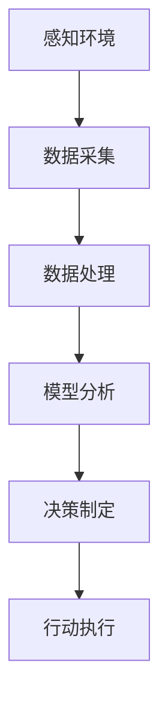
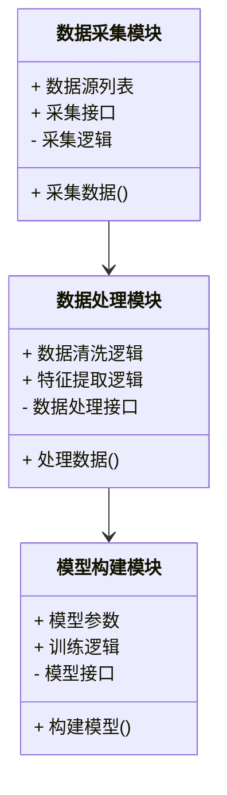
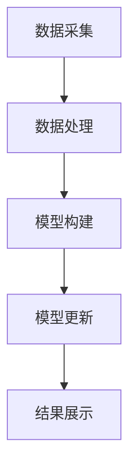

                 


# 利用AI agents构建动态行业生命周期模型：把握产业演变

## 关键词：AI代理，动态行业模型，产业演变，系统架构，数学模型

## 摘要：  
本文详细探讨了利用AI代理构建动态行业生命周期模型的方法，分析了模型的核心概念、算法原理、系统架构，并通过实际案例展示了模型的应用。文章从行业生命周期模型的背景出发，介绍了AI代理在模型中的作用，详细讲解了动态模型的构建过程，包括数据处理、算法实现、系统设计和项目实战。最后，总结了模型的优势和未来发展方向，为企业把握产业演变提供了新的思路。

---

# 第一部分: 背景与核心概念

## 第1章: 行业生命周期模型概述

### 1.1 行业生命周期模型的定义  
行业生命周期模型描述了行业从萌芽到成熟再到衰退的演变过程。模型通过分析行业的关键指标，如市场规模、增长率、竞争格局等，帮助企业预测行业趋势并制定战略。  

### 1.2 动态行业生命周期模型的背景  
- **传统模型的局限性**：传统行业生命周期模型通常是静态的，无法适应市场环境的快速变化。  
- **动态模型的需求**：随着市场竞争加剧和技术进步，行业演变速度加快，动态模型成为必要。  
- **数字化时代的挑战**：数据爆炸和实时分析的需求推动了动态模型的发展。  

### 1.3 AI代理在行业模型中的作用  
- **AI代理的智能性**：AI代理能够实时采集和分析数据，快速调整模型参数。  
- **动态调整能力**：AI代理通过机器学习算法，不断优化模型，使其更准确地反映行业动态。  

### 1.4 构建动态模型的意义  
- **实时性**：动态模型能够及时反映市场变化，帮助企业快速响应。  
- **准确性**：通过AI代理的数据处理能力，模型预测更精准。  
- **竞争力**：企业利用动态模型能够更好地把握行业趋势，制定有效策略。  

---

## 第2章: 动态行业生命周期模型的核心概念

### 2.1 动态模型的结构与特征  
- **动态性分析**：模型能够实时更新，反映行业最新动态。  
- **可扩展性**：模型支持多种数据源和分析方法的集成。  
- **实时更新机制**：通过AI代理实现数据的实时采集和模型的动态调整。  

### 2.2 AI代理与行业数据的关系  
- **数据采集**：AI代理从多个来源（如新闻、市场报告、社交媒体）实时采集行业数据。  
- **数据处理**：通过自然语言处理（NLP）和数据挖掘技术，提取关键指标。  
- **数据驱动的模型更新**：利用机器学习算法，基于新数据不断优化模型参数。  

### 2.3 动态模型与传统模型的对比  
| 特性          | 动态模型               | 传统模型               |
|---------------|-----------------------|-----------------------|
| 数据处理      | 实时采集和分析         | 基于历史数据           |
| 模型更新      | 高频调整               | 低频更新               |
| 预测准确性     | 更高                   | 较低                   |

### 2.4 动态模型的核心要素  
- **代理的智能性**：AI代理能够自主学习和调整模型。  
- **数据的实时性**：模型依赖实时数据进行动态更新。  
- **模型的动态调整能力**：通过反馈机制优化模型预测能力。  

---

# 第二部分: 算法与数学模型

## 第3章: AI代理的原理与实现

### 3.1 AI代理的基本原理  
AI代理通过感知环境、做出决策和执行动作来实现目标。其核心是基于数据的分析和机器学习算法的决策过程。  

#### 代理的决策流程  


### 3.2 AI代理的算法实现  
- **监督学习**：用于分类和回归任务，如行业阶段划分。  
- **无监督学习**：用于聚类分析，如识别行业竞争格局的变化。  

#### 监督学习示例代码  
```python
import numpy as np
from sklearn.linear_model import LinearRegression

# 示例数据：行业市场规模与时间的关系
time = np.array([1, 2, 3, 4, 5])
size = np.array([100, 200, 150, 250, 300])

model = LinearRegression()
model.fit(time.reshape(-1, 1), size)
print(model.predict([[6]]))  # 预测第6个时间点的市场规模
```

### 3.3 代理与行业数据的交互  
- **数据的实时性**：AI代理需要实时采集和处理数据，确保模型的准确性。  
- **数据的多样性**：模型需要整合多种数据源，如市场数据、政策变化等。  

---

## 第4章: 模型构建的算法与数学模型

### 4.1 数据处理与特征提取  
- **数据清洗**：去除噪声数据，确保数据质量。  
- **特征工程**：提取关键特征，如增长率、市场份额等。  

### 4.2 基于机器学习的模型构建  
- **时间序列分析**：使用ARIMA模型预测行业趋势。  
- **深度学习模型**：利用LSTM进行长期依赖建模，捕捉时间序列中的复杂模式。  

#### LSTM模型示例代码  
```python
import keras
from keras.models import Sequential
from keras.layers import LSTM, Dense

# 示例数据：行业生命周期阶段预测
# 输入数据：形状为 (样本数, 时间步, 特征数)
X_train = np.random.rand(100, 5, 4)
y_train = np.random.randint(0, 4, 100)  # 四个阶段

model = Sequential()
model.add(LSTM(64, input_shape=(5, 4)))
model.add(Dense(4, activation='softmax'))  # 四个阶段的输出
model.compile(loss='sparse_categorical_crossentropy', optimizer='adam', metrics=['accuracy'])
model.fit(X_train, y_train, epochs=10, batch_size=32)
```

### 4.3 模型评估与优化  
- **评估指标**：使用准确率、召回率、F1分数等指标评估模型性能。  
- **超参数优化**：通过网格搜索或随机搜索优化模型参数。  

---

# 第三部分: 系统架构设计

## 第5章: 系统架构设计

### 5.1 系统功能设计  
- **数据采集模块**：实时采集行业数据。  
- **模型构建模块**：基于数据构建动态模型。  
- **模型更新模块**：根据新数据更新模型参数。  

#### 系统功能设计类图  


### 5.2 系统架构设计  
- **分层架构**：系统分为数据层、业务逻辑层和表示层。  
- **微服务架构**：各模块独立运行，便于扩展和维护。  

#### 系统架构设计图  


### 5.3 系统接口设计  
- **数据接口**：提供REST API，供其他系统调用数据。  
- **模型接口**：提供预测服务接口，供外部系统查询行业阶段。  

---

## 第6章: 项目实战

### 6.1 环境安装与配置  
- 安装Python、TensorFlow、Keras等依赖库。  

### 6.2 核心代码实现  
```python
# 示例：行业生命周期阶段预测代码
import pandas as pd
from sklearn.preprocessing import LabelEncoder
from sklearn.tree import DecisionTreeClassifier

# 数据加载与预处理
data = pd.read_csv('industry_data.csv')
label_encoder = LabelEncoder()
data['阶段'] = label_encoder.fit_transform(data['阶段'])

# 特征选择与训练
features = data[['市场规模', '增长率', '竞争强度']]
target = data['阶段']

model = DecisionTreeClassifier()
model.fit(features, target)
```

### 6.3 案例分析与结果解读  
- **案例背景**：假设某行业进入成熟期，模型预测其未来趋势。  
- **结果分析**：模型预测行业将进入衰退期，企业应调整战略。  

### 6.4 项目小结  
通过实战，验证了动态模型的有效性，同时积累了项目经验。

---

# 第四部分: 总结与展望

## 第7章: 总结与展望

### 7.1 最佳实践  
- 定期更新模型，确保数据的实时性。  
- 结合多种算法，提高模型的泛化能力。  

### 7.2 小结  
本文详细探讨了利用AI代理构建动态行业生命周期模型的方法，从背景、算法、系统架构到项目实战，为读者提供了全面的指导。

### 7.3 未来展望  
- **模型优化**：引入更先进的机器学习算法，如强化学习。  
- **多模态数据融合**：结合文本、图像等多种数据源，提高模型的准确性。  

---

# 作者：AI天才研究院/AI Genius Institute & 禅与计算机程序设计艺术 /Zen And The Art of Computer Programming

---

这篇文章详细介绍了利用AI代理构建动态行业生命周期模型的全过程，涵盖了背景、核心概念、算法实现、系统架构和项目实战。通过理论与实践的结合，为读者提供了全面的技术指导。

