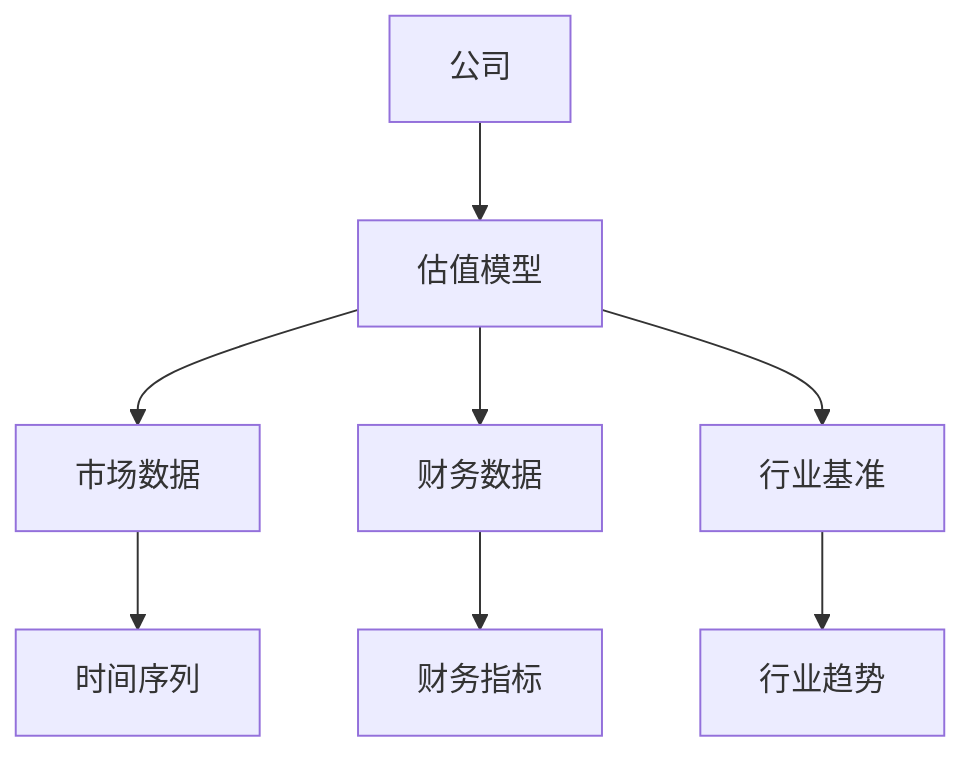

                 


# 利用AI构建自适应型公司估值模型：动态调整估值方法

> 关键词：AI，自适应模型，公司估值，动态调整，机器学习

> 摘要：本文探讨了如何利用AI技术构建自适应型公司估值模型，通过动态调整估值方法，提升金融分析的准确性和实时性。文章详细分析了传统估值方法的局限性，介绍了自适应型估值模型的核心概念，结合机器学习算法和系统架构设计，提供了具体的实现方法和案例分析。

---

## # 第1章: 自适应型公司估值模型的背景与问题背景

### 1.1 传统公司估值方法的局限性

#### 1.1.1 传统估值方法的介绍
传统的公司估值方法主要包括DCF模型、PE估值法、EV/EBITDA等。这些方法基于历史数据和固定假设，无法实时捕捉市场变化，且在面对非线性关系和复杂市场环境时表现有限。

#### 1.1.2 传统估值方法的局限性
- 数据依赖性强，难以适应市场快速变化。
- 忽略了公司内外部动态因素的交互作用。
- 无法实时更新模型参数，导致估值滞后。

#### 1.1.3 传统估值方法与现代金融需求的矛盾
现代金融市场中，公司价值受多种动态因素影响，如市场情绪、行业趋势、宏观经济指标等。传统估值方法难以实时整合这些动态因素，导致估值结果不够准确。

---

### 1.2 AI在金融估值中的应用前景

#### 1.2.1 AI在金融领域的应用现状
AI技术在金融领域的应用日益广泛，包括股票预测、风险评估、交易策略优化等。AI的强大数据处理能力和自适应学习能力为金融分析提供了新的可能性。

#### 1.2.2 AI在公司估值中的潜在优势
- 可以实时整合多源数据，捕捉市场动态。
- 通过机器学习算法，自动调整估值模型参数。
- 能够发现传统方法难以察觉的非线性关系。

#### 1.2.3 自适应型估值模型的必要性
随着市场的复杂化和不确定性增加，传统的静态估值模型已无法满足需求。自适应型估值模型能够根据市场变化动态调整，提供更精准的估值结果。

---

### 1.3 问题描述与目标

#### 1.3.1 公司估值的核心问题
公司估值的核心问题是如何准确反映公司的真实价值，同时考虑市场环境的变化。

#### 1.3.2 自适应型估值模型的目标
构建一个能够实时更新、动态调整的估值模型，结合AI技术，实现对公司价值的精准评估。

#### 1.3.3 边界与外延
- 本研究主要关注公司财务数据和市场数据的整合。
- 未来可以扩展到更多数据源，如社交媒体数据、行业新闻等。

---

## # 第2章: 自适应型公司估值模型的核心概念与联系

### 2.1 自适应型估值模型的核心原理

#### 2.1.1 自适应学习的基本概念
自适应学习是一种机器学习方法，通过不断更新模型参数，使其能够适应新的数据输入。

#### 2.1.2 动态调整的数学模型
动态调整模型的核心是通过时间序列分析和机器学习算法，实时更新估值参数。

#### 2.1.3 AI在动态调整中的作用
AI通过分析市场数据和公司数据，自动识别趋势和模式，为模型提供实时反馈。

---

### 2.2 核心概念的属性特征对比

| 比较维度       | 传统估值方法         | 自适应型估值方法       |
|----------------|----------------------|------------------------|
| 数据依赖性     | 高                   | 低                     |
| 动态调整能力   | 无                   | 有                     |
| 模型复杂性     | 简单                 | 复杂                   |

---

### 2.3 ER实体关系图架构



---

## # 第3章: 自适应型公司估值模型的算法原理

### 3.1 机器学习算法在估值模型中的应用

#### 3.1.1 监督学习与无监督学习的对比
- 监督学习：基于标记数据，适用于回归任务。
- 无监督学习：基于未标记数据，适用于聚类任务。

#### 3.1.2 回归分析在估值中的应用
回归分析是一种常用的传统统计方法，用于预测目标变量与多个自变量之间的关系。

#### 3.1.3 时间序列分析的原理
时间序列分析用于分析随时间变化的数据，帮助识别趋势和周期性。

---

### 3.2 神经网络在动态调整中的作用

#### 3.2.1 RNN与LSTM网络的原理
- RNN（循环神经网络）：适用于处理序列数据。
- LSTM（长短期记忆网络）：能够捕捉长期依赖关系。

#### 3.2.2 深度学习在特征提取中的应用
深度学习能够从大量数据中提取高维特征，提升模型的表达能力。

#### 3.2.3 网络结构的优化与调整
通过调整网络参数和结构，优化模型的预测能力。

---

### 3.3 动态调整的数学模型

#### 3.3.1 线性回归模型
$$ y = \beta_0 + \beta_1x + \epsilon $$

#### 3.3.2 时间序列模型
$$ ARIMA(p, d, q) $$

#### 3.3.3 神经网络模型
$$ y = f(Wx + b) $$

---

## # 第4章: 系统分析与架构设计方案

### 4.1 问题场景介绍

#### 4.1.1 企业估值的复杂性
企业估值受多种因素影响，包括市场环境、行业趋势和公司基本面。

#### 4.1.2 动态调整的必要性
市场环境不断变化，估值模型需要实时更新以反映最新情况。

#### 4.1.3 系统设计的目标
构建一个高效、动态的估值模型，能够实时调整参数并输出准确的估值结果。

---

### 4.2 系统功能设计

#### 4.2.1 领域模型
- 数据采集模块：收集市场数据和公司数据。
- 特征工程模块：提取关键特征。
- 模型训练模块：训练自适应型估值模型。
- 结果输出模块：输出估值结果。

---

## # 第5章: 项目实战

### 5.1 环境安装

#### 5.1.1 安装必要的库
```bash
pip install numpy pandas scikit-learn tensorflow
```

---

### 5.2 系统核心实现源代码

#### 5.2.1 数据预处理
```python
import numpy as np
import pandas as pd

# 读取数据
data = pd.read_csv('company_valuation.csv')

# 数据清洗
data = data.dropna()
```

#### 5.2.2 模型训练
```python
from sklearn.linear_model import LinearRegression
from sklearn.metrics import mean_squared_error

# 训练模型
model = LinearRegression()
model.fit(X_train, y_train)

# 评估模型
y_pred = model.predict(X_test)
print(mean_squared_error(y_test, y_pred))
```

---

### 5.3 代码应用解读与分析

#### 5.3.1 数据预处理
数据预处理是模型训练的基础，包括数据清洗和特征提取。

#### 5.3.2 模型训练
使用机器学习算法训练模型，并评估模型的性能。

---

### 5.4 实际案例分析和详细讲解剖析
通过具体案例分析，展示如何利用自适应型估值模型进行公司估值，并对比传统方法和AI方法的差异。

---

## # 第6章: 最佳实践、小结、注意事项、拓展阅读

### 6.1 最佳实践 tips
- 数据质量是模型性能的关键。
- 模型调优需要不断试验和优化。

### 6.2 小结
本文详细介绍了如何利用AI技术构建自适应型公司估值模型，通过动态调整估值方法，提升估值的准确性和实时性。

### 6.3 注意事项
- 数据隐私和安全问题需要注意。
- 模型需要定期更新和维护。

### 6.4 拓展阅读
- 《机器学习实战》
- 《深度学习》

---

作者：AI天才研究院/AI Genius Institute & 禅与计算机程序设计艺术 /Zen And The Art of Computer Programming

