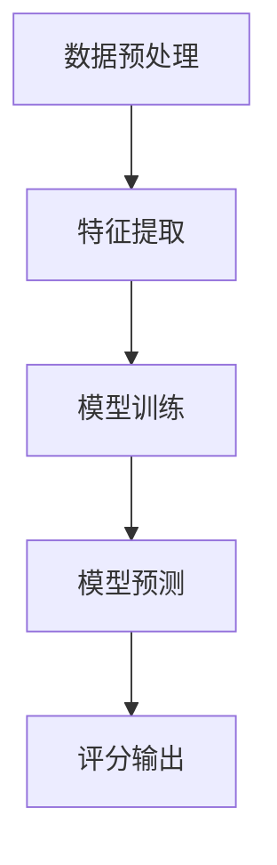
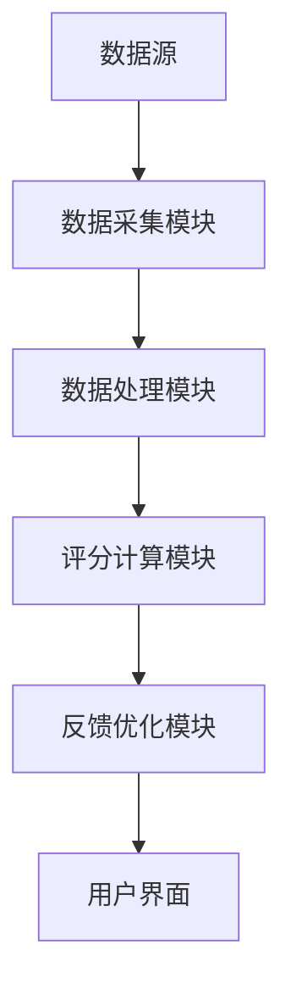

                 


# 利用AI构建自适应型公司文化评分系统：量化软实力

> **关键词**：公司文化，AI，评分系统，量化软实力，自适应系统  
> **摘要**：随着企业数字化转型的深入，公司文化的管理也逐渐从软性指标转向数据驱动的硬性指标。本文探讨如何利用人工智能技术构建自适应型公司文化评分系统，通过量化的方式评估和优化企业文化。文章详细介绍了系统的背景、核心概念、算法原理、系统架构、项目实战及最佳实践，旨在为企业提供一种全新的文化管理工具。

---

## 第一部分：背景介绍与问题分析

### 第1章：公司文化量化的重要性

#### 1.1 什么是公司文化
公司文化是一个企业的灵魂，它包括企业的价值观、使命、愿景、员工行为规范、团队协作精神等。这些软性指标通常难以量化，但却是企业成功的关键因素。

#### 1.2 为什么要量化公司文化
传统的公司文化管理主要依赖主观描述和员工调查，这种方式难以提供实时反馈，也无法与企业的绩效指标直接挂钩。量化公司文化可以帮助企业：
- 量化文化对员工满意度、生产力和创新的影响。
- 实时监控文化变化，及时调整管理策略。
- 提供数据支持的决策依据。

#### 1.3 问题背景与目标
现代企业面临快速变化的市场环境，公司文化需要具备更强的适应性。传统文化管理方法无法满足动态调整的需求，而AI技术为解决这一问题提供了新的可能性。本文的目标是构建一个基于AI的自适应型公司文化评分系统，能够实时评估和优化企业文化。

---

## 第二部分：核心概念与理论基础

### 第2章：AI与公司文化评分系统的核心概念

#### 2.1 自适应型评分系统的基本原理
自适应评分系统能够根据企业的实时数据动态调整评分标准和权重。这种系统的核心在于：
- 数据驱动：利用员工行为数据、绩效数据和反馈数据进行评分。
- 动态调整：根据企业目标和市场变化自动优化评分模型。

#### 2.2 AI在公司文化评分中的应用
AI技术在文化评分中的应用主要体现在：
- **机器学习**：用于预测文化对员工绩效的影响。
- **自然语言处理（NLP）**：用于分析员工反馈文本，提取文化相关的情感和关键词。
- **特征工程**：将文化相关数据转化为可量化的特征。

#### 2.3 公司文化评分的核心模型
文化评分模型需要考虑多个维度，例如员工满意度、团队协作、创新意识等。模型的核心公式如下：

$$文化评分 = \sum_{i=1}^{n} w_i \cdot x_i$$

其中，$w_i$是第i个维度的权重，$x_i$是该维度的评分。

---

## 第三部分：算法原理与数学模型

### 第3章：AI驱动的文化评分算法

#### 3.1 文化评分模型的数学框架
文化评分模型的输入包括员工行为数据、绩效数据和反馈数据。输出是一个综合评分，反映了企业文化的状态。

#### 3.2 基于机器学习的评分算法
以下是基于机器学习的评分算法流程：



#### 3.3 NLP在文化分析中的应用
NLP技术可以分析员工反馈文本，提取文化相关的情感和关键词。例如，使用词嵌入模型（如Word2Vec）将文本转化为向量表示。

---

## 第四部分：系统架构与设计方案

### 第4章：系统架构与设计方案

#### 4.1 系统功能设计
系统的功能模块包括：
- 数据采集模块：收集员工行为数据、绩效数据和反馈数据。
- 评分计算模块：根据模型计算文化评分。
- 反馈优化模块：根据评分结果优化企业文化。

#### 4.2 系统架构设计
以下是系统的架构图：



---

## 第五部分：项目实战与最佳实践

### 第5章：项目实战与最佳实践

#### 5.1 环境安装与代码实现
以下是Python代码示例：

```python
import numpy as np
from sklearn.feature_extraction.text import TfidfVectorizer
from sklearn.linear_model import LogisticRegression

# 示例数据
text_data = ["员工反馈：团队协作良好", "员工反馈：创新意识不足"]
target = [1, 0]

# 特征提取
vectorizer = TfidfVectorizer()
X = vectorizer.fit_transform(text_data)

# 模型训练
model = LogisticRegression()
model.fit(X, target)

# 预测评分
new_text = ["员工反馈：领导支持度高"]
new_X = vectorizer.transform(new_text)
predicted_score = model.predict(new_X)
print(predicted_score)
```

#### 5.2 项目小结与注意事项
- 确保数据的隐私和安全。
- 定期更新模型以适应企业变化。
- 结合企业实际情况调整评分权重。

---

## 总结

本文详细介绍了如何利用AI构建自适应型公司文化评分系统，通过量化的方式评估和优化企业文化。文章从背景、核心概念、算法原理、系统架构到项目实战进行了全面分析，并提供了一个实际的Python代码示例。未来，随着AI技术的不断发展，公司文化管理将更加智能化和数据化。

---

**作者：AI天才研究院/AI Genius Institute & 禅与计算机程序设计艺术 /Zen And The Art of Computer Programming**

