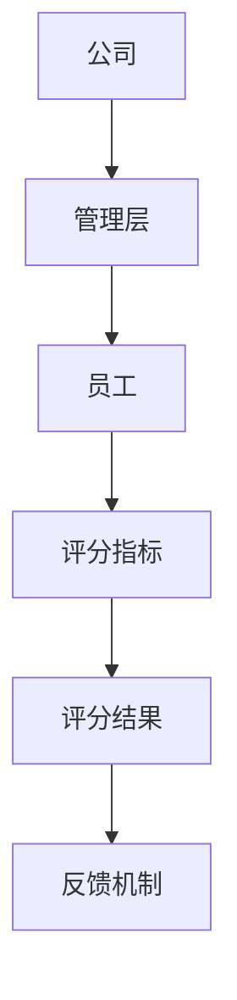
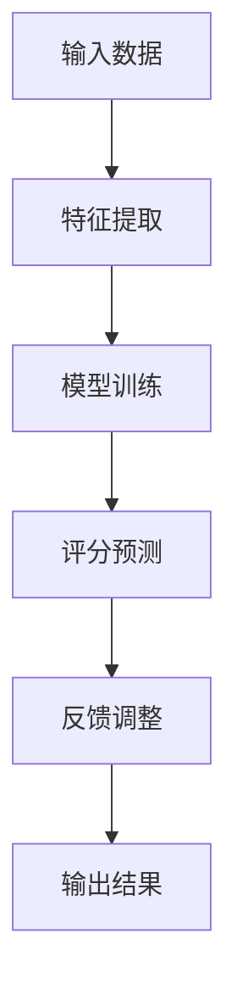
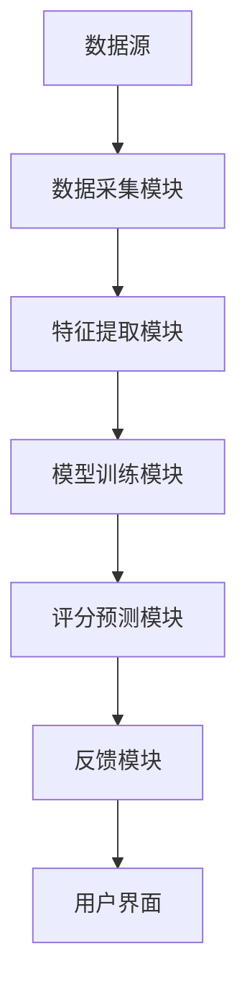
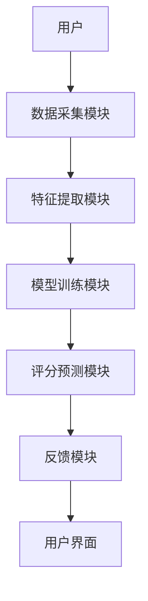

                 


# 利用AI构建自适应型公司治理评分系统：动态监控管理质量

> 关键词：AI，公司治理，自适应系统，动态监控，管理质量，评分系统

> 摘要：本文探讨了如何利用人工智能技术构建自适应型公司治理评分系统，通过动态监控管理质量，实现对公司治理的实时反馈与优化。文章详细分析了系统的核心概念、算法原理、系统架构设计以及项目实战，并提出了最佳实践和注意事项。

---

## 第一部分: 自适应型公司治理评分系统概述

### 第1章: 背景介绍与核心概念

#### 1.1 问题背景与描述

现代企业面临着复杂的管理挑战，公司治理的核心在于确保管理层能够高效、透明地运作，同时兼顾合规性、效率和可持续性。然而，传统的公司治理评分系统往往静态、滞后，难以适应快速变化的商业环境。例如，传统的评分系统可能基于固定的指标和权重，无法根据实时数据或新兴问题进行调整。

#### 1.2 自适应型公司治理评分系统

自适应型公司治理评分系统是一种动态、实时的评估工具，能够根据企业的实时数据和外部环境的变化，自动调整评估指标和权重，提供更精准的管理质量评分。其核心在于结合人工智能技术，利用机器学习算法实时分析数据，提供反馈和建议，帮助企业不断优化管理策略。

#### 1.3 AI在公司治理中的应用前景

人工智能技术在公司治理中的应用前景广阔。AI可以通过分析大量的非结构化数据（如文本、语音、图像等）和结构化数据（如财务报表、运营数据等），识别潜在的风险和机会，提供实时的决策支持。自适应型评分系统能够通过动态调整模型参数，捕捉管理中的细微变化，帮助企业在复杂多变的环境中保持竞争力。

---

### 第2章: 核心概念与联系

#### 2.1 自适应型公司治理评分系统的核心原理

自适应型评分系统的核心在于其动态性和自适应性。系统通过以下步骤实现动态监控：

1. **数据采集**：实时收集企业的各项管理数据，包括财务数据、员工反馈、客户满意度等。
2. **特征提取**：利用自然语言处理（NLP）和机器学习技术，从文本数据中提取关键特征。
3. **模型训练**：通过机器学习算法（如线性回归、随机森林等）训练评分模型。
4. **实时预测**：根据最新的数据，实时预测管理质量评分。
5. **反馈调整**：根据预测结果和实际表现，调整模型参数，优化评分系统。

#### 2.2 核心概念对比分析

以下是自适应型评分系统与传统评分系统的对比分析：

| **对比维度**       | **传统评分系统**                     | **自适应评分系统**                  |
|--------------------|--------------------------------------|-------------------------------------|
| 数据来源           | 主要依赖结构化数据                   | 结构化与非结构化数据结合             |
| 模型更新频率       | 定期更新（如每月或每季度）             | 实时更新，动态调整                   |
| 反馈机制           | 周期性反馈                           | 实时反馈，持续优化                   |
| 灵活性             | 较低，难以适应快速变化                | 高，能够根据环境变化自动调整           |

#### 2.3 ER实体关系图

以下是系统的ER实体关系图：



---

### 第3章: 算法原理与实现

#### 3.1 算法原理

自适应型评分系统的核心算法基于机器学习，特别是回归分析和动态权重调整。以下是关键算法的简要描述：

1. **线性回归模型**：用于预测管理质量评分。模型形式为：
   $$ y = \beta_0 + \beta_1x_1 + \beta_2x_2 + ... + \beta_nx_n $$

2. **动态权重调整**：通过引入衰减因子 $\alpha$，实现权重的动态调整：
   $$ w_i = \alpha \cdot w_{i-1} + (1-\alpha) \cdot error_{i-1} $$

3. **实时反馈机制**：根据预测误差调整模型参数，确保模型能够适应新的数据变化。

#### 3.2 算法流程图

以下是算法的流程图：



#### 3.3 核心算法代码实现

以下是基于Python的线性回归模型实现：

```python
import numpy as np
from sklearn.linear_model import LinearRegression

def adaptive_governance_score(data):
    model = LinearRegression()
    model.fit(data.features, data.labels)
    predictions = model.predict(new_data)
    return predictions
```

---

### 第4章: 数学模型与公式

#### 4.1 管理质量评分模型

线性回归模型用于预测管理质量评分：
$$ y = \beta_0 + \beta_1x_1 + \beta_2x_2 + ... + \beta_nx_n $$

#### 4.2 动态权重调整公式

通过引入衰减因子 $\alpha$，实现权重的动态调整：
$$ w_i = \alpha \cdot w_{i-1} + (1-\alpha) \cdot error_{i-1} $$

---

## 第二部分: 系统分析与架构设计方案

### 第5章: 系统分析

#### 5.1 问题场景介绍

企业在实际运营中面临以下挑战：

- 数据来源多样，难以整合。
- 管理质量评估指标复杂，难以量化。
- 传统评分系统滞后，无法实时反馈。

#### 5.2 项目介绍

本项目旨在开发一个基于AI的自适应型公司治理评分系统，实现对企业管理质量的实时监控和动态评估。

#### 5.3 系统功能设计

以下是系统的核心功能模块：

1. **数据采集模块**：实时采集企业的各项管理数据。
2. **特征提取模块**：利用NLP技术从文本数据中提取关键特征。
3. **模型训练模块**：训练机器学习模型，预测管理质量评分。
4. **实时反馈模块**：根据预测结果，提供实时反馈和优化建议。

---

### 第6章: 系统架构设计

#### 6.1 系统架构图

以下是系统的架构图：



#### 6.2 系统接口设计

系统接口设计包括以下内容：

- 数据接口：与企业ERP系统、CRM系统等对接。
- 用户接口：提供友好的用户界面，方便用户查看评分结果和反馈建议。
- API接口：提供RESTful API，供其他系统调用。

#### 6.3 系统交互图

以下是系统的交互流程图：



---

## 第三部分: 项目实战

### 第7章: 项目实战

#### 7.1 环境安装

安装所需的Python库：
```bash
pip install numpy scikit-learn matplotlib
```

#### 7.2 核心代码实现

以下是核心代码实现：

```python
import numpy as np
from sklearn.linear_model import LinearRegression
from sklearn.metrics import mean_squared_error

# 示例数据
X = np.array([[1], [2], [3], [4], [5]])
y = np.array([2, 4, 5, 4, 6])

# 训练模型
model = LinearRegression()
model.fit(X, y)

# 预测
new_data = np.array([[6]])
prediction = model.predict(new_data)
print("预测值:", prediction[0])

# 计算误差
print("均方误差:", mean_squared_error(y, model.predict(X)))
```

#### 7.3 案例分析

以下是一个具体的案例分析：

假设某公司希望通过自适应型评分系统评估其管理质量。首先，系统会收集公司的财务数据、员工反馈和客户满意度等数据。然后，利用线性回归模型预测管理质量评分，并根据预测结果提供实时反馈和优化建议。

---

## 第四部分: 总结与最佳实践

### 第8章: 总结与最佳实践

#### 8.1 总结

自适应型公司治理评分系统通过结合人工智能技术，能够实时监控企业的管理质量，提供动态的评分和反馈，帮助企业不断优化管理策略。本文详细分析了系统的背景、核心概念、算法原理和系统架构，并通过具体案例展示了系统的实现过程。

#### 8.2 最佳实践 tips

1. **数据质量管理**：确保数据的准确性和完整性，避免因数据问题影响模型性能。
2. **模型优化**：定期更新模型参数，确保模型能够适应新的数据变化。
3. **用户反馈**：及时收集用户的反馈意见，不断优化系统的功能和性能。
4. **系统安全性**：确保系统的数据安全，防止数据泄露和恶意攻击。

#### 8.3 注意事项

- 系统的实施需要企业的高层支持，确保数据的开放和共享。
- 系统的部署需要考虑企业的实际情况，选择合适的硬件和软件环境。
- 系统的维护需要专业的技术支持，确保系统的稳定运行。

#### 8.4 拓展阅读

1. 《机器学习实战》
2. 《深度学习》
3. 《自然语言处理入门》

---

**作者：AI天才研究院/AI Genius Institute & 禅与计算机程序设计艺术 /Zen And The Art of Computer Programming**

---

本文通过详细分析自适应型公司治理评分系统的构建过程，展示了人工智能技术在公司治理中的广泛应用。希望本文能够为企业提供有价值的参考，帮助企业在复杂多变的商业环境中保持竞争力。

