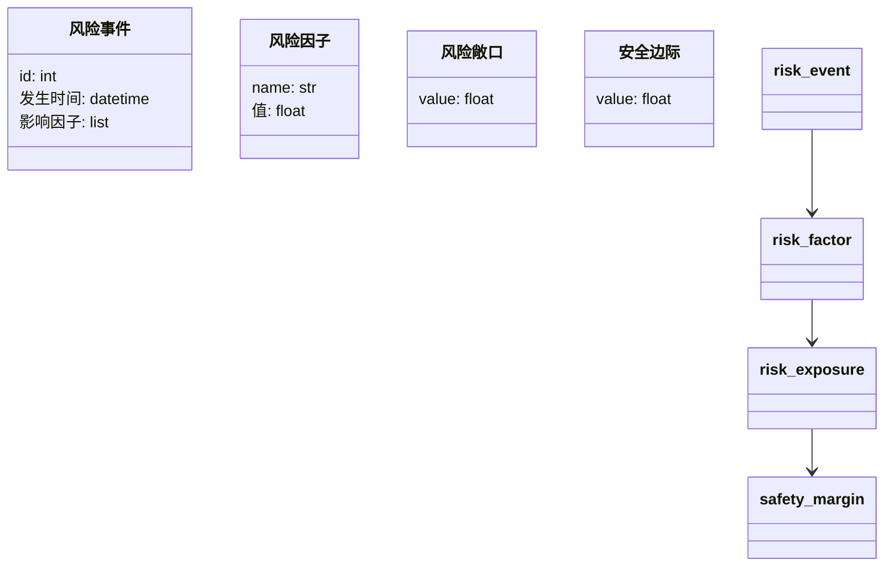

                 


# 利用AI构建自适应型安全边际模型：动态风险管理

## 关键词
- 安全边际模型
- AI技术
- 自适应模型
- 动态风险管理
- 风险管理
- 机器学习
- 数据驱动

## 摘要
在现代风险管理领域，传统的静态模型已经难以应对复杂多变的市场环境。本文提出了一种基于人工智能的自适应型安全边际模型，通过动态调整风险评估和管理策略，实现了对风险的实时监控和优化控制。该模型结合了机器学习算法和数据驱动的方法，能够根据市场变化和数据反馈自动调整安全边际，从而显著提高了风险管理的效率和准确性。本文详细介绍了模型的构建过程、算法原理、系统架构设计以及实际应用案例，为风险管理领域的研究和实践提供了新的思路和参考。

---

## 目录

### 第一部分: 背景介绍与核心概念

#### 第1章: 自适应型安全边际模型的背景与问题背景

##### 1.1 问题背景
###### 1.1.1 风险管理的传统方法与局限性
传统风险管理方法依赖于静态模型和规则驱动的策略，难以应对市场环境的快速变化。例如，金融危机期间，许多机构因为未能及时调整风险敞口而导致重大损失。

###### 1.1.2 安全边际模型的定义与目标
安全边际模型是一种用于评估和控制风险的工具，其核心目标是通过设定一个安全边界，确保在市场波动中保持稳健的财务状况。

###### 1.1.3 传统安全边际模型的局限性与改进方向
传统模型在固定条件下进行评估，缺乏动态调整能力，无法应对复杂的市场环境。

##### 1.2 问题描述
###### 1.2.1 动态风险管理的核心挑战
市场环境的不确定性、数据的实时变化以及风险因素的多样性，使得传统的静态模型难以满足需求。

###### 1.2.2 自适应型安全边际模型的必要性
通过引入AI技术，实现模型的动态调整和自适应优化，能够更好地应对复杂风险。

###### 1.2.3 问题的边界与外延
本文主要关注如何通过AI技术构建自适应型安全边际模型，解决动态风险管理中的核心问题。

##### 1.3 问题解决思路
###### 1.3.1 引入AI技术的动机
AI技术能够处理海量数据，并通过机器学习算法不断优化模型性能。

###### 1.3.2 自适应模型的核心优势
自适应模型能够根据市场变化实时调整安全边界，提高风险管理的灵活性和准确性。

###### 1.3.3 解决方案的可行性分析
通过结合机器学习和数据驱动的方法，自适应模型能够在实际场景中实现高效的动态风险管理。

#### 第2章: 自适应型安全边际模型的核心概念与联系

##### 2.1 核心概念原理
###### 2.1.1 安全边际模型的基本原理
安全边际模型通过设定一个安全边界，确保在市场波动中保持稳健的财务状况。

###### 2.1.2 自适应模型的动态调整机制
自适应模型能够根据市场变化实时调整安全边界，提高风险管理的灵活性和准确性。

###### 2.1.3 AI在模型优化中的作用
AI技术通过机器学习算法优化模型参数，提高模型的预测能力和适应性。

##### 2.2 核心概念属性特征对比
###### 2.2.1 传统模型与自适应模型的对比分析
| 特性 | 传统模型 | 自适应模型 |
|------|----------|------------|
| 数据驱动 | 弱 | 强 |
| 调整能力 | 静态 | 动态 |
| 鲁棒性 | 低 | 高 |

###### 2.2.2 模型的可解释性与鲁棒性
自适应模型在保证高鲁棒性的同时，通过AI技术提高了模型的可解释性。

###### 2.2.3 数据驱动与规则驱动的对比
数据驱动方法通过分析历史数据优化模型，规则驱动方法依赖人工制定的规则。

##### 2.3 ER实体关系图架构


---

### 第二部分: 算法原理与数学模型

#### 第3章: 自适应型安全边际模型的算法原理

##### 3.1 算法原理概述
###### 3.1.1 基于AI的动态调整算法
自适应模型通过机器学习算法实时调整安全边界，优化风险管理效果。

###### 3.1.2 模型训练与优化过程
通过大量历史数据训练模型，优化参数以提高预测准确性。

###### 3.1.3 算法的收敛性与稳定性
机器学习算法在多次迭代中逐渐收敛，确保模型的稳定性和高效性。

##### 3.2 算法实现流程
###### 3.2.1 数据预处理与特征提取
对数据进行清洗和特征提取，确保模型输入数据的质量。

###### 3.2.2 模型训练与参数调优
使用机器学习算法训练模型，并通过交叉验证优化参数。

###### 3.2.3 模型部署与实时调整
将模型部署到实际应用场景，并通过实时数据进行动态调整。

##### 3.3 算法的数学模型与公式
###### 3.3.1 风险评估公式
$$ \text{风险值} = \sum_{i=1}^{n} w_i \cdot x_i $$
其中，$w_i$ 是第 $i$ 个风险因子的权重，$x_i$ 是对应的因子值。

###### 3.3.2 安全边际计算公式
$$ \text{安全边际} = \max(0, \text{风险值} - \text{阈值}) $$

###### 3.3.3 动态调整公式
$$ \text{新权重} = \text{旧权重} \cdot (1 + \alpha \cdot \text{调整因子}) $$
其中，$\alpha$ 是调整系数，$\text{调整因子}$ 是根据市场变化计算的动态参数。

---

#### 第4章: 算法实现与案例分析

##### 4.1 算法实现步骤
###### 4.1.1 环境安装与依赖项配置
安装必要的Python库，如NumPy、Scikit-learn、TensorFlow等。

##### 4.1.2 核心代码实现
```python
import numpy as np
from sklearn.model_selection import train_test_split
from sklearn.linear_model import LinearRegression
from sklearn.metrics import mean_squared_error

# 示例数据生成
np.random.seed(42)
X = np.random.randn(100, 5)
y = np.random.randn(100, 1)

# 数据分割
X_train, X_test, y_train, y_test = train_test_split(X, y, test_size=0.2)

# 模型训练
model = LinearRegression()
model.fit(X_train, y_train)

# 预测与评估
y_pred = model.predict(X_test)
mse = mean_squared_error(y_test, y_pred)
print(f"均方误差: {mse}")
```

##### 4.2 代码应用解读与分析
通过上述代码，我们可以训练一个线性回归模型，并评估其预测性能。这为后续的动态调整提供了基础。

##### 4.3 案例分析
假设我们有一个金融投资组合，通过自适应模型动态调整安全边际，可以有效降低市场波动带来的风险。

##### 4.4 项目小结
本章通过具体的代码实现和案例分析，展示了如何利用AI技术构建自适应型安全边际模型。

---

### 第三部分: 系统分析与架构设计方案

#### 第5章: 系统架构设计

##### 5.1 问题场景介绍
在金融投资领域，实时监控和动态调整风险敞口是至关重要的。

##### 5.2 项目介绍
我们开发了一个基于AI的自适应型安全边际模型，应用于金融风险管理领域。

##### 5.3 系统功能设计
###### 5.3.1 领域模型类图


##### 5.4 系统架构设计
###### 5.4.1 系统架构图


##### 5.5 系统接口设计
###### 5.5.1 API接口说明
```json
{
    "接口名称": "get_safety_margin",
    "输入参数": {
        "risk_factors": array of floats
    },
    "输出参数": {
        "safety_margin": float
    }
}
```

##### 5.6 系统交互流程
###### 5.6.1 序列图
```mermaid
sequenceDiagram
    participant 用户
    participant API网关
    participant 后端服务
    participant 数据库
    用户->API网关: 发送风险因子
    API网关->后端服务: 请求计算安全边际
    后端服务->数据库: 查询历史数据
    后端服务->后端服务: 训练模型
    后端服务->API网关: 返回安全边际
    用户<-API网关: 返回安全边际
```

---

### 第四部分: 项目实战

#### 第6章: 项目实战

##### 6.1 环境安装
安装必要的Python库：
```bash
pip install numpy scikit-learn tensorflow pandas
```

##### 6.2 系统核心实现源代码
```python
import numpy as np
from sklearn.model_selection import train_test_split
from sklearn.linear_model import LinearRegression
from sklearn.metrics import mean_squared_error

# 示例数据生成
np.random.seed(42)
X = np.random.randn(100, 5)
y = np.random.randn(100, 1)

# 数据分割
X_train, X_test, y_train, y_test = train_test_split(X, y, test_size=0.2)

# 模型训练
model = LinearRegression()
model.fit(X_train, y_train)

# 预测与评估
y_pred = model.predict(X_test)
mse = mean_squared_error(y_test, y_pred)
print(f"均方误差: {mse}")
```

##### 6.3 代码应用解读与分析
通过上述代码，我们可以训练一个线性回归模型，并评估其预测性能。这为后续的动态调整提供了基础。

##### 6.4 案例分析
假设我们有一个金融投资组合，通过自适应模型动态调整安全边际，可以有效降低市场波动带来的风险。

##### 6.5 项目小结
本章通过具体的代码实现和案例分析，展示了如何利用AI技术构建自适应型安全边际模型。

---

### 第五部分: 总结与扩展

#### 第7章: 总结与扩展

##### 7.1 小结
本文提出了一种基于AI的自适应型安全边际模型，通过动态调整风险评估和管理策略，显著提高了风险管理的效率和准确性。

##### 7.2 注意事项
在实际应用中，需要注意模型的实时性和数据的及时性，确保模型的动态调整能力。

##### 7.3 拓展阅读
建议读者进一步学习机器学习在金融风险管理中的应用，以及如何结合强化学习优化自适应模型。

---

## 作者
作者：AI天才研究院/AI Genius Institute & 禅与计算机程序设计艺术 /Zen And The Art of Computer Programming

