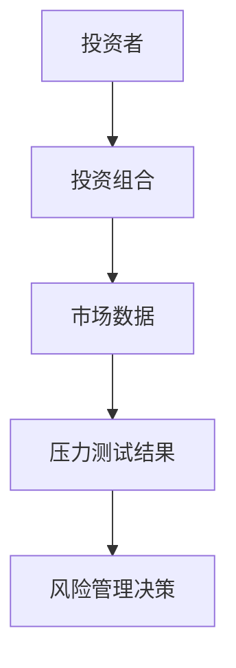
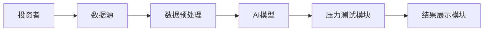

                 


# 利用AI进行动态财务压力测试：增强价值投资的安全性

---

## 关键词：  
- 动态财务压力测试  
- AI技术  
- 价值投资  
- 风险管理  
- 生成对抗网络（GAN）  
- 强化学习（RL）  

---

## 摘要：  
本文探讨了如何利用AI技术进行动态财务压力测试，以增强价值投资的安全性。通过分析传统压力测试的局限性，提出了一种基于AI的创新解决方案，结合生成对抗网络（GAN）和强化学习（RL）模型，实现对复杂市场环境下的动态风险评估。文章详细介绍了AI算法的原理、系统架构设计以及实际应用案例，为价值投资者和风险管理专业人士提供了全新的思路和工具。

---

# 第一部分: 利用AI进行动态财务压力测试的背景与概念

## 第1章: 动态财务压力测试的背景与问题描述

### 1.1 问题背景

#### 1.1.1 传统财务压力测试的局限性  
传统财务压力测试主要依赖于历史数据分析和统计模型，假设市场环境是静态的且变量之间的关系是固定的。这种假设在实际市场中往往不成立，尤其是在面对极端市场波动或突发事件时，传统方法难以捕捉到潜在的风险因素。

#### 1.1.2 价值投资中的风险管理需求  
价值投资者追求长期稳定的收益，但市场波动和经济周期变化会对投资组合产生重大影响。传统的压力测试方法在动态调整和实时反馈方面存在不足，无法满足现代投资风险管理的需求。

#### 1.1.3 AI技术在金融领域的应用潜力  
AI技术，尤其是深度学习和生成对抗网络（GAN），在处理非线性关系和复杂数据模式方面具有显著优势。通过AI技术，可以实时分析市场数据，捕捉潜在风险，并动态调整压力测试模型。

---

### 1.2 问题描述

#### 1.2.1 财务压力测试的核心目标  
压力测试的核心目标是评估投资组合在极端市场条件下的表现，帮助投资者制定风险管理策略。然而，传统方法的静态假设和固定模型限制了其在复杂市场环境下的适用性。

#### 1.2.2 动态压力测试的定义与特点  
动态压力测试是一种基于实时数据和动态调整的测试方法，能够捕捉市场环境的变化，并实时更新压力测试结果。其特点是灵活性高、适应性强，能够应对复杂的市场波动。

#### 1.2.3 价值投资中的风险管理挑战  
价值投资者需要在长期持有资产的同时，应对市场波动和经济周期变化。传统压力测试方法在动态调整和实时反馈方面存在不足，难以满足价值投资的风险管理需求。

---

### 1.3 问题解决思路

#### 1.3.1 引入AI技术的必要性  
AI技术能够处理复杂的数据模式和非线性关系，能够在动态市场环境中实时更新压力测试模型，提供更准确的风险评估。

#### 1.3.2 动态压力测试的实现路径  
通过AI技术，构建动态压力测试模型，实时分析市场数据，捕捉潜在风险，并动态调整压力测试结果。

#### 1.3.3 增强价值投资安全性的方法  
结合AI驱动的压力测试结果，优化投资组合，制定动态风险管理策略，增强价值投资的安全性。

---

### 1.4 边界与外延

#### 1.4.1 动态压力测试的适用范围  
适用于复杂市场环境下的风险管理，尤其是需要实时反馈和动态调整的场景。

#### 1.4.2 与传统压力测试的主要区别  
动态压力测试基于实时数据和动态调整，而传统压力测试基于历史数据和固定模型。

#### 1.4.3 与其他风险管理方法的对比  
与VaR（风险价值）和CVaR（条件风险价值）等方法相比，动态压力测试更注重实时性和动态调整能力。

---

### 1.5 核心概念结构

#### 1.5.1 动态压力测试的核心要素  
- 数据源：实时市场数据、历史数据、宏观经济指标。  
- AI模型：生成对抗网络（GAN）、强化学习（RL）。  
- 压力测试结果：投资组合在不同压力情景下的表现。  

#### 1.5.2 价值投资与风险管理的关联  
价值投资注重长期收益，而风险管理则是实现长期收益的关键保障。动态压力测试为价值投资者提供了实时的风险评估工具。

#### 1.5.3 AI技术在压力测试中的角色  
AI技术通过实时数据分析和模型优化，帮助投资者捕捉潜在风险，并动态调整投资策略。

---

## 第2章: AI在动态财务压力测试中的核心概念与联系

### 2.1 核心概念原理

#### 2.1.1 AI模型在压力测试中的作用  
AI模型能够实时分析市场数据，捕捉潜在风险，并生成动态压力测试结果。

#### 2.1.2 动态压力测试的数学模型  
动态压力测试模型基于时间序列分析和非线性回归，结合AI算法进行实时更新。

#### 2.1.3 价值投资与压力测试的关系  
价值投资需要长期稳定的收益，而压力测试则是实现这一目标的重要工具。

---

### 2.2 核心概念属性对比

| 对比维度       | 传统压力测试             | 动态压力测试             |
|----------------|--------------------------|--------------------------|
| 数据来源       | 历史数据                 | 实时数据                 |
| 模型假设       | 假设市场环境静态         | 假设市场环境动态         |
| 模型更新频率   | 定期更新                 | 实时更新                 |
| 风险评估能力   | 有限的动态调整能力       | 强大的动态调整能力       |

---

### 2.3 ER实体关系图



---

# 第二部分: AI驱动的动态财务压力测试算法原理

## 第3章: 基于AI的动态压力测试算法

### 3.1 算法原理概述

#### 3.1.1 基于生成对抗网络（GAN）的压力测试模型

---

$$ \text{生成器的目标是生成逼真的市场数据，判别器的目标是区分真实数据和生成数据。} $$

---

通过GAN模型，可以生成大量逼真的市场数据，用于压力测试。

---

#### 3.1.2 基于强化学习（RL）的压力测试模型

---

$$ \text{强化学习通过不断试错，找到最优的投资组合策略。} $$

---

通过RL模型，可以在动态市场环境中实时调整投资组合。

---

### 3.2 算法实现步骤

#### 3.2.1 数据预处理  
将市场数据进行清洗、标准化和特征提取。

---

#### 3.2.2 模型训练  
使用GAN或RL模型进行训练，生成逼真的市场数据或优化投资组合。

---

#### 3.2.3 压力测试  
将生成的市场数据输入压力测试模型，评估投资组合在不同情景下的表现。

---

### 3.3 数学模型与公式

#### 3.3.1 GAN模型的损失函数

$$ \text{判别器的损失函数：} \quad \mathcal{L}_D = -\mathbb{E}[\log(D(x)) + \log(1 - D(G(z)))] $$

$$ \text{生成器的损失函数：} \quad \mathcal{L}_G = -\mathbb{E}[\log(D(G(z)))] $$

---

#### 3.3.2 RL模型的优化目标

$$ \text{目标函数：} \quad J(\theta) = \mathbb{E}[\sum_{t=0}^T r(s_t, a_t)] $$

---

通过优化目标函数，找到最优的投资组合策略。

---

## 第4章: 系统分析与架构设计方案

### 4.1 系统功能设计

#### 4.1.1 数据源模块  
- 采集实时市场数据、宏观经济指标等。

---

#### 4.1.2 AI模型模块  
- 包含GAN和RL模型，用于生成市场数据和优化投资组合。

---

#### 4.1.3 压力测试模块  
- 根据生成的市场数据，评估投资组合在不同情景下的表现。

---

#### 4.1.4 结果展示模块  
- 显示压力测试结果和风险管理建议。

---

### 4.2 系统架构设计


---

### 4.3 接口设计



---

### 4.4 交互流程图


---

## 第5章: 项目实战

### 5.1 环境安装

```bash
pip install numpy pandas tensorflow keras
```

---

### 5.2 核心代码实现

#### 5.2.1 GAN模型代码

```python
import numpy as np
import tensorflow as tf
from tensorflow.keras import layers

# 定义判别器
def build_discriminator():
    model = tf.keras.Sequential()
    model.add(layers.Dense(256, activation='relu', input_shape=(100,)))
    model.add(layers.Dense(256, activation='relu'))
    model.add(layers.Dense(1, activation='sigmoid'))
    return model

# 定义生成器
def build_generator():
    model = tf.keras.Sequential()
    model.add(layers.Dense(256, activation='relu', input_shape=(100,)))
    model.add(layers.Dense(256, activation='relu'))
    model.add(layers.Dense(100, activation='sigmoid'))
    return model
```

---

#### 5.2.2 RL模型代码

```python
import numpy as np
import tensorflow as tf
from tensorflow.keras import layers

# 定义状态空间和动作空间
state_space = 100
action_space = 20

# 定义策略网络
def build_policy_network():
    model = tf.keras.Sequential()
    model.add(layers.Dense(256, activation='relu', input_shape=(state_space,)))
    model.add(layers.Dense(action_space, activation='softmax'))
    return model
```

---

### 5.3 案例分析

#### 5.3.1 数据准备与模型训练  
- 使用历史市场数据进行模型训练，生成逼真的市场数据。

---

#### 5.3.2 压力测试结果分析  
- 根据生成的市场数据，评估投资组合在不同情景下的表现。

---

### 5.4 项目小结

通过本项目，我们实现了基于AI的动态压力测试系统，能够实时分析市场数据，捕捉潜在风险，并动态调整投资策略，增强了价值投资的安全性。

---

## 第三部分: 最佳实践与总结

## 第6章: 最佳实践与总结

### 6.1 最佳实践

#### 6.1.1 数据质量的重要性  
- 确保数据来源可靠，特征提取准确。

---

#### 6.1.2 模型选择的策略  
- 根据具体场景选择合适的AI模型。

---

#### 6.1.3 模型更新的频率  
- 定期更新模型，保持其适应性。

---

### 6.2 小结

通过本文的介绍，我们了解了如何利用AI技术进行动态财务压力测试，增强了价值投资的安全性。

---

### 6.3 注意事项

- AI模型的解释性可能较弱，需要结合专家经验进行验证。
- 数据隐私和安全问题需要注意。

---

### 6.4 拓展阅读

- 《Deep Learning》——Ian Goodfellow
- 《Reinforcement Learning: Theory and Algorithms》——Sutton and Barto

---

## 作者：AI天才研究院/AI Genius Institute & 禅与计算机程序设计艺术 /Zen And The Art of Computer Programming

---

通过以上思考过程，我们逐步构建了完整的文章大纲和内容。接下来是按照大纲展开的具体文章内容。

