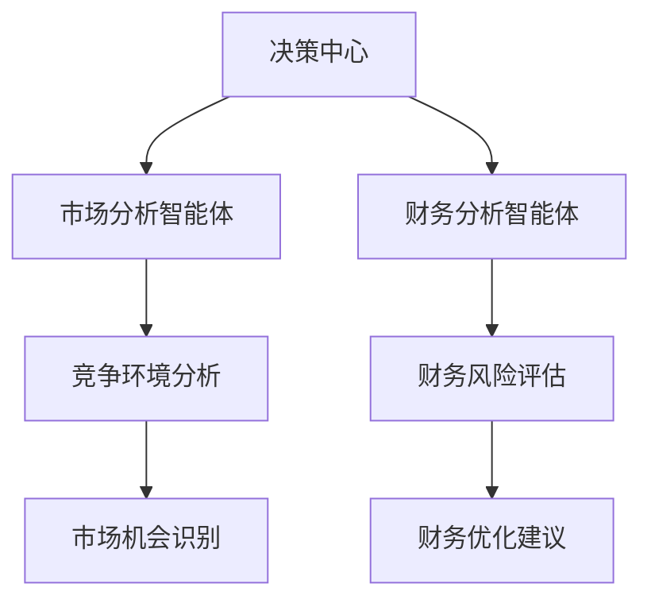
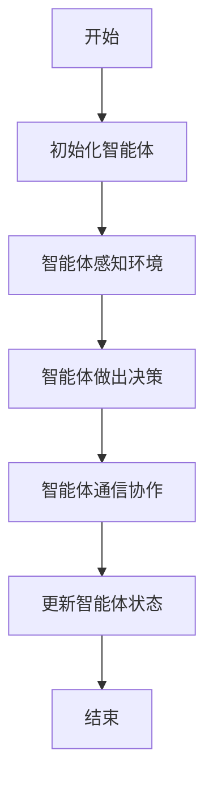
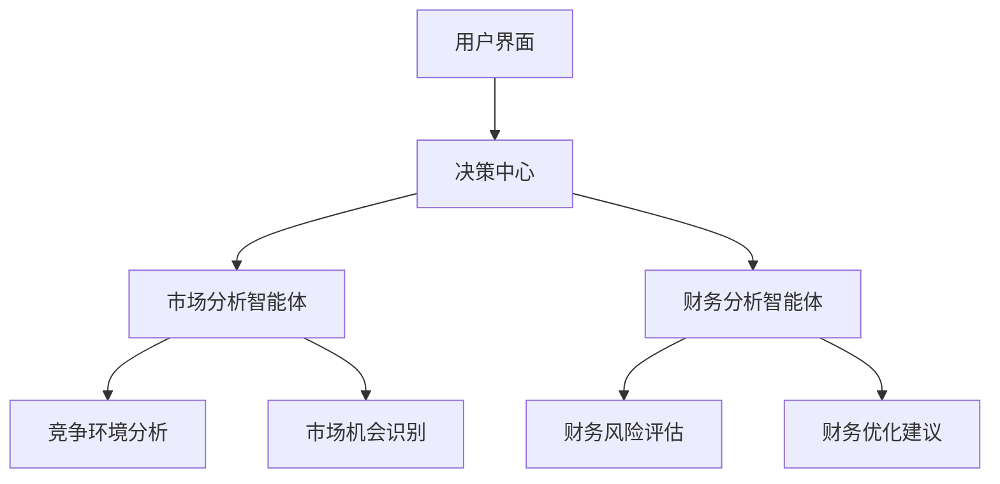
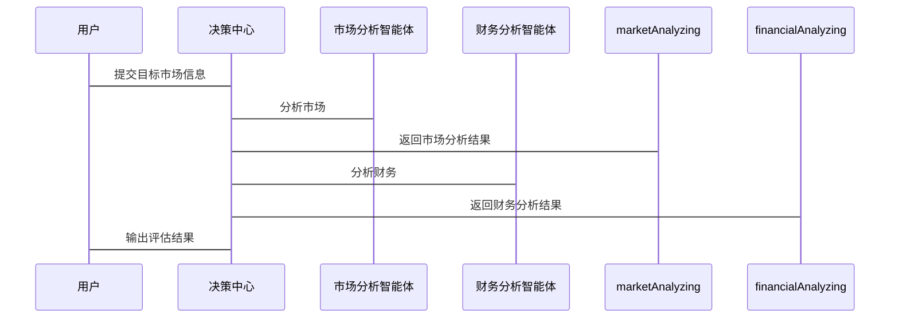

                 


# 利用多智能体AI优化公司扩张战略评估

> **关键词**: 多智能体AI, 公司扩张, 战略评估, 人工智能, 智能体协作

> **摘要**: 本文探讨了如何利用多智能体AI技术优化公司扩张战略评估。通过分析多智能体AI的核心概念、算法原理、系统架构及实际应用案例，展示了其在战略评估中的优势与价值。文章详细介绍了多智能体AI的协作机制、决策算法，并通过具体案例说明其在公司扩张中的应用，为企业的战略决策提供新的思路。

---

## 目录

1. [多智能体AI与公司扩张战略评估概述](#多智能体AI与公司扩张战略评估概述)
2. [多智能体AI的核心概念与联系](#多智能体AI的核心概念与联系)
3. [多智能体AI算法原理](#多智能体AI算法原理)
4. [系统分析与架构设计](#系统分析与架构设计)
5. [项目实战: 利用多智能体AI进行战略评估](#项目实战利用多智能体AI进行战略评估)
6. [总结与展望](#总结与展望)

---

## 1. 多智能体AI与公司扩张战略评估概述

### 1.1 多智能体AI的定义与特点

**多智能体AI（Multi-Agent AI）**是由多个相互作用的智能体（Agent）组成的系统，这些智能体能够自主决策、协作和通信，共同完成复杂任务。其特点包括：

- **分布式智能**: 每个智能体独立运作，但通过协作实现整体目标。
- **自主性**: 智能体能够自主感知环境并做出决策。
- **协作性**: 智能体之间通过通信和协作完成共同目标。
- **动态性**: 系统能够适应环境变化和新信息。

### 1.2 公司扩张战略评估的背景与挑战

**公司扩张战略评估**是企业在拓展市场、并购、进入新领域等决策时的关键步骤。传统方法依赖于人工分析和专家经验，存在以下挑战：

- **信息复杂性**: 涉及市场、财务、竞争等多方面数据。
- **决策滞后**: 人工分析耗时长，难以快速响应变化。
- **主观性**: 受专家经验限制，可能存在主观偏差。

**多智能体AI**的优势在于其分布式计算和协作能力，能够快速处理海量数据，提供更精准的决策支持。

### 1.3 多智能体AI在公司扩张战略评估中的应用前景

通过多智能体AI，企业可以实时分析市场动态、竞争对手策略、内部资源分配等问题，优化扩张决策。例如：

- **市场分析智能体**: 收集和分析市场数据，识别潜在机会。
- **财务分析智能体**: 评估扩张的成本和收益。
- **风险评估智能体**: 识别可能的风险并提出规避策略。

---

## 2. 多智能体AI的核心概念与联系

### 2.1 多智能体系统的原理

多智能体系统由多个智能体组成，每个智能体都有特定的目标和任务。智能体之间通过通信和协作完成共同目标。例如，一个企业扩张决策系统可以由以下智能体组成：

- **市场分析智能体**: 分析目标市场的竞争环境。
- **财务分析智能体**: 评估扩张的财务可行性。
- **风险评估智能体**: 识别潜在风险。

### 2.2 多智能体AI的核心概念对比

以下是几种智能体类型及其特点对比：

| 智能体类型 | 定义 | 优势 | 局限性 |
|------------|------|-------|--------|
| 单智能体    | 独立运行，无协作 | 简单直接 | 无法处理复杂任务 |
| 分布式智能体 | 多个智能体协作 | 处理复杂任务 | 需要高效的通信机制 |
| 自主智能体  | 自主决策 | 高度灵活 | 需要强大的计算能力 |

### 2.3 多智能体AI的实体关系图

以下是一个简单的实体关系图，展示了多智能体AI在公司扩张战略评估中的协作关系：



---

## 3. 多智能体AI算法原理

### 3.1 多智能体AI算法概述

多智能体AI算法的核心在于智能体之间的协作与通信。常见的算法包括：

- **分布式计算**: 每个智能体独立计算，然后通过通信共享结果。
- **博弈论**: 模拟智能体之间的竞争与合作，寻找纳什均衡。
- **分布式强化学习**: 多智能体通过协作学习最优策略。

### 3.2 多智能体AI算法流程图

以下是一个多智能体AI算法的流程图：



### 3.3 多智能体AI算法的数学模型

多智能体AI中的博弈论模型可以用纳什均衡来描述。纳什均衡是所有智能体策略的稳定状态，即没有任何智能体可以通过单方面改变策略而获益。

$$ 纳什均衡的定义：对于策略组合 (s_1, s_2, ..., s_n)，如果每个智能体 i 都有： $$
$$ \forall i, \text{策略 } s_i \text{ 是最佳反应，即 } s_i = \arg\max_{s_i} u_i(s_i, s_{-i}) $$

其中，\( u_i \) 是智能体 i 的效用函数。

---

## 4. 系统分析与架构设计

### 4.1 问题场景介绍

假设某公司计划进入一个新的市场，需要评估市场潜力、竞争环境、财务风险等因素。传统的评估方法耗时且不够精准，而多智能体AI可以实时分析数据，提供优化建议。

### 4.2 系统功能设计

以下是系统的功能模块：

- **市场分析模块**: 收集和分析目标市场的数据。
- **财务分析模块**: 评估扩张的财务可行性。
- **风险评估模块**: 识别潜在风险。

### 4.3 系统架构设计

以下是系统的架构图：



### 4.4 系统接口设计

系统接口设计如下：

- **输入接口**: 用户输入目标市场信息。
- **输出接口**: 输出市场分析、财务评估和风险评估结果。

### 4.5 系统交互序列图

以下是系统交互的序列图：



---

## 5. 项目实战: 利用多智能体AI进行战略评估

### 5.1 环境安装

需要安装以下工具和库：

- Python 3.8+
- NumPy, Pandas, Matplotlib
- Scikit-learn, TensorFlow

### 5.2 核心代码实现

以下是核心代码实现：

```python
import numpy as np
import pandas as pd

class MultiAgentAI:
    def __init__(self):
        self.agents = []
    
    def add_agent(self, agent):
        self.agents.append(agent)
    
    def run(self):
        for agent in self.agents:
            agent.run()

class MarketAnalyzer:
    def __init__(self, data):
        self.data = data
    
    def run(self):
        # 分析市场数据
        return self.data.mean()

class FinancialAnalyzer:
    def __init__(self, data):
        self.data = data
    
    def run(self):
        # 分析财务数据
        return self.data.sum()

# 示例用法
data = np.random.randn(100, 5)
market_agent = MarketAnalyzer(data)
financial_agent = FinancialAnalyzer(data)
multi_agent_system = MultiAgentAI()
multi_agent_system.add_agent(market_agent)
multi_agent_system.add_agent(financial_agent)
multi_agent_system.run()
```

### 5.3 实际案例分析

假设某公司计划进入一个新市场，数据如下：

| 参数 | 值 |
|------|----|
| 市场潜力 | 80 |
| 竞争强度 | 60 |
| 财务风险 | 20 |

通过多智能体AI分析，系统会根据数据生成最佳扩张策略。

---

## 6. 总结与展望

### 6.1 总结

本文详细介绍了如何利用多智能体AI优化公司扩张战略评估。通过分析多智能体AI的核心概念、算法原理和系统架构，展示了其在实际应用中的优势。多智能体AI能够高效处理复杂问题，为企业提供更精准的决策支持。

### 6.2 展望

未来，随着AI技术的发展，多智能体AI将在更多领域得到应用。企业需要结合自身需求，探索多智能体AI的新应用场景，进一步提升竞争力。

---

**作者：AI天才研究院/AI Genius Institute & 禅与计算机程序设计艺术 /Zen And The Art of Computer Programming**

