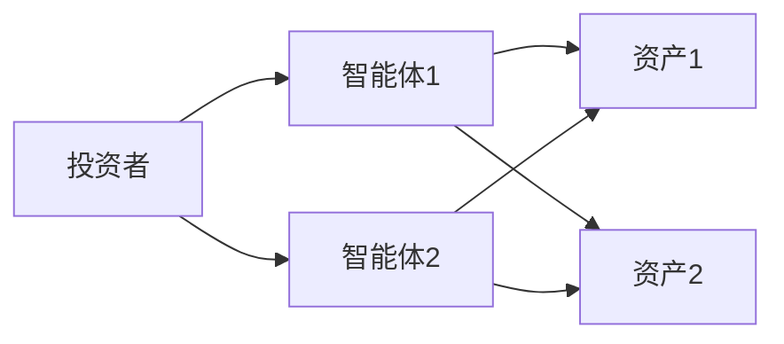
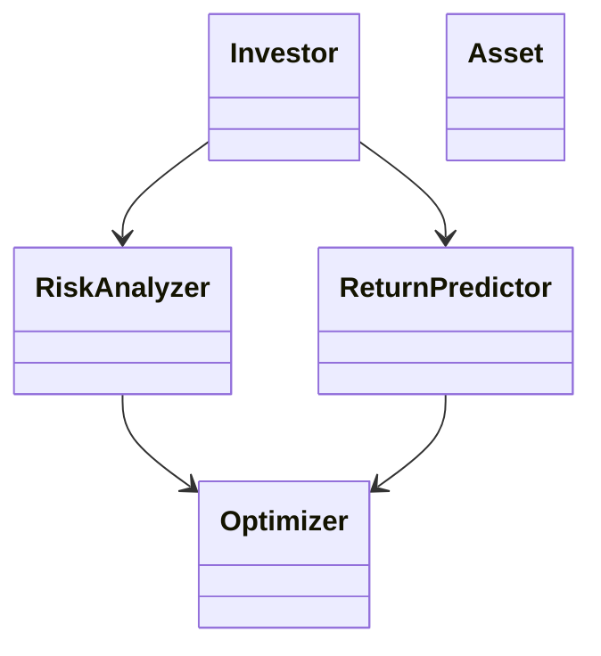
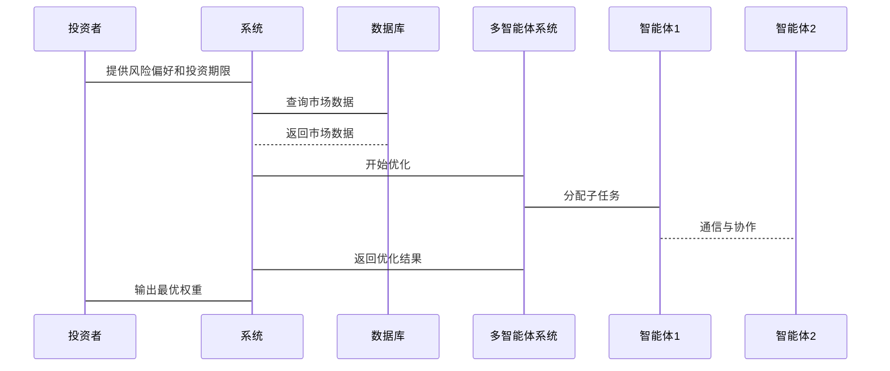

                 


# 利用多智能体AI优化投资组合：价值投资新范式

> **关键词**：多智能体AI、投资组合优化、价值投资、分布式计算、博弈论、系统架构

> **摘要**：本文探讨了利用多智能体人工智能技术优化投资组合的新方法。通过分析多智能体系统的核心原理，结合投资组合优化的数学模型，提出了一种基于多智能体协同优化的投资组合优化方案。文章详细讲解了算法实现步骤，并通过实际案例展示了如何应用这些理论进行投资组合优化。最后，总结了多智能体AI在投资组合优化中的优势，并展望了未来的研究方向。

---

# 第一部分: 利用多智能体AI优化投资组合的背景与概念

## 第1章: 多智能体系统与投资组合优化概述

### 1.1 多智能体系统的基本概念

#### 1.1.1 多智能体系统的定义
多智能体系统（Multi-Agent System, MAS）是由多个智能体组成的系统，这些智能体能够通过协同工作完成复杂的任务。每个智能体都是一个独立的实体，具有感知环境、做出决策和执行动作的能力。

#### 1.1.2 多智能体系统的特征
- **分布式智能**：多个智能体协同工作，而非单一中心化控制。
- **自主性**：每个智能体都具有自主决策的能力。
- **反应性**：智能体能够实时感知环境并做出响应。
- **协作性**：智能体之间通过通信和协作完成共同目标。

#### 1.1.3 多智能体系统与传统AI的区别
传统AI（如专家系统）通常基于规则和知识库进行推理，而多智能体系统强调多个智能体的协作与通信，更加灵活和适应复杂环境。

### 1.2 投资组合优化的基本概念

#### 1.2.1 投资组合的定义与目标
投资组合是指投资者持有的多种资产（如股票、债券等）的集合。投资组合优化的目标是在给定的风险承受能力下，最大化预期收益，或在给定收益下最小化风险。

#### 1.2.2 投资组合优化的核心问题
- **资产配置**：确定不同资产的权重。
- **风险控制**：降低投资组合的整体风险。
- **动态调整**：根据市场变化实时优化投资组合。

#### 1.2.3 传统投资组合优化方法的局限性
传统的优化方法（如均值-方差模型）假设资产价格服从正态分布，且市场是有效的，但在实际中，市场波动、非理性行为等因素可能导致模型失效。

### 1.3 多智能体AI在投资组合优化中的应用前景

#### 1.3.1 多智能体AI的优势
- **分布式计算能力**：能够处理海量数据和复杂任务。
- **适应性**：智能体能够实时适应市场变化。
- **协作优化**：通过智能体之间的协作，实现更优的投资组合。

#### 1.3.2 投资组合优化的新范式
多智能体AI通过分布式计算和协作优化，能够更灵活地应对市场波动，捕捉非线性关系，从而提高投资组合的优化效果。

#### 1.3.3 应用场景与实际案例
- **动态资产配置**：根据市场变化实时调整资产权重。
- **风险管理**：通过智能体协同识别和规避风险。
- **个性化投资**：为不同风险偏好的投资者定制投资组合。

---

# 第二部分: 多智能体AI优化投资组合的核心概念与联系

## 第2章: 多智能体系统与投资组合优化的核心原理

### 2.1 多智能体系统的协同机制

#### 2.1.1 分布式计算与协作
多智能体系统通过分布式计算实现任务分解和协同优化，每个智能体负责一部分计算任务。

#### 2.1.2 多智能体之间的通信与协调
智能体之间通过通信协议交换信息，协调各自的行为以实现共同目标。

#### 2.1.3 博弈论与多智能体决策
博弈论为多智能体决策提供了理论基础，智能体之间的博弈关系可以转化为投资组合优化的数学模型。

### 2.2 投资组合优化的数学模型

#### 2.2.1 投资组合的收益与风险模型
收益：$$ \text{收益} = \sum_{i=1}^{n} w_i r_i $$
风险：$$ \text{风险} = \sqrt{\sum_{i=1}^{n} w_i^2 \sigma_i^2} $$

#### 2.2.2 线性规划与非线性优化
线性规划模型用于解决简单的优化问题，而非线性优化模型（如二次规划）更适合复杂的投资组合优化问题。

#### 2.2.3 现代投资组合理论（MPT）的核心公式
MPT的核心公式是均值-方差模型：
$$ \min_w \sigma^2 \quad \text{subject to} \quad \sum_{i=1}^{n} w_i = 1 $$

### 2.3 多智能体与投资组合优化的结合

#### 2.3.1 多智能体协同优化的数学模型
通过将投资组合优化问题分解为多个子问题，每个子问题由一个智能体负责，最终通过协同优化得到全局最优解。

#### 2.3.2 多智能体系统在投资组合优化中的优势
- **并行计算**：提高优化速度。
- **局部优化**：通过智能体的协作实现全局最优。
- **适应性增强**：智能体能够快速响应市场变化。

#### 2.3.3 实体关系图与流程图（Mermaid）


---

# 第三部分: 多智能体AI优化投资组合的算法原理

## 第3章: 多智能体协同优化算法

### 3.1 多智能体协同优化算法的原理

#### 3.1.1 分布式计算与多智能体协作
算法通过分布式计算将优化任务分解为多个子任务，每个子任务由一个智能体负责。

#### 3.1.2 多智能体系统中的博弈论模型
智能体之间的博弈关系可以转化为数学模型，用于优化投资组合。

#### 3.1.3 算法的收敛性分析
通过分析算法的收敛性，确保优化过程能够快速收敛到全局最优解。

### 3.2 投资组合优化的数学模型与公式

#### 3.2.1 投资组合的收益与风险公式
收益公式：$$ \text{收益} = \sum_{i=1}^{n} w_i r_i $$
风险公式：$$ \text{风险} = \sqrt{\sum_{i=1}^{n} w_i^2 \sigma_i^2} $$

#### 3.2.2 多智能体协同优化的数学模型
通过将优化问题分解为多个子问题，每个子问题由一个智能体负责，最终通过协同优化得到全局最优解。

### 3.3 算法实现步骤

#### 3.3.1 环境安装
需要安装Python、numpy、scipy等库。

#### 3.3.2 代码实现
```python
import numpy as np
from scipy.optimize import minimize

def portfolio_optimization(weights, returns, risks):
    # 定义目标函数
    def objective(weights):
        return np.dot(weights, returns)  # 收益最大化

    # 定义约束条件
    constraints = [
        {'type': 'eq', 'fun': lambda w: np.sum(w) - 1},  # 权重和为1
        {'type': 'ineq', 'fun': lambda w: w[i] >= 0 for i in range(len(weights))}
    ]

    # 使用scipy.optimize进行优化
    result = minimize(objective, weights, constraints=constraints)
    return result.x

# 示例数据
n = 5
weights = np.array([0.2, 0.2, 0.2, 0.2, 0.2])
returns = np.array([0.1, 0.15, 0.12, 0.08, 0.2])
risks = np.array([0.1, 0.2, 0.15, 0.05, 0.3])

optimal_weights = portfolio_optimization(weights, returns, risks)
print("最优权重:", optimal_weights)
```

#### 3.3.3 实际案例分析
通过具体案例分析，展示如何利用多智能体协同优化算法进行投资组合优化，并对比传统方法的优化效果。

---

# 第四部分: 多智能体AI优化投资组合的系统架构

## 第4章: 系统架构设计与实现

### 4.1 问题场景介绍
投资者需要在动态市场中优化投资组合，传统方法难以应对复杂市场环境。

### 4.2 系统功能设计

#### 4.2.1 领域模型（Mermaid类图）


### 4.3 系统架构设计（Mermaid架构图）


### 4.4 系统接口设计

#### 4.4.1 输入接口
- **投资者输入**：风险偏好、投资期限等。
- **市场数据输入**：资产价格、收益率等。

#### 4.4.2 输出接口
- **优化结果**：最优投资组合权重。
- **风险报告**：投资组合的风险评估。

### 4.5 系统交互流程（Mermaid序列图）


---

# 第五部分: 多智能体AI优化投资组合的项目实战

## 第5章: 项目实战与案例分析

### 5.1 环境安装
安装Python、numpy、scipy、pandas等库。

### 5.2 系统核心实现源代码

#### 5.2.1 多智能体协同优化算法实现
```python
import numpy as np
from scipy.optimize import minimize

def portfolio_optimization(weights, returns, risks):
    # 定义目标函数
    def objective(weights):
        return np.dot(weights, returns)  # 收益最大化

    # 定义约束条件
    constraints = [
        {'type': 'eq', 'fun': lambda w: np.sum(w) - 1},  # 权重和为1
        {'type': 'ineq', 'fun': lambda w: w[i] >= 0 for i in range(len(weights))}
    ]

    # 使用scipy.optimize进行优化
    result = minimize(objective, weights, constraints=constraints)
    return result.x

# 示例数据
n = 5
weights = np.array([0.2, 0.2, 0.2, 0.2, 0.2])
returns = np.array([0.1, 0.15, 0.12, 0.08, 0.2])
risks = np.array([0.1, 0.2, 0.15, 0.05, 0.3])

optimal_weights = portfolio_optimization(weights, returns, risks)
print("最优权重:", optimal_weights)
```

#### 5.2.2 系统交互实现
通过API接口实现投资者与系统之间的交互，接收输入并返回优化结果。

### 5.3 实际案例分析

#### 5.3.1 案例描述
假设投资者有5种资产，目标是在风险可控的前提下，最大化投资收益。

#### 5.3.2 数据分析与处理
对历史数据进行分析，计算每种资产的预期收益率和风险。

#### 5.3.3 优化结果解读
通过优化算法得到最优权重，分析优化结果的有效性和可行性。

### 5.4 项目总结

#### 5.4.1 项目成果
成功实现了基于多智能体AI的投资组合优化系统。

#### 5.4.2 经验与教训
在实现过程中，需要注意智能体之间的通信效率和算法的收敛性。

---

# 第六部分: 总结与展望

## 第6章: 总结与展望

### 6.1 本章小结
本文详细探讨了利用多智能体AI优化投资组合的方法，提出了基于多智能体协同优化的新范式，通过实际案例验证了算法的有效性。

### 6.2 最佳实践 Tips
- **数据质量**：确保输入数据的准确性和完整性。
- **算法选择**：根据具体问题选择合适的优化算法。
- **系统维护**：定期更新市场数据和优化模型。

### 6.3 注意事项
- 多智能体系统需要高效的通信机制。
- 算法实现需要考虑计算资源的限制。
- 系统设计需要考虑可扩展性和可维护性。

### 6.4 拓展阅读
推荐读者阅读相关领域的书籍和论文，深入理解多智能体系统和投资组合优化的理论与实践。

---

# 作者：AI天才研究院/AI Genius Institute & 禅与计算机程序设计艺术 /Zen And The Art of Computer Programming

