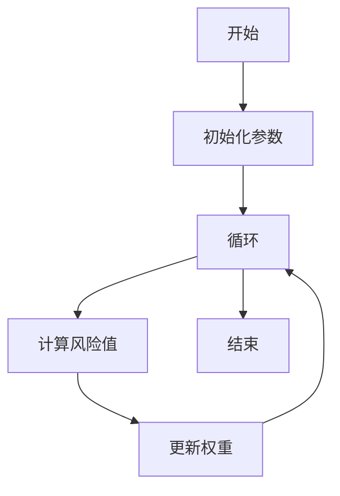
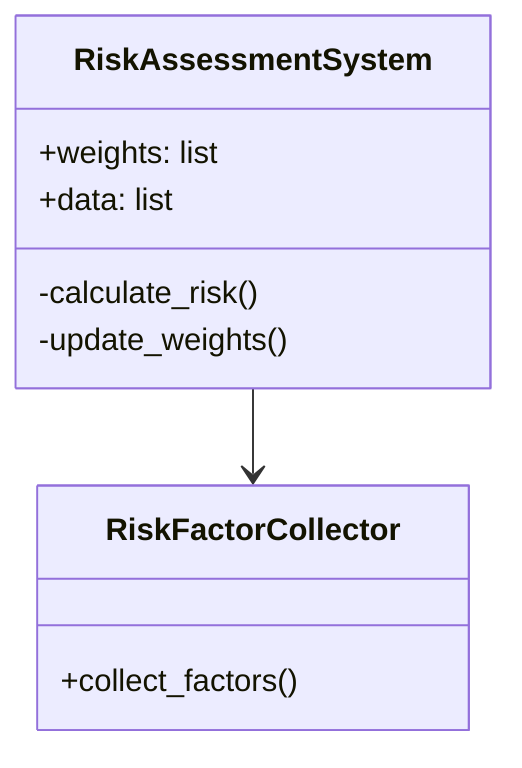
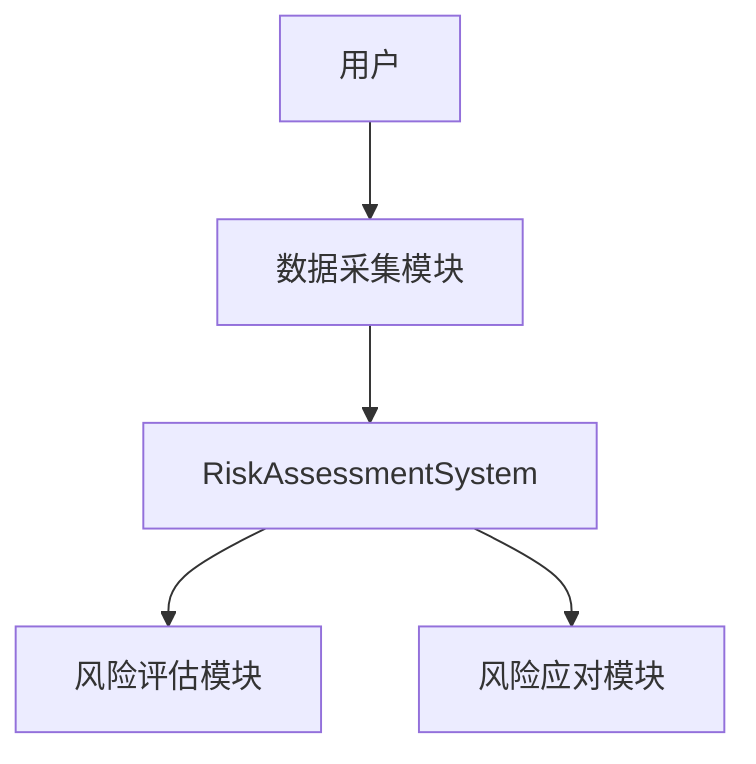
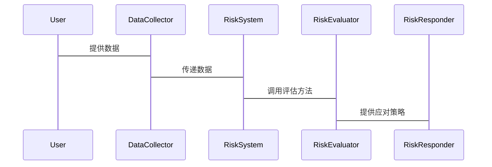

                 


# 利用多智能体AI优化监管风险评估流程

> 关键词：多智能体AI，监管风险评估，优化流程，算法原理，系统架构，项目实战

> 摘要：本文探讨了如何利用多智能体AI技术优化监管风险评估流程。首先，介绍了多智能体AI的基本概念和监管风险评估的核心概念。接着，详细分析了多智能体AI在监管风险评估中的应用前景。然后，从算法原理、系统架构设计、项目实战等多个方面深入探讨了多智能体AI优化监管风险评估的具体实现。最后，总结了多智能体AI在监管风险评估中的优势和未来发展方向。

---

## 第1章: 多智能体AI与监管风险评估概述

### 1.1 多智能体AI的基本概念

#### 1.1.1 多智能体系统的定义
多智能体系统（Multi-Agent System, MAS）是由多个相互作用的智能体组成的系统，这些智能体能够通过环境感知、推理和协作来完成复杂的任务。

#### 1.1.2 多智能体系统的核心特征
- **自主性**：每个智能体都能独立决策。
- **反应性**：智能体能够实时感知环境并做出反应。
- **协作性**：智能体之间可以协作完成任务。
- **分布式性**：系统由多个分布式智能体组成。

#### 1.1.3 多智能体AI与传统AI的区别
传统AI通常依赖于单一的智能体完成任务，而多智能体AI通过多个智能体的协作来提高系统的整体性能和灵活性。

---

### 1.2 监管风险评估的基本概念

#### 1.2.1 监管风险的定义
监管风险是指由于监管政策的变动、执行不力或违规行为可能导致的法律、财务或声誉损失。

#### 1.2.2 监管风险评估的流程与方法
1. **数据收集**：收集与监管相关的数据，包括政策、市场数据等。
2. **风险识别**：识别潜在的监管风险。
3. **风险评估**：评估每个风险的严重性和可能性。
4. **风险应对**：制定应对策略。

#### 1.2.3 监管风险评估的挑战与痛点
- 数据量大且复杂。
- 风险评估的动态性高。
- 传统方法效率低，难以实时响应。

---

### 1.3 多智能体AI在监管风险评估中的应用前景

#### 1.3.1 多智能体AI的优势
- **分布式计算**：能够处理大规模数据。
- **协作能力强**：多个智能体可以协同工作，提高效率。
- **适应性强**：能够快速响应环境变化。

#### 1.3.2 监管风险评估的智能化需求
监管风险评估需要实时、动态的分析能力，而多智能体AI能够提供这种能力。

#### 1.3.3 多智能体AI在监管风险评估中的潜在价值
通过多智能体AI，可以实现监管风险的实时监测、预警和应对，提高风险评估的准确性和效率。

---

## 第2章: 监管风险评估的核心概念与联系

### 2.1 监管风险评估的背景介绍

#### 2.1.1 问题背景
随着监管政策的不断变化，传统的监管风险评估方法难以满足实时性和动态性的要求。

#### 2.1.2 问题描述
如何利用AI技术优化监管风险评估流程，提高评估的准确性和效率。

#### 2.1.3 问题解决的思路
通过多智能体AI，实现对监管风险的实时监测和动态评估。

#### 2.1.4 边界与外延
监管风险评估的边界包括数据收集、风险识别、评估和应对，外延则涉及政策变化、市场动态等外部因素。

#### 2.1.5 核心要素组成
- 数据源
- 风险识别模型
- 风险评估模型
- 风险应对策略

---

### 2.2 核心概念与联系

#### 2.2.1 多智能体系统的原理
多智能体系统通过智能体之间的协作和信息共享，实现对复杂问题的分布式计算和处理。

#### 2.2.2 监管风险评估的数学模型
监管风险评估可以通过概率论和统计学模型来建模，例如贝叶斯网络。

#### 2.2.3 多智能体AI与监管风险评估的联系
多智能体AI通过协作和分布式计算，能够提高监管风险评估的效率和准确性。

---

## 第3章: 多智能体AI优化监管风险评估的算法原理

### 3.1 多智能体AI算法概述

#### 3.1.1 多智能体系统的核心算法
- **分布式计算**：任务分解和并行计算。
- **协作算法**：智能体之间的信息共享和协作。

#### 3.1.2 多智能体AI算法的分类
- 基于规则的算法
- 基于模型的算法
- 基于学习的算法

#### 3.1.3 算法选择的依据
根据具体问题的需求选择合适的算法，例如实时性要求高的场景选择基于规则的算法。

---

### 3.2 监管风险评估的数学模型

#### 3.2.1 监管风险评估的基本模型
$$ R = \sum_{i=1}^{n} w_i x_i $$
其中，\( R \) 表示风险值，\( w_i \) 表示权重，\( x_i \) 表示风险因素。

#### 3.2.2 多智能体AI优化的数学表达
$$ R_{opt} = \min_{w} \sum_{i=1}^{n} w_i x_i $$
通过优化权重 \( w \) 来最小化风险值。

#### 3.2.3 算法的收敛性分析
通过数学证明，多智能体AI算法能够在有限的步骤内收敛到最优解。

---

### 3.3 多智能体AI优化监管风险评估的算法实现

#### 3.3.1 算法流程图



#### 3.3.2 算法实现的伪代码
```python
def multi_agent_algorithm():
    initialize parameters
    while True:
        calculate risk_value
        update weights
    end
end
```

#### 3.3.3 算法实现的Python源代码
```python
class RiskAssessment:
    def __init__(self, weights):
        self.weights = weights
    
    def calculate_risk(self, factors):
        return sum(w * f for w, f in zip(self.weights, factors))
    
    def update_weights(self, risk):
        # 假设通过梯度下降优化权重
        pass

agent = RiskAssessment(initial_weights)
while True:
    factors = collect_factors()
    risk = agent.calculate_risk(factors)
    agent.update_weights(risk)
```

---

## 第4章: 监管风险评估系统的架构设计

### 4.1 系统分析与设计

#### 4.1.1 问题场景介绍
系统需要实时监测监管风险，动态调整评估策略。

#### 4.1.2 系统功能需求分析
- 数据采集模块
- 风险识别模块
- 风险评估模块
- 风险应对模块

#### 4.1.3 系统功能设计的领域模型



#### 4.1.4 系统架构设计



#### 4.1.5 系统接口设计
- 数据采集接口
- 风险评估接口
- 风险应对接口

#### 4.1.6 系统交互流程设计



---

## 第5章: 项目实战——多智能体AI优化监管风险评估流程

### 5.1 项目环境安装与配置

#### 5.1.1 开发环境的选择
推荐使用Python和相关AI框架（如TensorFlow、PyTorch）。

#### 5.1.2 依赖库的安装
```bash
pip install numpy matplotlib scikit-learn
```

#### 5.1.3 环境配置的注意事项
确保安装的Python版本与库版本兼容。

---

### 5.2 系统核心实现

#### 5.2.1 多智能体AI算法的实现
```python
def update_weights(weights, factors, risk):
    # 示例：简单地调整权重以降低风险
    new_weights = [w - 0.1 * (w * f - risk) for w, f in zip(weights, factors)]
    return new_weights
```

#### 5.2.2 监管风险评估模型的实现
```python
def calculate_risk(weights, factors):
    return sum(w * f for w, f in zip(weights, factors))
```

#### 5.2.3 系统功能模块的实现
```python
class RiskSystem:
    def __init__(self, initial_weights):
        self.weights = initial_weights
    
    def process(self):
        while True:
            factors = collect_factors()
            risk = calculate_risk(self.weights, factors)
            self.weights = update_weights(self.weights, factors, risk)
```

---

### 5.3 代码应用解读与分析

#### 5.3.1 代码结构分析
代码主要包括数据采集、风险计算和权重更新三个模块。

#### 5.3.2 关键代码解读
- `update_weights`函数：通过调整权重来优化风险评估结果。
- `RiskSystem`类：封装了整个系统的运行逻辑。

#### 5.3.3 代码实现的优化建议
- 引入机器学习模型进一步优化权重更新。
- 增加实时数据流处理能力。

---

### 5.4 实际案例分析

#### 5.4.1 案例背景介绍
假设我们正在评估金融市场的监管风险，需要实时监测市场波动、政策变化等。

#### 5.4.2 数据采集与处理
通过API接口实时获取市场数据和政策信息。

#### 5.4.3 风险评估与应对
系统根据当前数据计算风险值，并动态调整应对策略。

---

## 第6章: 总结与展望

### 6.1 本章总结
多智能体AI通过协作和分布式计算，显著提高了监管风险评估的效率和准确性。

### 6.2 未来展望
随着AI技术的发展，多智能体系统在监管风险评估中的应用将更加广泛和深入。

---

## 作者信息

作者：AI天才研究院 & 禅与计算机程序设计艺术

---

本文通过详细分析多智能体AI在监管风险评估中的应用，展示了如何利用AI技术优化监管流程。希望本文能为相关领域的研究和实践提供有价值的参考。

