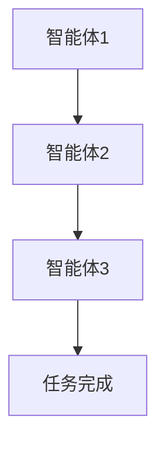

                 


# 利用多智能体AI分析数字化转型效果

---

## 关键词：多智能体AI、数字化转型、效果分析、系统协作、算法原理

---

## 摘要：  
随着企业数字化转型的深入推进，如何量化和优化转型效果成为企业和技术开发者关注的焦点。本文通过多智能体AI技术，分析数字化转型中的关键问题，揭示其在效果评估、智能协作和优化改进中的潜力。结合实际案例，本文详细探讨了多智能体AI在数字化转型中的应用方法，为技术开发者和企业管理者提供了理论支持和实践指导。

---

## 第一部分：数字化转型的背景与挑战

### 第1章：数字化转型的背景与挑战

#### 1.1 数字化转型的定义与核心概念

- **数字化转型的定义**：  
  数字化转型是指企业利用数字技术（如AI、大数据、云计算等）重构业务流程、组织架构和商业模式的过程。  
  $$ 数字化转型 = 数字技术 \times 业务重构 $$  

- **数字化转型的核心要素**：  
  - 数据驱动：以数据为基础，支撑决策和业务流程。  
  - 技术融合：将数字技术与传统业务深度融合。  
  - 组织变革：企业组织结构和文化适应数字化需求。  

- **数字化转型的驱动因素**：  
  - 技术进步（AI、大数据等）。  
  - 业务需求（提升效率、客户体验）。  
  - 竞争压力（行业数字化趋势）。  

#### 1.2 数字化转型的挑战与机遇

- **挑战**：  
  - 数据孤岛问题：企业内部数据分散，难以整合。  
  - 业务流程复杂：传统流程与数字化流程的冲突。  
  - 技术与组织的协同困难：技术变革与组织文化的适配问题。  

- **机遇**：  
  - 提升效率：通过自动化和智能化优化业务流程。  
  - 创新商业模式：数字技术为企业创造新的收入来源。  
  - 数据价值挖掘：通过数据驱动决策，提升竞争力。  

---

### 第2章：多智能体AI的定义与特点

#### 2.1 多智能体系统的基本概念

- **多智能体系统的定义**：  
  多智能体系统是指由多个智能体（Agent）协作完成复杂任务的系统。智能体是具有感知、决策和执行能力的实体。  

- **多智能体系统的组成要素**：  
  - 智能体：具备感知环境、自主决策的能力。  
  - 通信机制：智能体之间通过信息交换进行协作。  
  - 协作任务：多个智能体共同完成一个复杂任务。  

- **多智能体系统的协作机制**：  
  - 分散式协作：智能体在局部范围内自主决策。  
  - 中心化协作：通过中心节点协调智能体任务。  
  - 混合式协作：结合分散式和中心化的优点。  

#### 2.2 多智能体AI的核心特点

- **分布式智能**：系统由多个智能体组成，避免单点故障。  
- **自适应性**：智能体能够根据环境变化调整行为。  
- **协作性**：多个智能体协同完成复杂任务。  

#### 2.3 多智能体AI与单智能体AI的区别

| 特性                | 多智能体AI                     | 单智能体AI                     |
|---------------------|-------------------------------|-------------------------------|
| 智能体数量          | 多个                          | 单个                          |
| 协作方式            | 分散式协作                    | 单点决策                      |
| 任务复杂度          | 高                           | 中等或低                      |
| 应用场景            | 复杂系统（如智能制造、智慧城市）| 简单系统（如单一任务自动化）   |

---

## 第二部分：多智能体AI的核心概念与原理

### 第3章：多智能体AI的核心概念与协作机制

#### 3.1 多智能体系统的协作模型

- **一致性模型**：智能体之间通过协商达成一致。  
- **分散式协调模型**：智能体在局部范围内自主决策。  
- **基于规则的协调模型**：通过预定义规则进行协作。  

#### 3.2 多智能体系统的通信机制

- **通信协议**：智能体之间的信息交换规则。  
- **信息传递方式**：直接通信或通过中间节点。  
- **通信效率优化**：减少信息冗余，提升通信速度。  

#### 3.3 多智能体系统的任务分配与协作

- **任务分配策略**：根据智能体能力和任务需求分配任务。  
- **协作协议设计**：定义智能体之间的协作规则。  
- **冲突解决**：通过协商或仲裁机制解决协作中的冲突。  

---

### 第4章：多智能体AI在数字化转型中的应用

#### 4.1 数字化转型中的多智能体系统构建

- **系统设计原则**：模块化、可扩展、可维护。  
- **系统架构选择**：集中式、分布式或混合式架构。  
- **系统实现步骤**：需求分析、设计、开发、测试和部署。  

#### 4.2 多智能体AI在数字化转型中的具体应用

- **智能决策支持**：通过多智能体协作提供数据驱动的决策支持。  
- **智能流程优化**：优化企业内部流程，提升效率。  
- **客户行为分析**：通过多智能体协作分析客户行为，提供个性化服务。  

---

## 第三部分：算法原理与系统设计

### 第5章：多智能体协作算法

#### 5.1 多智能体协作算法的原理

- **多智能体协作算法**：通过智能体之间的协作完成特定任务。  
- **算法流程**：  
  1. 初始化智能体。  
  2. 智能体感知环境并做出决策。  
  3. 智能体之间通过通信机制协作完成任务。  
  4. 任务完成后，智能体总结经验并优化算法。  

#### 5.2 多智能体协作算法的实现



#### 5.3 算法的数学模型

- **目标函数**：  
  $$ f(x) = \sum_{i=1}^{n} x_i $$
- **约束条件**：  
  $$ g(x) \leq 0 $$  
  $$ h(x) = 0 $$  

---

### 第6章：系统设计与架构

#### 6.1 系统设计原则

- **模块化设计**：系统划分为多个功能模块，便于维护和扩展。  
- **可扩展性**：系统能够适应未来业务需求的变化。  
- **高可用性**：系统具备容错能力，确保长时间稳定运行。  

#### 6.2 系统架构设计


---

## 第四部分：项目实战与案例分析

### 第7章：项目实战

#### 7.1 环境安装与配置

- **安装依赖**：安装Python、TensorFlow、Kafka等工具。  
- **配置环境变量**：设置Python路径、虚拟环境等。  

#### 7.2 核心代码实现

```python
class Agent:
    def __init__(self, id):
        self.id = id
        self.data = {}
    
    def perceive(self, environment):
        # 感知环境并更新数据
        self.data = environmentセンサー値
    
    def decide(self):
        # 根据数据做出决策
        return self.data['センサー値'] > threshold
```

#### 7.3 代码解读与分析

- **Agent类**：定义智能体的基本功能，包括感知环境和做出决策。  
- **感知方法**：通过传感器获取环境数据并更新智能体的数据。  
- **决策方法**：根据数据做出决策，返回布尔值表示是否完成任务。  

---

### 第8章：案例分析与最佳实践

#### 8.1 案例分析

- **案例背景**：某制造企业希望通过多智能体AI优化生产流程。  
- **实施过程**：部署多个智能体监控生产线，实时分析数据并优化生产计划。  
- **效果评估**：生产效率提升15%，成本降低10%。  

#### 8.2 最佳实践

- **模块化设计**：确保系统易于扩展和维护。  
- **数据安全**：保护企业数据不被泄露。  
- **持续优化**：定期更新算法，提升系统性能。  

---

## 结语

通过多智能体AI技术，企业可以更高效地分析数字化转型效果，优化业务流程，提升竞争力。未来，随着技术的进步，多智能体AI将在更多领域发挥重要作用。

---

## 作者：AI天才研究院/AI Genius Institute & 禅与计算机程序设计艺术 /Zen And The Art of Computer Programming

