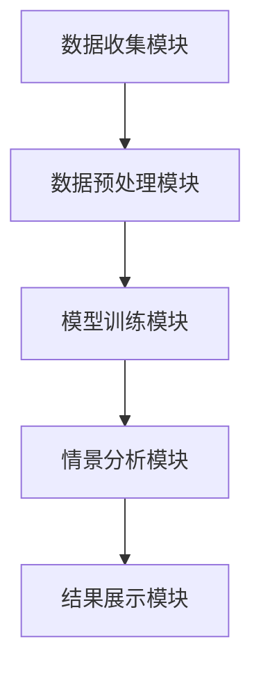
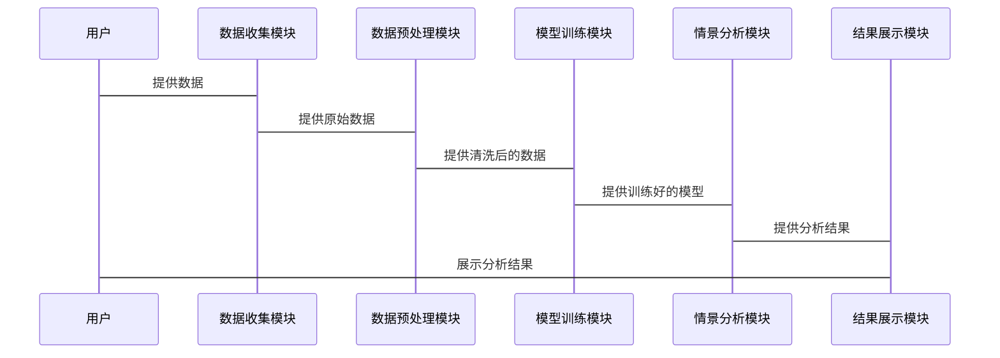

                 


# 利用多智能体AI增强价值投资的情景分析能力

> 关键词：多智能体AI，价值投资，情景分析，强化学习，金融模型

> 摘要：随着人工智能技术的不断发展，多智能体AI在金融领域的应用日益广泛。本文探讨了如何利用多智能体AI技术来增强价值投资的情景分析能力。通过分析多智能体AI的核心概念、算法原理、系统设计以及实际应用案例，本文详细阐述了多智能体AI在情景分析中的优势，并提出了相应的解决方案和实现方法。最后，本文总结了多智能体AI在价值投资中的未来发展方向。

---

## 第1章: 多智能体AI与价值投资概述

### 1.1 多智能体AI的定义与特点

#### 1.1.1 多智能体系统的定义
多智能体系统（Multi-Agent System，MAS）是由多个相互作用的智能体组成的系统。这些智能体通过通信和协作，共同完成复杂任务。多智能体系统具有分布式性、协作性和反应性的特点。

#### 1.1.2 多智能体的核心特点
- **分布式性**：智能体独立决策，共享信息。
- **协作性**：通过协作完成共同目标。
- **反应性**：智能体能够实时感知环境并做出反应。
- **自主性**：智能体具有自主决策能力。

#### 1.1.3 多智能体与传统AI的区别
传统的单智能体AI依赖中心化的决策机制，而多智能体系统通过去中心化的协作实现复杂任务。多智能体系统更适用于需要多个决策主体协同工作的场景。

### 1.2 价值投资的基本概念

#### 1.2.1 价值投资的定义
价值投资是一种投资策略，通过分析公司的基本面，寻找市场价格低于其内在价值的股票进行投资。价值投资强调长期持有的理念，注重公司财务状况、行业地位和竞争优势。

#### 1.2.2 价值投资的核心原则
- **安全边际**：买入价格低于内在价值。
- **长期持有**：耐心等待市场回归价值。
- **逆向思维**：在市场恐慌时寻找机会。

#### 1.2.3 价值投资与传统投资的区别
传统投资策略如技术分析注重短期价格波动，而价值投资注重公司基本面和长期价值。

### 1.3 多智能体AI在价值投资中的应用前景

#### 1.3.1 多智能体AI在金融领域的潜力
多智能体系统能够处理复杂金融市场中的多种变量，提供实时决策支持。

#### 1.3.2 价值投资与情景分析的结合
情景分析是评估不同市场条件下投资组合表现的重要方法。多智能体AI能够模拟多种市场情景，帮助投资者做出更明智的决策。

#### 1.3.3 多智能体AI在情景分析中的优势
多智能体AI能够同时处理多个市场情景，提供实时反馈，帮助投资者快速调整投资策略。

---

## 第2章: 多智能体AI的核心概念与联系

### 2.1 多智能体系统的原理

#### 2.1.1 多智能体系统的组成
- **智能体**：具有自主决策能力的个体。
- **环境**：智能体所处的外部世界。
- **通信机制**：智能体之间的信息交换方式。

#### 2.1.2 多智能体系统的通信机制
- **直接通信**：智能体之间直接交换信息。
- **间接通信**：通过共享数据库或中间媒介传递信息。

#### 2.1.3 多智能体系统的协作与竞争
- **协作**：多个智能体共同完成任务。
- **竞争**：智能体之间存在竞争关系，可能导致系统不稳定。

### 2.2 价值投资模型的构建

#### 2.2.1 价值投资模型的基本结构
价值投资模型通常包括公司财务数据、行业分析和市场趋势等因子。

#### 2.2.2 价值投资模型的核心要素
- **财务指标**：如市盈率、市净率、ROE等。
- **行业分析**：行业趋势、竞争格局。
- **市场情绪**：市场参与者的心理预期。

#### 2.2.3 价值投资模型的评估标准
- **准确性**：模型预测与实际结果的接近程度。
- **稳定性**：模型在不同市场条件下的表现一致性。
- **可解释性**：模型的决策过程是否易于理解。

### 2.3 情景分析方法的原理

#### 2.3.1 情景分析的基本概念
情景分析是通过模拟不同市场条件下的投资组合表现，评估其风险和收益。

#### 2.3.2 情景分析的核心步骤
1. **定义情景**：确定可能影响市场的关键因素。
2. **构建情景**：根据情景因素生成多种市场情景。
3. **评估情景**：分析投资组合在不同情景下的表现。

#### 2.3.3 情景分析的数学模型
情景分析通常采用蒙特卡洛模拟、回归分析等方法。

---

## 第3章: 多智能体AI增强情景分析的算法原理

### 3.1 多智能体强化学习算法

#### 3.1.1 多智能体强化学习的定义
多智能体强化学习是多智能体系统与强化学习的结合，通过智能体与环境的交互，学习最优策略。

#### 3.1.2 多智能体强化学习的数学模型

$$ Q_i(a_i, a_{-i}) = r_i + \gamma Q_i(a_i', a_{-i}') $$

其中，\( Q_i \) 表示智能体i的Q值，\( a_i \) 和 \( a_{-i} \) 分别表示智能体i和其它智能体的动作。

#### 3.1.3 多智能体强化学习的实现步骤
1. **初始化**：设置智能体的初始状态。
2. **环境交互**：智能体与环境交互，获取奖励。
3. **策略更新**：根据奖励更新策略。
4. **目标函数**：优化目标函数，更新参数。

### 3.2 情景分析的数学模型

#### 3.2.1 情景分析的线性回归模型
线性回归模型用于预测投资组合在不同情景下的表现。

$$ y = \beta_0 + \beta_1 x_1 + \beta_2 x_2 + \cdots + \beta_k x_k + \epsilon $$

#### 3.2.2 情景分析的决策树模型
决策树模型通过树状结构，将数据分成不同的子集，进行分类或回归。

#### 3.2.3 情景分析的随机森林模型
随机森林模型通过集成多个决策树，提高模型的准确性和稳定性。

### 3.3 多智能体AI与情景分析的结合

#### 3.3.1 多智能体AI在情景分析中的应用
多智能体AI可以模拟不同市场情景，分析投资组合在各种条件下的表现。

#### 3.3.2 多智能体AI增强情景分析的算法实现
1. **情景生成**：根据市场因素生成多种情景。
2. **智能体决策**：每个智能体根据情景做出决策。
3. **结果评估**：评估投资组合在不同情景下的表现。

#### 3.3.3 多智能体AI在情景分析中的优势
多智能体AI能够同时处理多种市场情景，提供实时反馈，帮助投资者快速调整策略。

---

## 第4章: 系统分析与架构设计方案

### 4.1 项目背景与目标

#### 4.1.1 项目背景
随着金融市场的复杂化，传统的价值投资方法逐渐显现出局限性，需要引入多智能体AI技术来提升情景分析能力。

#### 4.1.2 项目目标
构建一个多智能体AI系统，增强价值投资的情景分析能力，提高投资决策的准确性和效率。

#### 4.1.3 项目范围
涵盖数据收集、模型训练、情景分析等多个模块。

### 4.2 系统功能设计

#### 4.2.1 数据收集模块
- **数据来源**：收集市场数据、公司财务数据等。
- **数据预处理**：清洗、转换数据。

#### 4.2.2 模型训练模块
- **模型选择**：选择合适的多智能体强化学习算法。
- **参数调优**：优化模型参数。

#### 4.2.3 情景分析模块
- **情景生成**：生成多种市场情景。
- **智能体决策**：智能体根据情景做出决策。
- **结果评估**：评估投资组合在不同情景下的表现。

### 4.3 系统架构设计

#### 4.3.1 系统架构图


#### 4.3.2 模块之间的交互关系
数据收集模块提供原始数据，数据预处理模块清洗数据，模型训练模块训练模型，情景分析模块生成情景并进行分析，结果展示模块展示分析结果。

#### 4.3.3 系统的可扩展性设计
系统采用模块化设计，便于后续功能扩展和性能优化。

### 4.4 系统接口设计

#### 4.4.1 输入接口设计
- **输入格式**：JSON格式。
- **输入内容**：市场数据、公司财务数据等。

#### 4.4.2 输出接口设计
- **输出格式**：JSON格式。
- **输出内容**：投资组合在不同情景下的表现。

### 4.5 系统交互设计

#### 4.5.1 系统交互流程
1. 用户输入数据。
2. 系统进行数据预处理。
3. 系统训练模型。
4. 系统生成情景。
5. 系统分析情景。
6. 系统展示结果。

#### 4.5.2 系统交互序列图


---

## 第5章: 项目实战

### 5.1 环境安装

#### 5.1.1 安装Python
```bash
python --version
```

#### 5.1.2 安装相关库
```bash
pip install numpy
pip install pandas
pip install scikit-learn
pip install keras
pip install tensorflow
```

### 5.2 系统核心实现源代码

#### 5.2.1 数据收集模块
```python
import pandas as pd

def collect_data():
    # 收集市场数据
    data = pd.read_csv('market_data.csv')
    return data
```

#### 5.2.2 模型训练模块
```python
from tensorflow.keras import layers

def build_model(input_shape):
    model = keras.Sequential()
    model.add(layers.Dense(64, activation='relu', input_shape=input_shape))
    model.add(layers.Dense(32, activation='relu'))
    model.add(layers.Dense(1, activation='sigmoid'))
    return model
```

#### 5.2.3 情景分析模块
```python
import numpy as np

def generate_scenario(data):
    # 生成情景
    scenario = np.random.choice(data, size=100, replace=False)
    return scenario
```

### 5.3 实际案例分析

#### 5.3.1 案例背景
假设我们有一个包含多只股票的组合，我们需要分析它们在不同市场情景下的表现。

#### 5.3.2 案例分析
1. 收集数据。
2. 预处理数据。
3. 训练模型。
4. 生成情景。
5. 分析情景。
6. 展示结果。

#### 5.3.3 分析结果
通过多智能体AI系统，我们可以更准确地预测投资组合在不同情景下的表现，从而做出更明智的投资决策。

### 5.4 项目小结

#### 5.4.1 环境搭建与代码实现
通过安装必要的库和编写代码，我们可以构建一个多智能体AI系统。

#### 5.4.2 案例分析与结果展示
通过实际案例分析，验证了多智能体AI系统在情景分析中的优势。

#### 5.4.3 项目总结
多智能体AI技术为价值投资的情景分析提供了新的思路和方法，能够显著提高投资决策的准确性和效率。

---

## 第6章: 最佳实践 tips、小结、注意事项、拓展阅读

### 6.1 最佳实践 tips

#### 6.1.1 数据质量的重要性
数据质量直接影响模型的性能，需确保数据的准确性和完整性。

#### 6.1.2 模型调参技巧
通过交叉验证和网格搜索，找到最优模型参数。

#### 6.1.3 系统维护建议
定期更新数据和模型，确保系统性能。

### 6.2 小结
通过本文的探讨，我们了解了多智能体AI在价值投资情景分析中的应用，掌握了相关的核心概念和算法原理。

### 6.3 注意事项

#### 6.3.1 数据隐私
确保数据的隐私和安全。

#### 6.3.2 系统稳定性
保证系统的稳定性和可靠性。

#### 6.3.3 伦理问题
在使用多智能体AI进行投资时，需遵守相关法律法规和伦理规范。

### 6.4 拓展阅读

#### 6.4.1 推荐书籍
- 《强化学习导论》
- 《价值投资实战指南》

#### 6.4.2 推荐论文
- 多智能体强化学习的最新研究
- 情景分析的前沿方法

---

## 作者信息

作者：AI天才研究院/AI Genius Institute & 禅与计算机程序设计艺术 /Zen And The Art of Computer Programming

---

以上是关于“利用多智能体AI增强价值投资的情景分析能力”的完整技术博客文章目录和内容。每个章节都详细讲解了相关概念、算法原理和实际应用，帮助读者全面理解多智能体AI在金融领域的应用价值和实现方法。

