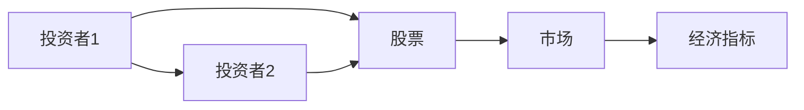
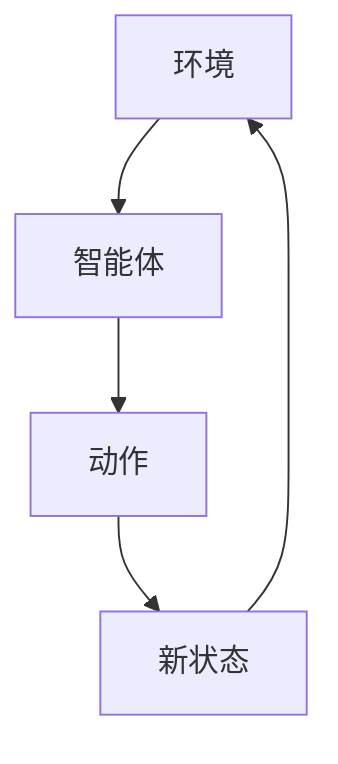
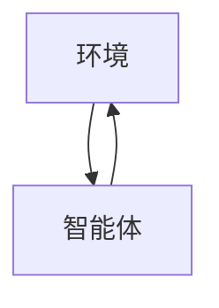
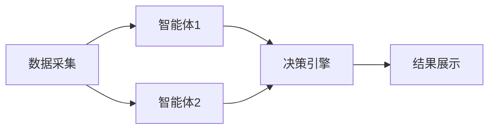

                 


# 利用多智能体AI增强价值投资的长期回报预测

**关键词：** 多智能体AI，价值投资，长期回报预测，强化学习，股票预测，投资策略

**摘要：**  
本文探讨了如何利用多智能体人工智能技术来增强价值投资的长期回报预测能力。通过分析多智能体AI的核心原理，结合实际案例，展示了其在股票市场中的应用优势。文章详细阐述了多智能体AI的算法原理、系统架构设计，以及如何通过实际项目实现对股票市场的长期回报预测。最终，本文提出了一套基于多智能体AI的投资策略，为投资者提供了新的视角和工具。

---

## 第一章：多智能体AI与价值投资的背景

### 1.1 多智能体AI的定义与特点
多智能体AI是指由多个相互作用的智能体组成的系统，这些智能体能够通过协作或竞争来完成复杂任务。与传统单智能体AI相比，多智能体AI具有以下特点：
- **分布式智能**：每个智能体独立决策，但通过通信协作完成整体目标。
- **动态交互**：智能体之间实时交互，适应环境变化。
- **任务分工**：每个智能体专注于特定任务，提高整体效率。

### 1.2 价值投资的定义与特点
价值投资是一种以低于内在价值的价格买入优质股票的投资策略，其核心在于寻找被市场低估的资产。价值投资的特点包括：
- **长期视角**：注重长期回报，而非短期波动。
- **基本面分析**：依赖财务报表等基本面数据进行决策。
- **低风险高收益**：通过精选优质资产降低风险，追求稳定收益。

### 1.3 多智能体AI在价值投资中的应用背景
传统价值投资依赖人工分析，存在效率低、覆盖面窄等问题。多智能体AI的引入为价值投资带来了新的可能性：
- **数据处理能力**：能够快速分析海量数据，发现潜在投资机会。
- **动态适应能力**：实时调整投资策略，应对市场变化。
- **分布式决策**：多个智能体协同工作，提高决策的准确性和鲁棒性。

---

## 第二章：多智能体AI的核心原理

### 2.1 多智能体系统的构成
多智能体系统由多个智能体、环境和通信机制组成。智能体之间通过共享信息或直接交互，完成复杂任务。

#### 实体关系图（ER图）


### 2.2 多智能体AI与价值投资的关系
多智能体AI通过分工协作，优化投资决策。其优势体现在：
- **协作性**：多个智能体分别关注不同的市场因素，如宏观经济、公司财务、技术指标等。
- **竞争性**：智能体之间通过竞争优化决策，避免过度依赖单一信息源。
- **适应性**：系统能够动态调整策略，适应市场变化。

#### 概念对比表格
| 概念 | 多智能体AI | 价值投资 |
|------|------------|----------|
| 核心 | 分布式智能 | 低买高卖 |
| 特点 | 协作与竞争 | 基于基本面 |
| 应用 | 自动化决策 | 长期收益预测 |

### 2.3 多智能体AI的算法原理
多智能体AI的算法设计是其核心。常见的算法包括分布式Q-learning和Actor-Critic算法。

#### 分布式Q-learning流程图


#### 数学模型与公式
- **Q-learning公式**
  $$ Q(s, a) = Q(s, a) + \alpha (r + \gamma \max Q(s', a') - Q(s, a)) $$
- **Actor-Critic公式**
  $$ \nabla \theta = \frac{\partial}{\partial \theta} (\log \pi(a|s) \cdot Q(s,a)) $$

---

## 第三章：多智能体AI的算法实现

### 3.1 环境与智能体交互
智能体通过与环境交互，获取状态、执行动作并获得奖励。环境状态包括市场数据、经济指标等。

#### 环境与智能体交互流程图


### 3.2 智能体协作机制
智能体之间通过共享信息或直接交互，完成任务分工。协作机制包括：
- **信息共享**：智能体定期交换信息，优化决策。
- **任务分配**：根据智能体能力，分配不同任务。

### 3.3 实际案例分析
以股票价格预测为例，智能体分别负责分析宏观经济、公司财务和技术指标，最终形成投资决策。

#### 股票价格预测案例
- **数据来源**：市场数据、公司财报、经济指标。
- **智能体分工**：
  - 智能体1：分析宏观经济指标。
  - 智能体2：分析公司财务数据。
  - 智能体3：分析技术指标（如均线、成交量）。

---

## 第四章：系统分析与架构设计

### 4.1 系统架构设计
系统架构包括数据采集、智能体交互、决策引擎和结果展示四个部分。

#### 系统架构图


### 4.2 系统功能设计
- **数据采集**：收集市场数据、经济指标等。
- **智能体交互**：智能体之间协作或竞争，生成投资策略。
- **决策引擎**：整合智能体决策，生成最终投资建议。
- **结果展示**：以可视化方式展示投资结果和预测。

---

## 第五章：项目实战与代码实现

### 5.1 环境安装
- **Python环境**：安装Python 3.8以上版本。
- **依赖库**：安装numpy、pandas、scikit-learn、tensorflow等。

### 5.2 核心代码实现
以下是一个简单的多智能体AI预测股票价格的代码示例。

```python
import numpy as np
import pandas as pd
import tensorflow as tf

# 定义智能体类
class Agent:
    def __init__(self, state_dim, action_dim):
        self.state_dim = state_dim
        self.action_dim = action_dim
        self.model = self.build_model()

    def build_model(self):
        model = tf.keras.Sequential([
            tf.keras.layers.Dense(64, activation='relu', input_dim=self.state_dim),
            tf.keras.layers.Dense(self.action_dim, activation='linear')
        ])
        return model

    def act(self, state):
        prediction = self.model.predict(np.array([state]))[0]
        return np.argmax(prediction)

# 初始化环境和智能体
state_dim = 6  # 状态维度，如宏观经济指标
action_dim = 3  # 动作维度，如买入、持有、卖出

agent = Agent(state_dim, action_dim)
```

### 5.3 案例分析与结果展示
通过训练智能体，我们可以得到股票价格的预测结果，并生成投资建议。

---

## 第六章：总结与展望

### 6.1 总结
多智能体AI通过协作与竞争，显著提升了价值投资的长期回报预测能力。其优势体现在数据处理能力、动态适应能力和决策准确性上。

### 6.2 展望
未来，随着AI技术的进步，多智能体AI在投资领域的应用将更加广泛。可能的发展方向包括：
- **更复杂的智能体协作机制**：如多层次协作结构。
- **结合其他技术**：如区块链技术，提升系统的安全性和透明度。

---

## 作者：AI天才研究院 & 禅与计算机程序设计艺术

---

本文通过详细分析多智能体AI的核心原理和实际应用，展示了其在价值投资中的巨大潜力。希望本文能够为投资者和相关领域研究者提供新的思路和工具，推动投资领域的智能化发展。

