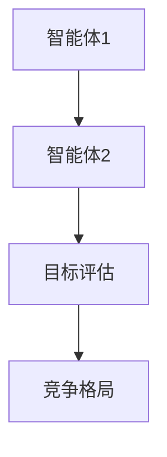
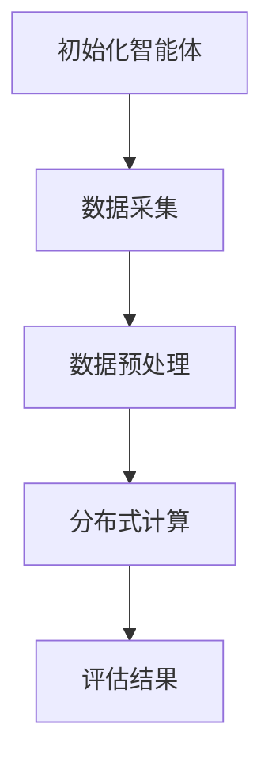
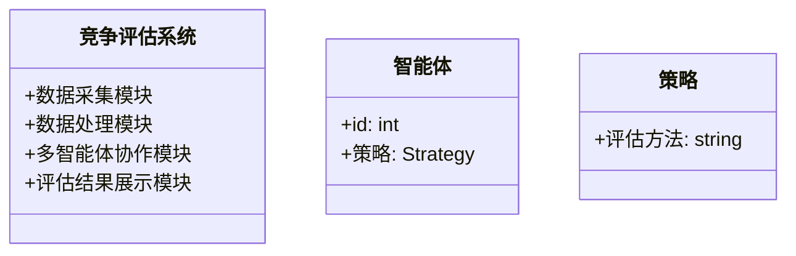
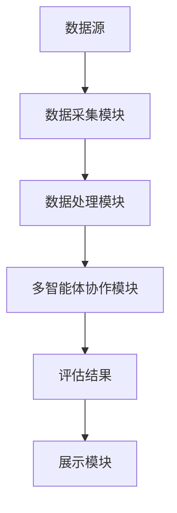
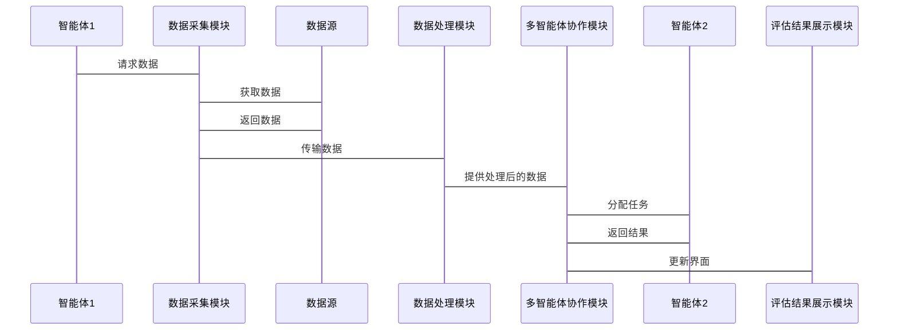

                 


# 利用多智能体AI实现动态竞争格局评估

> 关键词：多智能体AI，动态竞争格局，竞争分析，博弈论，实时评估

> 摘要：本文探讨了利用多智能体AI技术实现动态竞争格局评估的方法，从背景介绍、核心概念到算法实现、系统设计，再到项目实战，全面分析了如何利用多智能体协作来解决动态竞争环境下的实时评估问题。文章详细讲解了多智能体系统的原理、动态竞争评估的数学模型、系统架构设计以及实际项目中的应用，为读者提供了全面的技术指导。

---

# 第一部分: 利用多智能体AI实现动态竞争格局评估的背景与核心概念

## 第1章: 动态竞争格局评估的背景与问题描述

### 1.1 多智能体AI的背景与发展趋势

#### 1.1.1 多智能体系统的基本概念
多智能体系统（Multi-Agent System, MAS）是由多个智能体组成的分布式系统，每个智能体都是一个具有计算能力的实体，能够感知环境、自主决策并与其他智能体协作。多智能体系统的核心在于智能体之间的协作与通信。

#### 1.1.2 多智能体AI在竞争分析中的优势
多智能体AI能够通过分布式计算和协作，实时分析复杂的竞争环境，提供动态的评估结果。相比于传统的人工分析方法，多智能体AI具有高效性、实时性和准确性。

#### 1.1.3 动态竞争格局评估的定义与目标
动态竞争格局评估是指在动态变化的市场环境中，利用多智能体AI技术实时分析竞争对手的行为和市场趋势，评估自身的竞争优势和劣势，从而制定有效的竞争策略。

### 1.2 动态竞争格局评估的问题背景

#### 1.2.1 竞争格局动态变化的挑战
市场竞争环境瞬息万变，竞争对手的策略调整、市场趋势的变化都需要实时监控和分析。传统的静态分析方法难以应对这种动态变化。

#### 1.2.2 传统竞争分析方法的局限性
传统方法依赖于人工分析，效率低，且难以实时更新。此外，传统方法难以处理多维度的复杂数据和非线性关系。

#### 1.2.3 多智能体AI在动态竞争分析中的应用前景
多智能体AI能够通过实时数据采集、分布式计算和协作推理，快速适应市场变化，为竞争分析提供高效的解决方案。

### 1.3 多智能体AI实现动态竞争格局评估的核心问题

#### 1.3.1 多智能体协作的难点
多智能体协作需要解决通信、协调和冲突问题，确保每个智能体都能高效地完成任务。

#### 1.3.2 动态竞争环境下的实时评估需求
在动态竞争环境中，评估结果需要实时更新，这对系统的计算能力和响应速度提出了更高的要求。

#### 1.3.3 竞争数据的实时采集与处理挑战
动态竞争环境下的数据来源广泛且复杂，如何高效采集和处理这些数据是实现动态评估的关键。

### 1.4 本章小结
本章介绍了多智能体AI的背景和在竞争分析中的优势，分析了动态竞争格局评估的背景和问题，指出了多智能体AI在动态竞争分析中的应用前景。

---

## 第2章: 多智能体系统与动态竞争格局评估的核心概念

### 2.1 多智能体系统的定义与核心特征

#### 2.1.1 多智能体系统的定义
多智能体系统是由多个智能体组成的分布式系统，每个智能体都有自己的目标和决策机制。

#### 2.1.2 多智能体系统的特征对比分析
| 特征 | 单智能体系统 | 多智能体系统 |
|------|--------------|--------------|
| 独立性 | 单一决策中心 | 多个独立决策中心 |
| 通信 | 无 | 智能体之间需要通信 |
| 协作 | 无 | 智能体之间需要协作 |

#### 2.1.3 多智能体系统与单智能体系统的区别
多智能体系统通过协作实现复杂任务，而单智能体系统依赖于中心化的决策。

### 2.2 动态竞争格局评估的理论基础

#### 2.2.1 竞争格局的动态变化模型
竞争格局的变化可以看作是一个动态博弈过程，模型需要考虑多个参与者的策略变化。

#### 2.2.2 多智能体协作的博弈论基础
博弈论是分析多智能体协作的重要工具，纳什均衡是常见的分析模型。

#### 2.2.3 动态竞争环境下的实时评估方法
通过实时数据流处理和多智能体协作，实现竞争格局的动态评估。

### 2.3 多智能体系统与动态竞争格局评估的实体关系分析

#### 2.3.1 实体关系图（ER图）分析


#### 2.3.2 多智能体协作的流程图（Mermaid）


### 2.4 本章小结
本章详细介绍了多智能体系统的核心概念和动态竞争格局评估的理论基础，分析了多智能体系统与动态竞争格局评估的实体关系。

---

## 第3章: 多智能体协作算法与动态竞争评估模型

### 3.1 多智能体协作算法的原理

#### 3.1.1 分布式计算的基本原理
分布式计算将任务分解成多个部分，由不同的智能体独立完成。

#### 3.1.2 多智能体协作的通信机制
智能体之间需要通过消息传递进行通信，确保信息的实时共享。

#### 3.1.3 多智能体系统中的同步与一致性问题
通过共识算法（如Paxos、Raft）实现系统的一致性。

### 3.2 动态竞争评估模型的算法实现

#### 3.2.1 动态竞争数据流的处理流程
1. 数据采集：实时采集市场数据。
2. 数据预处理：清洗和标准化数据。
3. 数据分析：利用机器学习模型进行预测。

#### 3.2.2 多智能体协作的博弈论模型
基于博弈论的纳什均衡模型，分析各智能体的策略选择。

#### 3.2.3 动态竞争评估的数学模型
动态竞争评估模型可以通过以下公式表示：
$$
V(t) = \sum_{i=1}^{n} w_i \cdot x_i(t)
$$
其中，$V(t)$ 表示在时间 $t$ 的评估值，$w_i$ 是权重，$x_i(t)$ 是指标的值。

### 3.3 动态竞争评估算法的实现步骤

#### 3.3.1 算法步骤
1. 初始化智能体。
2. 数据采集与预处理。
3. 分布式计算与协作推理。
4. 实时更新评估结果。

#### 3.3.2 算法流程图（Mermaid）


#### 3.3.3 算法实现的Python代码示例
```python
import numpy as np

def dynamic_competition_assessment():
    # 初始化智能体
    agents = [Agent(i) for i in range(n)]
    
    # 数据采集
    data = collect_data()
    
    # 数据预处理
    processed_data = preprocess(data)
    
    # 分布式计算
    results = []
    for agent in agents:
        result = agent.compute(processed_data)
        results.append(result)
    
    # 评估结果
    assessment = aggregate(results)
    return assessment

class Agent:
    def __init__(self, id):
        self.id = id
    
    def compute(self, data):
        # 具体计算逻辑
        return np.mean(data)
```

### 3.4 本章小结
本章详细讲解了多智能体协作算法和动态竞争评估模型的实现，通过流程图和代码示例帮助读者理解算法的实现过程。

---

## 第4章: 系统分析与架构设计

### 4.1 问题场景介绍
市场竞争环境复杂，需要实时监控竞争对手的策略变化。

### 4.2 项目介绍
利用多智能体AI实现动态竞争格局评估的系统开发。

### 4.3 系统功能设计

#### 4.3.1 领域模型类图（Mermaid）


### 4.4 系统架构设计

#### 4.4.1 系统架构图（Mermaid）


### 4.5 系统接口设计
- 数据采集模块：提供API接口，接收市场数据。
- 多智能体协作模块：通过消息队列实现智能体间的通信。

### 4.6 系统交互序列图（Mermaid）


### 4.7 本章小结
本章详细分析了系统的需求、功能设计和架构设计，为系统的开发提供了理论基础。

---

## 第5章: 项目实战

### 5.1 环境安装与配置
安装Python、Jupyter Notebook、相关库（如numpy、pandas）。

### 5.2 系统核心实现源代码

#### 5.2.1 数据采集模块
```python
import requests

def collect_data():
    # 示例：从API获取数据
    response = requests.get('http://api.example.com/competitors')
    return response.json()
```

#### 5.2.2 数据处理模块
```python
import pandas as pd

def preprocess(data):
    df = pd.DataFrame(data)
    # 数据清洗和转换
    return df.dropna()
```

#### 5.2.3 多智能体协作模块
```python
from concurrent.futures import ThreadPoolExecutor

class MultiAgentSystem:
    def __init__(self, num_agents):
        self.agents = [Agent(i) for i in range(num_agents)]
    
    def compute(self, data):
        with ThreadPoolExecutor() as executor:
            futures = [executor.submit(agent.compute, data) for agent in self.agents]
            return [future.result() for future in futures]
```

### 5.3 代码应用解读与分析
- 数据采集模块通过API获取实时数据。
- 数据处理模块对数据进行清洗和预处理。
- 多智能体协作模块利用线程池实现并行计算，提高效率。

### 5.4 实际案例分析
以某行业为例，展示如何利用上述系统进行动态竞争评估。

### 5.5 项目小结
本章通过实际项目展示了系统的实现过程，验证了多智能体AI在动态竞争评估中的应用价值。

---

## 第6章: 总结与展望

### 6.1 最佳实践与技巧
- 数据采集的实时性和准确性是关键。
- 系统设计需要考虑扩展性和可维护性。
- 多智能体协作算法的选择应根据具体场景决定。

### 6.2 小结
本文详细讲解了利用多智能体AI实现动态竞争格局评估的理论基础、算法实现和系统设计，为读者提供了全面的技术指导。

### 6.3 注意事项
- 数据隐私和安全问题需要特别注意。
- 系统的实时性和响应速度需要优化。
- 智能体之间的通信和协作机制需要合理设计。

### 6.4 拓展阅读
建议读者进一步阅读相关领域的书籍和论文，深入理解多智能体系统和动态竞争评估的理论和技术。

---

## 作者信息

作者：AI天才研究院/AI Genius Institute & 禅与计算机程序设计艺术 /Zen And The Art of Computer Programming

---

以上是文章的完整目录和内容框架，希望对您有所帮助！

