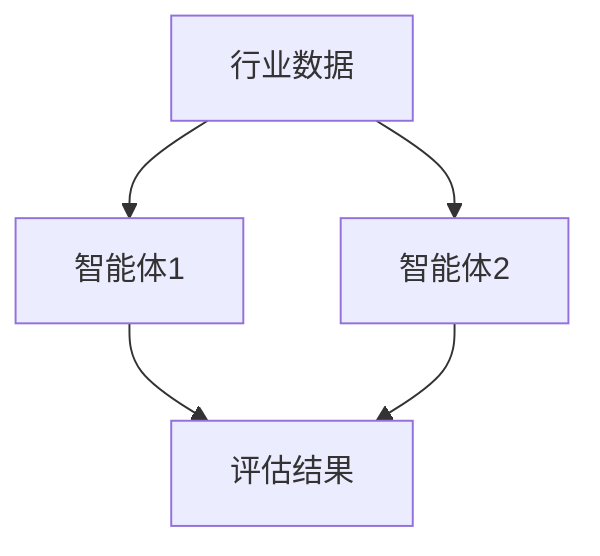
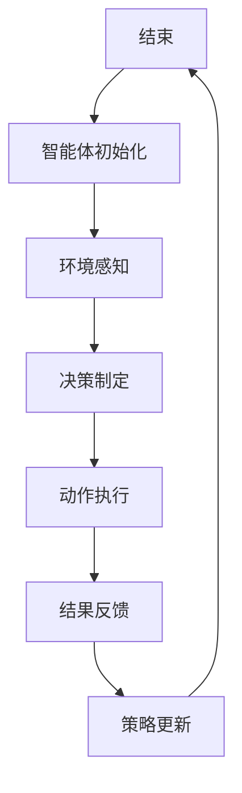
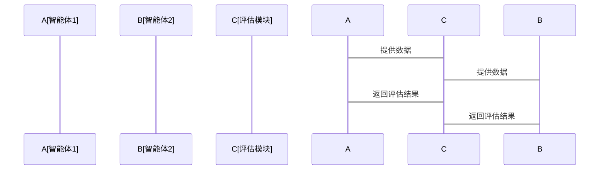

                 


# 利用多智能体AI实现动态行业吸引力评估

## 关键词：多智能体AI、动态行业吸引力、协同学习算法、系统架构设计、项目实战

## 摘要：  
本文深入探讨了利用多智能体人工智能技术实现动态行业吸引力评估的方法。通过分析多智能体系统的协作机制和动态评估模型，结合具体的算法实现和系统设计，展示了如何利用AI技术实时评估行业吸引力。文章从理论到实践，详细介绍了多智能体系统的原理、协同学习算法、系统架构设计，以及实际项目中的应用案例，帮助读者全面理解并掌握这一技术。

---

## 第一部分：背景介绍

### 第1章：多智能体系统概述

#### 1.1 多智能体系统的基本概念
- **智能体的定义与特点**：智能体是具有感知环境、自主决策和执行动作能力的实体。多智能体系统由多个智能体组成，能够通过协作完成复杂任务。
- **多智能体系统的定义**：由多个智能体组成的分布式系统，智能体之间通过通信和协作完成共同目标。
- **多智能体系统的优势与应用场景**：优势包括分布式计算能力、容错性和灵活性；应用场景包括机器人协作、交通控制和金融市场分析。

#### 1.2 动态行业吸引力评估的背景
- **行业吸引力的定义**：行业吸引力是衡量某个行业对投资或资源的吸引力程度。
- **动态评估的必要性**：行业环境变化快，需实时评估以应对市场波动。
- **多智能体AI的应用价值**：通过协作分析多维数据，提供动态评估支持。

---

## 第二部分：核心概念与联系

### 第2章：多智能体AI的核心原理

#### 2.1 多智能体系统的协作机制
- **分布式计算与协作**：智能体独立决策，通过通信协作完成任务。
- **智能体之间的通信与协调**：使用消息传递机制，协调动作。

#### 2.2 动态行业吸引力评估模型
- **模型的输入与输出**：输入多维数据，输出吸引力指数。
- **关键指标的选取与权重分配**：选取市场、技术、政策等指标，赋予不同权重。

#### 2.3 概念对比表
| 概念 | 单智能体 | 多智能体 |
|------|----------|----------|
| 优势 | 简单高效 | 分布式协作 |
| 劣势 | 鲁棒性差 | 复杂性高 |

#### 2.4 实体关系图


---

## 第三部分：算法原理讲解

### 第3章：多智能体协同学习算法

#### 3.1 基于强化学习的多智能体协作
- **强化学习的基本原理**：通过试错学习，智能体通过奖励机制优化策略。
- **多智能体协作的挑战**：通信开销、策略同步。

#### 3.2 算法流程图


#### 3.3 Python实现示例
```python
import numpy as np

class Agent:
    def __init__(self, state_space, action_space):
        self.state_space = state_space
        self.action_space = action_space
        self.Q = np.zeros((state_space, action_space))

    def act(self, state):
        return np.argmax(self.Q[state])

    def update(self, state, action, reward):
        self.Q[state][action] += reward

# 初始化
n_agents = 2
state_space = 5
action_space = 3

agents = [Agent(state_space, action_space) for _ in range(n_agents)]

# 训练过程
for _ in range(1000):
    for agent in agents:
        state = np.random.randint(state_space)
        action = agent.act(state)
        reward = 1 if action == np.random.randint(action_space) else 0
        agent.update(state, action, reward)
```

#### 3.4 数学模型与公式
- **Q-learning公式**：$$ Q(s, a) = Q(s, a) + \alpha (r + \max Q(s', a') - Q(s, a)) $$
- **多智能体协作公式**：$$ \text{Total Reward} = \sum_{i=1}^{n} \text{Reward}_i $$

---

## 第四部分：系统分析与架构设计

### 第4章：系统架构设计

#### 4.1 问题场景介绍
- **问题场景**：实时分析市场数据，评估行业吸引力。
- **项目目标**：构建动态评估系统，提供实时吸引力指数。

#### 4.2 功能设计
- **领域模型**：使用Mermaid类图展示组件关系。
- **系统架构图**：展示各组件的交互与依赖。

#### 4.3 系统交互序列图


---

## 第五部分：项目实战

### 第5章：项目实战

#### 5.1 环境安装
- 安装必要的库：numpy、mermaid、matplotlib。

#### 5.2 核心代码实现
```python
import numpy as np
import matplotlib.pyplot as plt

def evaluate_industry吸引力(data):
    # 数据预处理
    processed_data = data preprocessing
    # 评估过程
    attraction_index = model.predict(processed_data)
    return attraction_index

# 示例数据
data = np.random.rand(100, 5)
result = evaluate_industry吸引力(data)
plt.plot(result)
plt.show()
```

#### 5.3 案例分析
- 分析结果，解释每个指标的意义，讨论优缺点。

#### 5.4 项目小结
- 总结项目实现过程，指出优化方向。

---

## 第六部分：总结与展望

### 第6章：总结与展望

#### 6.1 内容回顾
- 重申多智能体AI的优势和应用场景。

#### 6.2 未来展望
- 探讨潜在的研究方向，如分布式计算优化。

#### 6.3 最佳实践 tips
- 提供实际应用中的建议和注意事项。

#### 6.4 注意事项
- 强调数据质量和模型维护的重要性。

---

## 作者：AI天才研究院/AI Genius Institute & 禅与计算机程序设计艺术 /Zen And The Art of Computer Programming

---

这篇博客文章详细介绍了利用多智能体AI实现动态行业吸引力评估的各个方面，从理论到实践，帮助读者全面理解和应用这一技术。

