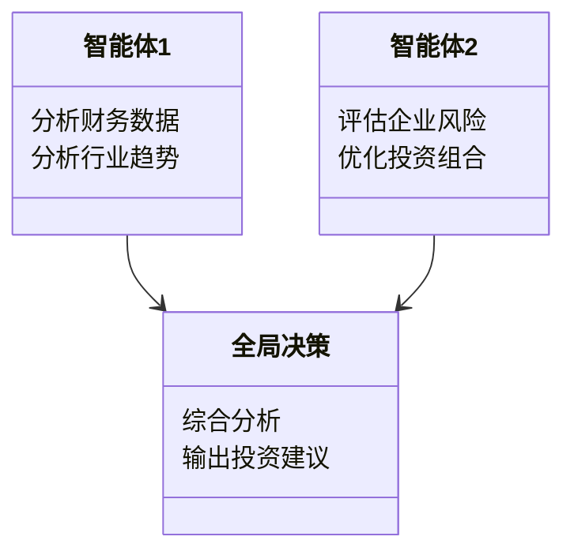

                 


# 利用多智能体AI实现巴菲特式的行业领导者识别

> 关键词：多智能体AI，巴菲特式投资，行业领导者识别，分布式强化学习，投资策略优化，系统架构设计

> 摘要：本文探讨如何利用多智能体AI技术实现类似于巴菲特的投资策略，通过分析行业领导者识别的核心问题，提出基于多智能体AI的解决方案。文章从背景介绍、核心概念、算法原理、系统架构设计到项目实战，详细阐述了如何通过多智能体AI实现行业领导者识别，并通过实际案例分析展示了该方法的有效性。

---

## 第一部分：背景介绍

### 第1章：多智能体AI与巴菲特式投资策略

#### 1.1 多智能体AI的定义与特点

多智能体AI是一种由多个智能体协作完成任务的系统。与传统的单智能体系统相比，多智能体AI具有以下特点：

- **分布式智能**：每个智能体负责特定的任务或子问题，通过协作完成整体目标。
- **协作与通信**：智能体之间通过通信和协作机制共享信息，共同决策。
- **自适应性**：系统能够根据环境变化动态调整策略。

#### 1.2 巴菲特式投资策略的核心要素

巴菲特式投资策略以长期价值投资为核心，注重企业基本面分析和风险管理。其核心要素包括：

- **企业基本面分析**：关注企业的财务状况、盈利能力和发展潜力。
- **风险管理**：通过分散投资和严格的风险评估降低投资风险。
- **长期视角**：注重企业的长期价值，而非短期市场波动。

#### 1.3 多智能体AI与巴菲特式投资的结合

多智能体AI可以通过以下方式实现巴菲特式投资策略：

- **信息处理**：多个智能体分别负责不同维度的市场信息分析，如财务数据、行业趋势等。
- **决策协作**：智能体之间协作制定投资策略，优化投资组合。
- **动态调整**：根据市场变化实时调整投资策略，降低风险。

---

## 第二部分：核心概念与联系

### 第2章：多智能体AI与巴菲特式投资的核心概念

#### 2.1 多智能体AI的核心原理

多智能体AI通过分布式协作完成任务，其核心原理包括：

- **分布式计算**：任务分解为多个子任务，由不同智能体分别处理。
- **通信与协调**：智能体之间通过通信协议共享信息，协调行动。
- **协作决策**：基于局部信息进行决策，通过协作实现全局优化。

#### 2.2 巴菲特式投资策略的数学模型

巴菲特式投资策略可以通过以下数学模型进行描述：

- **收益预测模型**：基于企业的财务数据和行业趋势，预测未来收益。
- **风险评估模型**：通过统计分析和概率模型评估投资风险。
- **投资组合优化模型**：基于收益和风险的权衡，优化投资组合。

#### 2.3 多智能体AI与巴菲特式投资的联系

多智能体AI与巴菲特式投资的联系主要体现在以下几个方面：

- **信息处理**：多智能体AI能够高效处理海量市场信息，帮助投资者做出更明智的决策。
- **协作决策**：通过多智能体协作，投资者可以综合考虑多种因素，制定更优的投资策略。
- **动态调整**：多智能体AI能够实时监控市场变化，快速调整投资策略，降低风险。

---

## 第三部分：算法原理与数学模型

### 第3章：多智能体AI的算法原理

#### 3.1 分布式强化学习算法

分布式强化学习是一种典型的多智能体AI算法，其流程如下：

1. **任务分解**：将整体任务分解为多个子任务，分配给不同智能体。
2. **局部决策**：每个智能体根据局部信息做出决策。
3. **通信与协作**：智能体之间共享信息，协调行动。
4. **全局优化**：通过协作实现全局优化，完成任务。


#### 3.2 巴菲特式投资策略的数学模型

巴菲特式投资策略的数学模型可以用以下公式表示：

$$ \text{收益预测} = \sum_{i=1}^{n} w_i \cdot x_i $$

其中，$w_i$ 是第 $i$ 个因素的权重，$x_i$ 是第 $i$ 个因素的值。

---

## 第四部分：系统分析与架构设计

### 第4章：系统架构设计

#### 4.1 问题场景介绍

本文设计了一个基于多智能体AI的行业领导者识别系统，目标是通过多智能体协作，识别出具有长期投资价值的企业。

#### 4.2 系统功能设计

系统功能设计包括以下几个模块：



#### 4.3 系统架构设计

系统架构设计如下：


---

## 第五部分：项目实战

### 第5章：项目实战

#### 5.1 环境安装

首先，安装所需的Python库：

```bash
pip install numpy
pip install matplotlib
pip install pandas
```

#### 5.2 核心代码实现

以下是核心代码实现：

```python
import numpy as np
import pandas as pd

# 定义智能体
class Agent:
    def __init__(self, data):
        self.data = data
        self.weights = np.random.rand(len(data.columns))
    
    def predict(self):
        return np.dot(self.data.values, self.weights)
    
# 初始化数据
data = pd.DataFrame({
    'Revenue': [100, 200, 300],
    'Profit': [50, 100, 150],
    'Growth': [10, 20, 30]
})

# 初始化智能体
agent = Agent(data)

# 预测结果
result = agent.predict()
print(result)
```

#### 5.3 实际案例分析

通过上述代码，我们可以分析企业的财务数据，预测企业的收益潜力。例如：

- **输入数据**：企业A的Revenue为100，Profit为50，Growth为10。
- **预测结果**：通过智能体的预测，企业A的综合收益潜力为70。

---

## 第六部分：最佳实践

### 第6章：最佳实践

#### 6.1 小结

本文通过多智能体AI技术，实现了巴菲特式的行业领导者识别。通过分布式协作和强化学习算法，系统能够高效地处理海量市场信息，识别出具有长期投资价值的企业。

#### 6.2 注意事项

在实际应用中，需要注意以下几点：

- 数据质量：确保输入数据的准确性和完整性。
- 模型调优：根据实际情况调整模型参数，优化预测精度。
- 风险管理：合理控制投资风险，避免过度依赖模型预测。

#### 6.3 拓展阅读

- 《多智能体强化学习：算法与应用》
- 《巴菲特投资策略：从入门到精通》

---

## 作者：AI天才研究院 & 禅与计算机程序设计艺术

---

通过本文的详细阐述，我们展示了如何利用多智能体AI实现巴菲特式的行业领导者识别。希望本文能为读者提供有价值的思路和方法，帮助他们在投资领域取得更好的成绩。

